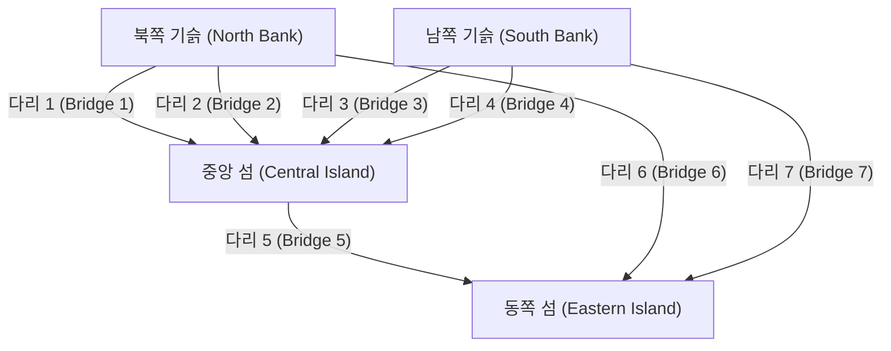
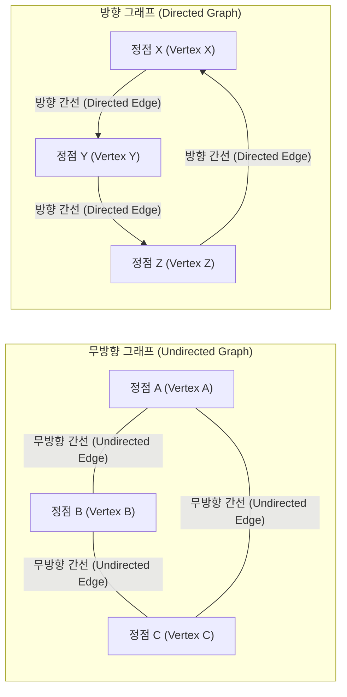

## 1. 서론: 세계는 "네트워크"로 이루어져 있다

현대 사회에서 우리는 항상 무언가와 연결되어 있습니다. 인터넷을 통한 컴퓨터 간의 통신, 소셜 네트워크 서비스(SNS)의 복잡한 인간관계, 도시와 도시를 잇는 광대한 도로망과 철도망, 전 세계를 누비는 물류 공급망, 혹은 우리 뇌 안의 무수한 뉴런의 연결 등, 세계는 무수한 네트워크로 구성되어 있다고 해도 과언이 아닙니다.

언뜻 보기에 매우 복잡하고 무질서해 보이는 이러한 네트워크를 단순하고 수학적으로 엄밀하게 표현하고 분석하기 위한 강력한 틀을 제공하는 것이 바로 **그래프 이론** ([Graph Theory](https://kenji.blog/ko/p/graph-theory-dijkstra-a-star/)) 입니다. 그래프 이론을 사용함으로써 복잡한 시스템 속에 숨겨진 구조와 성질을 밝혀내고, 최적의 통신 경로를 찾아내거나 네트워크 전체의 취약성을 평가하는 것이 가능해집니다.

본 기사에서는 그래프 이론의 역사적인 기원부터 시작하여, 기본적인 수학적 정의, 컴퓨터 프로그램으로 다루기 위한 자료 구조, 그리고 현대 기술 기반을 지탱하는 대표적인 알고리즘까지 폭넓고 상세하게 해설합니다.

## 2. 그래프 이론의 탄생: 쾨니히스베르크의 일곱 개의 다리

그래프 이론의 역사는 18세기까지 거슬러 올라갑니다. 1736년, 천재 스위스 수학자 [레온하르트 오일러](https://kenji.blog/ko/p/euler/)([Leonhard Euler](https://kenji.blog/ko/p/euler/))가 어느 유명한 수학 퍼즐을 멋지게 해결한 것이 이 분야의 시작으로 여겨집니다. 그 퍼즐이란 "쾨니히스베르크의 일곱 개의 다리"라고 불리는 것입니다.

당시 프로이센 왕국에 있던 쾨니히스베르크(현재의 러시아 칼리닌그라드)라는 아름다운 도시에는 프레겔 강이 흐르고 있었으며, 강 안의 두 섬과 양안을 연결하도록 총 일곱 개의 다리가 놓여 있었습니다. 시민들 사이에서는 "모든 다리를 정확히 한 번씩만 건너서 원래의 출발점으로 돌아올 수 있을까?"라는 놀이가 유행하고 있었습니다. 많은 사람이 도전했지만, 아무도 성공하지 못했습니다.

오일러는 이 문제를 풀기 위해 도시의 실제 지도를 극한까지 추상화하는 획기적인 접근을 취했습니다. 그는 육지(섬과 기슭)를 "점"으로, 그것들을 연결하는 다리를 "선"으로 표현하고, 거리나 방향과 같은 문제의 본질과 관계없는 요소를 모두 배제했습니다.



오일러는 어떤 점을 "통과"하기 위해서는 반드시 "들어오는 다리"와 "나가는 다리"의 쌍이 필요하다는 것을 깨달았습니다. 즉, 출발점과 종점을 제외한 모든 점은 연결된 다리의 수가 "짝수"여야 한다는 것을 수학적으로 증명한 것입니다.

쾨니히스베르크 다리의 추상화된 그래프에서는 4개의 육지(점) 모두에서 연결된 다리의 수가 "홀수"(3개 또는 5개)였습니다. 따라서 모든 다리를 정확히 한 번씩 건너는 "한붓그리기"는 불가능하다는 결론을 내렸습니다.

이 오일러의 발견이야말로 **그래프 이론** 이 탄생한 순간이었습니다. 그는 복잡한 현실의 지형을 버리고 점과 선의 연결 관계(토폴로지)에만 초점을 맞춤으로써 완전히 새로운 수학 분야를 개척한 것입니다.

## 3. [그래프 이론의 기초](https://kenji.blog/ko/p/basics-of-graph-theory/) 개념과 수학적 정의

그래프 이론에서 "그래프"란 꺾은선 그래프나 원그래프 같은 통계 데이터 시각화 방법을 의미하는 것이 아닙니다. 대상물의 집합과 그들 간의 관계성을 나타내는 수학적 구조를 의미합니다.

### 3.1. 그래프의 기본 구조: 정점과 간선

그래프 $G$ 는 일반적으로 정점(Vertex)의 집합 $V$ 와 간선(Edge)의 집합 $E$ 의 쌍으로 정의되며, 수학적으로는 $G = (V, E)$ 로 표기됩니다.

*   **정점 (Vertex / Node)** : 네트워크의 구성 요소를 나타냅니다. 시각적으로는 점으로 그려집니다. 집합 $V$ 의 원소 수(정점의 수)는 $|V|$ 로 나타냅니다.
*   **간선 (Edge / Link)** : 정점 간의 관계성이나 연결을 나타냅니다. 시각적으로는 선으로 그려집니다. 집합 $E$ 의 원소 수(간선의 수)는 $|E|$ 로 나타냅니다.

예를 들어, 정점 $u$ 와 $v$ 를 연결하는 간선은 $e = (u, v)$ 로 표현됩니다.

### 3.2. 방향 그래프와 무방향 그래프

간선에 방향성을 가질 것인지에 따라 그래프는 크게 두 가지로 분류됩니다.

*   **무방향 그래프 (Undirected Graph)** : 간선에 방향이 없는 그래프입니다. 통신 회선이나 양방향 도로, 혹은 Facebook의 "친구" 관계처럼 서로의 관계가 항상 대등하고 양방향일 때 사용됩니다.
*   **방향 그래프 (Directed Graph)** : 간선에 방향이 있는 그래프입니다. 강물, 일방통행 도로, 혹은 Twitter(X)의 "팔로우" 관계처럼 단방향의 관계를 표현할 때 사용됩니다. 방향 그래프에서 간선은 명확한 화살표로 그려집니다.



### 3.3. 가중치 그래프

현실 세계의 문제를 모델링할 때, 단순히 "연결되어 있는가"뿐만 아니라 "연결의 용이성"이나 "비용"을 표현하고 싶을 때가 많습니다. 이럴 때는 각 간선에 수치(가중치)를 할당한 **가중치 그래프 (Weighted Graph)** 가 사용됩니다. 가중치는 도시 간의 거리, 통신 지연 시간, 혹은 이동에 드는 비용 등을 나타냅니다.

### 3.4. 경로와 사이클

그래프 내부를 이동하는 개념도 매우 중요합니다.

*   **보행 (Walk)** : 정점과 간선을 번갈아 반복하는 수열입니다. 같은 정점이나 간선을 여러 번 지나도 무방합니다.
*   **경로 (Path)** : 도중에 같은 정점을 두 번 지나지 않는 보행입니다.
*   **사이클 (Cycle)** : 시작점과 끝점이 같은 경로입니다.

이러한 개념은 네트워크 상의 데이터 흐름 추적이나 교통 경로 탐색 알고리즘에서 기본적인 구성 요소가 됩니다.

### 3.5. 차수와 연결성

어떤 정점에 직접 연결된 간선의 수를 그 정점의 **차수 (Degree)** 라고 부릅니다. 정점 $v$ 의 차수는 수학적으로 $\deg(v)$ 로 나타냅니다.

방향 그래프에서는 정점으로 들어오는 화살표의 수를 **진입 차수 (In-degree)** , 정점에서 나가는 화살표의 수를 **진출 차수 (Out-degree)** 로 명확히 구별합니다.

또한, 그래프 내의 임의의 두 정점 사이에 항상 경로가 존재할 경우, 그 그래프는 **연결 그래프 (Connected)** 라고 합니다. 인터넷과 같은 통신 네트워크에서는 네트워크 전체가 연결 그래프인 것이 모든 컴퓨터가 서로 통신할 수 있음을 보장하는 절대적인 조건이 됩니다.

## 4. 컴퓨터에서 그래프를 다루기 위한 자료 구조

그래프 이론의 수학적 개념을 프로그램으로 구현하고 컴퓨터가 빠르게 계산하도록 하기 위해서는 그래프를 적절한 자료 구조를 사용하여 메모리에 표현해야 합니다. 실무에서는 주로 "인접 행렬"과 "인접 리스트" 두 가지가 사용됩니다.

### 4.1. 인접 행렬 (Adjacency Matrix)

인접 행렬은 그래프를 2차원 배열(행렬)로 표현하는 방법입니다. 정점 수가 $N$ 인 그래프는 $N \times N$ 크기의 행렬 $A$ 로 표현됩니다. 정점 $i$ 에서 정점 $j$ 로의 간선이 존재하면 행렬의 요소 $A_{i,j}$ 를 $1$ 로 하고, 존재하지 않으면 $0$ 으로 합니다. 가중치 그래프의 경우는 $1$ 대신 간선의 가중치 수치를 넣습니다.

수학적으로는 다음과 같이 정의됩니다.

$$
A_{i,j} = \begin{cases} 
1 & (\text{정점 } i \text{ 에서 정점 } j \text{ 로의 간선이 존재할 경우}) \\
0 & (\text{그 외})
\end{cases}
$$

*   **장점** : 임의의 두 정점 사이에 간선이 존재하는지 여부를 $\mathcal{O}(1)$ (상수 시간) 만에 즉시 판정할 수 있습니다. 또한 행렬 곱을 이용한 대수적 그래프 분석(스펙트럼 그래프 이론 등)과 직결됩니다.
*   **단점** : 정점 수 $N$ 에 대해 메모리 소비량이 $\mathcal{O}(N^2)$ 이 되어 거대한 그래프에서는 메모리가 고갈됩니다. 특히 간선의 수가 정점 수의 제곱에 비해 매우 적은 **희소 그래프 (Sparse Graph)** 에서는 행렬의 대부분이 $0$ 이 되어 매우 비효율적입니다.

### 4.2. 인접 리스트 (Adjacency List)

인접 리스트는 각 정점마다 해당 정점과 직접 연결된 "인접 정점의 리스트(배열이나 연결 리스트 등)"를 유지하는 방법입니다.

*   정점 A: `[B, C]`
*   정점 B: `[A, D, E]`
*   정점 C: `[A, F]`

*   **장점** : 메모리 소비량이 정점 수와 간선 수의 합에 비례하므로 $\mathcal{O}(|V| + |E|)$ 가 되어, 현실 세계에 많은 희소 그래프에서 매우 메모리 효율이 뛰어납니다.
*   **단점** : 특정 정점 $i$ 와 정점 $j$ 가 연결되어 있는지 확인하려면 리스트를 순서대로 탐색해야 하므로 최악의 경우 $\mathcal{O}(|V|)$ 의 시간이 걸립니다.

## 5. 그래프를 둘러싼 대표적인 알고리즘

그래프 상의 문제를 효율적으로 해결하기 위해 컴퓨터 과학의 역사 속에서 많은 뛰어난 알고리즘이 고안되었습니다. 여기서는 현대 소프트웨어 엔지니어링에서 필수로 여겨지는 대표적인 알고리즘을 몇 가지 소개합니다.

### 5.1. 너비 우선 탐색 (BFS) 과 깊이 우선 탐색 (DFS)

네트워크 내의 모든 정점을 규칙적으로 빠짐없이 방문하기 위한 가장 기본적인 알고리즘이 **너비 우선 탐색 (Breadth-First Search, BFS)** 과 **깊이 우선 탐색 (Depth-First Search, DFS)** 입니다.

*   **너비 우선 탐색 (BFS)** : 시작점에서 가까운 정점을 우선하여 동심원 모양으로 탐색합니다. 수면에 돌을 던졌을 때 파문이 퍼지는 듯한 이미지입니다. 가중치가 없는 그래프에서 시작점으로부터의 최단 경로(거치는 간선의 수가 최소인 경로)를 찾는 데 최적입니다. 자료 구조인 큐(Queue)를 사용하여 구현됩니다.
*   **깊이 우선 탐색 (DFS)** : 가능한 한 깊게 탐색을 진행하고, 막다른 곳에 다다르면 직전 분기점으로 돌아가 다른 경로를 탐색합니다. 미로를 벽을 짚어가며 푸는 듯한 이미지입니다. 그래프 내의 사이클 탐지나 위상 정렬 등에 이용됩니다. 스택(Stack) 또는 함수의 재귀 호출을 사용하여 구현됩니다.

다음은 Python을 사용한 너비 우선 탐색(BFS)의 간단한 구현 예입니다.

```python
from collections import deque

def bfs(graph, start_vertex):
    """
    그래프에 대한 너비 우선 탐색 (BFS) 을 실행하는 함수
    :param graph: 인접 리스트 형식으로 표현된 그래프 딕셔너리
    :param start_vertex: 탐색을 시작할 초기 정점
    """
    visited = set() # 방문한 정점을 기록하기 위한 집합
    queue = deque([start_vertex]) # 탐색할 정점을 관리하는 큐
    visited.add(start_vertex)
    
    while queue:
        # 큐의 맨 앞부분에서 정점을 꺼냄
        vertex = queue.popleft()
        print(f"현재 방문 중인 정점: {vertex}")
        
        # 현재 정점에 인접한 미방문 정점을 모두 큐에 추가함
        for neighbor in graph[vertex]:
            if neighbor not in visited:
                visited.add(neighbor)
                queue.append(neighbor)

# 그래프 정의 (인접 리스트 형식)
graph_data = {
    'A': ['B', 'C'],
    'B': ['A', 'D', 'E'],
    'C': ['A', 'F'],
    'D': ['B'],
    'E': ['B', 'F'],
    'F': ['C', 'E']
}

print("BFS 실행 결과 로그:")
bfs(graph_data, 'A')
```

### 5.2. 최단 경로 문제: 다익스트라 알고리즘 ([Dijkstra](https://kenji.blog/ko/p/graph-theory-dijkstra-a-star/)'s Algorithm)

지도 애플리케이션에서 목적지까지의 가장 빠른 경로를 검색할 때 시스템의 중추에서 작동하는 것이 **최단 경로 알고리즘** 입니다. 경로에는 "거리"나 "소요 시간" 등 비용(가중치)이 존재하며, 시작점에서 종점까지의 누적 비용이 최소가 되는 경로를 구하는 것이 목적입니다.

네덜란드의 컴퓨터 과학자 에츠허르 다익스트라(Edsger W. Dijkstra)가 1956년에 고안한 **다익스트라 알고리즘** 은 간선의 가중치가 모두 음수가 아니라는(0 이상) 조건 하에 단일 시작점에서 네트워크 내의 다른 모든 정점까지의 최단 경로를 효율적으로 계산하는 매우 유명한 알고리즘입니다.

다익스트라 알고리즘의 핵심 논리는 "이미 시작점으로부터의 최단 거리가 확정된 정점군에서 가장 거리가 짧은 미확정 정점을 골라내어, 그 정점을 경유하는 경로를 통해 주변 정점의 최단 거리 정보를 갱신해 나가는" 과정을 반복하는 것입니다. 우선순위 큐(Priority Queue)를 사용하면 실행 시간을 대폭 단축할 수 있습니다.

```python
import heapq

def dijkstra(graph, start):
    """
    다익스트라 알고리즘에 의한 최단 경로 비용 계산
    """
    # 시작점으로부터의 최단 거리를 유지하는 딕셔너리. 초기값은 무한대.
    distances = {vertex: float('infinity') for vertex in graph}
    distances[start] = 0
    
    # (누적 거리, 정점) 튜플을 저장하는 우선순위 큐
    priority_queue = [(0, start)]
    
    while priority_queue:
        # 현재 가장 거리가 짧은 정점을 꺼냄
        current_distance, current_vertex = heapq.heappop(priority_queue)
        
        # 큐에서 꺼낸 거리가 이미 기록된 거리보다 길면 처리 스킵
        if current_distance > distances[current_vertex]:
            continue
            
        # 인접한 모든 정점에 대해 거리 갱신을 시도
        for neighbor, weight in graph[current_vertex].items():
            distance = current_distance + weight
            
            # 이전보다 짧은 경로를 발견한 경우 거리를 갱신하고 큐에 넣음
            if distance < distances[neighbor]:
                distances[neighbor] = distance
                heapq.heappush(priority_queue, (distance, neighbor))
                
    return distances

# 가중치 방향 그래프 정의
weighted_graph = {
    'A': {'B': 2, 'C': 5},
    'B': {'C': 2, 'D': 4},
    'C': {'D': 1},
    'D': {'C': 3} # 사이클이 존재함
}

print("\n다익스트라 알고리즘 실행 결과 (정점 A로부터의 최단 거리):")
print(dijkstra(weighted_graph, 'A'))
```

### 5.3. 최소 신장 트리 문제: 크루스칼 알고리즘 (Kruskal's Algorithm)

광대한 네트워크 내의 모든 거점을 가장 저렴한 총비용으로 물리적으로 연결하고 싶다는 요구를 생각해 봅시다. 예를 들어 새로운 주택지에 전력을 공급하기 위한 전선망을 구축하거나 여러 도시 간에 광섬유 케이블을 부설할 때 인프라 구축 비용을 최소화하려는 상황입니다.

이처럼 그래프의 모든 정점을 포함하는 부분 그래프 중에서 사이클을 전혀 가지지 않고(즉, 트리 구조이며) 사용하는 간선 가중치의 합이 최소가 되는 부분 그래프를 **최소 신장 트리 (Minimum Spanning Tree, MST)** 라고 부릅니다.

이 최소 신장 트리를 구하는 대표적인 알고리즘 중 하나가 **크루스칼 알고리즘** 입니다. 크루스칼 알고리즘은 국소적인 최적해를 쌓아가는 "탐욕 알고리즘 (Greedy Algorithm)"의 전형적인 예로, 매우 단순하고 직관적인 절차를 밟습니다.

1.  그래프 내에 존재하는 모든 간선을 가중치가 작은 순서대로 정렬합니다.
2.  가중치가 가장 작은 간선부터 순서대로 하나씩 꺼내어, 그 간선을 신장 트리에 추가함으로써 "사이클(루프)"이 형성되지 않는 경우에만 실제로 신장 트리에 채택합니다.
3.  신장 트리에 채택된 간선의 수가 "정점의 총수 - 1"에 도달한 시점에 알고리즘을 종료합니다.

사이클이 형성되는지에 대한 빠른 판정에는 서로소 집합 자료 구조(Union-Find Tree)라는 특별한 자료 구조가 활약합니다.

### 5.4. 네트워크 흐름과 최대 유량 문제

도시의 수도관 네트워크나 인터넷의 기간 통신망에서 "시작점(소스)에서 종점(싱크)을 향해 시스템 전체에서 최대로 얼마만큼의 양(물이나 데이터 패킷)을 동시에 흘려보낼 수 있는가?"라는 문제를 **최대 유량 문제 (Maximum Flow Problem)** 라고 부릅니다.

네트워크를 구성하는 각 간선(파이프나 케이블)에는 단위 시간당 흘려보낼 수 있는 최대량을 나타내는 "용량 (Capacity)"이 엄밀하게 정해져 있으며, 어떠한 경로에서도 이 용량을 초과하여 흘려보내는 것은 물리적으로 불가능합니다. 이 복잡한 문제는 포드-풀커슨 알고리즘(Ford-Fulkerson Algorithm) 등의 알고리즘을 사용함으로써 수학적으로 정확한 최대 유량을 도출할 수 있습니다. 최대 유량 이론은 교통 체증의 모델링과 완화, 물류 네트워크의 병목 현상 해소, 나아가 이미지 처리에서의 객체 추출(그래프 컷) 등 놀라울 정도로 폭넓은 분야에 응용되고 있습니다.

## 6. 이분 그래프와 매칭 문제

그래프 이론 중에서도 특이한 위치를 차지하는 것이 **이분 그래프 (Bipartite Graph)** 입니다. 이분 그래프란, 모든 정점을 두 그룹(예를 들어, 그룹 $U$ 와 그룹 $V$)으로 분할했을 때 모든 간선이 반드시 $U$ 의 정점과 $V$ 의 정점을 연결하며 같은 그룹 내의 정점끼리 연결하는 간선이 전혀 존재하지 않는 그래프를 말합니다.

이분 그래프는 "구직자"와 "구인 기업", "학생"과 "연구실", "택시"와 "승객"과 같이 서로 다른 성질을 가진 집단 간의 관계성을 모델링하는 데 최적입니다.

이분 그래프에서 가장 중요한 문제 중 하나가 **매칭 문제 (Matching Problem)** 입니다. 이는 그래프 중에서 서로 끝점을 공유하지 않는 간선들의 집합(매칭)을 골라내는 문제입니다. 특히 가능한 한 많은 쌍을 성립시키는 "최대 이분 매칭"은 자원의 최적 할당 문제와 직결됩니다. 또한 각 쌍의 만족도나 이익을 최대화하는 문제는 노벨 경제학상의 대상이 되기도 한 "게일-섀플리 알고리즘 (Gale-Shapley Algorithm)" 등에 의해 풀리며, 레지던트의 병원 배정이나 학교 선택 시스템 등 현실의 사회 제도 설계에 깊이 편입되어 있습니다.

## 7. 현대 사회에서의 그래프 이론의 응용

그래프 이론은 칠판 위의 추상적인 수학에 머물지 않고 우리의 일상생활을 근저에서 지탱하는 인프라 기술로서 매우 다양한 영역에서 활용되고 있습니다.

### 7.1. 검색 엔진과 PageRank 알고리즘

Google의 검색 엔진이 전 세계에 흩어진 무수한 웹 페이지를 순식간에 평가하여 유용한 순서대로 순위를 매기는 시스템인 **PageRank** 알고리즘은 웹의 세계를 거대한 방향 그래프로 모델링한 결정적인 성공 사례입니다.

*   **정점** : 인터넷상의 개별 웹 페이지
*   **간선** : 페이지에서 페이지로 넘어가는 하이퍼링크

PageRank의 근저에 있는 것은 "양질의 웹 페이지에서 링크가 많이 걸린 페이지는 그 자신도 양질의 페이지일 가능성이 매우 높다"는 재귀적인 평가 아이디어입니다. 링크 구조를 거대한 인접 행렬로 표현하고 그 행렬의 주 고유벡터를 계산하는(스펙트럼 그래프 이론의 응용) 것으로써 수천억 페이지에 달하는 인터넷 정보의 상대적 중요도를 수학적이고 객관적으로 산출하는 데 성공했습니다.

### 7.2. 소셜 네트워크의 구조 분석

Twitter, Facebook, LinkedIn, Instagram 등의 SNS 플랫폼은 사람과 사람, 혹은 사람과 콘텐츠의 연결을 표현한 거대한 **소셜 그래프 (Social Graph)** 를 형성하고 있습니다. 그래프 이론을 응용함으로써 거대한 커뮤니티의 구조를 정밀하게 분석할 수 있습니다.

예를 들어 "네트워크 전체에서 가장 영향력을 가진 중심 인물(인플루언서)은 누구인가?"라는 질문에 대해서는 **중심성 (Centrality)** 이라는 개념이 사용됩니다. 정점에 연결된 간선의 단순한 수에 기반한 "차수 중심성", 네트워크 상의 최단 경로에 얼마나 빈번하게 출현하는지를 측정하는 "매개 중심성", 다른 모든 정점으로의 접근 용이성을 평가하는 "근접 중심성" 등 다양한 지표를 계산하여 인플루언서 특정, 정보 확산 경로 예측, 혹은 반향실 효과(에코 체임버) 감지 등이 이루어지고 있습니다.

### 7.3. 기계 학습과 그래프 신경망 (GNN)

최근 인공지능(AI)과 기계 학습의 최전선에서 그래프 구조의 데이터를 그대로 직접 학습할 수 있는 **그래프 신경망 (Graph Neural Network, GNN)** 이 폭발적인 주목을 받고 있습니다.

이미지 인식에 사용되는 CNN이나 자연어 처리에 사용되는 Transformer와 같은 기존 기계 학습 모델은 격자 형태의 픽셀 배열이나 1차원의 단어 배열과 같은 규칙적인 데이터를 다루도록 설계되었습니다. 그러나 SNS의 복잡한 연결이나 분자를 구성하는 원자의 결합 구조와 같은 불규칙하고 복잡한 그래프 데이터를 다루는 것은 매우 어려웠습니다.

GNN은 그래프 상의 각 정점의 특징량 정보와 그래프 전체의 토폴로지(연결 관계)를 동시에 전파하고 학습시킴으로써 이 장벽을 허물었습니다. 현재는 새로운 화합물의 특성을 예측하는 신약 개발(Drug Discovery) 분야, Amazon이나 Netflix의 고도화된 추천 시스템, Google 지도의 도착 시간 예측 등 최첨단 AI 애플리케이션에서 GNN은 필수 불가결한 핵심 기술로 실용화되어 있습니다.

## 8. 결론 및 향후 전망

본 기사에서는 18세기 쾨니히스베르크의 소박한 퍼즐에서 첫 울음을 터뜨린 **그래프 이론** 이 어떻게 현대 사회의 복잡하기 짝이 없는 네트워크를 밝혀내는 "최강의 도구"로 진화를 이루었는지 개관해 보았습니다.

점(정점)과 선(간선)이라는 이 이상 없을 정도로 단순하고 추상적인 요소만으로 구성된 그래프이지만, 거기에 적용되는 수학적 이론이나 계산 알고리즘의 세계는 우주처럼 깊고 압도적인 힘을 숨기고 있습니다. 소프트웨어 엔지니어, 데이터 과학자, 혹은 복잡한 시스템에 흥미를 가진 모든 사람에게 그래프 이론의 체계적인 지식은 어려운 문제에 대한 고도의 추상화 능력과 최적해를 도출하기 위한 논리적 사고력을 비약적으로 향상시켜 줄 것입니다.

만약 당신이 프로그래밍을 배우고 있다면 부디 이 기사를 발판 삼아 다익스트라 알고리즘이나 너비 우선 탐색 등의 알고리즘을 자신의 컴퓨터에서 실제로 코딩하여 움직여 보십시오. 눈에 보이지 않는 복잡한 네트워크가 당신이 짠 코드에 의해 선명하게 풀려나가는 과정을 체험할 때, 그래프 이론의 진정한 아름다움과 재미를 실감할 수 있을 것입니다. 세계는 당신이 생각하는 것 이상으로 아름답고 계산 가능한 그래프로 가득 차 있습니다.
