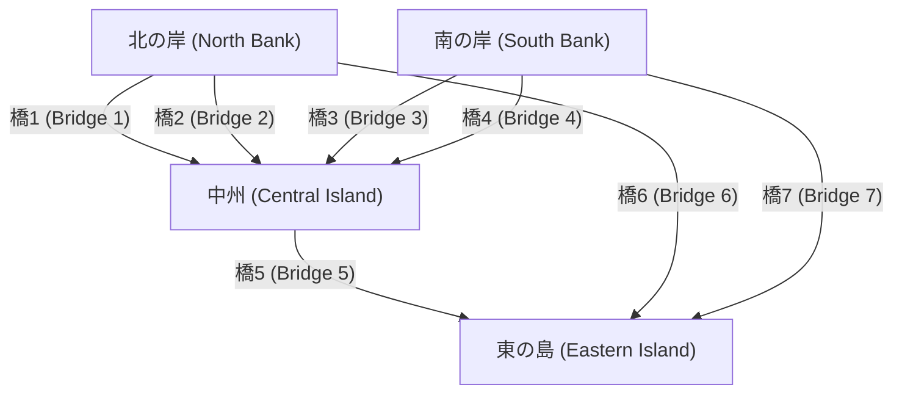
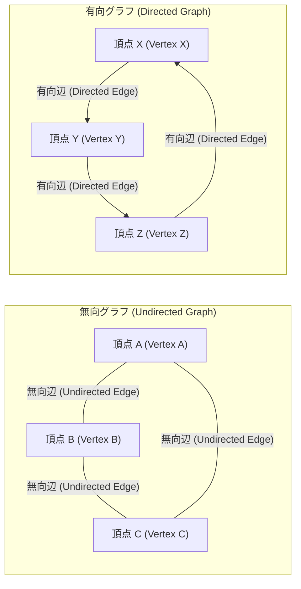

## 1. はじめに：世界は「ネットワーク」でできている

現代社会において、私たちは常に何かと繋がっています。インターネットを通じたコンピュータ同士の通信、ソーシャル・ネットワーキング・サービス (SNS) における複雑な人間関係、都市と都市を結ぶ広大な道路網や鉄道網、世界中を駆け巡る物流のサプライチェーン、あるいは私たち自身の脳内にある無数のニューロンの繋がりなど、世界は無数のネットワークによって構成されていると言っても過言ではありません。

一見すると非常に複雑で、無秩序にさえ見えるこれらのネットワークを、シンプルかつ数学的に厳密に表現し、分析するための強力な枠組みを提供するのが **[グラフ理論](https://kenji.blog/p/graph-theory-dijkstra-a-star/)** (Graph Theory) です。グラフ理論を用いることで、複雑なシステムの中に隠された構造や性質を解き明かし、最適な通信経路を見つけ出したり、ネットワーク全体の[脆弱性](https://kenji.blog/p/web-application-vulnerability-owasp-top-10/)を評価したりすることが可能になります。

本記事では、[グラフ](https://kenji.blog/p/tree-graph-data-structures-search-dfs-bfs-dijkstra/)理論の歴史的な起源から始まり、基本的な数学的定義、コンピュータプログラムとして扱うためのデータ構造、そして現代のテクノロジー基盤を支える代表的なアルゴリズムまで、幅広くかつ詳細に解説していきます。

## 2. グラフ理論の誕生：[ケーニヒスベルクの七つの橋](https://kenji.blog/p/seven-bridges-of-konigsberg/)

[グラフ理論](https://kenji.blog/p/graph-theory-dijkstra-a-star/)の歴史は、18世紀にまで遡ります。1736年、スイス出身の天才数学者であるレオンハルト・オイラー (Leonhard Euler) が、ある有名な数学のパズルを鮮やかに解決したことが、この分野の始まりとされています。そのパズルとは、「[ケーニヒスベルクの七つの橋](https://kenji.blog/p/seven-bridges-of-konigsberg/)」と呼ばれるものです。

当時のプロイセン王国にあったケーニヒスベルク（現在のロシア・カリーニングラード）という美しい都市には、プレーゲル川が流れており、川の中にある2つの島と両岸を結ぶように、全部で7つの橋が架けられていました。市民たちの間では、「すべての橋をちょうど1回ずつ渡って、元の出発点に戻ってくることができるだろうか？」という遊びが流行していました。多くの人が挑戦しましたが、誰も成功しませんでした。

[オイラー](https://kenji.blog/p/euler/)は、この問題を解くために、都市の実際の地図を極限まで抽象化するという画期的なアプローチをとりました。彼は、陸地（島や岸）を「点」とし、それらを結ぶ橋を「線」として表現し、距離や方角といった問題の本質に関係のない要素をすべて排除したのです。



[オイラー](https://kenji.blog/p/euler/)は、ある点を「通過」するためには、「入ってくる橋」と「出ていく橋」のペアが必ず必要であることに気づきました。つまり、出発点と終点以外のすべての点は、接続されている橋の数が「偶数」でなければならないと数学的に証明したのです。

ケーニヒスベルクの橋を抽象化した[グラフ](https://kenji.blog/p/tree-graph-data-structures-search-dfs-bfs-dijkstra/)では、4つの陸地（点）すべてにおいて、接続されている橋の数が「奇数」（3本または5本）でした。したがって、すべての橋をちょうど1回ずつ渡る「一筆書き」は不可能であると結論づけられました。

この[オイラー](https://kenji.blog/p/euler/)の発見こそが、 **[グラフ理論](https://kenji.blog/p/graph-theory-dijkstra-a-star/)** が誕生した瞬間でした。彼は複雑な現実の地形を排除し、点と線の接続関係（トポロジー）のみに焦点を当てることで、全く新しい数学の分野を切り開いたのです。

## 3. [グラフ理論の基礎](https://kenji.blog/p/basics-of-graph-theory/)概念と数学的定義

[グラフ理論](https://kenji.blog/p/graph-theory-dijkstra-a-star/)において、「[グラフ](https://kenji.blog/p/tree-graph-data-structures-search-dfs-bfs-dijkstra/)」とは、折れ線グラフや円グラフのような統計データの可視化手法のことではありません。対象物の集合と、それらの間の関係性を表す数学的な構造を指します。

### 3.1. グラフの基本構造：頂点と辺

グラフ $G$ は、一般的に頂点 (Vertex) の集合 $V$ と、辺 (Edge) の集合 $E$ の組として定義され、数学的には $G = (V, E)$ と表記されます。

*   **頂点 (Vertex / Node)** : ネットワークの構成要素を表します。視覚的には点として描かれます。集合 $V$ の要素数（頂点の数）は $|V|$ で表されます。
*   **辺 (Edge / Link)** : 頂点同士の関係性や繋がりを表します。視覚的には線として描かれます。集合 $E$ の要素数（辺の数）は $|E|$ で表されます。

例えば、頂点 $u$ と $v$ を結ぶ辺は、 $e = (u, v)$ と表現されます。

### 3.2. 有向グラフと無向グラフ

辺に方向性を持たせるかどうかによって、グラフは大きく2種類に分類されます。

*   **無向グラフ (Undirected [Graph](https://kenji.blog/p/tree-graph-data-structures-search-dfs-bfs-dijkstra/))** : 辺に向きがないグラフです。通信回線や双方向の道路、あるいはFacebookの「友達」関係のように、お互いの関係が常に対等・双方向である場合に用いられます。
*   **有向グラフ (Directed Graph)** : 辺に向きがあるグラフです。川の水流、一方通行の道路、あるいはTwitter（現在のX）の「フォロー」関係のように、単方向の関係を表現する場合に用いられます。有向グラフでは、辺は明確な矢印として描かれます。



### 3.3. 重み付き[グラフ](https://kenji.blog/p/tree-graph-data-structures-search-dfs-bfs-dijkstra/)

現実世界の問題をモデル化する際、単に「繋がっているか否か」だけでなく、「繋がりやすさ」や「コスト」を表現したいことがよくあります。このような場合、各辺に数値（重み）を割り当てた **重み付きグラフ (Weighted [Graph](https://kenji.blog/p/tree-graph-data-structures-search-dfs-bfs-dijkstra/))** が用いられます。重みは、都市間の距離、通信の遅延時間、あるいは移動にかかる費用などを表します。

### 3.4. 経路（パス）と閉路（サイクル）

グラフ内を移動する概念も非常に重要です。

*   **歩道 (Walk)** : 頂点と辺を交互に繰り返す列です。同じ頂点や同じ辺を何度通っても構いません。
*   **経路 (Path)** : 途中で同じ頂点を二度通らない歩道のことです。
*   **閉路 (Cycle)** : 始点と終点が同じである経路のことです。

これらの概念は、ネットワーク上のデータの流れの追跡や、交通ルートの[探索アルゴリズム](https://kenji.blog/p/search-algorithms-linear-binary-hash-table-principles/)において、基本的な構成要素となります。

### 3.5. 次数（ディグリー）と連結性

ある頂点に直接接続している辺の数を、その頂点の **次数 (Degree)** と呼びます。頂点 $v$ の次数は数学的に $\deg(v)$ と表されます。

有向グラフにおいては、頂点に入ってくる矢印の数を **入次数 (In-degree)** 、頂点から出ていく矢印の数を **出次数 (Out-degree)** と明確に区別します。

また、あるグラフ内の任意の2つの頂点間に常に経路が存在する場合、そのグラフは **連結 (Connected)** であると言います。インターネットなどの通信ネットワークにおいては、ネットワーク全体が連結グラフであることが、すべてのコンピュータが互いに通信可能であることを保証する上で絶対条件となります。

## 4. グラフをコンピュータで扱うためのデータ構造

[グラフ理論](https://kenji.blog/p/graph-theory-dijkstra-a-star/)の数学的な概念をプログラムとして実装し、コンピュータに高速に計算させるためには、[グラフ](https://kenji.blog/p/tree-graph-data-structures-search-dfs-bfs-dijkstra/)を適切なデータ構造でメモリ上に表現する必要があります。実用上、主に「隣接行列」と「隣接リスト」の2つが使われます。

### 4.1. 隣接行列 (Adjacency Matrix)

隣接行列は、グラフを2次元の配列（行列）で表現する方法です。頂点数が $N$ のグラフは、$N \times N$ の行列 $A$ で表されます。頂点 $i$ から頂点 $j$ へ辺が存在する場合、行列の要素 $A_{i,j}$ を $1$ とし、存在しない場合は $0$ とします。重み付きグラフの場合は、$1$ の代わりにその辺の重みの数値を入れます。

数学的には、以下のように定義されます。

$$
A_{i,j} = \begin{cases} 
1 & (\text{頂点 } i \text{ から頂点 } j \text{ への辺が存在する場合}) \\
0 & (\text{それ以外})
\end{cases}
$$

*   **長所** : 任意の2つの頂点間に辺が存在するかどうかを $\mathcal{O}(1)$ （定数時間）で即座に判定できます。また、行列の積を用いた代数的なグラフ解析（スペクトラルグラフ理論など）に直結します。
*   **短所** : 頂点数 $N$ に対してメモリ消費量が $\mathcal{O}(N^2)$ となり、巨大なグラフではメモリが枯渇します。特に、辺の数が頂点数の2乗に比べて非常に少ない **疎なグラフ (Sparse [Graph](https://kenji.blog/p/tree-graph-data-structures-search-dfs-bfs-dijkstra/))** では、行列の大部分が $0$ になり、著しく非効率です。

### 4.2. 隣接リスト (Adjacency List)

隣接リストは、各頂点ごとに、その頂点と直接繋がっている「隣接頂点のリスト（配列や連結リストなど）」を保持する方法です。

*   頂点 A: `[B, C]`
*   頂点 B: `[A, D, E]`
*   頂点 C: `[A, F]`

*   **長所** : メモリ消費量が頂点数と辺の数の和に比例するため、$\mathcal{O}(|V| + |E|)$ となり、現実世界に多い疎な[グラフ](https://kenji.blog/p/tree-graph-data-structures-search-dfs-bfs-dijkstra/)において極めてメモリ効率に優れています。
*   **短所** : ある特定の頂点 $i$ と頂点 $j$ が繋がっているかを確認するためには、リストを順番に探索する必要があるため、最悪の場合は $\mathcal{O}(|V|)$ の時間がかかってしまいます。

## 5. グラフを巡る代表的なアルゴリズム

グラフ上の問題を効率的に解決するために、情報科学の歴史の中で多くの優れたアルゴリズムが考案されてきました。ここでは、現代のソフトウェアエンジニアリングにおいて必須とされる代表的なアルゴリズムをいくつか紹介します。

### 5.1. 幅優先探索 ([BFS](https://kenji.blog/p/tree-graph-data-structures-search-dfs-bfs-dijkstra/)) と深さ優先探索 ([DFS](https://kenji.blog/p/tree-graph-data-structures-search-dfs-bfs-dijkstra/))

ネットワーク内のすべての頂点を、規則正しく漏れなく訪問するための最も基本的なアルゴリズムが、 **幅優先探索 (Breadth-First Search, BFS)** と **深さ優先探索 (Depth-First Search, DFS)** です。

*   **幅優先探索 (BFS)** : 始点から近い頂点を優先して同心円状に探索します。水面に石を投げたときに波紋が広がるようなイメージです。重みのないグラフにおいて、始点からの最短経路（経由する辺の数が最小の経路）を見つけるのに最適です。データ構造のキュー (Queue) を用いて実装されます。
*   **深さ優先探索 (DFS)** : 可能な限り深く探索を進め、行き止まりになったら直前の分岐点に戻って別の経路を探索します。迷路を壁伝いに解くようなイメージです。グラフ内の閉路（サイクル）の検出や、トポロジカル[ソート](https://kenji.blog/p/sorting-algorithms/)などに利用されます。スタック ([Stack](https://kenji.blog/p/c-language-pointers-memory-management-stack-heap/)) または関数の再帰呼び出しを用いて実装されます。

以下は、Pythonを用いた幅優先探索 ([BFS](https://kenji.blog/p/tree-graph-data-structures-search-dfs-bfs-dijkstra/)) のシンプルな実装例です。

```python
from collections import deque

def bfs(graph, start_vertex):
    """
    グラフに対する幅優先探索 (BFS) を実行する関数
    :param graph: 隣接リスト形式で表現されたグラフ辞書
    :param start_vertex: 探索を開始する初期頂点
    """
    visited = set() # 訪問済みの頂点を記録するための集合
    queue = deque([start_vertex]) # 探索予定の頂点を管理するキュー
    visited.add(start_vertex)
    
    while queue:
        # キューの先頭から頂点を取り出す
        vertex = queue.popleft()
        print(f"現在訪問中の頂点: {vertex}")
        
        # 現在の頂点に隣接する未訪問の頂点をすべてキューに追加する
        for neighbor in graph[vertex]:
            if neighbor not in visited:
                visited.add(neighbor)
                queue.append(neighbor)

# グラフの定義（隣接リスト形式）
graph_data = {
    'A': ['B', 'C'],
    'B': ['A', 'D', 'E'],
    'C': ['A', 'F'],
    'D': ['B'],
    'E': ['B', 'F'],
    'F': ['C', 'E']
}

print("BFSの実行結果ログ:")
bfs(graph_data, 'A')
```

### 5.2. 最短経路問題：[ダイクストラ法](https://kenji.blog/p/graph-theory-dijkstra-a-star/) ([Dijkstra](https://kenji.blog/p/graph-theory-dijkstra-a-star/)'s Algorithm)

地図アプリケーションで目的地までの最速ルートを検索するとき、システムの中枢で稼働しているのが **最短経路アルゴリズム** です。経路には「距離」や「所要時間」といったコスト（重み）が存在し、始点から終点までの累積コストが最小になる経路を求めることが目的となります。

オランダの計算機科学者エドガー・ダイクストラ (Edsger W. [Dijkstra](https://kenji.blog/p/tree-graph-data-structures-search-dfs-bfs-dijkstra/)) が1956年に考案した **[ダイクストラ法](https://kenji.blog/p/tree-graph-data-structures-search-dfs-bfs-dijkstra/)** は、辺の重みがすべて非負（0以上）であるという条件の下で、単一の始点からネットワーク内の他のすべての頂点への最短経路を効率的に計算する、極めて有名なアルゴリズムです。

ダイクストラ法の核となる論理は、「すでに始点からの最短距離が確定した頂点群から、最も距離が短い未確定の頂点を選び出し、その頂点を経由するルートによって周囲の頂点の最短距離情報を更新していく」というプロセスを反復することです。優先度付きキュー (Priority Queue) を用いることで、実行時間を大幅に短縮できます。

```python
import heapq

def dijkstra(graph, start):
    """
    ダイクストラ法による最短経路コストの計算
    """
    # 始点からの最短距離を保持する辞書。初期値は無限大。
    distances = {vertex: float('infinity') for vertex in graph}
    distances[start] = 0
    
    # (累積距離, 頂点) のタプルを格納する優先度付きキュー
    priority_queue = [(0, start)]
    
    while priority_queue:
        # 現在最も距離が短い頂点を取り出す
        current_distance, current_vertex = heapq.heappop(priority_queue)
        
        # キューから取り出した距離が、既に記録されている距離より長ければ処理をスキップ
        if current_distance > distances[current_vertex]:
            continue
            
        # 隣接するすべての頂点に対して距離の更新を試みる
        for neighbor, weight in graph[current_vertex].items():
            distance = current_distance + weight
            
            # 従来よりも短い経路が見つかった場合、距離を更新してキューに積む
            if distance < distances[neighbor]:
                distances[neighbor] = distance
                heapq.heappush(priority_queue, (distance, neighbor))
                
    return distances

# 重み付き有向グラフの定義
weighted_graph = {
    'A': {'B': 2, 'C': 5},
    'B': {'C': 2, 'D': 4},
    'C': {'D': 1},
    'D': {'C': 3} # 閉路が存在する
}

print("\nダイクストラ法の実行結果（頂点Aからの最短距離）:")
print(dijkstra(weighted_graph, 'A'))
```

### 5.3. 最小全域木問題：クラスカル法 (Kruskal's Algorithm)

ある広大なネットワーク内のすべての拠点を、最も安い総コストで物理的に繋ぎ合わせたいという要求を考えてみましょう。例えば、新しい住宅地に電力を供給するための電線網を構築したり、複数の都市間に光ファイバーケーブルを敷設したりする際、インフラ構築コストを最小化したいという状況です。

このように、[グラフ](https://kenji.blog/p/tree-graph-data-structures-search-dfs-bfs-dijkstra/)のすべての頂点を包含する部分グラフの中で、閉路を一切持たず（つまり木構造であり）、かつ使用する辺の重みの合計が最小になるような部分グラフを **最小全域木 (Minimum Spanning [Tree](https://kenji.blog/p/tree-graph-data-structures-search-dfs-bfs-dijkstra/), MST)** と呼びます。

この最小全域木を求める代表的なアルゴリズムの一つが **クラスカル法** です。クラスカル法は、局所的な最適解を積み重ねていく「貪欲法 (Greedy Algorithm)」の典型例であり、非常にシンプルで直感的な手順を踏みます。

1.  グラフ内に存在するすべての辺を、その重みが小さい順に並べ替えます。
2.  重みが最も小さい辺から順に1つずつ取り出し、その辺を全域木に追加することで「閉路（ループ）」が形成されない場合のみ、実際に全域木へと採用します。
3.  全域木に採用された辺の数が「頂点の総数 - 1」に達した時点でアルゴリズムを終了します。

閉路が形成されるかどうかの高速な判定には、素集合データ構造 (Union-Find Tree) という特別なデータ構造が活躍します。

### 5.4. ネットワークフローと最大フロー問題

都市の水道管ネットワークや、インターネットの基幹通信回線において、「始点（ソース）から終点（シンク）に向かって、システム全体で最大でどれだけの量（水やデータパケット）を同時に流すことができるか？」という問題を **最大フロー問題 (Maximum Flow Problem)** と呼びます。

ネットワークを構成する各辺（パイプやケーブル）には、単位時間あたりに流せる最大量を示す「容量 (Capacity)」が厳密に定められており、いかなる経路においてもこの容量を超過して流すことは物理的に不可能です。この複雑な問題は、フォード・ファルカーソン法 (Ford-Fulkerson Algorithm) などのアルゴリズムを用いることで、数学的に正確な最大流量を導き出すことができます。最大フロー理論は、交通渋滞のモデリングと緩和、物流ネットワークのボトルネック解消、さらには画像処理におけるオブジェクトの切り出し（グラフカット）など、驚くほど幅広い分野に応用されています。

## 6. 二部グラフとマッチング問題

[グラフ理論](https://kenji.blog/p/graph-theory-dijkstra-a-star/)の中でも特異な位置を占めるのが **二部グラフ (Bipartite [Graph](https://kenji.blog/p/tree-graph-data-structures-search-dfs-bfs-dijkstra/))** です。二部グラフとは、すべての頂点を2つのグループ（例えば、グループ $U$ とグループ $V$ ）に分割したとき、すべての辺が必ず $U$ の頂点と $V$ の頂点を結んでおり、同じグループ内の頂点同士を結ぶ辺が一切存在しないようなグラフのことです。

二部グラフは、「求職者」と「求人企業」、「学生」と「研究室」、「タクシー」と「乗客」のような、2つの異なる性質を持つ集合間の関係性をモデル化するのに最適です。

二部グラフにおける最も重要な問題の一つが **マッチング問題 (Matching Problem)** です。これは、グラフの中から互いに端点を共有しない辺の集合（マッチング）を選び出す問題です。特に、できるだけ多くのペアを成立させる「最大二部マッチング」は、リソースの最適な割り当て問題に直結します。また、各ペアの満足度や利益を最大化する問題は、ノーベル経済学賞の対象ともなった「ゲール・シャプレー・アルゴリズム (Gale-Shapley Algorithm)」などによって解かれ、研修医の病院配属や学校選択システムなど、現実の社会制度設計に深く組み込まれています。

## 7. 現代社会におけるグラフ理論の応用

グラフ理論は、黒板の上の抽象的な数学にとどまらず、私たちの日常生活を根底から支えるインフラストラクチャ技術として、多種多様な領域で活用されています。

### 7.1. 検索エンジンとPageRankアルゴリズム

Googleの検索エンジンが、世界中に散らばる無数のウェブページを瞬時に評価し、有用な順にランク付けする仕組みである **PageRank** アルゴリズムは、まさにウェブの世界を巨大な有向グラフとしてモデル化した決定的な成功例です。

*   **頂点** : インターネット上の個々のウェブページ
*   **辺** : ページからページへと飛ぶハイパーリンク

PageRankの根底にあるのは、「多くの良質なウェブページからリンクされているページは、それ自身もまた良質なページである可能性が極めて高い」という再帰的な評価のアイデアです。リンクの構造を巨大な隣接行列として表現し、その行列の主固有ベクトルを計算する（スペクトラルグラフ理論の応用）ことで、数千億ページにも及ぶインターネット情報の相対的な重要度を、数学的かつ客観的に算出することに成功しました。

### 7.2. ソーシャルネットワークの構造分析

Twitter、Facebook、LinkedIn、InstagramなどのSNSプラットフォームは、人と人、あるいは人とコンテンツの繋がりを表現した巨大な **ソーシャルグラフ (Social Graph)** を形成しています。グラフ理論を応用することで、巨大なコミュニティの構造を精緻に分析することができます。

例えば、「ネットワーク全体において最も影響力を持つ中心人物（インフルエンサー）は誰か？」という問いに対しては、 **中心性 (Centrality)** という概念が用いられます。頂点に繋がる辺の単純な数に基づく「次数中心性」、ネットワーク上の最短経路上にどれだけ頻繁に出現するかを測る「媒介中心性」、他のすべての頂点へのアクセスの良さを評価する「近接中心性」など、多様な指標を計算することで、インフルエンサーの特定、情報の拡散経路の予測、あるいはエコーチェンバー現象の検出などが行われています。

### 7.3. 機械学習とグラフニューラルネットワーク (GNN)

近年、人工知能 (AI) や機械学習の最前線において、グラフ構造のデータをそのまま直接的に学習できる **グラフニューラルネットワーク (Graph Neural Network, GNN)** が爆発的な注目を集めています。

画像認識に用いられるCNNや、自然言語処理に用いられる[Transformer](https://kenji.blog/p/large-language-models-llm-transformer-prompt-engineering/)などの従来の機械学習モデルは、グリッド状のピクセル配列や、1次元の単語の並びといった規則的なデータを扱うように設計されていました。しかし、SNSの複雑な繋がりや、分子を構成する原子の結合構造のような、不規則で複雑なグラフデータを扱うのは非常に困難でした。

GNNは、グラフ上の各頂点の特徴量情報と、グラフ全体のトポロジー（接続関係）を同時に伝播・学習させることで、この壁を打ち破りました。現在では、新しい化合物の特性を予測する創薬 (Drug Discovery) の分野、AmazonやNetflixの高度なレコメンデーションシステム、Googleマップの到着時間予測など、最先端のAIアプリケーションにおいてGNNは不可欠なコア技術として実用化されています。

## 8. まとめと今後の展望

本記事では、18世紀のケーニヒスベルクにおける素朴なパズルから産声を上げた **グラフ理論** が、いかにして現代社会の複雑極まりないネットワークを解き明かす「最強のツール」へと進化を遂げたのかを概観してきました。

点（頂点）と線（辺）という、これ以上ないほどシンプルで抽象的な要素のみから構成されるグラフですが、そこに適用される数学的理論や計算アルゴリズムの世界は、宇宙のように奥深く、そして圧倒的な力を秘めています。ソフトウェアエンジニア、データサイエンティスト、あるいは複雑なシステムに興味を持つすべての人にとって、グラフ理論の体系的な知識は、困難な問題に対する高度な抽象化能力と、最適解を導き出すための論理的思考力を飛躍的に向上させてくれるはずです。

もしあなたがプログラミングを学んでいるのであれば、ぜひこの記事を足がかりとして、[ダイクストラ法](https://kenji.blog/p/graph-theory-dijkstra-a-star/)や幅優先探索などのアルゴリズムを自身のパソコンで実際にコーディングして動かしてみてください。目に見えない複雑なネットワークが、あなたの書いたコードによって鮮やかに解きほぐされていく過程を体験するとき、[グラフ](https://kenji.blog/p/tree-graph-data-structures-search-dfs-bfs-dijkstra/)理論の真の美しさと面白さを実感できることでしょう。世界は、あなたが思っている以上に、美しく計算可能なグラフで満ち溢れているのです。
