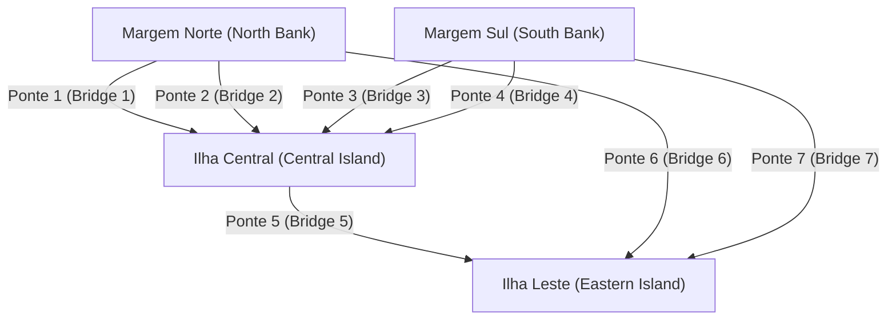
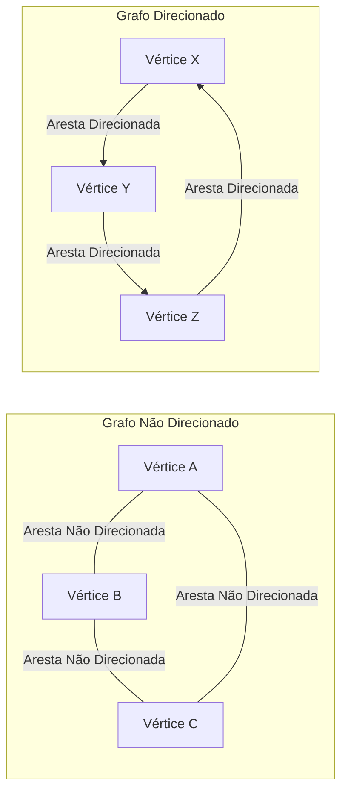

## 1. Introdução: O Mundo é Feito de Redes

Na sociedade moderna, estamos constantemente conectados a algo. Quer seja a comunicação entre computadores através da internet, as complexas relações humanas nas redes sociais (SNS), as vastas redes rodoviárias e ferroviárias que ligam as cidades, as cadeias de abastecimento globais para a logística, ou as inúmeras conexões neurais dentro dos nossos próprios cérebros – não é exagero dizer que o mundo é composto por inúmeras redes.

Fornecendo uma estrutura poderosa para representar e analisar de forma simples e matematicamente rigorosa estas redes, que à primeira vista parecem altamente complexas e até caóticas, está a **Teoria dos Grafos** (Graph Theory). Ao utilizar a teoria dos grafos, podemos desvendar as estruturas e propriedades ocultas em sistemas complexos, encontrar rotas de comunicação ideais e avaliar a vulnerabilidade de redes inteiras.

Este artigo explicará de forma abrangente e sistemática a teoria dos grafos, começando por suas origens históricas, abrangendo definições matemáticas básicas e estruturas de dados para programação de computadores, e introduzindo algoritmos representativos que sustentam a base da tecnologia moderna.

## 2. O Nascimento da Teoria dos Grafos: [As Sete Pontes de Königsberg](https://kenji.blog/p/seven-bridges-of-konigsberg/)

A história da teoria dos grafos remonta ao século XVIII. Em 1736, o brilhante matemático suíço [Leonhard Euler](https://kenji.blog/p/euler/) resolveu com elegância um famoso quebra-cabeças matemático, marcando o início deste campo. Este quebra-cabeças é conhecido como as "Sete Pontes de Königsberg".

Na bela cidade de Königsberg, no Reino da Prússia (atual Kaliningrado, Rússia), fluía o rio Pregel, com duas ilhas no meio e um total de sete pontes que as ligavam às margens do rio. Um jogo tornou-se popular entre os cidadãos: "É possível atravessar cada ponte exatamente uma vez e voltar ao ponto de partida original?" Muitas pessoas tentaram, mas ninguém teve sucesso.

Para resolver este problema, Euler adotou uma abordagem revolucionária ao abstrair o mapa real da cidade até ao seu limite. Ele representou as massas de terra (ilhas e margens) como "pontos" e as pontes que as ligavam como "linhas", eliminando todos os elementos irrelevantes para a essência do problema, como distância e direção.



Euler percebeu que para "passar através" de um ponto, deve haver sempre um par formado por uma "ponte de entrada" e uma "ponte de saída". Ou seja, ele provou matematicamente que para todos os pontos, exceto o ponto de partida e o ponto final, o número de pontes conectadas deve ser "par".

No grafo abstrato das pontes de Königsberg, o número de pontes conectadas a todas as quatro massas de terra (pontos) era "ímpar" (3 ou 5). Portanto, concluiu-se que é impossível traçar uma linha contínua cruzando todas as pontes exatamente uma vez.

Esta descoberta de Euler foi o momento exato em que a **Teoria dos Grafos** nasceu. Ao descartar o complexo terreno físico e concentrar-se apenas nas relações de conexão (topologia) de pontos e linhas, ele abriu um campo da matemática totalmente novo.

## 3. Conceitos Básicos e Definições Matemáticas da Teoria dos Grafos

Na teoria dos grafos, um "grafo" não se refere a métodos de visualização de dados estatísticos como gráficos de linhas ou de pizza. Refere-se a uma estrutura matemática que representa um conjunto de objetos e as relações entre eles.

### 3.1. Estrutura Básica de um Grafo: Vértices e Arestas

Um grafo $G$ é geralmente definido como um par de um conjunto de vértices $V$ e um conjunto de arestas $E$, denotado matematicamente como $G = (V, E)$.

*   **Vértice / Nó (Vertex / Node)**: Representa os componentes de uma rede. Desenhado visualmente como um ponto. O número de elementos no conjunto $V$ (número de vértices) é denotado por $|V|$.
*   **Aresta / Ligação (Edge / Link)**: Representa a relação ou conexão entre os vértices. Desenhado visualmente como uma linha. O número de elementos no conjunto $E$ (número de arestas) é denotado por $|E|$.

Por exemplo, uma aresta conectando o vértice $u$ e $v$ é representada como $e = (u, v)$.

### 3.2. Grafos Direcionados e Não Direcionados

Os grafos são amplamente classificados em dois tipos, dependendo se as arestas têm direção.

*   **Grafo Não Direcionado (Undirected Graph)**: Um grafo onde as arestas não têm direção. Usado quando a relação é sempre mútua e bidirecional, como linhas de comunicação, estradas de mão dupla ou relações de "amigos" no Facebook.
*   **Grafo Direcionado (Directed Graph)**: Um grafo onde as arestas têm uma direção. Usado para expressar relações unidirecionais, como o fluxo de água, ruas de mão única ou relações de "seguir" no Twitter (X). Em grafos direcionados, as arestas são claramente desenhadas como setas.



### 3.3. Grafos Ponderados

Ao modelar problemas do mundo real, muitas vezes queremos expressar não apenas "se estão conectados", mas também a "facilidade de conexão" ou "custo". Nesses casos, usa-se um **Grafo Ponderado (Weighted Graph)**, onde um valor numérico (peso) é atribuído a cada aresta. O peso pode representar a distância entre as cidades, o tempo de atraso de comunicação ou o custo da viagem.

### 3.4. Caminhos e Ciclos

O conceito de movimento dentro de um grafo também é muito importante.

*   **Passeio (Walk)**: Uma sequência alternando entre vértices e arestas. Os mesmos vértices ou arestas podem ser percorridos várias vezes.
*   **Caminho (Path)**: Um passeio onde nenhum vértice é visitado mais de uma vez.
*   **Ciclo (Cycle)**: Um caminho onde o ponto de partida e o ponto final são os mesmos.

Estes conceitos são blocos de construção fundamentais para rastrear o fluxo de dados em uma rede ou em algoritmos de roteamento de tráfego.

### 3.5. Grau e Conectividade

O número de arestas conectadas diretamente a um vértice é chamado de **Grau (Degree)** desse vértice. O grau do vértice $v$ é denotado matematicamente como $\deg(v)$.

Em um grafo direcionado, distinguimos claramente entre o **Grau de Entrada (In-degree)**, o número de setas que entram num vértice, e o **Grau de Saída (Out-degree)**, o número de setas que saem de um vértice.

Além disso, se sempre houver um caminho entre quaisquer dois vértices arbitrários em um grafo, diz-se que esse grafo é **Conexo (Connected)**. Em redes de comunicação como a Internet, o fato de toda a rede ser um grafo conexo é um requisito absoluto para garantir que todos os computadores possam comunicar entre si.

## 4. Estruturas de Dados para Lidar com Grafos em Computadores

Para implementar os conceitos matemáticos da teoria dos grafos como programas e fazer com que os computadores os calculem rapidamente, é necessário representar grafos na memória usando estruturas de dados apropriadas. Na prática, dois métodos principais são usados: "Matriz de Adjacência" e "Lista de Adjacência".

### 4.1. Matriz de Adjacência (Adjacency Matrix)

Uma matriz de adjacência é um método de representar um grafo usando um array bidimensional (matriz). Um grafo com $N$ vértices é representado por uma matriz $A$ de $N \times N$. Se existir uma aresta do vértice $i$ para o vértice $j$, o elemento da matriz $A_{i,j}$ é definido como $1$; se não existir, é definido como $0$. Para grafos ponderados, o valor numérico do peso da aresta é colocado em vez de $1$.

Matematicamente, é definido da seguinte forma:

$$
A_{i,j} = \begin{cases} 
1 & (\text{se existir uma aresta do vértice } i \text{ para o vértice } j) \\
0 & (\text{caso contrário})
\end{cases}
$$

*   **Prós**: É possível determinar imediatamente se existe uma aresta entre quaisquer dois vértices em $\mathcal{O}(1)$ (tempo constante). Também se vincula diretamente à análise algébrica de grafos (como a teoria espectral de grafos) usando multiplicação de matrizes.
*   **Contras**: O consumo de memória é de $\mathcal{O}(N^2)$ para o número de vértices $N$, o que esgotará a memória para grafos gigantes. Particularmente para **Grafos Esparsos (Sparse Graphs)**, onde o número de arestas é muito pequeno em comparação com o quadrado do número de vértices, a maior parte da matriz se torna $0$, tornando-o altamente ineficiente.

### 4.2. Lista de Adjacência (Adjacency List)

Uma lista de adjacência é um método que mantém uma "lista de vértices adjacentes (como um array ou lista ligada)" diretamente conectados por uma aresta para cada vértice.

*   Vértice A: `[B, C]`
*   Vértice B: `[A, D, E]`
*   Vértice C: `[A, F]`

*   **Prós**: O consumo de memória é proporcional à soma do número de vértices e arestas, resultando em $\mathcal{O}(|V| + |E|)$, tornando-o extremamente eficiente em termos de memória para grafos esparsos comuns no mundo real.
*   **Contras**: Para verificar se um vértice específico $i$ e o vértice $j$ estão conectados, é necessário pesquisar sequencialmente na lista, o que leva um tempo $\mathcal{O}(|V|)$ no pior dos casos.

## 5. Algoritmos Representativos em Torno dos Grafos

Para resolver problemas em grafos de forma eficiente, muitos excelentes algoritmos foram desenvolvidos ao longo da história da ciência da computação. Aqui introduzimos alguns algoritmos representativos que são considerados essenciais na engenharia de software moderna.

### 5.1. Busca em Largura (BFS) e Busca em Profundidade (DFS)

Os algoritmos mais fundamentais para visitar sistematicamente todos os vértices numa rede sem omissão são a **Busca em Largura (Breadth-First Search, BFS)** e a **Busca em Profundidade (Depth-First Search, DFS)**.

*   **Busca em Largura (BFS)**: Explora concentricamente, priorizando os vértices mais próximos ao ponto de partida. É como ondulações se espalhando quando uma pedra é atirada na água. É ideal para encontrar o caminho mais curto (o caminho com o número mínimo de arestas) em um grafo não ponderado. É implementado usando uma estrutura de dados de Fila (Queue).
*   **Busca em Profundidade (DFS)**: Explora o mais profundamente possível, e ao atingir um beco sem saída, volta ao ponto de ramificação anterior para explorar outro caminho. É como resolver um labirinto seguindo as paredes. Usado para detectar ciclos em um grafo ou para ordenação topológica. É implementado usando uma Pilha (Stack) ou chamadas de função recursivas.

Abaixo está um exemplo de implementação simples da Busca em Largura (BFS) usando Python.

```python
from collections import deque

def bfs(graph, start_vertex):
    """
    Função para executar a Busca em Largura (BFS) em um grafo
    :param graph: Dicionário do grafo representado no formato de lista de adjacência
    :param start_vertex: Vértice inicial para iniciar a exploração
    """
    visited = set() # Conjunto para registrar os vértices visitados
    queue = deque([start_vertex]) # Fila para gerenciar os vértices a explorar
    visited.add(start_vertex)
    
    while queue:
        # Remover um vértice da frente da fila
        vertex = queue.popleft()
        print(f"Visitando vértice atualmente: {vertex}")
        
        # Adicionar todos os vértices adjacentes não visitados à fila
        for neighbor in graph[vertex]:
            if neighbor not in visited:
                visited.add(neighbor)
                queue.append(neighbor)

# Definição do grafo (formato de lista de adjacência)
graph_data = {
    'A': ['B', 'C'],
    'B': ['A', 'D', 'E'],
    'C': ['A', 'F'],
    'D': ['B'],
    'E': ['B', 'F'],
    'F': ['C', 'E']
}

print("Registo de resultados de execução do BFS:")
bfs(graph_data, 'A')
```

### 5.2. Problema do Caminho Mais Curto: Algoritmo de Dijkstra

Ao procurar a rota mais rápida para um destino em uma aplicação de mapas, o que opera no núcleo do sistema é um **Algoritmo de Caminho Mais Curto**. A rota tem custos (pesos) como "distância" e "tempo de viagem", e o objetivo é encontrar o caminho que minimize o custo cumulativo desde o ponto de partida até ao destino.

Inventado pelo cientista da computação holandês Edsger W. Dijkstra em 1956, o **Algoritmo de Dijkstra** é um algoritmo extremamente famoso para calcular eficientemente o caminho mais curto de uma única origem para todos os outros vértices numa rede, sob a condição de que todos os pesos das arestas sejam não negativos (0 ou mais).

A lógica central do algoritmo de Dijkstra é repetir o processo de "selecionar o vértice com a distância não confirmada mais curta do conjunto de vértices cuja distância mais curta a partir do início já está confirmada, e atualizar as informações de distância mais curta dos vértices circundantes através de rotas passando por esse vértice". Ao usar uma Fila de Prioridade (Priority Queue), o tempo de execução pode ser reduzido significativamente.

```python
import heapq

def dijkstra(graph, start):
    """
    Cálculo dos custos do caminho mais curto usando o algoritmo de Dijkstra
    """
    # Dicionário para manter a distância mais curta a partir do início. O valor inicial é infinito.
    distances = {vertex: float('infinity') for vertex in graph}
    distances[start] = 0
    
    # Fila de prioridade para armazenar tuplos (distância acumulada, vértice)
    priority_queue = [(0, start)]
    
    while priority_queue:
        # Extrair o vértice com a distância mais curta atualmente
        current_distance, current_vertex = heapq.heappop(priority_queue)
        
        # Ignorar o processamento se a distância extraída da fila for maior que a distância já registada
        if current_distance > distances[current_vertex]:
            continue
            
        # Tentar atualizar as distâncias para todos os vértices adjacentes
        for neighbor, weight in graph[current_vertex].items():
            distance = current_distance + weight
            
            # Se for encontrado um caminho mais curto do que o anterior, atualizar a distância e empurrá-lo para a fila
            if distance < distances[neighbor]:
                distances[neighbor] = distance
                heapq.heappush(priority_queue, (distance, neighbor))
                
    return distances

# Definição de um grafo direcionado ponderado
weighted_graph = {
    'A': {'B': 2, 'C': 5},
    'B': {'C': 2, 'D': 4},
    'C': {'D': 1},
    'D': {'C': 3} # Um ciclo existe
}

print("\nResultado da execução do algoritmo de Dijkstra (distância mais curta do vértice A):")
print(dijkstra(weighted_graph, 'A'))
```

### 5.3. Problema da Árvore de Expansão Mínima: Algoritmo de Kruskal

Imagine a necessidade de ligar fisicamente todas as bases numa vasta rede com o menor custo total possível. Por exemplo, na construção de uma rede elétrica para fornecer eletricidade a uma nova área residencial, ou ao lançar cabos de fibra ótica entre várias cidades, a situação exige minimizar o custo de construção da infraestrutura.

Desta forma, um subgrafo que inclui todos os vértices do grafo, que não tem absolutamente nenhum ciclo (ou seja, uma estrutura em árvore), e que minimiza a soma dos pesos das arestas utilizadas é chamado de **Árvore de Expansão Mínima (Minimum Spanning Tree, MST)**.

Um dos algoritmos representativos para encontrar esta árvore de expansão mínima é o **Algoritmo de Kruskal**. O algoritmo de Kruskal é um exemplo típico de um "Algoritmo Guloso (Greedy Algorithm)" que acumula soluções ótimas locais, seguindo passos extremamente simples e intuitivos.

1.  Ordene todas as arestas presentes no grafo por ordem crescente dos seus pesos.
2.  Extraia as arestas uma a uma, começando pela de menor peso, e adote-a oficialmente na árvore de expansão apenas se a adição dessa aresta não formar um "ciclo (loop)".
3.  Termine o algoritmo quando o número de arestas adotadas na árvore de expansão atingir "número total de vértices - 1".

Uma estrutura de dados especial chamada Conjunto Disjunto (Union-Find Tree) tem um papel ativo na determinação rápida de se um ciclo é formado.

### 5.4. Fluxo em Redes e o Problema do Fluxo Máximo

Na rede de condutas de água de uma cidade ou nas linhas de comunicação de backbone da Internet, a questão "Qual é a quantidade máxima (de água ou pacotes de dados) que pode fluir simultaneamente por todo o sistema, desde o ponto de partida (fonte) até ao ponto de chegada (sorvedouro)?" é chamada de **Problema do Fluxo Máximo (Maximum Flow Problem)**.

Cada aresta (tubo ou cabo) que compõe a rede tem uma "Capacidade (Capacity)" estritamente definida que indica a quantidade máxima que pode fluir por unidade de tempo, e é fisicamente impossível que o fluxo exceda esta capacidade em qualquer rota. Este problema complexo pode ser resolvido de forma matemática e precisa utilizando algoritmos como o Algoritmo de Ford-Fulkerson para derivar a taxa de fluxo máximo. A teoria do fluxo máximo é aplicada a uma gama surpreendentemente vasta de campos, incluindo modelação e mitigação de congestionamentos de tráfego, resolução de estrangulamentos na rede logística e até mesmo extração de objetos (cortes em grafos) no processamento de imagens.

## 6. Grafos Bipartidos e Problemas de Emparelhamento

Ocupando uma posição única dentro da teoria dos grafos está o **Grafo Bipartido (Bipartite Graph)**. Um grafo bipartido é um grafo onde, quando todos os vértices são divididos em dois grupos (por exemplo, grupo $U$ e grupo $V$), todas as arestas ligam sempre um vértice em $U$ e um vértice em $V$, e não há absolutamente nenhuma aresta que ligue vértices dentro do mesmo grupo.

Os grafos bipartidos são ideais para modelar relações entre dois conjuntos com propriedades diferentes, tais como "candidatos a emprego" e "empresas de recrutamento", "estudantes" e "laboratórios", ou "táxis" e "passageiros".

Um dos problemas mais importantes em grafos bipartidos é o **Problema de Emparelhamento (Matching Problem)**. Este é o problema de selecionar um conjunto de arestas (emparelhamento) do grafo que não partilham os pontos de extremidade entre si. Em particular, o "emparelhamento bipartido máximo", que forma o maior número possível de pares, liga-se diretamente aos problemas de alocação ótima de recursos. Além disso, os problemas que maximizam a satisfação ou o lucro de cada par foram resolvidos pelo "Algoritmo de Gale-Shapley", que foi objeto do Prémio Nobel da Economia, e estão profundamente integrados nas concepções de sistemas sociais do mundo real, tais como a alocação de hospitais para médicos residentes e os sistemas de escolha de escolas.

## 7. Aplicações da Teoria dos Grafos na Sociedade Moderna

A teoria dos grafos não se restringe à matemática abstrata num quadro; ela é utilizada numa grande variedade de domínios como uma tecnologia de infraestrutura que suporta fundamentalmente o nosso dia a dia.

### 7.1. Motores de Busca e o Algoritmo PageRank

O mecanismo do motor de busca da Google, que avalia instantaneamente inúmeras páginas da web espalhadas pelo mundo e as classifica por ordem de utilidade, conhecido como algoritmo **PageRank**, é um caso de sucesso definitivo da modelação do mundo da web como um grafo direcionado gigante.

*   **Vértice**: Páginas web individuais na Internet
*   **Aresta**: Hiperligações (hyperlinks) saltando de página em página

Na base do PageRank está a ideia de avaliação recursiva de que "uma página para a qual apontam muitas páginas web de alta qualidade tem grande probabilidade de ser ela própria uma página de alta qualidade". Ao representar a estrutura das ligações como uma matriz de adjacência maciça e ao calcular o vetor próprio principal dessa matriz (uma aplicação da teoria espetral de grafos), conseguiram calcular de forma matemática e objetiva a importância relativa das informações na Internet, abrangendo centenas de milhares de milhões de páginas.

### 7.2. Análise Estrutural de Redes Sociais

Plataformas de SNS, como Twitter, Facebook, LinkedIn e Instagram, formam enormes **Grafos Sociais (Social Graphs)** que expressam as ligações entre as pessoas, ou entre as pessoas e o conteúdo. Aplicando a teoria dos grafos, a estrutura das grandes comunidades pode ser analisada com precisão.

Por exemplo, para responder à questão "Quem é a figura central (influenciador) com mais influência em toda a rede?", usa-se o conceito de **Centralidade (Centrality)**. Ao calcular várias métricas, tais como a "centralidade de grau", baseada no simples número de arestas ligadas a um vértice, a "centralidade de intermediação" (betweenness), que mede a frequência com que se aparece nos caminhos mais curtos da rede, e a "centralidade de proximidade" (closeness), que avalia a facilidade de acesso a todos os outros vértices, são realizadas atividades como a identificação de influenciadores, a previsão de rotas de difusão de informações e a detecção de fenómenos de câmara de eco.

### 7.3. Aprendizado de Máquina e Redes Neurais de Grafos (GNN)

Nos últimos anos, na vanguarda da inteligência artificial (IA) e do aprendizado de máquina, as **Redes Neurais de Grafos (Graph Neural Networks, GNN)**, que podem aprender diretamente a partir de dados com estruturas de grafos, atraíram uma atenção explosiva.

Os modelos de aprendizado de máquina tradicionais, como as CNNs utilizadas no reconhecimento de imagens ou os Transformers usados no processamento de linguagem natural, foram concebidos para lidar com dados regulares, como arrays de píxeis em grelha ou sequências de palavras unidimensionais. No entanto, era extremamente difícil lidar com dados de grafos irregulares e complexos, como as intrincadas ligações de SNS ou as estruturas de ligações atómicas que constituem as moléculas.

As GNNs ultrapassaram esta barreira ao propagar e aprender simultaneamente as informações de características de cada vértice do grafo e a topologia (relações de ligação) de todo o grafo. Atualmente, as GNNs foram implementadas na prática como tecnologias essenciais em aplicações de IA de ponta, nomeadamente no campo da descoberta de fármacos (Drug Discovery), prevendo as propriedades de novos compostos, em sistemas avançados de recomendação na Amazon e Netflix, e na previsão da hora de chegada no Google Maps.

## 8. Conclusão e Perspetivas Futuras

Neste artigo, traçámos como a **Teoria dos Grafos**, nascida de um simples quebra-cabeças em Königsberg no século XVIII, evoluiu para se tornar a "ferramenta definitiva" para desvendar as redes extremamente complexas da sociedade moderna.

Embora os grafos sejam compostos apenas pelos elementos mais simples e abstratos possíveis: pontos (vértices) e linhas (arestas), o mundo das teorias matemáticas e dos algoritmos de cálculo que lhes são aplicados é tão profundo como o universo e encerra um poder avassalador. Para engenheiros de software, cientistas de dados ou qualquer pessoa interessada em sistemas complexos, o conhecimento sistemático da teoria dos grafos melhorará exponencialmente a capacidade de abstração de alto nível perante problemas difíceis e o pensamento lógico para derivar as soluções ideais.

Se estiver a aprender programação, utilize este artigo como trampolim e tente efetivamente codificar e executar no seu próprio computador algoritmos como o de Dijkstra ou a busca em largura. Quando experienciar o processo em que redes invisíveis e complexas são desvendadas de forma vívida através do código que escreveu, compreenderá verdadeiramente a autêntica beleza e o fascínio da teoria dos grafos. O mundo está cheio de grafos mais belos e computáveis do que poderia pensar.
