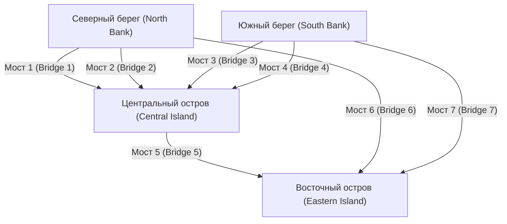
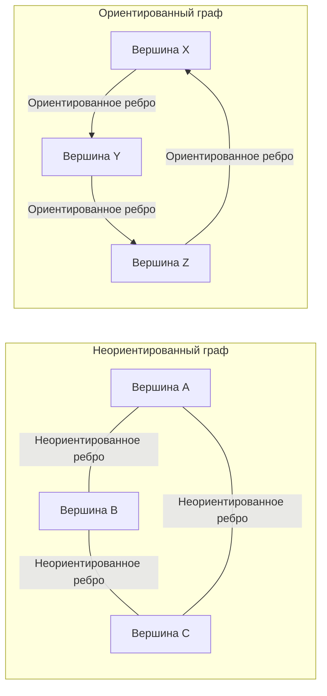

## 1. Введение: Мир состоит из сетей

В современном обществе мы постоянно с чем-то связаны. Будь то связь между компьютерами через Интернет, сложные человеческие отношения в социальных сетях (SNS), обширные автомобильные и железные дороги, соединяющие города, глобальные цепочки поставок в логистике или бесчисленные нейронные связи в нашем собственном мозге — не будет преувеличением сказать, что мир состоит из бесчисленных сетей.

Мощную структуру для простого и математически строгого представления и анализа этих сетей, которые на первый взгляд кажутся в высшей степени сложными и даже хаотичными, предоставляет **Теория графов** ([Graph Theory](https://kenji.blog/ru/p/graph-theory-dijkstra-a-star/)). Используя теорию графов, мы можем раскрыть скрытые структуры и свойства внутри сложных систем, найти оптимальные маршруты связи и оценить уязвимость целых сетей.

В этой статье будет всесторонне и систематически объяснена теория графов, начиная с ее исторических истоков, охватывая основные математические определения и структуры данных для компьютерного программирования, а также представляя репрезентативные алгоритмы, которые служат фундаментом современных технологий.

## 2. Рождение теории графов: [Семь мостов Кёнигсберга](https://kenji.blog/ru/p/seven-bridges-of-konigsberg/)

История теории графов восходит к 18 веку. В 1736 году гениальный швейцарский математик [Леонард Эйлер](https://kenji.blog/ru/p/euler/) (Leonhard Euler) элегантно решил знаменитую математическую головоломку, положив начало этой области. Эта головоломка известна как «[Семь мостов Кёнигсберга](https://kenji.blog/ru/p/seven-bridges-of-konigsberg/)».

В красивом городе Кёнигсберге в Прусском королевстве (ныне Калининград, Россия) протекала река Преголя, посреди которой находились два острова, и в общей сложности семь мостов соединяли их с берегами реки. Среди горожан стала популярной игра: «Можно ли пройти по каждому мосту ровно один раз и вернуться в исходную точку отправления?» Многие люди пытались, но никому это не удалось.

Чтобы решить эту проблему, Эйлер применил революционный подход к абстрагированию реальной карты города до предела. Он представил участки суши (острова и берега) как «точки», а соединяющие их мосты как «линии», устранив все элементы, не относящиеся к сути проблемы, такие как расстояние и направление.



Эйлер понял, что для того, чтобы «пройти» через точку, всегда должна существовать пара из «входящего моста» и «выходящего моста». То есть он математически доказал, что для всех точек, кроме начальной и конечной, количество соединенных мостов должно быть «четным».

В абстрактном графе кёнигсбергских мостов количество соединенных мостов на всех четырех участках суши (точках) было «нечетным» (либо 3, либо 5). Поэтому был сделан вывод о том, что невозможно нарисовать непрерывную линию, пересекающую все мосты ровно один раз.

Это открытие Эйлера стало точным моментом зарождения **Теории графов**. Отбросив сложный физический рельеф и сосредоточившись исключительно на отношениях соединения (топологии) точек и линий, он открыл совершенно новую область математики.

## 3. Основные понятия и математические определения теории графов

В теории графов «граф» не относится к методам визуализации статистических данных, таким как линейные диаграммы или круговые диаграммы. Он относится к математической структуре, которая представляет собой набор объектов и связи между ними.

### 3.1. Базовая структура графа: Вершины и Ребра

Граф $G$ обычно определяется как пара из множества вершин (Vertex) $V$ и множества ребер (Edge) $E$, математически обозначаемая как $G = (V, E)$.

*   **Вершина / Узел (Vertex / Node)**: Представляет компоненты сети. Визуально изображается как точка. Количество элементов в множестве $V$ (количество вершин) обозначается как $|V|$.
*   **Ребро / Связь (Edge / Link)**: Представляет отношение или связь между вершинами. Визуально изображается как линия. Количество элементов в множестве $E$ (количество ребер) обозначается как $|E|$.

Например, ребро, соединяющее вершину $u$ и $v$, представляется как $e = (u, v)$.

### 3.2. Ориентированные и неориентированные графы

Графы в целом классифицируются на два типа в зависимости от того, имеют ли ребра направление.

*   **Неориентированный граф (Undirected [Graph](https://kenji.blog/ru/p/tree-graph-data-structures-search-dfs-bfs-dijkstra/))**: Граф, в котором ребра не имеют направления. Используется, когда отношения всегда взаимны и двунаправленны, например, линии связи, дороги с двусторонним движением или отношения «друзей» в Facebook.
*   **Ориентированный граф (Directed Graph)**: Граф, в котором ребра имеют направление. Используется для выражения однонаправленных отношений, таких как поток воды, улицы с односторонним движением или отношения «подписки» в Twitter (X). В ориентированных графах ребра четко нарисованы в виде стрелок.



### 3.3. Взвешенные графы

При моделировании проблем реального мира мы часто хотим выразить не только «связаны ли они», но и «легкость связи» или «стоимость». В таких случаях используется **Взвешенный граф (Weighted [Graph](https://kenji.blog/ru/p/tree-graph-data-structures-search-dfs-bfs-dijkstra/))**, где каждому ребру присваивается числовое значение (вес). Вес может представлять расстояние между городами, время задержки связи или стоимость поездки.

### 3.4. Пути и Циклы

Концепция перемещения внутри графа также очень важна.

*   **Маршрут (Walk)**: Последовательность чередующихся вершин и ребер. Одни и те же вершины или ребра могут быть пройдены несколько раз.
*   **Путь (Path)**: Маршрут, в котором ни одна вершина не посещается более одного раза.
*   **Цикл (Cycle)**: Путь, в котором начальная и конечная точки совпадают.

Эти концепции являются фундаментальными строительными блоками для отслеживания потока данных в сети или в алгоритмах маршрутизации трафика.

### 3.5. Степень и Связность

Количество ребер, напрямую соединенных с вершиной, называется **Степенью (Degree)** этой вершины. Степень вершины $v$ математически обозначается как $\deg(v)$.

В ориентированном графе мы четко различаем **Степень захода (In-degree)** (количество стрелок, входящих в вершину) и **Степень исхода (Out-degree)** (количество стрелок, выходящих из вершины).

Кроме того, если между любыми двумя произвольными вершинами в графе всегда существует путь, такой граф называется **Связным (Connected)**. В сетях связи, таких как Интернет, абсолютным требованием для обеспечения возможности взаимодействия всех компьютеров является то, чтобы вся сеть была связным графом.

## 4. Структуры данных для обработки графов в компьютерах

Чтобы реализовать математические концепции теории графов в виде программ и заставить компьютеры быстро их вычислять, необходимо представлять графы в памяти с использованием соответствующих структур данных. На практике в основном используются два метода: «Матрица смежности» и «Список смежности».

### 4.1. Матрица смежности (Adjacency Matrix)

Матрица смежности — это метод представления графа с использованием двумерного массива (матрицы). Граф с $N$ вершинами представляется матрицей $A$ размером $N \times N$. Если существует ребро от вершины $i$ к вершине $j$, элемент матрицы $A_{i,j}$ устанавливается равным $1$; если не существует, устанавливается равным $0$. Для взвешенных графов вместо $1$ помещается числовое значение веса ребра.

Математически это определяется следующим образом:

$$
A_{i,j} = \begin{cases} 
1 & (\text{если существует ребро от вершины } i \text{ к вершине } j) \\
0 & (\text{в противном случае})
\end{cases}
$$

*   **Плюсы**: Можно сразу определить, существует ли ребро между любыми двумя вершинами, за время $\mathcal{O}(1)$ (константное время). Это также напрямую связано с алгебраическим анализом графов (например, спектральной теорией графов) с использованием умножения матриц.
*   **Минусы**: Потребление памяти составляет $\mathcal{O}(N^2)$ для количества вершин $N$, что исчерпает память для гигантских графов. В особенности для **Разреженных графов (Sparse Graphs)**, где количество ребер очень мало по сравнению с квадратом количества вершин, большая часть матрицы становится равной $0$, что делает ее крайне неэффективной.

### 4.2. Список смежности (Adjacency List)

Список смежности — это метод, который поддерживает «список смежных вершин (например, массив или связный список)», напрямую соединенных ребром для каждой вершины.

*   Вершина A: `[B, C]`
*   Вершина B: `[A, D, E]`
*   Вершина C: `[A, F]`

*   **Плюсы**: Потребление памяти пропорционально сумме количества вершин и ребер, что дает $\mathcal{O}(|V| + |E|)$, делая его чрезвычайно эффективным с точки зрения памяти для разреженных графов, распространенных в реальном мире.
*   **Минусы**: Чтобы проверить, связаны ли определенная вершина $i$ и вершина $j$, необходимо последовательно просматривать список, что в худшем случае занимает время $\mathcal{O}(|V|)$.

## 5. Репрезентативные алгоритмы работы с графами

Для эффективного решения задач на графах на протяжении всей истории информатики было разработано множество превосходных алгоритмов. Здесь мы представляем некоторые репрезентативные алгоритмы, которые считаются необходимыми в современной разработке программного обеспечения.

### 5.1. Поиск в ширину ([BFS](https://kenji.blog/ru/p/tree-graph-data-structures-search-dfs-bfs-dijkstra/)) и Поиск в глубину ([DFS](https://kenji.blog/ru/p/tree-graph-data-structures-search-dfs-bfs-dijkstra/))

Самыми фундаментальными алгоритмами для систематического обхода всех вершин в сети без пропусков являются **Поиск в ширину (Breadth-First Search, BFS)** и **Поиск в глубину (Depth-First Search, DFS)**.

*   **Поиск в ширину (BFS)**: Исследует концентрически, отдавая приоритет вершинам, расположенным ближе к начальной точке. Это похоже на рябь, расходящуюся при бросании камня в воду. Идеально подходит для поиска кратчайшего пути (пути с минимальным количеством ребер) в невзвешенном графе. Реализуется с использованием структуры данных Очередь (Queue).
*   **Поиск в глубину (DFS)**: Исследует как можно глубже, а при достижении тупика возвращается к предыдущей точке ветвления, чтобы исследовать другой путь. Это похоже на решение лабиринта, следуя вдоль стены. Используется для обнаружения циклов в графе или для топологической сортировки. Реализуется с использованием Стека ([Stack](https://kenji.blog/ru/p/c-language-pointers-memory-management-stack-heap/)) или рекурсивных вызовов функций.

Ниже приведен простой пример реализации Поиска в ширину (BFS) с использованием Python.

```python
from collections import deque

def bfs(graph, start_vertex):
    """
    Функция для выполнения Поиска в ширину (BFS) в графе
    :param graph: Словарь графа, представленный в формате списка смежности
    :param start_vertex: Начальная вершина для начала исследования
    """
    visited = set() # Множество для записи посещенных вершин
    queue = deque([start_vertex]) # Очередь для управления вершинами для исследования
    visited.add(start_vertex)
    
    while queue:
        # Извлечь вершину из начала очереди
        vertex = queue.popleft()
        print(f"В настоящее время посещается вершина: {vertex}")
        
        # Добавить все смежные непосещенные вершины в очередь
        for neighbor in graph[vertex]:
            if neighbor not in visited:
                visited.add(neighbor)
                queue.append(neighbor)

# Определение графа (формат списка смежности)
graph_data = {
    'A': ['B', 'C'],
    'B': ['A', 'D', 'E'],
    'C': ['A', 'F'],
    'D': ['B'],
    'E': ['B', 'F'],
    'F': ['C', 'E']
}

print("Журнал результатов выполнения BFS:")
bfs(graph_data, 'A')
```

### 5.2. Задача о кратчайшем пути: Алгоритм Дейкстры

При поиске самого быстрого маршрута до пункта назначения в картографическом приложении в ядре системы работает **Алгоритм кратчайшего пути**. У маршрута есть стоимости (веса), такие как «расстояние» и «время в пути», и цель состоит в том, чтобы найти путь, который минимизирует совокупную стоимость от начальной точки до пункта назначения.

Изобретенный голландским ученым в области информатики Эдсгером В. Дейкстрой в 1956 году, **Алгоритм Дейкстры** является чрезвычайно известным алгоритмом для эффективного вычисления кратчайшего пути от единственного источника ко всем другим вершинам в сети при условии, что все веса ребер неотрицательны (0 или больше).

Основная логика алгоритма Дейкстры заключается в повторении процесса «выбора вершины с кратчайшим неподтвержденным расстоянием из множества вершин, кратчайшее расстояние которых от начала уже подтверждено, и обновления информации о кратчайшем расстоянии для окружающих вершин через маршруты, проходящие через эту вершину». При использовании Очереди с приоритетом (Priority Queue) время выполнения может быть значительно сокращено.

```python
import heapq

def dijkstra(graph, start):
    """
    Вычисление стоимости кратчайшего пути с использованием алгоритма Дейкстры
    """
    # Словарь для хранения кратчайшего расстояния от старта. Начальное значение - бесконечность.
    distances = {vertex: float('infinity') for vertex in graph}
    distances[start] = 0
    
    # Очередь с приоритетом для хранения кортежей (накопленное расстояние, вершина)
    priority_queue = [(0, start)]
    
    while priority_queue:
        # Извлечь вершину с наименьшим расстоянием в настоящее время
        current_distance, current_vertex = heapq.heappop(priority_queue)
        
        # Пропустить обработку, если расстояние, извлеченное из очереди, больше, чем уже записанное расстояние
        if current_distance > distances[current_vertex]:
            continue
            
        # Попытаться обновить расстояния для всех смежных вершин
        for neighbor, weight in graph[current_vertex].items():
            distance = current_distance + weight
            
            # Если найден путь короче, чем раньше, обновить расстояние и поместить его в очередь
            if distance < distances[neighbor]:
                distances[neighbor] = distance
                heapq.heappush(priority_queue, (distance, neighbor))
                
    return distances

# Определение взвешенного ориентированного графа
weighted_graph = {
    'A': {'B': 2, 'C': 5},
    'B': {'C': 2, 'D': 4},
    'C': {'D': 1},
    'D': {'C': 3} # Существует цикл
}

print("\nРезультат выполнения алгоритма Дейкстры (кратчайшее расстояние от вершины A):")
print(dijkstra(weighted_graph, 'A'))
```

### 5.3. Задача о минимальном остовном дереве: Алгоритм Крускала

Представьте себе необходимость физически соединить все базы в обширной сети с минимально возможными общими затратами. Например, при строительстве энергосистемы для снабжения электроэнергией нового жилого района или при прокладке волоконно-оптических кабелей между несколькими городами ситуация требует минимизации затрат на строительство инфраструктуры.

Таким образом, подграф, который включает все вершины графа, абсолютно не имеет циклов (т. е. древовидная структура) и минимизирует сумму весов используемых ребер, называется **Минимальным остовным деревом (Minimum Spanning [Tree](https://kenji.blog/ru/p/tree-graph-data-structures-search-dfs-bfs-dijkstra/), MST)**.

Одним из репрезентативных алгоритмов для поиска этого минимального остовного дерева является **Алгоритм Крускала**. Алгоритм Крускала является типичным примером «Жадного алгоритма (Greedy Algorithm)», который накапливает локальные оптимальные решения, следуя чрезвычайно простым и интуитивно понятным шагам.

1.  Отсортируйте все ребра, присутствующие в графе, в порядке возрастания их весов.
2.  Извлекайте ребра по одному, начиная с ребра с наименьшим весом, и официально принимайте его в остовное дерево, только если добавление этого ребра не образует «цикл (петлю)».
3.  Завершите алгоритм, когда количество ребер, принятых в остовное дерево, достигнет «общее количество вершин - 1».

Специальная структура данных под названием Система непересекающихся множеств (Union-Find Tree) играет активную роль в быстром определении того, образуется ли цикл.

### 5.4. Сетевой поток и задача о максимальном потоке

В водопроводной сети города или в магистральных линиях связи Интернета вопрос «Каково максимальное количество (воды или пакетов данных), которое может одновременно протекать через всю систему от начальной точки (источника) до конечной точки (стока)?» называется **Задачей о максимальном потоке (Maximum Flow Problem)**.

Каждое ребро (труба или кабель), составляющее сеть, имеет строго определенную «Емкость (Capacity)», указывающую максимальное количество, которое может протекать за единицу времени, и физически невозможно, чтобы поток превышал эту емкость на любом маршруте. Эту сложную проблему можно математически точно решить с помощью таких алгоритмов, как Алгоритм Форда-Фалкерсона, чтобы вывести максимальную скорость потока. Теория максимального потока применяется в удивительно широком спектре областей, включая моделирование и смягчение заторов на дорогах, устранение узких мест в логистических сетях и даже выделение объектов (разрезы графов) при обработке изображений.

## 6. Двудольные графы и задачи о паросочетании

Уникальное положение в теории графов занимает **Двудольный граф (Bipartite [Graph](https://kenji.blog/ru/p/tree-graph-data-structures-search-dfs-bfs-dijkstra/))**. Двудольный граф — это граф, в котором, когда все вершины разделены на две группы (например, группа $U$ и группа $V$), каждое ребро всегда соединяет вершину из $U$ и вершину из $V$, и абсолютно нет ребер, соединяющих вершины внутри одной и той же группы.

Двудольные графы идеально подходят для моделирования отношений между двумя множествами с различными свойствами, такими как «искатели работы» и «рекрутинговые компании», «студенты» и «лаборатории» или «такси» и «пассажиры».

Одной из наиболее важных проблем в двудольных графах является **Задача о паросочетании (Matching Problem)**. Это задача выбора из графа множества ребер (паросочетания), которые не имеют общих конечных точек друг с другом. В частности, «максимальное двудольное паросочетание», образующее как можно больше пар, напрямую связано с проблемами оптимального распределения ресурсов. Кроме того, проблемы максимизации удовлетворения или прибыли каждой пары были решены с помощью «Алгоритма Гейла-Шепли», который стал предметом Нобелевской премии по экономике, и глубоко интегрированы в проекты реальных социальных систем, такие как распределение интернов по больницам и системы выбора школ.

## 7. Применение теории графов в современном обществе

Теория графов не ограничивается абстрактной математикой на классной доске; она используется в самых разных областях как инфраструктурная технология, которая фундаментально поддерживает нашу повседневную жизнь.

### 7.1. Поисковые системы и алгоритм PageRank

Механизм поисковой системы Google, который мгновенно оценивает бесчисленные веб-страницы, разбросанные по всему миру, и ранжирует их в порядке полезности, известный как алгоритм **PageRank**, является окончательной историей успеха моделирования веб-мира как массивного ориентированного графа.

*   **Вершина**: Отдельные веб-страницы в Интернете
*   **Ребро**: Гиперссылки, переходящие со страницы на страницу

В основе PageRank лежит идея рекурсивной оценки о том, что «страница, на которую ссылаются многие высококачественные веб-страницы, с высокой вероятностью сама является высококачественной страницей». Представив структуру ссылок в виде огромной матрицы смежности и вычислив главный собственный вектор этой матрицы (применение спектральной теории графов), они преуспели в математически и объективном вычислении относительной важности информации в Интернете, охватывающей сотни миллиардов страниц.

### 7.2. Структурный анализ социальных сетей

Платформы социальных сетей, такие как Twitter, Facebook, LinkedIn и Instagram, формируют массивные **Социальные графы (Social Graphs)**, выражающие связи между людьми или людьми и контентом. Применяя теорию графов, можно точно проанализировать структуру огромных сообществ.

Например, чтобы ответить на вопрос «Кто является центральной фигурой (лидером мнений) с наибольшим влиянием во всей сети?», используется концепция **Центральности (Centrality)**. Рассчитывая различные показатели, такие как «центральность по степени», основанная на простом количестве ребер, соединенных с вершиной, «центральность по посредничеству», измеряющая, как часто человек появляется на кратчайших путях в сети, и «центральность по близости», оценивающая легкость доступа ко всем другим вершинам, выполняются такие действия, как выявление лидеров мнений, прогнозирование маршрутов распространения информации и обнаружение феноменов эхо-камеры.

### 7.3. Машинное обучение и Графовые нейронные сети (GNN)

В последние годы на переднем крае искусственного интеллекта (ИИ) и машинного обучения взрывное внимание привлекли **Графовые нейронные сети (Graph Neural Networks, GNN)**, способные напрямую обучаться на данных со структурой графов.

Традиционные модели машинного обучения, такие как CNN, используемые в распознавании изображений, или [Transformer](https://kenji.blog/ru/p/large-language-models-llm-transformer-prompt-engineering/)s, используемые в обработке естественного языка, были разработаны для обработки регулярных данных, таких как сеткообразные массивы пикселей или одномерные последовательности слов. Однако обрабатывать нерегулярные и сложные графовые данные, такие как сложные связи в социальных сетях или структуры атомных связей, составляющие молекулы, было чрезвычайно сложно.

GNN преодолели этот барьер, одновременно распространяя и изучая информацию о признаках каждой вершины в графе и топологии (отношениях связи) всего графа. Сегодня GNN были введены в практическое использование в качестве незаменимых основных технологий в передовых приложениях ИИ, включая область открытия лекарств (Drug Discovery) для прогнозирования свойств новых соединений, передовые системы рекомендаций на Amazon и Netflix, а также прогнозирование времени прибытия на Google Картах.

## 8. Заключение и перспективы на будущее

В этой статье мы обрисовали в общих чертах, как **Теория графов**, зародившаяся из простой головоломки в Кёнигсберге в 18 веке, превратилась в «идеальный инструмент» для распутывания чрезвычайно сложных сетей современного общества.

Хотя графы состоят только из самых простых и абстрактных элементов из возможных: точек (вершин) и линий (ребер), мир применяемых к ним математических теорий и вычислительных алгоритмов глубок, как вселенная, и таит в себе подавляющую силу. Для инженеров-программистов, специалистов по данным или всех, кто интересуется сложными системами, систематические знания теории графов в геометрической прогрессии улучшат способность к абстракции на высоком уровне при решении сложных проблем и логическое мышление для получения оптимальных решений.

Если вы изучаете программирование, пожалуйста, используйте эту статью как трамплин и попробуйте фактически написать код и запустить такие алгоритмы, как алгоритм Дейкстры или поиск в ширину, на собственном компьютере. Когда вы испытаете процесс, в котором невидимые сложные сети живо распутываются с помощью написанного вами кода, вы по-настоящему осознаете истинную красоту и очарование теории графов. Мир полон более красивых и вычисляемых графов, чем вы могли бы подумать.
