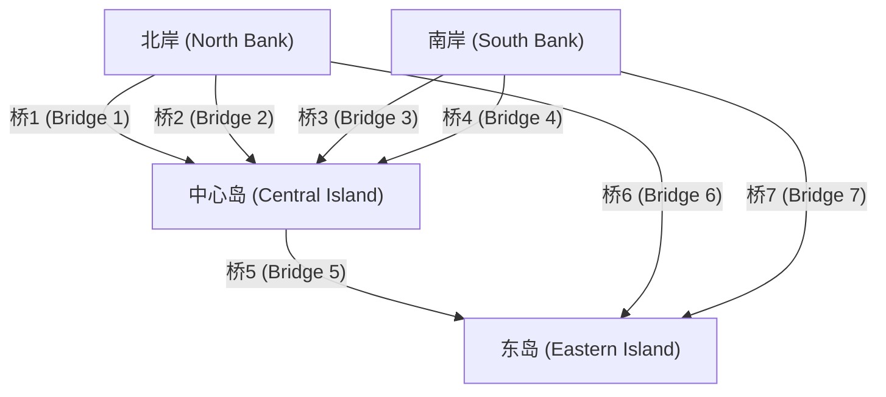
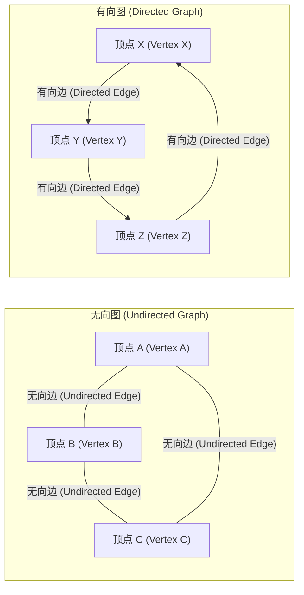

## 1. 引言：世界是由“网络”构成的

在现代社会中，我们总是与某些事物相连。无论是计算机之间通过互联网进行的通信、社交网络服务 (SNS) 中复杂的人际关系、连接城市的光阔公路和铁路网、遍布全球的物流供应链，还是我们自己大脑中无数神经元的连接——毫不夸张地说，世界是由无数的网络构成的。

提供一个强大框架，以简单而严谨的数学方式表示和分析这些乍看之下极其复杂甚至无序的网络，正是 **图论** (Graph Theory) 。通过使用图论，我们能够揭示复杂系统背后隐藏的结构和属性，找到最佳的通信路径，并评估整个网络的脆弱性。

本文将全面而系统地讲解图论，从其历史起源开始，涵盖基本的数学定义、用于计算机编程的数据结构，并介绍支撑现代技术基础的代表性算法。

## 2. 图论的诞生：哥尼斯堡七桥问题

图论的历史可以追溯到18世纪。1736年，才华横溢的瑞士数学家莱昂哈德·欧拉 (Leonhard Euler) 完美地解决了一个著名的数学谜题，标志着这一领域的开端。这个谜题被称为“哥尼斯堡七桥问题”。

在当时普鲁士王国的哥尼斯堡（现俄罗斯加里宁格勒）这座美丽的城市中，普列戈利亚河流经其间，河中心有两个岛屿，共有七座桥梁将它们与两岸连接起来。市民们流行一种游戏：“是否有可能恰好通过每座桥一次，然后回到最初的起点？” 很多人都尝试过，但无一人成功。

为了解决这个问题，欧拉采取了一种革命性的方法，将城市的实际地图抽象到了极致。他将陆地（岛屿和河岸）表示为“点”，将连接它们的桥梁表示为“线”，从而排除了距离和方向等与问题本质无关的所有要素。



欧拉意识到，为了“穿过”一个点，必须始终存在一对“进入的桥”和“出去的桥”。也就是说，他从数学上证明了，除了起点和终点之外，所有点连接的桥的数量必须是“偶数”。

在哥尼斯堡桥梁的抽象图中，所有四个陆地（点）连接的桥的数量都是“奇数”（3或5）。因此，他得出结论：不可能一笔画出连续穿过所有桥梁恰好一次的路线。

欧拉的这一发现正是 **图论** 诞生的时刻。通过抛弃复杂的物理地形，只关注点和线之间的连接关系（拓扑结构），他开辟了一个全新的数学领域。

## 3. 图论的基本概念与数学定义

在图论中，“图”指的不是折线图或饼图等统计数据可视化方法。它指的是表示一组对象以及它们之间关系的数学结构。

### 3.1. 图的基本结构：顶点和边

图 $G$ 通常被定义为顶点 (Vertex) 集合 $V$ 和边 (Edge) 集合 $E$ 的二元组，数学上表示为 $G = (V, E)$。

*   **顶点 (Vertex / Node)** : 表示网络的组成元素。视觉上绘制为点。集合 $V$ 的元素数量（顶点数）用 $|V|$ 表示。
*   **边 (Edge / Link)** : 表示顶点之间的关系或连接。视觉上绘制为线。集合 $E$ 的元素数量（边数）用 $|E|$ 表示。

例如，连接顶点 $u$ 和 $v$ 的边表示为 $e = (u, v)$。

### 3.2. 有向图与无向图

根据边是否具有方向，图大致分为两类。

*   **无向图 (Undirected Graph)** : 边没有方向的图。用于表示始终是相互且双向的关系，例如通信线路、双向道路或 Facebook 的“好友”关系。
*   **有向图 (Directed Graph)** : 边有方向的图。用于表达单向关系，例如水流、单行道或 Twitter (X) 的“关注”关系。在有向图中，边被清楚地画成箭头。



### 3.3. 加权图

在对现实世界问题进行建模时，我们通常不仅想要表达“是否连接”，还想要表达“连接的容易程度”或“成本”。在这种情况下，会使用 **加权图 (Weighted Graph)** ，其中每条边都分配了一个数值（权重）。权重可以表示城市之间的距离、通信延迟时间或旅行成本。

### 3.4. 路径与环

在图内移动的概念也非常重要。

*   **漫游 (Walk)** : 顶点和边交替出现的序列。可以多次经过相同的顶点或边。
*   **路径 (Path)** : 没有顶点被访问多次的漫游。
*   **环 (Cycle)** : 起点和终点相同的路径。

这些概念是在网络上追踪数据流或交通路线算法的基本构建块。

### 3.5. 度与连通性

与一个顶点直接相连的边数称为该顶点的 **度 (Degree)** 。顶点 $v$ 的度在数学上表示为 $\deg(v)$。

在有向图中，我们明确区分 **入度 (In-degree)** （进入顶点的箭头数）和 **出度 (Out-degree)** （离开顶点的箭头数）。

此外，如果图中任意两个顶点之间始终存在路径，则称该图为 **连通图 (Connected)** 。在像互联网这样的通信网络中，整个网络是一个连通图是确保所有计算机都能相互通信的绝对要求。

## 4. 在计算机中处理图的数据结构

为了将图论的数学概念作为程序实现并让计算机快速计算，必须使用适当的数据结构在内存中表示图。在实践中，主要使用两种方法：“邻接矩阵”和“邻接表”。

### 4.1. 邻接矩阵 (Adjacency Matrix)

邻接矩阵是一种使用二维数组（矩阵）表示图的方法。具有 $N$ 个顶点的图由 $N \times N$ 的矩阵 $A$ 表示。如果从顶点 $i$ 到顶点 $j$ 存在边，则矩阵元素 $A_{i,j}$ 设置为 $1$；如果不存在，则设置为 $0$。对于加权图，放置边权重的数值而不是 $1$。

在数学上，它定义如下：

$$
A_{i,j} = \begin{cases} 
1 & (\text{如果存在从顶点 } i \text{ 到顶点 } j \text{ 的边}) \\
0 & (\text{其他})
\end{cases}
$$

*   **优点** : 可以立即在 $\mathcal{O}(1)$ （常数时间）内确定任意两个顶点之间是否存在边。它还通过矩阵乘法直接与代数图分析（如谱图理论）联系起来。
*   **缺点** : 内存消耗为顶点数 $N$ 的 $\mathcal{O}(N^2)$ ，这将耗尽巨大图的内存。特别是对于 **稀疏图 (Sparse Graph)**，其中边数与顶点数的平方相比非常小，矩阵的大部分变为 $0$，效率极低。

### 4.2. 邻接表 (Adjacency List)

邻接表是一种方法，为每个顶点维护一个“相邻顶点列表（如数组或链表）”，这些相邻顶点通过边直接连接。

*   顶点 A: `[B, C]`
*   顶点 B: `[A, D, E]`
*   顶点 C: `[A, F]`

*   **优点** : 内存消耗与顶点数和边数之和成正比，即 $\mathcal{O}(|V| + |E|)$，使其对于现实世界中常见的稀疏图具有极高的内存效率。
*   **缺点** : 要检查特定顶点 $i$ 和顶点 $j$ 是否连接，必须顺序搜索列表，最坏情况下需要 $\mathcal{O}(|V|)$ 的时间。

## 5. 围绕图的代表性算法

为了有效地解决图上的问题，在计算机科学的历史中设计了许多优秀的算法。在这里，我们介绍一些在现代软件工程中被认为是必不可少的代表性算法。

### 5.1. 广度优先搜索 (BFS) 与深度优先搜索 (DFS)

系统地访问网络中所有顶点且没有遗漏的最基本算法是 **广度优先搜索 (Breadth-First Search, BFS)** 和 **深度优先搜索 (Depth-First Search, DFS)** 。

*   **广度优先搜索 (BFS)** : 呈同心圆状探索，优先访问靠近起点的顶点。就像石头扔进水里时涟漪扩散一样。它非常适合在无权图中寻找最短路径（边数最少的路径）。它使用队列 (Queue) 数据结构实现。
*   **深度优先搜索 (DFS)** : 尽可能深入地探索，当遇到死胡同时，回溯到上一个分支点以探索另一条路径。就像沿着墙壁走迷宫一样。用于检测图中的环或进行拓扑排序。它使用栈 (Stack) 或递归函数调用来实现。

以下是使用 Python 实现广度优先搜索 (BFS) 的简单示例。

```python
from collections import deque

def bfs(graph, start_vertex):
    """
    在图上执行广度优先搜索 (BFS) 的函数
    :param graph: 以邻接表形式表示的图字典
    :param start_vertex: 开始探索的初始顶点
    """
    visited = set() # 记录已访问顶点的集合
    queue = deque([start_vertex]) # 管理待探索顶点的队列
    visited.add(start_vertex)
    
    while queue:
        # 从队首取出一个顶点
        vertex = queue.popleft()
        print(f"当前访问顶点: {vertex}")
        
        # 将所有相邻的未访问顶点加入队列
        for neighbor in graph[vertex]:
            if neighbor not in visited:
                visited.add(neighbor)
                queue.append(neighbor)

# 图的定义（邻接表形式）
graph_data = {
    'A': ['B', 'C'],
    'B': ['A', 'D', 'E'],
    'C': ['A', 'F'],
    'D': ['B'],
    'E': ['B', 'F'],
    'F': ['C', 'E']
}

print("BFS 执行结果日志:")
bfs(graph_data, 'A')
```

### 5.2. 最短路径问题：迪杰斯特拉算法 (Dijkstra's Algorithm)

当在地图应用程序上搜索到达目的地的最快路线时，在系统核心运行的就是 **最短路径算法** 。路线具有诸如“距离”和“旅行时间”等成本（权重），目标是找到一条使从起点到终点的累积成本最小化的路径。

由荷兰计算机科学家艾兹格·迪杰斯特拉 (Edsger W. Dijkstra) 于1956年发明的 **迪杰斯特拉算法** ，是一个极其著名的算法，用于在所有边权重为非负数（0或更大）的条件下，有效地计算网络中从单一源点到所有其他顶点的最短路径。

迪杰斯特拉算法的核心逻辑是重复“从距离起点最短距离已确定的顶点集合中，选出未确定距离最短的顶点，并通过经过该顶点的路线更新周围顶点的最短距离信息”的过程。通过使用优先队列 (Priority Queue) ，可以大幅缩短执行时间。

```python
import heapq

def dijkstra(graph, start):
    """
    使用迪杰斯特拉算法计算最短路径成本
    """
    # 保存从起点开始的最短距离的字典。初始值为无穷大。
    distances = {vertex: float('infinity') for vertex in graph}
    distances[start] = 0
    
    # 存储 (累积距离, 顶点) 元组的优先队列
    priority_queue = [(0, start)]
    
    while priority_queue:
        # 提取当前距离最短的顶点
        current_distance, current_vertex = heapq.heappop(priority_queue)
        
        # 如果从队列中提取的距离大于已记录的距离，则跳过处理
        if current_distance > distances[current_vertex]:
            continue
            
        # 尝试更新所有相邻顶点的距离
        for neighbor, weight in graph[current_vertex].items():
            distance = current_distance + weight
            
            # 如果找到比以前更短的路径，则更新距离并将其推入队列
            if distance < distances[neighbor]:
                distances[neighbor] = distance
                heapq.heappush(priority_queue, (distance, neighbor))
                
    return distances

# 加权有向图的定义
weighted_graph = {
    'A': {'B': 2, 'C': 5},
    'B': {'C': 2, 'D': 4},
    'C': {'D': 1},
    'D': {'C': 3} # 存在一个环
}

print("\n迪杰斯特拉算法执行结果 (从顶点 A 的最短距离):")
print(dijkstra(weighted_graph, 'A'))
```

### 5.3. 最小生成树问题：克鲁斯卡尔算法 (Kruskal's Algorithm)

想象一下，需要以尽可能低的总成本将巨大网络中的所有基地物理连接起来。例如，在建设电网以向新住宅区供电，或在多个城市之间铺设光纤电缆时，这种情况要求最小化基础设施建设成本。

这样，包含图的所有顶点、绝对没有环（即树结构）且所使用边的权重总和最小的子图称为 **最小生成树 (Minimum Spanning Tree, MST)** 。

寻找这个最小生成树的代表性算法之一是 **克鲁斯卡尔算法** 。克鲁斯卡尔算法是积累局部最优解的“贪心算法 (Greedy Algorithm)”的一个典型例子，遵循极其简单直观的步骤。

1.  将图中存在的所有边按权重升序排序。
2.  从权重最小的边开始逐个提取，只有在添加该边不会形成“环（循环）”的情况下，才正式将其采用到生成树中。
3.  当生成树中采用的边数达到“顶点总数 - 1”时终止算法。

一种称为并查集 (Union-Find Tree) 的特殊数据结构在快速确定是否形成环方面发挥着积极作用。

### 5.4. 网络流与最大流问题

在城市的自来水管网或互联网的骨干通信线路中，问题“在同一时间内，整个系统从起点（源点）到终点（汇点）最大可以流过多少数量（水或数据包）？”被称为 **最大流问题 (Maximum Flow Problem)** 。

组成网络的每条边（管道或电缆）都有一个严格定义的“容量 (Capacity)”，表示单位时间内可以流过的最大量，并且在物理上不可能在任何路线上超过此容量流动。这个复杂的问题可以使用福特-富尔克森算法 (Ford-Fulkerson Algorithm) 等算法进行数学上精确求解，从而得出最大流量。最大流理论广泛应用于惊人数量的领域，包括交通拥堵建模和缓解、物流网络瓶颈解决，甚至图像处理中的对象提取（图割）。

## 6. 二分图与匹配问题

在图论中占据独特地位的是 **二分图 (Bipartite Graph)** 。二分图是指，当所有顶点被划分为两组（例如，组 $U$ 和组 $V$）时，每条边总是连接 $U$ 中的一个顶点和 $V$ 中的一个顶点，而绝对没有连接同一组内顶点的边的图。

二分图非常适合对具有不同属性的两个集合之间的关系进行建模，例如“求职者”和“招聘公司”、“学生”和“实验室”或“出租车”和“乘客”。

二分图中最重要的一个问题是 **匹配问题 (Matching Problem)** 。这是从图中选取一组互不共享端点的边（匹配）的问题。特别是形成尽可能多对的“最大二分匹配”，直接关系到资源的最优分配问题。此外，使每对的满意度或利润最大化的问题已被“盖尔-沙普利算法 (Gale-Shapley Algorithm)”（该算法是诺贝尔经济学奖的主题）解决，并深深融入现实世界的社会系统设计中，如住院医师医院分配和学校选择系统。

## 7. 图论在现代社会中的应用

图论并不局限于黑板上的抽象数学；它作为从根本上支撑我们日常生活的核心技术，被应用于各种广泛的领域。

### 7.1. 搜索引擎与 PageRank 算法

谷歌的搜索引擎机制，可以瞬间评估散布在世界各地的无数网页，并按其有用程度进行排名，这就是众所周知的 **PageRank** 算法，它是将网络世界建模为巨型有向图的一个决定性成功案例。

*   **顶点** : 互联网上的各个网页
*   **边** : 从页面跳转到页面的超链接

PageRank 的根源在于这样一个递归评估的理念：“被许多高质量网页链接的页面，本身极有可能也是一个高质量页面。”通过将链接结构表示为一个庞大的邻接矩阵，并计算该矩阵的主特征向量（谱图理论的应用），他们成功地以客观且数学化的方式计算出跨越数千亿页面的互联网信息的相对重要性。

### 7.2. 社交网络的结构分析

Twitter、Facebook、LinkedIn和Instagram等SNS平台形成了巨大的 **社交图谱 (Social Graph)** ，表达了人与人，或人与内容之间的联系。通过应用图论，可以精确分析庞大社区的结构。

例如，为了回答“在整个网络中最具影响力的核心人物（意见领袖）是谁？”这个问题，引入了 **中心性 (Centrality)** 的概念。通过计算各种指标，如基于连接到顶点的简单边数的“度中心性”、衡量在网络最短路径上出现频率的“介数中心性”，以及评估到达所有其他顶点难易程度的“接近中心性”，可以进行影响力者识别、信息传播路径预测以及回音室现象检测等活动。

### 7.3. 机器学习与图神经网络 (GNN)

近年来，在人工智能 (AI) 和机器学习的最前沿，能够直接学习具有图结构数据的 **图神经网络 (Graph Neural Network, GNN)** 受到了爆炸性的关注。

传统的机器学习模型，如用于图像识别的 CNN 或用于自然语言处理的 Transformer，都是为了处理网格状像素阵列或一维单词序列等规则数据而设计的。然而，处理复杂的 SNS 连接或构成分子的原子结合结构等不规则和复杂的图数据极其困难。

GNN 通过在图上同时传播和学习每个顶点的特征量信息以及整个图的拓扑结构（连接关系），突破了这一障碍。今天，GNN 已作为不可或缺的核心技术投入到最先进的 AI 应用中，包括预测新化合物特性的新药研发领域、亚马逊和 Netflix 的高级推荐系统，以及谷歌地图的到达时间预测。

## 8. 总结与未来展望

在本文中，我们概述了诞生于18世纪哥尼斯堡一个简单谜题的 **图论** ，是如何演变成揭开现代社会极其复杂网络的“终极工具”的。

尽管图仅由最简单、最抽象的元素组成：点（顶点）和线（边），但应用于它们的数学理论和计算算法的世界深如宇宙，蕴藏着压倒性的力量。对于软件工程师、数据科学家或任何对复杂系统感兴趣的人来说，图论的系统知识将成倍地提高针对困难问题的高级抽象能力，以及得出最佳解决方案的逻辑思维能力。

如果您正在学习编程，请以此文为垫脚石，尝试在您自己的计算机上实际编写和运行诸如迪杰斯特拉算法或广度优先搜索之类的算法。当您体验到不可见的复杂网络被您编写的代码生动地解开的过程时，您将真正意识到图论真正的美丽与魅力。世界充满了比你想象中更加美丽、可计算的图。
