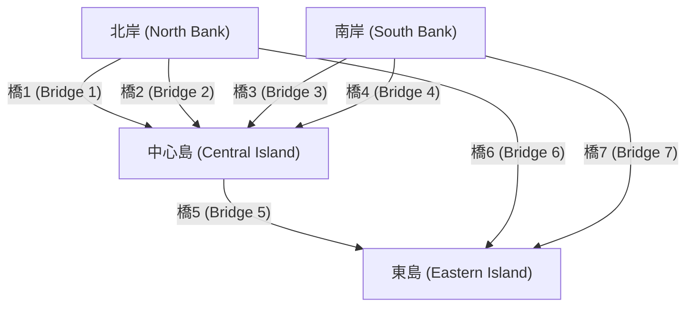
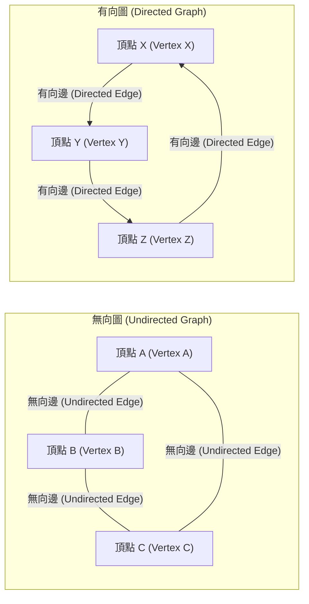

## 1. 引言：世界是由「網路」構成的

在現代社會中，我們總是與某些事物相連。無論是電腦之間透過網際網路進行的通訊、社群網路服務 (SNS) 中複雜的人際關係、連接城市的廣闊公路和鐵路網、遍布全球的物流供應鏈，還是我們自己大腦中無數神經元的連接——毫不誇張地說，世界是由無數的網路構成的。

提供一個強大框架，以簡單而嚴謹的數學方式表示和分析這些乍看之下極其複雜甚至無序的網路，正是 **圖論** ([Graph Theory](https://kenji.blog/zh-tw/p/graph-theory-dijkstra-a-star/)) 。透過使用圖論，我們能夠揭示複雜系統背後隱藏的結構和屬性，找到最佳的通訊路徑，並評估整個網路的脆弱性。

本文將全面而系統地講解圖論，從其歷史起源開始，涵蓋基本的數學定義、用於電腦程式設計的資料結構，並介紹支撐現代技術基礎的代表性演算法。

## 2. 圖論的誕生：哥尼斯堡七橋問題

圖論的歷史可以追溯到18世紀。1736年，才華橫溢的瑞士數學家李昂哈德·尤拉 ([Leonhard Euler](https://kenji.blog/zh-tw/p/euler/)) 完美地解決了一個著名的數學謎題，標誌著這一領域的開端。這個謎題被稱為「哥尼斯堡七橋問題」。

在當時普魯士王國的哥尼斯堡（現俄羅斯加里寧格勒）這座美麗的城市中，普列戈利亞河流經其間，河中心有兩個島嶼，共有七座橋梁將它們與兩岸連接起來。市民們流行一種遊戲：「是否有可能恰好通過每座橋一次，然後回到最初的起點？」 很多人都嘗試過，但無一人成功。

為了解決這個問題，尤拉採取了一種革命性的方法，將城市的實際地圖抽象到了極致。他將陸地（島嶼和河岸）表示為「點」，將連接它們的橋梁表示為「線」，從而排除了距離和方向等與問題本質無關的所有要素。



尤拉意識到，為了「穿過」一個點，必須始終存在一對「進入的橋」和「出去的橋」。也就是說，他從數學上證明了，除了起點和終點之外，所有點連接的橋的數量必須是「偶數」。

在哥尼斯堡橋梁的抽象圖中，所有四個陸地（點）連接的橋的數量都是「奇數」（3或5）。因此，他得出結論：不可能一筆畫出連續穿過所有橋梁恰好一次的路線。

尤拉的這一發現正是 **圖論** 誕生的時刻。透過拋棄複雜的物理地形，只關注點和線之間的連接關係（拓撲結構），他開闢了一個全新的數學領域。

## 3. 圖論的基本概念與數學定義

在圖論中，「圖」指的不是折線圖或圓餅圖等統計資料視覺化方法。它指的是表示一組物件以及它們之間關係的數學結構。

### 3.1. 圖的基本結構：頂點和邊

圖 $G$ 通常被定義為頂點 (Vertex) 集合 $V$ 和邊 (Edge) 集合 $E$ 的二元組，數學上表示為 $G = (V, E)$。

*   **頂點 (Vertex / Node)** : 表示網路的組成元素。視覺上繪製為點。集合 $V$ 的元素數量（頂點數）用 $|V|$ 表示。
*   **邊 (Edge / Link)** : 表示頂點之間的關係或連接。視覺上繪製為線。集合 $E$ 的元素數量（邊數）用 $|E|$ 表示。

例如，連接頂點 $u$ 和 $v$ 的邊表示為 $e = (u, v)$。

### 3.2. 有向圖與無向圖

根據邊是否具有方向，圖大致分為兩類。

*   **無向圖 (Undirected Graph)** : 邊沒有方向的圖。用於表示始終是相互且雙向的關係，例如通訊線路、雙向道路或 Facebook 的「好友」關係。
*   **有向圖 (Directed Graph)** : 邊有方向的圖。用於表達單向關係，例如水流、單行道或 Twitter (X) 的「跟隨」關係。在有向圖中，邊被清楚地畫成箭頭。



### 3.3. 加權圖

在對現實世界問題進行建模時，我們通常不僅想要表達「是否連接」，還想要表達「連接的容易程度」或「成本」。在這種情況下，會使用 **加權圖 (Weighted Graph)** ，其中每條邊都分配了一個數值（權重）。權重可以表示城市之間的距離、通訊延遲時間或旅行成本。

### 3.4. 路徑與環

在圖內移動的概念也非常重要。

*   **漫遊 (Walk)** : 頂點和邊交替出現的序列。可以多次經過相同的頂點或邊。
*   **路徑 (Path)** : 沒有頂點被存取多次的漫遊。
*   **環 (Cycle)** : 起點和終點相同的路徑。

這些概念是在網路上追蹤資料流或交通路線演算法的基本建構區塊。

### 3.5. 度與連通性

與一個頂點直接相連的邊數稱為該頂點的 **度 (Degree)** 。頂點 $v$ 的度在數學上表示為 $\deg(v)$。

在有向圖中，我們明確區分 **入度 (In-degree)** （進入頂點的箭頭數）和 **出度 (Out-degree)** （離開頂點的箭頭數）。

此外，如果圖中任意兩個頂點之間始終存在路徑，則稱該圖為 **連通圖 (Connected)** 。在像網際網路這樣的通訊網路中，整個網路是一個連通圖是確保所有電腦都能相互通訊的絕對要求。

## 4. 在電腦中處理圖的資料結構

為了將圖論的數學概念作為程式實作並讓電腦快速計算，必須使用適當的資料結構在記憶體中表示圖。在實務上，主要使用兩種方法：「鄰接矩陣」和「鄰接串列」。

### 4.1. 鄰接矩陣 (Adjacency Matrix)

鄰接矩陣是一種使用二維陣列（矩陣）表示圖的方法。具有 $N$ 個頂點的圖由 $N \times N$ 的矩陣 $A$ 表示。如果從頂點 $i$ 到頂點 $j$ 存在邊，則矩陣元素 $A_{i,j}$ 設定為 $1$；如果不存在，則設定為 $0$。對於加權圖，放置邊權重的數值而不是 $1$。

在數學上，它定義如下：

$$
A_{i,j} = \begin{cases} 
1 & (\text{如果存在從頂點 } i \text{ 到頂點 } j \text{ 的邊}) \\
0 & (\text{其他})
\end{cases}
$$

*   **優點** : 可以立即在 $\mathcal{O}(1)$ （常數時間）內確定任意兩個頂點之間是否存在邊。它還透過矩陣乘法直接與代數圖分析（如譜圖理論）聯繫起來。
*   **缺點** : 記憶體消耗為頂點數 $N$ 的 $\mathcal{O}(N^2)$ ，這將耗盡巨大圖的記憶體。特別是對於 **稀疏圖 (Sparse Graph)**，其中邊數與頂點數的平方相比非常小，矩陣的大部分變為 $0$，效率極低。

### 4.2. 鄰接串列 (Adjacency List)

鄰接串列是一種方法，為每個頂點維護一個「相鄰頂點串列（如陣列或鏈結串列）」，這些相鄰頂點透過邊直接連接。

*   頂點 A: `[B, C]`
*   頂點 B: `[A, D, E]`
*   頂點 C: `[A, F]`

*   **優點** : 記憶體消耗與頂點數和邊數之和成正比，即 $\mathcal{O}(|V| + |E|)$，使其對於現實世界中常見的稀疏圖具有極高的記憶體效率。
*   **缺點** : 要檢查特定頂點 $i$ 和頂點 $j$ 是否連接，必須順序搜尋串列，最壞情況下需要 $\mathcal{O}(|V|)$ 的時間。

## 5. 圍繞圖的代表性演算法

為了有效地解決圖上的問題，在電腦科學的歷史中設計了許多優秀的演算法。在這裡，我們介紹一些在現代軟體工程中被認為是不可或缺的代表性演算法。

### 5.1. 廣度優先搜尋 (BFS) 與深度優先搜尋 (DFS)

系統地存取網路中所有頂點且沒有遺漏的最基本演算法是 **廣度優先搜尋 (Breadth-First Search, BFS)** 和 **深度優先搜尋 (Depth-First Search, DFS)** 。

*   **廣度優先搜尋 (BFS)** : 呈同心圓狀探索，優先存取靠近起點的頂點。就像石頭扔進水裡時漣漪擴散一樣。它非常適合在無權圖中尋找最短路徑（邊數最少的路徑）。它使用佇列 (Queue) 資料結構實作。
*   **深度優先搜尋 (DFS)** : 盡可能深入地探索，當遇到死胡同時，回溯到上一個分支點以探索另一條路徑。就像沿著牆壁走迷宮一樣。用於檢測圖中的環或進行拓撲排序。它使用堆疊 (Stack) 或遞迴函式呼叫來實作。

以下是使用 Python 實作廣度優先搜尋 (BFS) 的簡單範例。

```python
from collections import deque

def bfs(graph, start_vertex):
    """
    在圖上執行廣度優先搜尋 (BFS) 的函式
    :param graph: 以鄰接串列形式表示的圖字典
    :param start_vertex: 開始探索的初始頂點
    """
    visited = set() # 記錄已存取頂點的集合
    queue = deque([start_vertex]) # 管理待探索頂點的佇列
    visited.add(start_vertex)
    
    while queue:
        # 從佇列首取出一個頂點
        vertex = queue.popleft()
        print(f"當前存取頂點: {vertex}")
        
        # 將所有相鄰的未存取頂點加入佇列
        for neighbor in graph[vertex]:
            if neighbor not in visited:
                visited.add(neighbor)
                queue.append(neighbor)

# 圖的定義（鄰接串列形式）
graph_data = {
    'A': ['B', 'C'],
    'B': ['A', 'D', 'E'],
    'C': ['A', 'F'],
    'D': ['B'],
    'E': ['B', 'F'],
    'F': ['C', 'E']
}

print("BFS 執行結果日誌:")
bfs(graph_data, 'A')
```

### 5.2. 最短路徑問題：戴克斯特拉演算法 ([Dijkstra](https://kenji.blog/zh-tw/p/graph-theory-dijkstra-a-star/)'s Algorithm)

當在地圖應用程式上搜尋到達目的地的最快路線時，在系統核心運作的就是 **最短路徑演算法** 。路線具有諸如「距離」和「旅行時間」等成本（權重），目標是找到一條使從起點到終點的累積成本最小化的路徑。

由荷蘭電腦科學家艾茲格·戴克斯特拉 (Edsger W. Dijkstra) 於1956年發明的 **戴克斯特拉演算法** ，是一個極其著名的演算法，用於在所有邊權重為非負數（0或更大）的條件下，有效地計算網路中從單一源點到所有其他頂點的最短路徑。

戴克斯特拉演算法的核心邏輯是重複「從距離起點最短距離已確定的頂點集合中，選出未確定距離最短的頂點，並透過經過該頂點的路線更新周圍頂點的最短距離資訊」的過程。透過使用優先佇列 (Priority Queue) ，可以大幅縮短執行時間。

```python
import heapq

def dijkstra(graph, start):
    """
    使用戴克斯特拉演算法計算最短路徑成本
    """
    # 保存從起點開始的最短距離的字典。初始值為無窮大。
    distances = {vertex: float('infinity') for vertex in graph}
    distances[start] = 0
    
    # 儲存 (累積距離, 頂點) 元組的優先佇列
    priority_queue = [(0, start)]
    
    while priority_queue:
        # 提取當前距離最短的頂點
        current_distance, current_vertex = heapq.heappop(priority_queue)
        
        # 如果從佇列中提取的距離大於已記錄的距離，則跳過處理
        if current_distance > distances[current_vertex]:
            continue
            
        # 嘗試更新所有相鄰頂點的距離
        for neighbor, weight in graph[current_vertex].items():
            distance = current_distance + weight
            
            # 如果找到比以前更短的路徑，則更新距離並將其推入佇列
            if distance < distances[neighbor]:
                distances[neighbor] = distance
                heapq.heappush(priority_queue, (distance, neighbor))
                
    return distances

# 加權有向圖的定義
weighted_graph = {
    'A': {'B': 2, 'C': 5},
    'B': {'C': 2, 'D': 4},
    'C': {'D': 1},
    'D': {'C': 3} # 存在一個環
}

print("\n戴克斯特拉演算法執行結果 (從頂點 A 的最短距離):")
print(dijkstra(weighted_graph, 'A'))
```

### 5.3. 最小生成樹問題：克魯斯克爾演算法 (Kruskal's Algorithm)

想像一下，需要以盡可能低的總成本將巨大網路中的所有基地物理連接起來。例如，在建設電網以向新住宅區供電，或在多個城市之間鋪設光纖電纜時，這種情況要求最小化基礎設施建設成本。

這樣，包含圖的所有頂點、絕對沒有環（即樹狀結構）且所使用邊的權重總和最小的子圖稱為 **最小生成樹 (Minimum Spanning Tree, MST)** 。

尋找這個最小生成樹的代表性演算法之一是 **克魯斯克爾演算法** 。克魯斯克爾演算法是累積局部最佳解的「貪心演算法 (Greedy Algorithm)」的一個典型例子，遵循極其簡單直觀的步驟。

1.  將圖中存在的所有邊按權重升序排序。
2.  從權重最小的邊開始逐個提取，只有在添加該邊不會形成「環（循環）」的情況下，才正式將其採用到生成樹中。
3.  當生成樹中採用的邊數達到「頂點總數 - 1」時終止演算法。

一種稱為互斥集 (Union-Find Tree) 的特殊資料結構在快速確定是否形成環方面發揮著積極作用。

### 5.4. 網路流與最大流問題

在城市的自來水管網或網際網路的骨幹通訊線路中，問題「在同一時間內，整個系統從起點（源點）到終點（匯點）最大可以流過多少數量（水或資料封包）？」被稱為 **最大流問題 (Maximum Flow Problem)** 。

組成網路的每條邊（管道或電纜）都有一個嚴格定義的「容量 (Capacity)」，表示單位時間內可以流過的最大量，並且在物理上不可能在任何路線上超過此容量流動。這個複雜的問題可以使用福特-富爾克森演算法 (Ford-Fulkerson Algorithm) 等演算法進行數學上精確求解，從而得出最大流量。最大流理論廣泛應用於驚人數量的領域，包括交通擁堵建模和緩解、物流網路瓶頸解決，甚至影像處理中的物件擷取（圖割）。

## 6. 二分圖與匹配問題

在圖論中佔據獨特地位的是 **二分圖 (Bipartite Graph)** 。二分圖是指，當所有頂點被劃分為兩組（例如，組 $U$ 和組 $V$）時，每條邊總是連接 $U$ 中的一個頂點和 $V$ 中的一個頂點，而絕對沒有連接同一組內頂點的邊的圖。

二分圖非常適合對具有不同屬性的兩個集合之間的關係進行建模，例如「求職者」和「招募公司」、「學生」和「實驗室」或「計程車」和「乘客」。

二分圖中最大的一個問題是 **匹配問題 (Matching Problem)** 。這是從圖中選取一組互不共享端點的邊（匹配）的問題。特別是形成盡可能多對的「最大二分匹配」，直接關係到資源的最佳分配問題。此外，使每對的滿意度或利潤最大化的問題已被「蓋爾-夏普利演算法 (Gale-Shapley Algorithm)」（該演算法是諾貝爾經濟學獎的主題）解決，並深深融入現實世界的社會系統設計中，如住院醫師醫院分配和學校選擇系統。

## 7. 圖論在現代社會中的應用

圖論並不侷限於黑板上的抽象數學；它作為從根本上支撐我們日常生活的核心技術，被應用於各種廣泛的領域。

### 7.1. 搜尋引擎與 PageRank 演算法

Google的搜尋引擎機制，可以瞬間評估散佈在世界各地的無數網頁，並按其有用程度進行排名，這就是眾所皆知的 **PageRank** 演算法，它是將網路世界建模為巨型有向圖的一個決定性成功案例。

*   **頂點** : 網際網路上的各個網頁
*   **邊** : 從頁面跳轉到頁面的超連結

PageRank 的根源在於這樣一個遞迴評估的理念：「被許多高品質網頁連結的頁面，本身極有可能也是一個高品質頁面。」透過將連結結構表示為一個龐大的鄰接矩陣，並計算該矩陣的主特徵向量（譜圖理論的應用），他們成功地以客觀且數學化的方式計算出跨越數千億頁面的網際網路資訊的相對重要性。

### 7.2. 社群網路的結構分析

Twitter、Facebook、LinkedIn和Instagram等SNS平台形成了巨大的 **社群圖譜 (Social Graph)** ，表達了人與人，或人與內容之間的聯繫。透過應用圖論，可以精確分析龐大社群的結構。

例如，為了回答「在整個網路中最具影響力的核心人物（意見領袖）是誰？」這個問題，引入了 **中心性 (Centrality)** 的概念。透過計算各種指標，如基於連接到頂點的簡單邊數的「度中心性」、衡量在網路最短路徑上出現頻率的「介數中心性」，以及評估到達所有其他頂點難易程度的「接近中心性」，可以進行影響力者識別、資訊傳播路徑預測以及同溫層效應檢測等活動。

### 7.3. 機器學習與圖神經網路 (GNN)

近年來，在人工智慧 (AI) 和機器學習的最前線，能夠直接學習具有圖結構資料的 **圖神經網路 (Graph Neural Network, GNN)** 受到了爆炸性的關注。

傳統的機器學習模型，如用於影像辨識的 CNN 或用於自然語言處理的 Transformer，都是為了處理網格狀像素陣列或一維單詞序列等規則資料而設計的。然而，處理複雜的 SNS 連接或構成分子的原子結合結構等不規則和複雜的圖資料極其困難。

GNN 透過在圖上同時傳播和學習每個頂點的特徵量資訊以及整個圖的拓撲結構（連接關係），突破了這一障礙。今天，GNN 已作為不可或缺的核心技術投入到最先進的 AI 應用中，包括預測新化合物特性的新藥研發領域、亞馬遜和 Netflix 的高級推薦系統，以及Google地圖的到達時間預測。

## 8. 總結與未來展望

在本文中，我們概述了誕生於18世紀哥尼斯堡一個簡單謎題的 **圖論** ，是如何演變成揭開現代社會極其複雜網路的「終極工具」的。

儘管圖僅由最簡單、最抽象的元素組成：點（頂點）和線（邊），但應用於它們的數學理論和計算演算法的世界深如宇宙，蘊藏著壓倒性的力量。對於軟體工程師、資料科學家或任何對複雜系統感興趣的人來說，圖論的系統知識將成倍地提高針對困難問題的高級抽象能力，以及得出最佳解決方案的邏輯思維能力。

如果您正在學習程式設計，請以此文為墊腳石，嘗試在您自己的電腦上實際編寫和執行諸如戴克斯特拉演算法或廣度優先搜尋之類的演算法。當您體驗到不可見的複雜網路被您編寫的程式碼生動地解開的過程時，您將真正意識到圖論真正的美麗與魅力。世界充滿了比你想像中更加美麗、可計算的圖。
