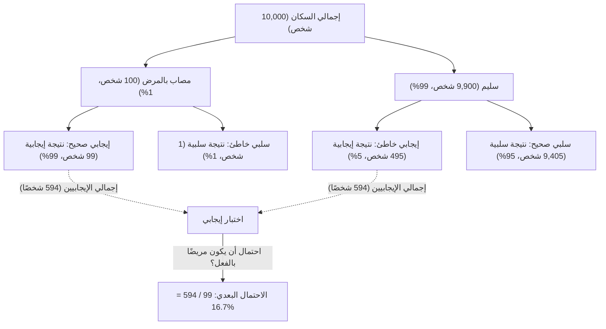
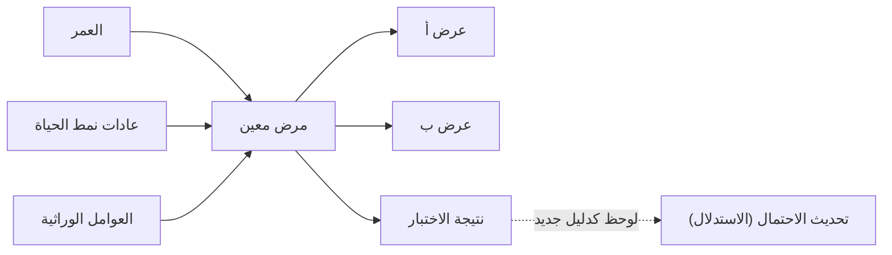

## مقدمة: "تحديث المعتقدات" في عالم غير مؤكد

العالم الذي نعيش فيه مليء بعدم اليقين. من احتمال هطول المطر غدًا، إلى احتمال أن يكون دواء جديد فعالاً ضد مرض معين، أو احتمال أن يكون البريد الإلكتروني الذي تلقيناه رسالة غير مرغوب فيها، نحن نتخذ القرارات باستمرار بناءً على معلومات غير مكتملة. الإطار القوي للتعامل مع عدم اليقين هذا رياضيًا و **تحديث توقعاتنا في كل مرة يتم فيها الحصول على معلومات (أدلة) جديدة** هو [مبرهنة بايز](https://kenji.blog/p/bayes-theorem/) ([Bayes' Theorem](https://kenji.blog/p/bayes-theorem/)).

اكتشف هذه المبرهنة توماس بايز، وهو قس وعالم رياضيات إنجليزي من القرن الثامن عشر، وأصبحت نظرية أساسية يقوم عليها الذكاء الاصطناعي الحديث والتعلم الآلي. في هذه المقالة، سنتعمق في كل شيء بدءًا من الرياضيات الأساسية ل[مبرهنة بايز](https://kenji.blog/p/bayes-theorem/)، إلى مفارقات الاحتمالات التي تتحدى الحدس، وكيف يتم تطبيقها في التكنولوجيا الحديثة.

## الصياغة الرياضية ل[مبرهنة بايز](https://kenji.blog/p/bayes-theorem/)

[مبرهنة بايز](https://kenji.blog/p/bayes-theorem/) هي مبرهنة تُستخدم لحساب الاحتمال $P(A|B)$ لحدث $A$ بشرط وقوع الحدث $B$، بناءً على الاحتمال الشرطي العكسي $P(B|A)$ وعوامل أخرى. على الرغم من أن المعادلة بسيطة للغاية، إلا أن آثارها عميقة.

$$
P(A|B) = \frac{P(B|A) \cdot P(A)}{P(B)}
$$

يُعطى كل مصطلح في هذه المعادلة اسمًا خاصًا من منظور "تحديث المعتقدات" الإحصائي.

- **الاحتمال القبلي (Prior Probability)** $P(A)$ : احتمال وقوع الحدث $A$ قبل النظر في الدليل الجديد $B$. معتقدنا الأولي.
- **الأرجحية (Likelihood)** $P(B|A)$ : احتمال ملاحظة الدليل $B$ بافتراض أن الحدث $A$ صحيح.
- **الأرجحية الهامشية / الدليل (Marginal Likelihood / Evidence)** $P(B)$ : الاحتمال الإجمالي لملاحظة الدليل $B$ بغض النظر عما إذا كان الحدث $A$ صحيحًا أم خاطئًا. يعمل كثابت تسوية.
- **الاحتمال البعدي (Posterior Probability)** $P(A|B)$ : احتمال الحدث $A$ بعد النظر في الدليل الجديد $B$. معتقدنا المُحَدَّث.

باختصار، يمكن وصف [مبرهنة بايز](https://kenji.blog/p/bayes-theorem/) بأنها الصياغة الرياضية لعملية **تحديث معتقدنا إلى "احتمال بعدي" عن طريق ضرب "الاحتمال القبلي" في "مدى ملاءمة الدليل الجديد (الأرجحية)"**.

## الانحراف عن الحدس: مفارقة "الإيجابية الخاطئة" (مثال الفحص الطبي)

غالبًا ما يرتكب الحدس البشري أخطاء في حسابات الاحتمالات. كمثال كلاسيكي لفهم قوة [مبرهنة بايز](https://kenji.blog/p/bayes-theorem/)، دعونا نفكر في اختبار الأمراض (الفحص الطبي).

لنفترض وجود مرض نادر، وأن $1\%$ ($0.01$) من إجمالي السكان مصابون بهذا المرض (هذا هو الاحتمال القبلي $P(\text{مرض})$).
اختبار الكشف عن هذا المرض دقيق للغاية: إذا أجرى شخص مصاب بالمرض الاختبار، فسيتم الحكم عليه بأنه "إيجابي" باحتمال $99\%$ (معدل الإيجابية الصحيحة: الأرجحية $P(\text{إيجابي}|\text{مرض})$).
ومع ذلك، يحتوي هذا الاختبار على خلل بسيط: حتى لو أجراه شخص سليم لا يعاني من المرض، فسيتم الحكم عليه بشكل غير صحيح بأنه "إيجابي" باحتمال $5\%$ (معدل الإيجابية الخاطئة $P(\text{إيجابي}|\text{سليم})$).

الآن، لنفترض أنك أجريت هذا الاختبار بشكل عشوائي وحصلت على نتيجة **"إيجابية"** . ما هو احتمال أن تكون مصابًا بهذا المرض بالفعل؟

يميل الكثير من الناس إلى التفكير: "بما أن دقة الاختبار $99\%$، فهناك فرصة بنسبة $90\%$ أو أكثر أن أكون مصابًا بالمرض". ومع ذلك، دعونا نحسبها باستخدام [مبرهنة بايز](https://kenji.blog/p/bayes-theorem/).

نريد إيجاد $P(\text{مرض}|\text{إيجابي})$.

1. **الاحتمال القبلي** $P(\text{مرض}) = 0.01$
2. **الأرجحية** $P(\text{إيجابي}|\text{مرض}) = 0.99$
3. **احتمال الشخص السليم** $P(\text{سليم}) = 1 - 0.01 = 0.99$
4. **احتمال الإيجابية الخاطئة** $P(\text{إيجابي}|\text{سليم}) = 0.05$

أولاً، نحسب الاحتمال الإجمالي لنتيجة اختبار إيجابية $P(\text{إيجابي})$ (الأرجحية الهامشية). هذا هو مجموع "الاختبار إيجابي مع وجود المرض" و "الاختبار إيجابي مع كون الشخص سليمًا".

$$
\begin{aligned}
P(\text{إيجابي}) &= P(\text{إيجابي}|\text{مرض}) \cdot P(\text{مرض}) + P(\text{إيجابي}|\text{سليم}) \cdot P(\text{سليم}) \\
&= (0.99 \times 0.01) + (0.05 \times 0.99) \\
&= 0.0099 + 0.0495 \\
&= 0.0594
\end{aligned}
$$

بعد ذلك، نطبق [مبرهنة بايز](https://kenji.blog/p/bayes-theorem/).

$$
\begin{aligned}
P(\text{مرض}|\text{إيجابي}) &= \frac{P(\text{إيجابي}|\text{مرض}) \cdot P(\text{مرض})}{P(\text{إيجابي})} \\
&= \frac{0.0099}{0.0594} \\
&\approx 0.1667
\end{aligned}
$$

المثير للدهشة أنه حتى مع نتيجة اختبار إيجابية، فإن **احتمال أن تكون مصابًا بالمرض بالفعل هو حوالي $16.7\%$ فقط**. الـ $83.3\%$ المتبقية هي حالات "لأشخاص أصحاء تم الحكم عليهم بشكل غير صحيح على أنهم إيجابيون" (إيجابيات خاطئة). وذلك لأن الانتشار الأصلي للمرض ($1\%$) منخفض للغاية، مما يجعل "الإيجابيات الخاطئة من العدد الكبير للسكان الأصحاء" تفوق بشكل كبير العدد الصغير "للأشخاص المرضى حقًا".

وبهذه الطريقة، تقوم [مبرهنة بايز](https://kenji.blog/p/bayes-theorem/) بتصحيح الفخاخ التي يقع فيها حدسنا بسهولة رياضيًا، وتعمل كأداة قوية لاتخاذ أحكام هادئة.

## تطبيق [مبرهنة بايز](https://kenji.blog/p/bayes-theorem/) في الذكاء الاصطناعي والتعلم الآلي

تتجاوز [مبرهنة بايز](https://kenji.blog/p/bayes-theorem/) مجرد كونها لغزًا للاحتمالات؛ فهي تلعب دورًا حاسمًا في علوم البيانات الحديثة والذكاء الاصطناعي (AI). وذلك لأن عملية تعلم الأنماط من كميات كبيرة من البيانات وعمل تنبؤات حول البيانات غير المعروفة بحد ذاتها يمكن صياغتها على أنها "تعظيم للاحتمال البعدي".

### 1. مصنف بايز الساذج (Naive Bayes Classifier)

يعد "مصنف بايز الساذج"، والذي غالبًا ما يستخدم لتصفية رسائل البريد الإلكتروني العشوائية، أحد أكثر التطبيقات المباشرة ل[مبرهنة بايز](https://kenji.blog/p/bayes-theorem/). تعامل هذه الخوارزمية الكلمات الواردة في البريد الإلكتروني (مثل "مجاني"، "فائز"، "كلمة مرور") كأدلة (ميزات) وتحسب الاحتمال البعدي لكون البريد الإلكتروني عشوائيًا.

يطلق عليه اسم "الساذج" لأنه يضع افتراضًا قويًا بأن كل ميزة (كلمة) تحدث بشكل مستقل عن غيرها. في الواقع، الكلمات مترابطة، ولكن على الرغم من هذا الافتراض التبسيطي، يُظهر مصنف بايز الساذج دقة عالية جدًا وسرعات معالجة سريعة في مهام مثل تصنيف النصوص.

### 2. شبكات بايز (Bayesian Networks)

في الأنظمة التي تتشابك فيها متغيرات متعددة بشكل معقد، تعبر شبكات بايز عن التبعيات بين المتغيرات كهيكل رسم بياني (رسم بياني موجه غير دوري) لإجراء الاستدلال في ظل عدم اليقين.

على سبيل المثال، في الذكاء الاصطناعي للتشخيص الطبي، يتم نمذجة التأثير الاحتمالي من "عمر المريض" و "عادات نمط الحياة" و "العوامل الوراثية" على "مرض معين"، ثم يتم ربط تأثير ذلك المرض على "الأعراض الظاهرة". في كل مرة يتم فيها إدخال عرض جديد (دليل)، يتم تحديث الاحتمالات عبر الشبكة بالكامل وفقًا ل[مبرهنة بايز](https://kenji.blog/p/bayes-theorem/)، واستنتاج اسم المرض الأكثر احتمالاً. يتم استخدام هذا في مجموعة واسعة من المجالات، مثل تقييم الموقف في السيارات ذاتية القيادة والتنبؤ بالأسواق المالية.

### 3. تحسين بايز (Bayesian Optimization)

في بناء نماذج التعلم الآلي، تستغرق مهمة العثور على المجموعة المثلى من المعلمات الفائقة (المعلمات التي يجب على البشر تعيينها، مثل معدل التعلم أو عمق الشبكة) وقتًا طويلاً جدًا. من غير الواقعي تجربة جميع المجموعات.

في تحسين بايز، يتم التعبير عن العلاقة بين "إعدادات المعلمات" و "أداء النموذج" كنموذج احتمالي (مثل العملية الغاوسية). استنادًا إلى إعدادات ونتائج التجارب السابقة (الأدلة)، فإنه يستنتج إعداد المعلمة الواعد التالي الذي يجب النظر فيه. هذا يجعل من الممكن بناء نماذج ذكاء اصطناعي عالية الأداء بأقل عدد من المحاولات.

### 4. التعلم العميق البايزي (Bayesian Deep Learning)

النهج الذي جذب الانتباه مؤخرًا هو دمج التعلم العميق والإحصاء البايزي. تُخرج الشبكة العصبية القياسية تنبؤها كقيمة حتمية واحدة، لكنها لا تخبرك "بمدى ثقتها".

في التعلم العميق البايزي، يتم التعامل مع أوزان الشبكة على أنها "توزيعات احتمالية" بدلاً من أرقام ثابتة. يتيح ذلك للذكاء الاصطناعي إخراج **"عدم اليقين (نقص الثقة)"** جنبًا إلى جنب مع تنبؤاته. على سبيل المثال، قد يحذر الذكاء الاصطناعي الطبي: "هناك احتمال بنسبة 90% للإصابة بالسرطان. ومع ذلك، فإن عدم اليقين في هذا التنبؤ بحد ذاته مرتفع للغاية، لذلك يلزم تأكيد من طبيب بشري". هذه تقنية في غاية الأهمية لزيادة سلامة وموثوقية الذكاء الاصطناعي.

## المنظور الفلسفي: التكرارية مقابل البايزية

في تاريخ الإحصاء، اشتبكت مدرستان فكريتان رئيسيتان حول "ما هو الاحتمال". وهما **التكرارية (Frequentism)** و **البايزية (Bayesianism)** .

في التكرارية، يُعرّف الاحتمال بأنه "التردد النسبي الذي يقع به حدث ما عند تكرار نفس التجربة لعدد لا نهائي من المرات". إن القول بأن احتمال استقرار العملة المعدنية على الصورة هو $50\%$ يعني أنه إذا تم رميها لعدد لا نهائي من المرات، فإن النصف بالضبط سيكون صورة. في هذا الموقف، يوجد احتمال حقيقي وثابت للحدث نفسه، ولا يترك مجالًا للمراقب لامتلاك "معتقد".

من ناحية أخرى، في البايزية، يُعامل الاحتمال على أنه **"درجة معتقد المراقب (احتمال شخصي)"**. يمثل احتمال هطول المطر غدًا بنسبة $70\%$ "درجة ثقة" وكالة الأرصاد الجوية بناءً على بيانات الطقس المتاحة (الأدلة). إذا تمت ملاحظة بيانات جديدة (على سبيل المثال، انخفاض مفاجئ في الضغط الجوي)، فسيتم تحديث هذه الثقة وفقًا ل[مبرهنة بايز](https://kenji.blog/p/bayes-theorem/).

سيطرت التكرارية على جزء كبير من القرن العشرين، ولكن في العصر الحديث، حيث تحسنت قوة المعالجة لأجهزة الكمبيوتر بشكل كبير، تمت إعادة تقييم النهج المرن والعملي للبايزية، ليصبح أحد القوى الدافعة وراء طفرة الذكاء الاصطناعي.

## الخاتمة: استمر في التعلم والتحديث

توفر [مبرهنة بايز](https://kenji.blog/p/bayes-theorem/) نوعًا من إطار التفكير الذي يتجاوز مجرد معادلة رياضية.

لدينا جميعًا "احتمالات قبلية (معتقدات أولية)" بناءً على التجارب السابقة والتحيزات. هذا ليس بالضرورة شيئًا سيئًا؛ إنه نقطة انطلاق لإدراك العالم بكفاءة. ومع ذلك، فإن المهم هو امتلاك **المرونة لتحديث معتقدات المرء بسلاسة (التحديث إلى الاحتمال البعدي)، تمامًا مثل [مبرهنة بايز](https://kenji.blog/p/bayes-theorem/)، بدلاً من غض الطرف عند مواجهة حقائق وأدلة جديدة**.

تمامًا كما يصبح الذكاء الاصطناعي أكثر ذكاءً من خلال استهلاك البيانات، يجب علينا نحن البشر أيضًا دمج معلومات جديدة كأدلة وتحديث أنفسنا باستمرار، للوصول إلى فهم أكثر دقة للعالم. ربما يمكن القول إن [مبرهنة بايز](https://kenji.blog/p/bayes-theorem/) هي تمثيل رياضي لـ "جوهر الذكاء" نفسه.
