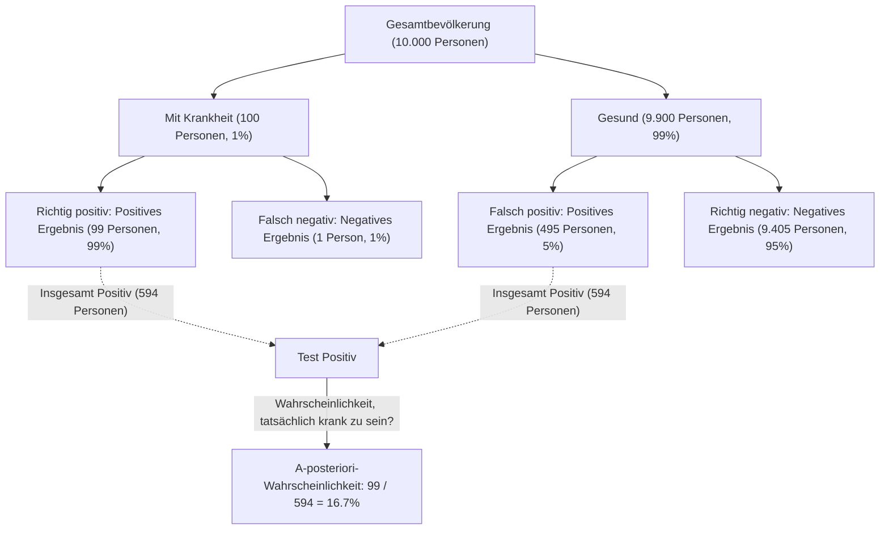
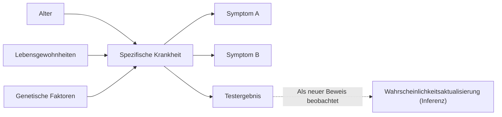

## Einleitung: "Überzeugungen aktualisieren" in einer unsicheren Welt

Die Welt, in der wir leben, ist voller Unsicherheiten. Von der Wahrscheinlichkeit, dass es morgen regnet, über die Wahrscheinlichkeit, dass ein neues Medikament gegen eine bestimmte Krankheit wirksam ist, bis hin zur Chance, dass eine empfangene E-Mail Spam ist – wir treffen ständig Entscheidungen auf der Grundlage unvollständiger Informationen. Ein mächtiger Rahmen, um diese Unsicherheit mathematisch zu handhaben und **unsere Vorhersagen jedes Mal zu aktualisieren, wenn neue Informationen (Beweise) gewonnen werden**, ist der [Satz von Bayes](https://kenji.blog/de/p/bayes-theorem/) ([Bayes' Theorem](https://kenji.blog/de/p/bayes-theorem/)).

Dieses Theorem wurde von Thomas Bayes, einem englischen Geistlichen und Mathematiker des 18. Jahrhunderts, entdeckt und ist zu einer grundlegenden Theorie geworden, die der modernen KI (Künstliche Intelligenz) und dem maschinellen Lernen zugrunde liegt. In diesem Artikel werden wir tief in alles eintauchen, von der grundlegenden Mathematik des Satzes von Bayes bis hin zu kontraintuitiven Wahrscheinlichkeitsparadoxien und wie er in der modernen Technologie angewendet wird.

## Mathematische Formulierung des Satzes von Bayes

Der [Satz von Bayes](https://kenji.blog/de/p/bayes-theorem/) ist ein Theorem, das verwendet wird, um die Wahrscheinlichkeit $P(A|B)$ eines Ereignisses $A$ unter der Bedingung, dass ein Ereignis $B$ eingetreten ist, basierend auf der inversen bedingten Wahrscheinlichkeit $P(B|A)$ und anderen Faktoren zu berechnen. Obwohl die Formel extrem einfach ist, sind ihre Auswirkungen tiefgreifend.

$$
P(A|B) = \frac{P(B|A) \cdot P(A)}{P(B)}
$$

Jedem Term in dieser Gleichung wird aus der Perspektive der statistischen "Aktualisierung von Überzeugungen" ein besonderer Name gegeben.

- **A-priori-Wahrscheinlichkeit (Prior Probability)** $P(A)$ : Die Wahrscheinlichkeit, dass Ereignis $A$ eintritt, bevor der neue Beweis $B$ berücksichtigt wird. Unsere anfängliche Überzeugung.
- **Likelihood (Verisimilitude)** $P(B|A)$ : Die Wahrscheinlichkeit, Beweis $B$ zu beobachten, unter der Annahme, dass Ereignis $A$ wahr ist.
- **Marginale Likelihood / Evidenz (Marginal Likelihood / Evidence)** $P(B)$ : Die Gesamtwahrscheinlichkeit, Beweis $B$ zu beobachten, unabhängig davon, ob Ereignis $A$ wahr oder falsch ist. Sie fungiert als Normalisierungskonstante.
- **A-posteriori-Wahrscheinlichkeit (Posterior Probability)** $P(A|B)$ : Die Wahrscheinlichkeit von Ereignis $A$ nach Berücksichtigung des neuen Beweises $B$. Unsere aktualisierte Überzeugung.

Kurz gesagt, der [Satz von Bayes](https://kenji.blog/de/p/bayes-theorem/) kann als mathematische Formulierung des Prozesses beschrieben werden, **unsere Überzeugung auf eine "A-posteriori-Wahrscheinlichkeit" zu aktualisieren, indem die "A-priori-Wahrscheinlichkeit" mit "wie gut der neue Beweis passt (Likelihood)" multipliziert wird**.

## Abweichung von der Intuition: Das Paradoxon der "Falsch-Positiven" (Beispiel eines medizinischen Tests)

Die menschliche Intuition macht bei Wahrscheinlichkeitsberechnungen oft Fehler. Als klassisches Beispiel, um die Macht des Satzes von Bayes zu verstehen, betrachten wir Krankheitstests (medizinisches Screening).

Angenommen, es gibt eine seltene Krankheit, und $1\%$ ($0.01$) der Gesamtbevölkerung ist mit dieser Krankheit infiziert (dies ist die A-priori-Wahrscheinlichkeit $P(\text{Krankheit})$).
Der Test zur Erkennung dieser Krankheit ist sehr genau: Wenn eine Person mit der Krankheit den Test macht, wird sie mit einer Wahrscheinlichkeit von $99\%$ als "Positiv" beurteilt (Richtig-Positiv-Rate: Likelihood $P(\text{Positiv}|\text{Krankheit})$).
Dieser Test hat jedoch einen leichten Fehler: Selbst wenn eine gesunde Person ohne die Krankheit ihn macht, wird sie fälschlicherweise mit einer Wahrscheinlichkeit von $5\%$ als "Positiv" beurteilt (Falsch-Positiv-Rate $P(\text{Positiv}|\text{Gesund})$).

Angenommen, Sie machen diesen Test zufällig und erhalten ein **"Positives"** Ergebnis. Wie hoch ist die Wahrscheinlichkeit, dass Sie diese Krankheit tatsächlich haben?

Viele Menschen neigen zu der Annahme: "Da der Test zu $99\%$ genau ist, besteht eine Chance von $90\%$ oder mehr, dass ich die Krankheit habe." Lassen Sie uns dies jedoch mit dem [Satz von Bayes](https://kenji.blog/de/p/bayes-theorem/) berechnen.

Wir wollen $P(\text{Krankheit}|\text{Positiv})$ finden.

1. **A-priori-Wahrscheinlichkeit** $P(\text{Krankheit}) = 0.01$
2. **Likelihood** $P(\text{Positiv}|\text{Krankheit}) = 0.99$
3. **Wahrscheinlichkeit einer gesunden Person** $P(\text{Gesund}) = 1 - 0.01 = 0.99$
4. **Wahrscheinlichkeit für ein falsch positives Ergebnis** $P(\text{Positiv}|\text{Gesund}) = 0.05$

Zunächst berechnen wir die Gesamtwahrscheinlichkeit eines positiven Testergebnisses $P(\text{Positiv})$ (Marginale Likelihood). Dies ist die Summe aus "positiv testen, wenn man krank ist" und "positiv testen, wenn man gesund ist".

$$
\begin{aligned}
P(\text{Positiv}) &= P(\text{Positiv}|\text{Krankheit}) \cdot P(\text{Krankheit}) + P(\text{Positiv}|\text{Gesund}) \cdot P(\text{Gesund}) \\
&= (0.99 \times 0.01) + (0.05 \times 0.99) \\
&= 0.0099 + 0.0495 \\
&= 0.0594
\end{aligned}
$$

Als nächstes wenden wir den [Satz von Bayes](https://kenji.blog/de/p/bayes-theorem/) an.

$$
\begin{aligned}
P(\text{Krankheit}|\text{Positiv}) &= \frac{P(\text{Positiv}|\text{Krankheit}) \cdot P(\text{Krankheit})}{P(\text{Positiv})} \\
&= \frac{0.0099}{0.0594} \\
&\approx 0.1667
\end{aligned}
$$

Überraschenderweise beträgt die Wahrscheinlichkeit, dass Sie die Krankheit tatsächlich haben, selbst bei einem positiven Testergebnis **nur etwa $16.7\%$**. Die restlichen $83.3\%$ sind Fälle von "gesunden Menschen, die fälschlicherweise als positiv beurteilt wurden" (Falsch-Positive). Dies liegt daran, dass die ursprüngliche Prävalenz der Krankheit ($1\%$) sehr niedrig ist, sodass die "Falsch-Positiven aus der großen gesunden Bevölkerung" die kleine Anzahl der "wirklich kranken Menschen" überwältigend übertreffen.

Auf diese Weise korrigiert der [Satz von Bayes](https://kenji.blog/de/p/bayes-theorem/) mathematisch die Fallen, in die unsere Intuition leicht tappt, und dient als mächtiges Werkzeug, um ruhige Urteile zu fällen.

## Anwendung des Satzes von Bayes in KI und Maschinellem Lernen

Der [Satz von Bayes](https://kenji.blog/de/p/bayes-theorem/) ist mehr als nur ein Wahrscheinlichkeitsrätsel; er spielt eine entscheidende Rolle in der modernen Datenwissenschaft und Künstlichen Intelligenz (KI). Denn der eigentliche Prozess des Lernens von Mustern aus großen Datenmengen und der Vorhersage unbekannter Daten kann als "Maximierung der A-posteriori-Wahrscheinlichkeit" formuliert werden.

### 1. Naive Bayes Klassifikator

Der "Naive Bayes Klassifikator", der häufig für das Filtern von Spam-E-Mails verwendet wird, ist eine der direktesten Anwendungen des Satzes von Bayes. Dieser Algorithmus behandelt die in einer E-Mail enthaltenen Wörter (wie "kostenlos", "Gewinner", "Passwort") als Beweise (Merkmale) und berechnet die A-posteriori-Wahrscheinlichkeit, ob die E-Mail Spam ist.

Er wird als "naiv" bezeichnet, weil er die starke Annahme trifft, dass jedes Merkmal (Wort) unabhängig von den anderen auftritt. In der Realität stehen Wörter in Beziehung zueinander, aber trotz dieser vereinfachenden Annahme weist Naive Bayes bei Aufgaben wie der Textklassifizierung eine sehr hohe Genauigkeit und schnelle Verarbeitungsgeschwindigkeiten auf.

### 2. Bayessche Netze

In Systemen, in denen mehrere Variablen kompliziert miteinander verflochten sind, drücken Bayessche Netze die Abhängigkeiten zwischen den Variablen als Graphenstruktur (Gerichteter azyklischer Graph) aus, um Schlussfolgerungen unter Unsicherheit durchzuführen.

Zum Beispiel wird in der medizinischen Diagnose-KI der probabilistische Einfluss von "Alter des Patienten", "Lebensgewohnheiten" und "genetischen Faktoren" auf eine "bestimmte Krankheit" modelliert und dann der Einfluss dieser Krankheit auf "auftretende Symptome" verknüpft. Jedes Mal, wenn ein neues Symptom (Beweis) eingegeben wird, werden die Wahrscheinlichkeiten im gesamten Netzwerk gemäß dem [Satz von Bayes](https://kenji.blog/de/p/bayes-theorem/) aktualisiert, wodurch auf den wahrscheinlichsten Namen der Krankheit geschlossen wird. Dies wird in einer Vielzahl von Bereichen eingesetzt, wie z. B. bei der Situationsbeurteilung in selbstfahrenden Autos und bei der Vorhersage von Finanzmärkten.

### 3. Bayes'sche Optimierung

Beim Erstellen von Modellen für maschinelles Lernen ist die Aufgabe, die optimale Kombination von Hyperparametern (Parametern, die von Menschen festgelegt werden müssen, wie Lernrate oder Netzwerktiefe) zu finden, sehr zeitaufwendig. Es ist unrealistisch, alle Kombinationen auszuprobieren.

Bei der Bayes'schen Optimierung wird die Beziehung zwischen "Parametereinstellungen" und "Modellleistung" als probabilistisches Modell (wie ein Gaußprozess) ausgedrückt. Basierend auf vergangenen Versuchseinstellungen und Ergebnissen (Beweisen) leitet es die vielversprechendste Parametereinstellung ab, die als nächstes untersucht werden soll. Dies ermöglicht es, leistungsstarke KI-Modelle mit einem Minimum an Versuchen zu erstellen.

### 4. Bayesianisches Deep Learning

Ein Ansatz, der in letzter Zeit Aufmerksamkeit erregt hat, ist die Verschmelzung von Deep Learning und Bayes'scher Statistik. Ein standardmäßiges neuronales Netzwerk gibt seine Vorhersage als einen einzigen deterministischen Wert aus, sagt Ihnen jedoch nicht, "wie sicher es sich ist".

Im Bayesianischen Deep Learning werden die Netzwerkgewichte nicht als feste Zahlen, sondern als "Wahrscheinlichkeitsverteilungen" behandelt. Dadurch kann die KI zusammen mit ihren Vorhersagen **"Unsicherheit (mangelndes Vertrauen)"** ausgeben. Zum Beispiel könnte eine medizinische KI warnen: "Die Wahrscheinlichkeit für Krebs liegt bei 90 %. Allerdings ist die Unsicherheit dieser Vorhersage selbst sehr hoch, weshalb eine Bestätigung durch einen menschlichen Arzt erforderlich ist." Dies ist eine extrem wichtige Technologie, um die Sicherheit und Zuverlässigkeit von KI zu erhöhen.

## Philosophische Perspektive: Frequentismus vs. Bayesianismus

In der Geschichte der Statistik sind zwei große Denkschulen in der Frage aufeinandergeprallt, "was Wahrscheinlichkeit ist". Diese sind der **Frequentismus (Frequentism)** und der **Bayesianismus (Bayesianism)** .

Im Frequentismus wird Wahrscheinlichkeit als "die relative Häufigkeit, mit der ein Ereignis auftritt, wenn derselbe Versuch unendlich oft wiederholt wird" definiert. Zu sagen, dass die Wahrscheinlichkeit, dass eine Münze auf Kopf landet, bei $50\%$ liegt, bedeutet, dass bei unendlich vielen Würfen genau die Hälfte Kopf sein wird. In dieser Haltung existiert eine wahre, feste Wahrscheinlichkeit für das Ereignis selbst und lässt dem Beobachter keinen Raum für eine "Überzeugung".

Andererseits wird Wahrscheinlichkeit im Bayesianismus als **"der Grad der Überzeugung des Beobachters (subjektive Wahrscheinlichkeit)"** behandelt. Eine Regenwahrscheinlichkeit von $70\%$ für morgen repräsentiert den "Grad des Vertrauens" des Wetterdienstes auf der Grundlage verfügbarer Wetterdaten (Beweise). Wenn neue Daten (z. B. ein plötzlicher Abfall des Luftdrucks) beobachtet werden, wird dieses Vertrauen gemäß dem [Satz von Bayes](https://kenji.blog/de/p/bayes-theorem/) aktualisiert.

Der Frequentismus dominierte einen Großteil des 20. Jahrhunderts, aber in der modernen Ära, in der sich die Rechenleistung von Computern drastisch verbessert hat, wurde der flexible und praktische Ansatz des Bayesianismus neu bewertet und wurde zu einer der treibenden Kräfte hinter dem KI-Boom.

## Fazit: Weiter lernen und aktualisieren

Der [Satz von Bayes](https://kenji.blog/de/p/bayes-theorem/) bietet eine Art Denkrahmen, der über eine bloße mathematische Formel hinausgeht.

Wir alle haben "A-priori-Wahrscheinlichkeiten (anfängliche Überzeugungen)", die auf vergangenen Erfahrungen und Vorurteilen basieren. Das ist nicht unbedingt etwas Schlechtes; es ist ein Ausgangspunkt, um die Welt effizient wahrzunehmen. Wichtig ist jedoch, **die Flexibilität zu haben, die eigenen Überzeugungen anmutig zu aktualisieren (auf A-posteriori-Wahrscheinlichkeit aktualisieren), genau wie der [Satz von Bayes](https://kenji.blog/de/p/bayes-theorem/), anstatt die Augen zu verschließen, wenn man mit neuen Fakten und Beweisen konfrontiert wird**.

Genauso wie KI durch den Konsum von Daten intelligenter wird, sollten auch wir Menschen neue Informationen als Beweise aufnehmen und uns ständig aktualisieren, um ein genaueres Verständnis der Welt zu erreichen. Vielleicht lässt sich sagen, dass der [Satz von Bayes](https://kenji.blog/de/p/bayes-theorem/) eine mathematische Darstellung des "Wesens der Intelligenz" selbst ist.
