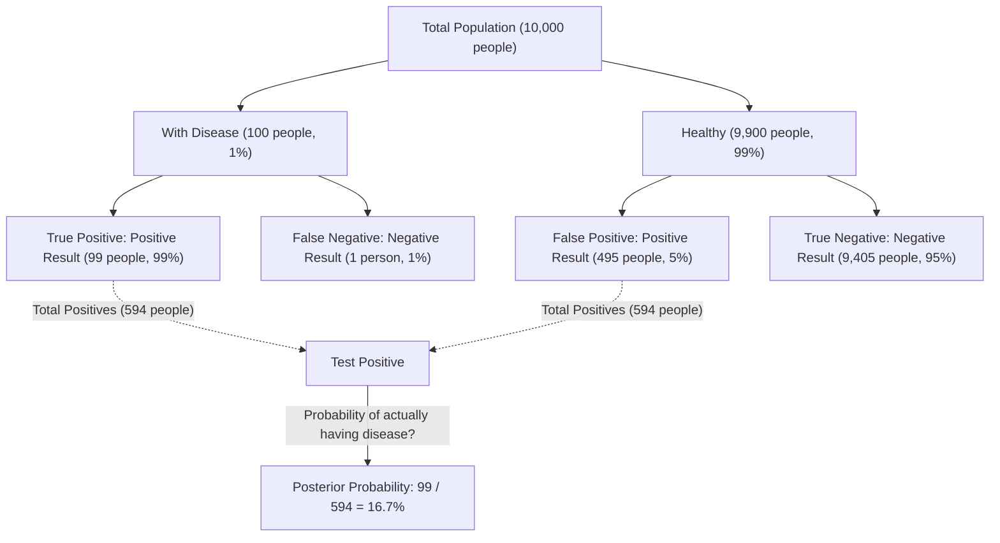
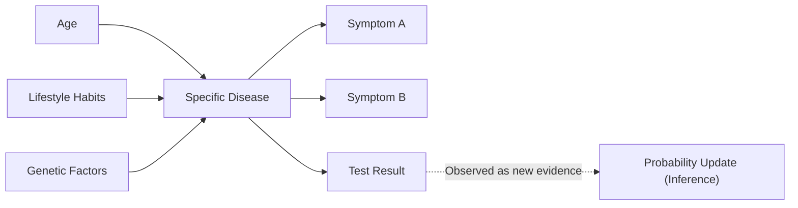

## Introduction: "Updating Beliefs" in an Uncertain World

The world we live in is full of uncertainty. From the probability of rain tomorrow to the likelihood that a new drug will be effective against a specific disease, or the chance that a received email is spam, we constantly make decisions based on incomplete information. A powerful framework for mathematically handling this uncertainty and **updating our predictions every time new information (evidence) is obtained** is Bayes' Theorem.

Discovered by Thomas Bayes, an 18th-century English minister and mathematician, this theorem has become a fundamental theory underlying modern AI (Artificial Intelligence) and machine learning. In this article, we will delve deep into everything from the basic mathematics of Bayes' Theorem to counter-intuitive probability paradoxes, and how it is applied in modern technology.

## Mathematical Formulation of Bayes' Theorem

Bayes' Theorem is a theorem used to calculate the probability $P(A|B)$ of an event $A$ under the condition that an event $B$ has occurred, based on the inverse conditional probability $P(B|A)$ and other factors. Although the formula is extremely simple, its implications are profound.

$$
P(A|B) = \frac{P(B|A) \cdot P(A)}{P(B)}
$$

Each term in this equation is given a special name from the perspective of statistical "belief updating".

- **Prior Probability** $P(A)$ : The probability of event $A$ occurring before considering the new evidence $B$. Our initial belief.
- **Likelihood** $P(B|A)$ : The probability of observing evidence $B$ assuming that event $A$ is true.
- **Marginal Likelihood / Evidence** $P(B)$ : The overall probability of observing evidence $B$ regardless of whether event $A$ is true or false. It acts as a normalizing constant.
- **Posterior Probability** $P(A|B)$ : The probability of event $A$ after considering the new evidence $B$. Our updated belief.

In short, Bayes' Theorem can be described as a mathematical formula for the process of **updating our belief to a "posterior probability" by multiplying the "prior probability" by "how well the new evidence fits (likelihood)"**.

## Deviation from Intuition: The "False Positive" Paradox (Medical Testing Example)

Human intuition often makes mistakes in probability calculations. As a classic example to understand the power of Bayes' Theorem, let's consider disease testing (medical screening).

Suppose there is a rare disease, and $1\%$ ($0.01$) of the total population is infected with this disease (this is the prior probability $P(\text{Disease})$).
The test to detect this disease is highly accurate: if a person with the disease takes the test, they are judged "Positive" with a $99\%$ probability (True Positive Rate: Likelihood $P(\text{Positive}|\text{Disease})$).
However, this test has a slight flaw: even if a healthy person without the disease takes it, they are incorrectly judged "Positive" with a $5\%$ probability (False Positive Rate $P(\text{Positive}|\text{Healthy})$).

Now, suppose you take this test at random and get a **"Positive"** result. What is the probability that you actually have this disease?

Many people tend to think, "Since the test is $99\%$ accurate, there is a $90\%$ or higher chance that I have the disease." However, let's calculate it using Bayes' Theorem.

We want to find $P(\text{Disease}|\text{Positive})$.

1. **Prior Probability** $P(\text{Disease}) = 0.01$
2. **Likelihood** $P(\text{Positive}|\text{Disease}) = 0.99$
3. **Probability of Healthy Person** $P(\text{Healthy}) = 1 - 0.01 = 0.99$
4. **False Positive Probability** $P(\text{Positive}|\text{Healthy}) = 0.05$

First, we calculate the overall probability of a positive test result $P(\text{Positive})$ (Marginal Likelihood). This is the sum of "testing positive when sick" and "testing positive when healthy".

$$
\begin{aligned}
P(\text{Positive}) &= P(\text{Positive}|\text{Disease}) \cdot P(\text{Disease}) + P(\text{Positive}|\text{Healthy}) \cdot P(\text{Healthy}) \\
&= (0.99 \times 0.01) + (0.05 \times 0.99) \\
&= 0.0099 + 0.0495 \\
&= 0.0594
\end{aligned}
$$

Next, we apply Bayes' Theorem.

$$
\begin{aligned}
P(\text{Disease}|\text{Positive}) &= \frac{P(\text{Positive}|\text{Disease}) \cdot P(\text{Disease})}{P(\text{Positive})} \\
&= \frac{0.0099}{0.0594} \\
&\approx 0.1667
\end{aligned}
$$

Surprisingly, even with a positive test result, **the probability that you actually have the disease is only about $16.7\%$**. The remaining $83.3\%$ are cases of "healthy people incorrectly judged as positive" (false positives). This is because the original prevalence of the disease ($1\%$) is very low, making the "false positives from the large healthy population" overwhelmingly outnumber the small number of "truly sick people".

In this way, Bayes' Theorem corrects the mathematical traps our intuition easily falls into and serves as a powerful tool for making calm judgments.

## Application of Bayes' Theorem in AI and Machine Learning

Bayes' Theorem goes beyond being just a probability puzzle; it plays a crucial role in modern data science and Artificial Intelligence (AI). This is because the very process of learning patterns from large amounts of data and making predictions on unknown data can be formulated as "maximizing the posterior probability".

### 1. Naive Bayes Classifier

The "Naive Bayes Classifier", often used for spam email filtering, is one of the most direct applications of Bayes' Theorem. This algorithm treats the words contained in an email (such as "free", "winner", "password") as evidence (features) and calculates the posterior probability of whether the email is spam.

It is called "naive" because it places a strong assumption that each feature (word) occurs independently of the others. In reality, words are related, but despite this simplistic assumption, Naive Bayes exhibits very high accuracy and fast processing speeds in tasks like text classification.

### 2. Bayesian Networks

In systems where multiple variables are intricately intertwined, Bayesian Networks express the dependencies between variables as a graph structure (Directed Acyclic Graph) to perform reasoning under uncertainty.

For instance, in medical diagnostic AI, the probabilistic influence from "patient's age", "lifestyle habits", and "genetic factors" on a "specific disease" is modeled, and the influence from that disease to "appearing symptoms" is linked. Every time a new symptom (evidence) is input, the probabilities across the entire network are updated according to Bayes' Theorem, inferring the most likely disease name. This is utilized in a wide variety of fields, such as situation judgment in self-driving cars and financial market prediction.

### 3. Bayesian Optimization

In building machine learning models, the task of finding the optimal combination of hyperparameters (parameters that humans must set, such as learning rate or network depth) is very time-consuming. It is unrealistic to try all combinations.

In Bayesian Optimization, the relationship between "parameter settings" and "model performance" is expressed as a probabilistic model (such as a Gaussian Process). Based on past trial settings and results (evidence), it infers the most promising parameter setting to look at next. This makes it possible to build high-performance AI models with a minimum number of trials.

### 4. Bayesian Deep Learning

An approach that has been gaining attention recently is the fusion of Deep Learning and Bayesian statistics. A standard neural network outputs its prediction as a single deterministic value, but it does not tell you "how confident it is".

In Bayesian Deep Learning, the network weights are treated as "probability distributions" rather than fixed numbers. This allows the AI to output **"uncertainty (lack of confidence)"** along with its predictions. For example, a medical AI could warn, "There is a 90% chance of cancer. However, the uncertainty of this prediction itself is very high, so confirmation by a human doctor is required." This is an extremely important technology for increasing the safety and reliability of AI.

## Philosophical Perspective: Frequentism vs. Bayesianism

In the history of statistics, two major schools of thought have clashed over "what probability is". These are **Frequentism** and **Bayesianism**.

In Frequentism, probability is defined as "the relative frequency with which an event occurs when the same trial is repeated infinitely". Saying the probability of a coin landing heads is $50\%$ means that if tossed infinitely, exactly half will be heads. In this stance, a true, fixed probability exists for the event itself, leaving no room for the observer to hold a "belief".

On the other hand, in Bayesianism, probability is treated as **"the observer's degree of belief (subjective probability)"**. A $70\%$ probability of rain tomorrow represents the meteorological agency's "degree of confidence" based on available weather data (evidence). If new data (e.g., a sudden drop in atmospheric pressure) is observed, that confidence is updated according to Bayes' Theorem.

Frequentism dominated much of the 20th century, but in the modern era, where computer processing power has drastically improved, the flexible and practical approach of Bayesianism has been re-evaluated, becoming one of the driving forces behind the AI boom.

## Conclusion: Keep Learning and Updating

Bayes' Theorem provides a kind of thinking framework that goes beyond a mere mathematical formula.

We all have "prior probabilities (initial beliefs)" based on past experiences and biases. This is not necessarily a bad thing; it's a starting point for efficiently perceiving the world. However, what is important is to have **the flexibility to gracefully update one's beliefs (update to posterior probability), just like Bayes' Theorem, rather than turning a blind eye when faced with new facts and evidence**.

Just as AI becomes smarter by consuming data, we humans should also incorporate new information as evidence and constantly update ourselves, reaching a more accurate understanding of the world. Perhaps Bayes' Theorem can be said to be a mathematical representation of the very "essence of intelligence".
