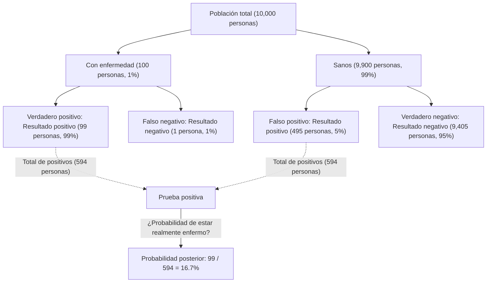
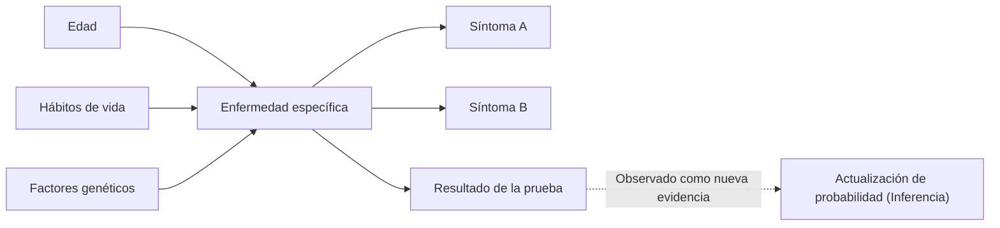

## Introducción: "Actualizando creencias" en un mundo incierto

El mundo en el que vivimos está lleno de incertidumbre. Desde la probabilidad de que llueva mañana hasta la probabilidad de que un nuevo medicamento sea efectivo contra una enfermedad específica, o la posibilidad de que un correo electrónico recibido sea spam, tomamos decisiones constantemente basándonos en información incompleta. Un marco poderoso para manejar matemáticamente esta incertidumbre y **actualizar nuestras predicciones cada vez que se obtiene nueva información (evidencia)** es el [Teorema de Bayes](https://kenji.blog/p/bayes-theorem/) ([Bayes' Theorem](https://kenji.blog/p/bayes-theorem/)).

Descubierto por Thomas Bayes, un ministro y matemático inglés del siglo XVIII, este teorema se ha convertido en una teoría fundamental que sustenta la IA (Inteligencia Artificial) moderna y el aprendizaje automático. En este artículo, profundizaremos en todo, desde las matemáticas básicas del [Teorema de Bayes](https://kenji.blog/p/bayes-theorem/) hasta las paradojas de probabilidad contrarias a la intuición, y cómo se aplica en la tecnología moderna.

## Formulación matemática del [Teorema de Bayes](https://kenji.blog/p/bayes-theorem/)

El [Teorema de Bayes](https://kenji.blog/p/bayes-theorem/) es un teorema utilizado para calcular la probabilidad $P(A|B)$ de un evento $A$ bajo la condición de que ha ocurrido un evento $B$, basándose en la probabilidad condicional inversa $P(B|A)$ y otros factores. Aunque la fórmula es extremadamente simple, sus implicaciones son profundas.

$$
P(A|B) = \frac{P(B|A) \cdot P(A)}{P(B)}
$$

Cada término en esta ecuación recibe un nombre especial desde la perspectiva de la "actualización de creencias" estadística.

- **Probabilidad A Priori (Prior Probability)** $P(A)$ : La probabilidad de que ocurra el evento $A$ antes de considerar la nueva evidencia $B$. Nuestra creencia inicial.
- **Verosimilitud (Likelihood)** $P(B|A)$ : La probabilidad de observar la evidencia $B$ suponiendo que el evento $A$ es verdadero.
- **Verosimilitud Marginal / Evidencia (Marginal Likelihood / Evidence)** $P(B)$ : La probabilidad general de observar la evidencia $B$ independientemente de si el evento $A$ es verdadero o falso. Actúa como una constante de normalización.
- **Probabilidad A Posteriori (Posterior Probability)** $P(A|B)$ : La probabilidad del evento $A$ después de considerar la nueva evidencia $B$. Nuestra creencia actualizada.

En resumen, el [Teorema de Bayes](https://kenji.blog/p/bayes-theorem/) se puede describir como la formulación matemática del proceso de **actualizar nuestra creencia a una "probabilidad a posteriori" multiplicando la "probabilidad a priori" por "qué tan bien encaja la nueva evidencia (verosimilitud)"**.

## Desviación de la intuición: La paradoja de los "Falsos Positivos" (Ejemplo de prueba médica)

La intuición humana a menudo comete errores en los cálculos de probabilidad. Como un ejemplo clásico para comprender el poder del [Teorema de Bayes](https://kenji.blog/p/bayes-theorem/), consideremos las pruebas de enfermedades (detección médica).

Supongamos que hay una enfermedad rara y el $1\%$ ($0.01$) de la población total está infectada con esta enfermedad (esta es la probabilidad a priori $P(\text{Enfermedad})$).
La prueba para detectar esta enfermedad es muy precisa: si una persona con la enfermedad se hace la prueba, se la juzga "Positivo" con una probabilidad del $99\%$ (Tasa de verdaderos positivos: Verosimilitud $P(\text{Positivo}|\text{Enfermedad})$).
Sin embargo, esta prueba tiene un ligero defecto: incluso si se la hace una persona sana sin la enfermedad, se la juzga incorrectamente como "Positivo" con una probabilidad del $5\%$ (Tasa de falsos positivos $P(\text{Positivo}|\text{Sano})$).

Ahora, supongamos que tomas esta prueba al azar y obtienes un resultado **"Positivo"** . ¿Cuál es la probabilidad de que realmente tengas esta enfermedad?

Muchas personas tienden a pensar: "Como la prueba tiene una precisión del $99\%$, hay un $90\%$ o más de probabilidades de que tenga la enfermedad". Sin embargo, calculémoslo usando el [Teorema de Bayes](https://kenji.blog/p/bayes-theorem/).

Queremos encontrar $P(\text{Enfermedad}|\text{Positivo})$.

1. **Probabilidad a priori** $P(\text{Enfermedad}) = 0.01$
2. **Verosimilitud** $P(\text{Positivo}|\text{Enfermedad}) = 0.99$
3. **Probabilidad de persona sana** $P(\text{Sano}) = 1 - 0.01 = 0.99$
4. **Probabilidad de falso positivo** $P(\text{Positivo}|\text{Sano}) = 0.05$

Primero, calculamos la probabilidad general de un resultado positivo de la prueba $P(\text{Positivo})$ (Verosimilitud Marginal). Esta es la suma de "dar positivo estando enfermo" y "dar positivo estando sano".

$$
\begin{aligned}
P(\text{Positivo}) &= P(\text{Positivo}|\text{Enfermedad}) \cdot P(\text{Enfermedad}) + P(\text{Positivo}|\text{Sano}) \cdot P(\text{Sano}) \\
&= (0.99 \times 0.01) + (0.05 \times 0.99) \\
&= 0.0099 + 0.0495 \\
&= 0.0594
\end{aligned}
$$

A continuación, aplicamos el [Teorema de Bayes](https://kenji.blog/p/bayes-theorem/).

$$
\begin{aligned}
P(\text{Enfermedad}|\text{Positivo}) &= \frac{P(\text{Positivo}|\text{Enfermedad}) \cdot P(\text{Enfermedad})}{P(\text{Positivo})} \\
&= \frac{0.0099}{0.0594} \\
&\approx 0.1667
\end{aligned}
$$

Sorprendentemente, incluso con un resultado positivo de la prueba, **la probabilidad de que realmente tengas la enfermedad es solo de aproximadamente un $16.7\%$**. El $83.3\%$ restante son casos de "personas sanas juzgadas incorrectamente como positivas" (falsos positivos). Esto se debe a que la prevalencia original de la enfermedad ($1\%$) es muy baja, lo que hace que los "falsos positivos de la gran población sana" superen abrumadoramente al pequeño número de "personas verdaderamente enfermas".

De esta manera, el [Teorema de Bayes](https://kenji.blog/p/bayes-theorem/) corrige matemáticamente las trampas en las que nuestra intuición cae fácilmente y sirve como una herramienta poderosa para emitir juicios serenos.

## Aplicación del [Teorema de Bayes](https://kenji.blog/p/bayes-theorem/) en IA y Aprendizaje Automático

El [Teorema de Bayes](https://kenji.blog/p/bayes-theorem/) va más allá de ser un simple rompecabezas de probabilidad; juega un papel crucial en la ciencia de datos moderna y en la Inteligencia Artificial (IA). Esto se debe a que el propio proceso de aprender patrones de grandes cantidades de datos y hacer predicciones sobre datos desconocidos puede formularse como "maximizar la probabilidad a posteriori".

### 1. Clasificador Bayesiano Ingenuo (Naive Bayes)

El "Clasificador Bayesiano Ingenuo", a menudo utilizado para filtrar correos electrónicos no deseados (spam), es una de las aplicaciones más directas del [Teorema de Bayes](https://kenji.blog/p/bayes-theorem/). Este algoritmo trata las palabras contenidas en un correo electrónico (como "gratis", "ganador", "contraseña") como evidencia (características) y calcula la probabilidad a posteriori de que el correo sea spam.

Se le llama "ingenuo" porque impone la fuerte suposición de que cada característica (palabra) ocurre independientemente de las demás. En realidad, las palabras están relacionadas, pero a pesar de esta suposición simplista, el clasificador Naive Bayes exhibe una precisión muy alta y velocidades de procesamiento rápidas en tareas como la clasificación de textos.

### 2. Redes Bayesianas

En sistemas donde múltiples variables están intrincadamente entrelazadas, las Redes Bayesianas expresan las dependencias entre las variables como una estructura gráfica (Grafo Acíclico Dirigido) para realizar razonamiento bajo incertidumbre.

Por ejemplo, en la IA de diagnóstico médico, la influencia probabilística de la "edad del paciente", "hábitos de vida" y "factores genéticos" en una "enfermedad específica" es modelada, y luego se vincula la influencia de esa enfermedad en los "síntomas que aparecen". Cada vez que se introduce un nuevo síntoma (evidencia), las probabilidades en toda la red se actualizan según el [Teorema de Bayes](https://kenji.blog/p/bayes-theorem/), infiriendo el nombre de la enfermedad más probable. Esto se utiliza en una amplia variedad de campos, como la evaluación de situaciones en automóviles autónomos y la predicción en mercados financieros.

### 3. Optimización Bayesiana

Al construir modelos de aprendizaje automático, la tarea de encontrar la combinación óptima de hiperparámetros (parámetros que deben ser configurados por humanos, como la tasa de aprendizaje o la profundidad de la red) consume mucho tiempo. Es poco realista probar todas las combinaciones.

En la Optimización Bayesiana, la relación entre las "configuraciones de los parámetros" y el "rendimiento del modelo" se expresa como un modelo probabilístico (como un Proceso Gaussiano). Basándose en configuraciones y resultados de pruebas anteriores (evidencia), infiere la configuración de parámetros más prometedora a evaluar a continuación. Esto hace posible construir modelos de IA de alto rendimiento con un número mínimo de intentos.

### 4. Aprendizaje Profundo Bayesiano (Bayesian Deep Learning)

Un enfoque que ha estado ganando atención recientemente es la fusión del Aprendizaje Profundo (Deep Learning) y las estadísticas Bayesianas. Una red neuronal estándar genera su predicción como un único valor determinista, pero no dice "qué tan segura está".

En el Aprendizaje Profundo Bayesiano, los pesos de la red se tratan como "distribuciones de probabilidad" en lugar de números fijos. Esto permite que la IA emita **"incertidumbre (falta de confianza)"** junto con sus predicciones. Por ejemplo, una IA médica podría advertir: "Hay un 90% de probabilidades de cáncer. Sin embargo, la incertidumbre de esta predicción en sí es muy alta, por lo que se requiere la confirmación de un médico humano". Esta es una tecnología extremadamente importante para aumentar la seguridad y confiabilidad de la IA.

## Perspectiva filosófica: Frecuentismo vs. Bayesianismo

En la historia de la estadística, dos grandes escuelas de pensamiento se han enfrentado sobre "qué es la probabilidad". Estas son el **Frecuentismo (Frequentism)** y el **Bayesianismo (Bayesianism)** .

En el Frecuentismo, la probabilidad se define como "la frecuencia relativa con la que ocurre un evento cuando el mismo ensayo se repite infinitamente". Decir que la probabilidad de que una moneda caiga en cara es del $50\%$ significa que si se lanza infinitamente, exactamente la mitad de las veces será cara. En esta postura, existe una probabilidad verdadera y fija para el evento en sí, sin dejar lugar para que el observador tenga una "creencia".

Por otro lado, en el Bayesianismo, la probabilidad es tratada como **"el grado de creencia del observador (probabilidad subjetiva)"**. Una probabilidad del $70\%$ de lluvia para mañana representa el "grado de confianza" de la agencia meteorológica basado en los datos climáticos disponibles (evidencia). Si se observan nuevos datos (por ejemplo, una caída repentina de la presión atmosférica), esa confianza se actualiza según el [Teorema de Bayes](https://kenji.blog/p/bayes-theorem/).

El frecuentismo dominó gran parte del siglo XX, pero en la era moderna, donde el poder de procesamiento de las computadoras ha mejorado drásticamente, el enfoque flexible y práctico del Bayesianismo ha sido reevaluado, convirtiéndose en una de las fuerzas impulsoras detrás del auge de la IA.

## Conclusión: Sigue aprendiendo y actualizando

El [Teorema de Bayes](https://kenji.blog/p/bayes-theorem/) proporciona una especie de marco de pensamiento que va más allá de una simple fórmula matemática.

Todos tenemos "probabilidades a priori (creencias iniciales)" basadas en experiencias pasadas y sesgos. Esto no es necesariamente algo malo; es un punto de partida para percibir el mundo de manera eficiente. Sin embargo, lo importante es tener **la flexibilidad para actualizar elegantemente las propias creencias (actualizar a una probabilidad a posteriori), al igual que el [Teorema de Bayes](https://kenji.blog/p/bayes-theorem/), en lugar de hacerse de la vista gorda al enfrentarse a nuevos hechos y evidencia**.

Al igual que la IA se vuelve más inteligente al consumir datos, nosotros los humanos también deberíamos incorporar nueva información como evidencia y actualizarnos constantemente, alcanzando una comprensión más precisa del mundo. Quizás, el [Teorema de Bayes](https://kenji.blog/p/bayes-theorem/) puede ser considerado una representación matemática de la "esencia misma de la inteligencia".
