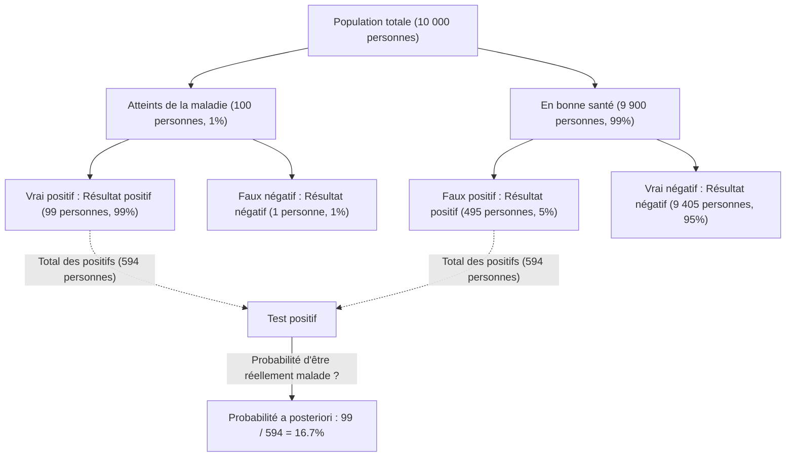
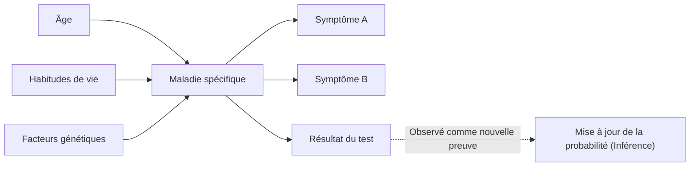

## Introduction : « Mettre à jour les croyances » dans un monde incertain

Le monde dans lequel nous vivons est rempli d'incertitudes. Qu'il s'agisse de la probabilité qu'il pleuve demain, de la probabilité qu'un nouveau médicament soit efficace contre une maladie spécifique, ou de la chance qu'un courriel reçu soit un spam, nous prenons constamment des décisions basées sur des informations incomplètes. Le « [Théorème de Bayes](https://kenji.blog/fr/p/bayes-theorem/) » ([Bayes' Theorem](https://kenji.blog/fr/p/bayes-theorem/)) est un cadre puissant pour traiter mathématiquement cette incertitude et **mettre à jour nos prédictions chaque fois que de nouvelles informations (preuves) sont obtenues**.

Découvert par Thomas Bayes, un ministre et mathématicien anglais du 18ème siècle, ce théorème est devenu une théorie fondamentale qui sous-tend l'IA (Intelligence Artificielle) moderne et l'apprentissage automatique. Dans cet article, nous allons approfondir tout ce qui concerne le théorème de Bayes, depuis ses mathématiques de base jusqu'aux paradoxes de probabilité contre-intuitifs, et la manière dont il est appliqué dans la technologie moderne.

## Formulation mathématique du [Théorème de Bayes](https://kenji.blog/fr/p/bayes-theorem/)

Le [Théorème de Bayes](https://kenji.blog/fr/p/bayes-theorem/) est un théorème utilisé pour calculer la probabilité $P(A|B)$ d'un événement $A$ à la condition qu'un événement $B$ se soit produit, en se basant sur la probabilité conditionnelle inverse $P(B|A)$ et d'autres facteurs. Bien que la formule soit extrêmement simple, ses implications sont profondes.

$$
P(A|B) = \frac{P(B|A) \cdot P(A)}{P(B)}
$$

Chaque terme de cette équation reçoit un nom spécial du point de vue de la « mise à jour des croyances » statistique.

- **Probabilité a priori (Prior Probability)** $P(A)$ : La probabilité que l'événement $A$ se produise avant de considérer la nouvelle preuve $B$. Notre croyance initiale.
- **Vraisemblance (Likelihood)** $P(B|A)$ : La probabilité d'observer la preuve $B$ en supposant que l'événement $A$ est vrai.
- **Vraisemblance marginale / Preuve (Marginal Likelihood / Evidence)** $P(B)$ : La probabilité globale d'observer la preuve $B$ indépendamment du fait que l'événement $A$ soit vrai ou faux. Elle agit comme une constante de normalisation.
- **Probabilité a posteriori (Posterior Probability)** $P(A|B)$ : La probabilité de l'événement $A$ après avoir considéré la nouvelle preuve $B$. Notre croyance mise à jour.

En bref, le [Théorème de Bayes](https://kenji.blog/fr/p/bayes-theorem/) peut être décrit comme la formulation mathématique du processus de **mise à jour de notre croyance vers une « probabilité a posteriori » en multipliant la « probabilité a priori » par « la mesure dans laquelle la nouvelle preuve correspond (vraisemblance) »**.

## Écart par rapport à l'intuition : Le paradoxe du « faux positif » (Exemple de test médical)

L'intuition humaine fait souvent des erreurs dans les calculs de probabilité. Comme exemple classique pour comprendre la puissance du [Théorème de Bayes](https://kenji.blog/fr/p/bayes-theorem/), considérons les tests de maladies (dépistage médical).

Supposons qu'il existe une maladie rare, et que $1\%$ ($0.01$) de la population totale est infectée par cette maladie (c'est la probabilité a priori $P(\text{Maladie})$).
Le test pour détecter cette maladie est très précis : si une personne atteinte de la maladie passe le test, elle est jugée « Positive » avec une probabilité de $99\%$ (Taux de vrais positifs : Vraisemblance $P(\text{Positif}|\text{Maladie})$).
Cependant, ce test présente un léger défaut : même si une personne en bonne santé et non atteinte de la maladie le passe, elle est incorrectement jugée « Positive » avec une probabilité de $5\%$ (Taux de faux positifs $P(\text{Positif}|\text{Sain})$).

Maintenant, supposons que vous passiez ce test au hasard et que vous obteniez un résultat **« Positif »** . Quelle est la probabilité que vous soyez réellement atteint de cette maladie ?

Beaucoup de gens ont tendance à penser : « Puisque le test est précis à $99\%$, il y a $90\%$ de chances ou plus que j'aie la maladie. » Cependant, calculons cela en utilisant le [Théorème de Bayes](https://kenji.blog/fr/p/bayes-theorem/).

Nous cherchons $P(\text{Maladie}|\text{Positif})$.

1. **Probabilité a priori** $P(\text{Maladie}) = 0.01$
2. **Vraisemblance** $P(\text{Positif}|\text{Maladie}) = 0.99$
3. **Probabilité d'une personne saine** $P(\text{Sain}) = 1 - 0.01 = 0.99$
4. **Probabilité de faux positif** $P(\text{Positif}|\text{Sain}) = 0.05$

Tout d'abord, nous calculons la probabilité globale d'un résultat de test positif $P(\text{Positif})$ (Vraisemblance Marginale). C'est la somme de « tester positif en étant malade » et « tester positif en étant sain ».

$$
\begin{aligned}
P(\text{Positif}) &= P(\text{Positif}|\text{Maladie}) \cdot P(\text{Maladie}) + P(\text{Positif}|\text{Sain}) \cdot P(\text{Sain}) \\
&= (0.99 \times 0.01) + (0.05 \times 0.99) \\
&= 0.0099 + 0.0495 \\
&= 0.0594
\end{aligned}
$$

Ensuite, nous appliquons le [Théorème de Bayes](https://kenji.blog/fr/p/bayes-theorem/).

$$
\begin{aligned}
P(\text{Maladie}|\text{Positif}) &= \frac{P(\text{Positif}|\text{Maladie}) \cdot P(\text{Maladie})}{P(\text{Positif})} \\
&= \frac{0.0099}{0.0594} \\
&\approx 0.1667
\end{aligned}
$$

Étonnamment, même avec un résultat de test positif, **la probabilité que vous soyez réellement atteint de la maladie n'est que d'environ $16.7\%$**. Les $83.3\%$ restants sont des cas de « personnes saines incorrectement jugées positives » (faux positifs). Cela s'explique par le fait que la prévalence initiale de la maladie ($1\%$) est très faible, ce qui fait que les « faux positifs de la grande population saine » surpassent largement le petit nombre de « personnes véritablement malades ».

De cette manière, le [Théorème de Bayes](https://kenji.blog/fr/p/bayes-theorem/) corrige mathématiquement les pièges dans lesquels notre intuition tombe facilement et sert d'outil puissant pour porter des jugements sereins.

## Application du [Théorème de Bayes](https://kenji.blog/fr/p/bayes-theorem/) en IA et Apprentissage Automatique

Le [Théorème de Bayes](https://kenji.blog/fr/p/bayes-theorem/) va bien au-delà d'un simple casse-tête de probabilité ; il joue un rôle crucial dans la science des données moderne et l'Intelligence Artificielle (IA). En effet, le processus même d'apprentissage de modèles à partir de grandes quantités de données et de prédiction sur des données inconnues peut être formulé comme la « maximisation de la probabilité a posteriori ».

### 1. Classificateur naïf de Bayes (Naive Bayes)

Le « Classificateur naïf de Bayes », souvent utilisé pour le filtrage des courriels indésirables (spam), est l'une des applications les plus directes du [Théorème de Bayes](https://kenji.blog/fr/p/bayes-theorem/). Cet algorithme traite les mots contenus dans un courriel (tels que « gratuit », « gagnant », « mot de passe ») comme des preuves (caractéristiques) et calcule la probabilité a posteriori que le courriel soit un spam.

Il est appelé « naïf » car il pose l'hypothèse forte que chaque caractéristique (mot) apparaît indépendamment des autres. En réalité, les mots sont liés, mais malgré cette hypothèse simpliste, le classificateur Naive Bayes affiche une précision très élevée et des vitesses de traitement rapides dans des tâches comme la classification de textes.

### 2. Réseaux Bayésiens

Dans les systèmes où de multiples variables sont intimement entrelacées, les Réseaux Bayésiens expriment les dépendances entre les variables sous forme de structure graphique (Graphe Orienté Acyclique) pour effectuer un raisonnement sous incertitude.

Par exemple, dans l'IA de diagnostic médical, l'influence probabiliste de « l'âge du patient », de ses « habitudes de vie » et de ses « facteurs génétiques » sur une « maladie spécifique » est modélisée, puis l'influence de cette maladie sur l'« apparition des symptômes » y est reliée. Chaque fois qu'un nouveau symptôme (preuve) est saisi, les probabilités de l'ensemble du réseau sont mises à jour selon le [Théorème de Bayes](https://kenji.blog/fr/p/bayes-theorem/), déduisant le nom de la maladie la plus probable. Ceci est utilisé dans une grande variété de domaines, tels que l'évaluation des situations dans les voitures autonomes et les prédictions sur les marchés financiers.

### 3. Optimisation Bayésienne

Lors de la construction de modèles d'apprentissage automatique, la tâche consistant à trouver la combinaison optimale d'hyperparamètres (les paramètres que les humains doivent définir, comme le taux d'apprentissage ou la profondeur du réseau) prend beaucoup de temps. Il n'est pas réaliste d'essayer toutes les combinaisons.

Dans l'Optimisation Bayésienne, la relation entre les « réglages des paramètres » et la « performance du modèle » est exprimée comme un modèle probabiliste (tel qu'un Processus Gaussien). Sur la base des réglages et des résultats des essais précédents (preuves), elle déduit le réglage de paramètres le plus prometteur à examiner ensuite. Cela permet de construire des modèles d'IA très performants avec un minimum d'essais.

### 4. Apprentissage Profond Bayésien (Bayesian Deep Learning)

Une approche qui a récemment attiré l'attention est la fusion de l'Apprentissage Profond (Deep Learning) et des statistiques bayésiennes. Un réseau neuronal standard fournit sa prédiction sous la forme d'une valeur déterministe unique, mais il ne vous indique pas « son niveau de certitude ».

Dans l'Apprentissage Profond Bayésien, les poids du réseau sont traités comme des « distributions de probabilité » plutôt que comme des nombres fixes. Cela permet à l'IA d'exprimer une **« incertitude (manque de confiance) »** en même temps que ses prédictions. Par exemple, une IA médicale pourrait avertir : « Il y a 90 % de chances qu'il s'agisse d'un cancer. Cependant, l'incertitude de cette prédiction elle-même est très élevée, la confirmation d'un médecin humain est donc requise. » Il s'agit d'une technologie extrêmement importante pour accroître la sécurité et la fiabilité de l'IA.

## Perspective philosophique : Fréquentisme vs Bayésianisme

Dans l'histoire des statistiques, deux grandes écoles de pensée se sont affrontées sur la question « qu'est-ce que la probabilité ». Il s'agit du **Fréquentisme (Frequentism)** et du **Bayésianisme (Bayesianism)** .

Dans le Fréquentisme, la probabilité est définie comme « la fréquence relative avec laquelle un événement se produit lorsque la même expérience est répétée indéfiniment ». Dire que la probabilité qu'une pièce tombe sur face est de $50\%$ signifie que si elle est lancée à l'infini, exactement la moitié des lancers donnera face. Dans cette approche, il existe une véritable probabilité fixe pour l'événement lui-même, ne laissant aucune place à l'observateur pour avoir une « croyance ».

D'un autre côté, dans le Bayésianisme, la probabilité est traitée comme **« le degré de croyance de l'observateur (probabilité subjective) »**. Une probabilité de $70\%$ qu'il pleuve demain représente le « degré de confiance » de l'agence météorologique sur la base des données météorologiques disponibles (preuves). Si de nouvelles données (par exemple, une baisse soudaine de la pression atmosphérique) sont observées, cette confiance est mise à jour selon le [Théorème de Bayes](https://kenji.blog/fr/p/bayes-theorem/).

Le fréquentisme a dominé une grande partie du 20ème siècle, mais à l'époque moderne, où la puissance de calcul des ordinateurs s'est considérablement améliorée, l'approche flexible et pratique du Bayésianisme a été réévaluée, devenant l'une des forces motrices de l'essor de l'IA.

## Conclusion : Continuer à apprendre et à se mettre à jour

Le [Théorème de Bayes](https://kenji.blog/fr/p/bayes-theorem/) fournit une sorte de cadre de réflexion qui va au-delà d'une simple formule mathématique.

Nous avons tous des « probabilités a priori (croyances initiales) » basées sur des expériences passées et des préjugés. Ce n'est pas nécessairement une mauvaise chose ; c'est un point de départ pour percevoir le monde efficacement. Cependant, ce qui est important, c'est d'avoir **la flexibilité de mettre à jour gracieusement ses propres croyances (mise à jour vers la probabilité a posteriori), tout comme le [Théorème de Bayes](https://kenji.blog/fr/p/bayes-theorem/), plutôt que de fermer les yeux face à de nouveaux faits et de nouvelles preuves**.

Tout comme l'IA devient plus intelligente en consommant des données, nous, les humains, devrions également intégrer de nouvelles informations comme des preuves et nous mettre à jour en permanence, pour atteindre une compréhension plus précise du monde. Peut-être que le [Théorème de Bayes](https://kenji.blog/fr/p/bayes-theorem/) peut être considéré comme une représentation mathématique de l'« essence même de l'intelligence ».
