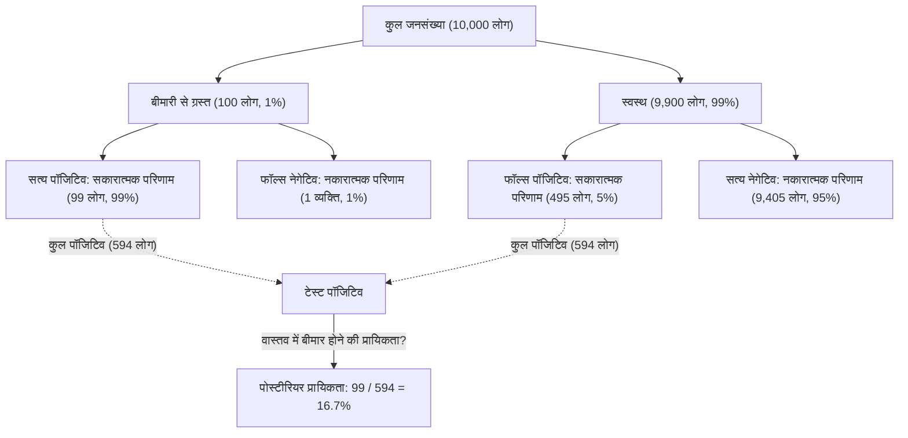
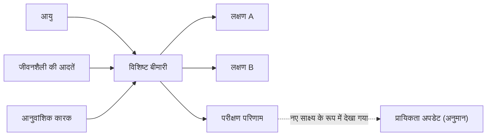

## प्रस्तावना: एक अनिश्चित दुनिया में "विश्वासों को अपडेट करना"

हम जिस दुनिया में रहते हैं वह अनिश्चितताओं से भरी है। कल बारिश होने की प्रायिकता से लेकर, किसी नई दवा के किसी विशिष्ट बीमारी के खिलाफ प्रभावी होने की संभावना, या प्राप्त ईमेल के स्पैम होने की संभावना तक, हम लगातार अधूरी जानकारी के आधार पर निर्णय लेते हैं। इस अनिश्चितता को गणितीय रूप से संभालने और **हर बार नई जानकारी (साक्ष्य) प्राप्त होने पर हमारी भविष्यवाणियों को अपडेट करने** के लिए एक शक्तिशाली ढांचा [बेज़ का प्रमेय](https://kenji.blog/hi/p/bayes-theorem/) ([Bayes' Theorem](https://kenji.blog/hi/p/bayes-theorem/)) है।

18वीं सदी के अंग्रेज पादरी और गणितज्ञ थॉमस बेज़ द्वारा खोजा गया यह प्रमेय, आधुनिक AI (आर्टिफिशियल इंटेलिजेंस) और मशीन लर्निंग का आधार बनने वाला एक मूलभूत सिद्धांत बन गया है। इस लेख में, हम बेज़ के प्रमेय के बुनियादी गणित से लेकर, अंतर्ज्ञान के विपरीत प्रायिकता विरोधाभासों, और आधुनिक तकनीक में इसके उपयोग तक सब कुछ गहराई से जानेंगे।

## बेज़ के प्रमेय का गणितीय सूत्रीकरण

[बेज़ का प्रमेय](https://kenji.blog/hi/p/bayes-theorem/) एक ऐसा प्रमेय है जिसका उपयोग किसी घटना $A$ की प्रायिकता $P(A|B)$ की गणना करने के लिए किया जाता है, इस शर्त के तहत कि एक घटना $B$ घटित हो चुकी है, जो व्युत्क्रम सशर्त प्रायिकता $P(B|A)$ और अन्य कारकों पर आधारित है। हालांकि यह सूत्र अत्यंत सरल है, इसके निहितार्थ बहुत गहरे हैं।

$$
P(A|B) = \frac{P(B|A) \cdot P(A)}{P(B)}
$$

सांख्यिकीय "विश्वास अद्यतन" के परिप्रेक्ष्य से इस समीकरण में प्रत्येक पद को एक विशेष नाम दिया गया है।

- **पूर्व प्रायिकता (Prior Probability)** $P(A)$ : नए साक्ष्य $B$ पर विचार करने से पहले घटना $A$ के घटित होने की प्रायिकता। हमारा प्रारंभिक विश्वास।
- **संभावना (Likelihood)** $P(B|A)$ : घटना $A$ को सत्य मानते हुए साक्ष्य $B$ का निरीक्षण करने की प्रायिकता।
- **सीमांत संभावना / साक्ष्य (Marginal Likelihood / Evidence)** $P(B)$ : घटना $A$ के सत्य या असत्य होने की परवाह किए बिना साक्ष्य $B$ का निरीक्षण करने की समग्र प्रायिकता। यह एक सामान्यीकरण स्थिरांक के रूप में कार्य करता है।
- **पश्च प्रायिकता (Posterior Probability)** $P(A|B)$ : नए साक्ष्य $B$ पर विचार करने के बाद घटना $A$ की प्रायिकता। हमारा अद्यतित विश्वास।

संक्षेप में, बेज़ के प्रमेय को **"पूर्व प्रायिकता" को "नया साक्ष्य कितनी अच्छी तरह फिट बैठता है (संभावना)" से गुणा करके, हमारे विश्वास को "पश्च प्रायिकता" में अपडेट करने** की प्रक्रिया के गणितीय सूत्रीकरण के रूप में वर्णित किया जा सकता है।

## अंतर्ज्ञान से विचलन: "फॉल्स पॉजिटिव" विरोधाभास (मेडिकल टेस्ट का उदाहरण)

मानव अंतर्ज्ञान अक्सर प्रायिकता गणनाओं में गलतियाँ करता है। बेज़ के प्रमेय की शक्ति को समझने के लिए एक क्लासिक उदाहरण के रूप में, आइए रोग परीक्षण (मेडिकल स्क्रीनिंग) पर विचार करें।

मान लीजिए कि एक दुर्लभ बीमारी है, और कुल जनसंख्या का $1\%$ ($0.01$) इस बीमारी से संक्रमित है (यह पूर्व प्रायिकता $P(\text{बीमारी})$ है)।
इस बीमारी का पता लगाने के लिए परीक्षण अत्यधिक सटीक है: यदि बीमारी से ग्रस्त व्यक्ति परीक्षण कराता है, तो उसे $99\%$ प्रायिकता के साथ "पॉजिटिव" आंका जाता है (ट्रू पॉजिटिव दर: संभावना $P(\text{पॉजिटिव}|\text{बीमारी})$)।
हालाँकि, इस परीक्षण में एक मामूली खामी है: भले ही बीमारी के बिना एक स्वस्थ व्यक्ति इसे कराता है, तो उसे $5\%$ प्रायिकता के साथ गलत तरीके से "पॉजिटिव" आंका जाता है (फॉल्स पॉजिटिव दर $P(\text{पॉजिटिव}|\text{स्वस्थ})$)।

अब, मान लीजिए कि आप यह परीक्षण यादृच्छिक रूप से कराते हैं और **"पॉजिटिव"** परिणाम प्राप्त करते हैं। वास्तव में आपको यह बीमारी होने की प्रायिकता क्या है?

बहुत से लोग यह सोचने लगते हैं, "चूंकि परीक्षण $99\%$ सटीक है, इसलिए मुझे बीमारी होने की $90\%$ या उससे अधिक संभावना है।" हालाँकि, आइए बेज़ के प्रमेय का उपयोग करके इसकी गणना करें।

हम $P(\text{बीमारी}|\text{पॉजिटिव})$ खोजना चाहते हैं।

1. **पूर्व प्रायिकता** $P(\text{बीमारी}) = 0.01$
2. **संभावना** $P(\text{पॉजिटिव}|\text{बीमारी}) = 0.99$
3. **स्वस्थ व्यक्ति की प्रायिकता** $P(\text{स्वस्थ}) = 1 - 0.01 = 0.99$
4. **फॉल्स पॉजिटिव की प्रायिकता** $P(\text{पॉजिटिव}|\text{स्वस्थ}) = 0.05$

सबसे पहले, हम सकारात्मक परीक्षण परिणाम की समग्र प्रायिकता $P(\text{पॉजिटिव})$ (सीमांत संभावना) की गणना करते हैं। यह "बीमार होने पर पॉजिटिव परीक्षण" और "स्वस्थ होने पर पॉजिटिव परीक्षण" का योग है।

$$
\begin{aligned}
P(\text{पॉजिटिव}) &= P(\text{पॉजिटिव}|\text{बीमारी}) \cdot P(\text{बीमारी}) + P(\text{पॉजिटिव}|\text{स्वस्थ}) \cdot P(\text{स्वस्थ}) \\
&= (0.99 \times 0.01) + (0.05 \times 0.99) \\
&= 0.0099 + 0.0495 \\
&= 0.0594
\end{aligned}
$$

इसके बाद, हम [बेज़ का प्रमेय](https://kenji.blog/hi/p/bayes-theorem/) लागू करते हैं।

$$
\begin{aligned}
P(\text{बीमारी}|\text{पॉजिटिव}) &= \frac{P(\text{पॉजिटिव}|\text{बीमारी}) \cdot P(\text{बीमारी})}{P(\text{पॉजिटिव})} \\
&= \frac{0.0099}{0.0594} \\
&\approx 0.1667
\end{aligned}
$$

आश्चर्यजनक रूप से, एक सकारात्मक परीक्षण परिणाम के बावजूद, **आपके वास्तव में बीमारी होने की प्रायिकता केवल लगभग $16.7\%$ है**। शेष $83.3\%$ "स्वस्थ लोगों के गलत तरीके से पॉजिटिव आंके जाने" (फॉल्स पॉजिटिव) के मामले हैं। ऐसा इसलिए है क्योंकि बीमारी की मूल व्यापकता ($1\%$) बहुत कम है, जिससे "बड़ी स्वस्थ आबादी से फॉल्स पॉजिटिव" बहुत कम संख्या में "वास्तव में बीमार लोगों" से कहीं अधिक हो जाते हैं।

इस तरह, [बेज़ का प्रमेय](https://kenji.blog/hi/p/bayes-theorem/) गणितीय रूप से उन जालों को ठीक करता है जिनमें हमारा अंतर्ज्ञान आसानी से गिर जाता है, और शांत निर्णय लेने के लिए एक शक्तिशाली उपकरण के रूप में कार्य करता है।

## AI और मशीन लर्निंग में बेज़ के प्रमेय का अनुप्रयोग

[बेज़ का प्रमेय](https://kenji.blog/hi/p/bayes-theorem/) केवल एक प्रायिकता पहेली होने से परे है; यह आधुनिक डेटा विज्ञान और आर्टिफिशियल इंटेलिजेंस (AI) में एक महत्वपूर्ण भूमिका निभाता है। ऐसा इसलिए है क्योंकि बड़ी मात्रा में डेटा से पैटर्न सीखने और अज्ञात डेटा पर भविष्यवाणी करने की प्रक्रिया को "पश्च प्रायिकता को अधिकतम करने" के रूप में सूत्रबद्ध किया जा सकता है।

### 1. नैव बेज़ क्लासिफायर (Naive Bayes Classifier)

"नैव बेज़ क्लासिफायर", जिसका उपयोग अक्सर स्पैम ईमेल फ़िल्टरिंग के लिए किया जाता है, बेज़ के प्रमेय के सबसे प्रत्यक्ष अनुप्रयोगों में से एक है। यह एल्गोरिथ्म ईमेल में मौजूद शब्दों (जैसे "फ्री", "विजेता", "पासवर्ड") को साक्ष्य (विशेषताओं) के रूप में मानता है और यह पश्च प्रायिकता की गणना करता है कि ईमेल स्पैम है।

इसे "नैव" (भोला) कहा जाता है क्योंकि यह एक मजबूत धारणा रखता है कि प्रत्येक विशेषता (शब्द) दूसरों से स्वतंत्र रूप से होती है। वास्तविकता में, शब्द संबंधित होते हैं, लेकिन इस सरलीकृत धारणा के बावजूद, नैव बेज़ पाठ वर्गीकरण जैसे कार्यों में बहुत उच्च सटीकता और तेज़ प्रसंस्करण गति प्रदर्शित करता है।

### 2. बायेसियन नेटवर्क (Bayesian Networks)

ऐसी प्रणालियों में जहाँ कई चर जटिल रूप से आपस में जुड़े होते हैं, बायेसियन नेटवर्क अनिश्चितता के तहत तर्क करने के लिए चरों के बीच निर्भरता को एक ग्राफ संरचना (निर्देशित चक्रीय ग्राफ) के रूप में व्यक्त करते हैं।

उदाहरण के लिए, चिकित्सा निदान AI में, "रोगी की आयु", "जीवनशैली की आदतों" और "आनुवंशिक कारकों" से "विशिष्ट बीमारी" पर संभाव्य प्रभाव को मॉडल किया जाता है, और फिर उस बीमारी के प्रभाव को "दिखने वाले लक्षणों" से जोड़ा जाता है। हर बार जब कोई नया लक्षण (साक्ष्य) इनपुट किया जाता है, तो संपूर्ण नेटवर्क में प्रायिकताओं को बेज़ के प्रमेय के अनुसार अपडेट किया जाता है, जिससे सबसे संभावित बीमारी के नाम का अनुमान लगाया जाता है। इसका उपयोग स्व-चालित कारों में स्थिति का आकलन करने और वित्तीय बाज़ार की भविष्यवाणी जैसे विविध क्षेत्रों में किया जाता है।

### 3. बायेसियन ऑप्टिमाइज़ेशन (Bayesian Optimization)

मशीन लर्निंग मॉडल बनाने में, हाइपरपैरामीटर (मानवों द्वारा सेट किए जाने वाले पैरामीटर, जैसे सीखने की दर या नेटवर्क की गहराई) का इष्टतम संयोजन खोजने का कार्य बहुत समय लेने वाला है। सभी संयोजनों को आज़माना अवास्तविक है।

बायेसियन ऑप्टिमाइज़ेशन में, "पैरामीटर सेटिंग्स" और "मॉडल प्रदर्शन" के बीच के संबंध को एक संभाव्य मॉडल (जैसे कि गाऊसी प्रक्रिया) के रूप में व्यक्त किया जाता है। पिछले परीक्षण सेटिंग्स और परिणामों (साक्ष्य) के आधार पर, यह आगे देखने के लिए सबसे आशाजनक पैरामीटर सेटिंग का अनुमान लगाता है। इससे न्यूनतम परीक्षणों के साथ उच्च प्रदर्शन वाले AI मॉडल बनाना संभव हो जाता है।

### 4. बायेसियन डीप लर्निंग (Bayesian Deep Learning)

एक दृष्टिकोण जो हाल ही में ध्यान आकर्षित कर रहा है वह है डीप लर्निंग और बायेसियन सांख्यिकी का विलय। एक मानक तंत्रिका नेटवर्क (न्यूरल नेटवर्क) अपनी भविष्यवाणी को एक नियतात्मक मान के रूप में आउटपुट करता है, लेकिन यह आपको यह नहीं बताता कि "यह कितना आश्वस्त है"।

बायेसियन डीप लर्निंग में, नेटवर्क वेट को निश्चित संख्याओं के बजाय "प्रायिकता वितरण" के रूप में माना जाता है। इससे AI अपनी भविष्यवाणियों के साथ **"अनिश्चितता (आत्मविश्वास की कमी)"** आउटपुट कर पाता है। उदाहरण के लिए, एक मेडिकल AI चेतावनी दे सकता है: "कैंसर की 90% संभावना है। हालाँकि, इस भविष्यवाणी की अनिश्चितता स्वयं बहुत अधिक है, इसलिए मानव चिकित्सक द्वारा पुष्टि आवश्यक है।" AI की सुरक्षा और विश्वसनीयता बढ़ाने के लिए यह एक अत्यंत महत्वपूर्ण तकनीक है।

## दार्शनिक दृष्टिकोण: फ़्रीक्वेंटिज़्म बनाम बायेसियनिज़्म (Frequentism vs. Bayesianism)

सांख्यिकी के इतिहास में, "प्रायिकता क्या है" इस पर विचार के दो प्रमुख स्कूल आपस में टकराए हैं। ये **फ़्रीक्वेंटिज़्म (Frequentism)** और **बायेसियनिज़्म (Bayesianism)** हैं।

फ़्रीक्वेंटिज़्म में, प्रायिकता को "सापेक्षिक आवृत्ति जिसके साथ कोई घटना तब घटित होती है जब वही परीक्षण असीम रूप से दोहराया जाता है" के रूप में परिभाषित किया जाता है। यह कहना कि सिक्का उछालने पर हेड आने की प्रायिकता $50\%$ है, इसका मतलब है कि यदि असीम रूप से उछाला जाए, तो ठीक आधा हेड होगा। इस रुख में, घटना के लिए एक सच्ची, निश्चित प्रायिकता मौजूद होती है, जिसमें पर्यवेक्षक के पास "विश्वास" रखने की कोई गुंजाइश नहीं होती है।

दूसरी ओर, बायेसियनिज़्म में, प्रायिकता को **"पर्यवेक्षक के विश्वास की डिग्री (व्यक्तिपरक प्रायिकता)"** के रूप में माना जाता है। कल बारिश होने की $70\%$ प्रायिकता उपलब्ध मौसम डेटा (साक्ष्य) के आधार पर मौसम विज्ञान एजेंसी के "विश्वास की डिग्री" का प्रतिनिधित्व करती है। यदि नए डेटा (उदा., वायुमंडलीय दबाव में अचानक गिरावट) को देखा जाता है, तो उस विश्वास को बेज़ के प्रमेय के अनुसार अपडेट किया जाता है।

20वीं सदी के अधिकांश समय में फ़्रीक्वेंटिज़्म का दबदबा रहा, लेकिन आधुनिक युग में, जहाँ कंप्यूटर की प्रसंस्करण शक्ति में काफी सुधार हुआ है, बायेसियनिज़्म के लचीले और व्यावहारिक दृष्टिकोण का पुनर्मूल्यांकन किया गया है, जो AI उछाल के पीछे प्रेरक शक्तियों में से एक बन गया है।

## निष्कर्ष: सीखते रहें और अपडेट करते रहें

[बेज़ का प्रमेय](https://kenji.blog/hi/p/bayes-theorem/) एक प्रकार का विचार ढांचा प्रदान करता है जो मात्र एक गणितीय सूत्र से परे है।

हम सभी के पास पिछले अनुभवों और पूर्वाग्रहों के आधार पर "पूर्व प्रायिकताएं (प्रारंभिक विश्वास)" हैं। यह जरूरी नहीं कि एक बुरी बात है; यह दुनिया को कुशलता से समझने का एक प्रारंभिक बिंदु है। हालाँकि, महत्वपूर्ण यह है कि **नए तथ्यों और साक्ष्यों का सामना करने पर आंखें मूंदने के बजाय, बेज़ के प्रमेय की तरह, अपने विश्वासों को शानदार ढंग से अपडेट (पश्च प्रायिकता में अपडेट) करने का लचीलापन** हो।

जिस तरह AI डेटा का उपभोग करके अधिक स्मार्ट हो जाता है, उसी तरह हम मनुष्यों को भी नई जानकारी को साक्ष्य के रूप में शामिल करना चाहिए और दुनिया की अधिक सटीक समझ तक पहुँचने के लिए खुद को लगातार अपडेट करते रहना चाहिए। शायद, बेज़ के प्रमेय को "बुद्धिमत्ता के सार" का एक गणितीय प्रतिनिधित्व कहा जा सकता है।
