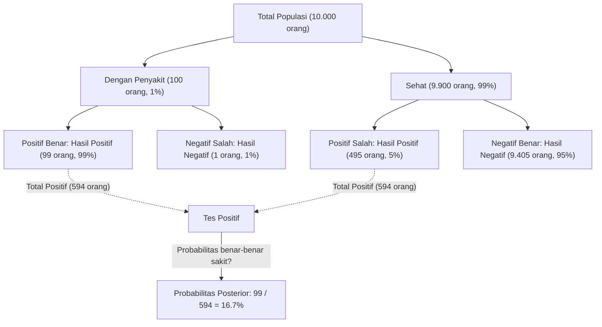
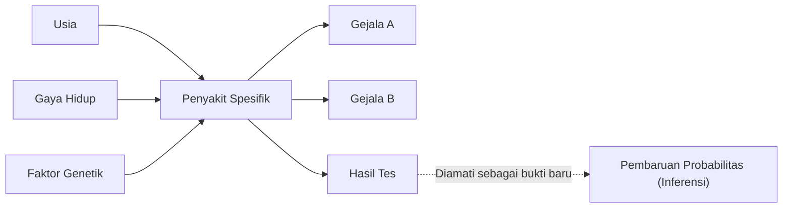

## Pendahuluan: "Memperbarui Keyakinan" di Dunia yang Penuh Ketidakpastian

Dunia tempat kita hidup penuh dengan ketidakpastian. Dari probabilitas hujan esok hari hingga kemungkinan obat baru efektif terhadap penyakit tertentu, atau peluang email yang diterima adalah spam, kita terus-menerus membuat keputusan berdasarkan informasi yang tidak lengkap. Kerangka kerja yang kuat untuk menangani ketidakpastian ini secara matematis dan **memperbarui prediksi kita setiap kali informasi (bukti) baru diperoleh** adalah [Teorema Bayes](https://kenji.blog/id/p/bayes-theorem/) ([Bayes' Theorem](https://kenji.blog/id/p/bayes-theorem/)).

Ditemukan oleh Thomas Bayes, seorang menteri dan matematikawan Inggris abad ke-18, teorema ini telah menjadi teori fundamental yang mendasari AI (Kecerdasan Buatan) modern dan pembelajaran mesin. Dalam artikel ini, kita akan menggali lebih dalam mulai dari dasar matematika [Teorema Bayes](https://kenji.blog/id/p/bayes-theorem/) hingga paradoks probabilitas yang berlawanan dengan intuisi, serta bagaimana hal ini diterapkan dalam teknologi modern.

## Formulasi Matematis [Teorema Bayes](https://kenji.blog/id/p/bayes-theorem/)

[Teorema Bayes](https://kenji.blog/id/p/bayes-theorem/) adalah teorema yang digunakan untuk menghitung probabilitas $P(A|B)$ dari sebuah kejadian $A$ dengan syarat kejadian $B$ telah terjadi, berdasarkan probabilitas bersyarat kebalikannya $P(B|A)$ dan faktor-faktor lainnya. Meskipun rumusnya sangat sederhana, implikasinya sangat mendalam.

$$
P(A|B) = \frac{P(B|A) \cdot P(A)}{P(B)}
$$

Setiap suku dalam persamaan ini diberi nama khusus dari perspektif "pembaruan keyakinan" statistik.

- **Probabilitas Prior (Prior Probability)** $P(A)$ : Probabilitas kejadian $A$ terjadi sebelum mempertimbangkan bukti baru $B$. Keyakinan awal kita.
- **Kemungkinan (Likelihood)** $P(B|A)$ : Probabilitas mengamati bukti $B$ dengan asumsi bahwa kejadian $A$ adalah benar.
- **Kemungkinan Marginal / Bukti (Marginal Likelihood / Evidence)** $P(B)$ : Probabilitas keseluruhan mengamati bukti $B$ terlepas dari apakah kejadian $A$ benar atau salah. Bertindak sebagai konstanta normalisasi.
- **Probabilitas Posterior (Posterior Probability)** $P(A|B)$ : Probabilitas kejadian $A$ setelah mempertimbangkan bukti baru $B$. Keyakinan kita yang telah diperbarui.

Singkatnya, [Teorema Bayes](https://kenji.blog/id/p/bayes-theorem/) dapat digambarkan sebagai rumusan matematis dari proses **memperbarui keyakinan kita menjadi "probabilitas posterior" dengan mengalikan "probabilitas prior" dengan "seberapa cocok bukti baru tersebut (kemungkinan)"**.

## Penyimpangan dari Intuisi: Paradoks "Positif Palsu" (Contoh Tes Medis)

Intuisi manusia sering membuat kesalahan dalam perhitungan probabilitas. Sebagai contoh klasik untuk memahami kekuatan [Teorema Bayes](https://kenji.blog/id/p/bayes-theorem/), mari kita pertimbangkan pengujian penyakit (skrining medis).

Misalkan ada penyakit langka, dan $1\%$ ($0.01$) dari total populasi terinfeksi penyakit ini (ini adalah probabilitas prior $P(\text{Penyakit})$).
Tes untuk mendeteksi penyakit ini sangat akurat: jika orang yang mengidap penyakit tersebut mengikuti tes, mereka akan dinilai "Positif" dengan probabilitas $99\%$ (Tingkat Positif Benar: Kemungkinan $P(\text{Positif}|\text{Penyakit})$).
Namun, tes ini memiliki sedikit kelemahan: meskipun orang sehat tanpa penyakit tersebut mengikutinya, mereka akan salah dinilai sebagai "Positif" dengan probabilitas $5\%$ (Tingkat Positif Salah $P(\text{Positif}|\text{Sehat})$).

Sekarang, misalkan Anda mengikuti tes ini secara acak dan mendapatkan hasil **"Positif"** . Berapa probabilitas Anda benar-benar mengidap penyakit ini?

Banyak orang cenderung berpikir, "Karena tes ini $99\%$ akurat, ada peluang $90\%$ atau lebih bahwa saya mengidap penyakit ini." Namun, mari kita hitung menggunakan [Teorema Bayes](https://kenji.blog/id/p/bayes-theorem/).

Kita ingin mencari $P(\text{Penyakit}|\text{Positif})$.

1. **Probabilitas Prior** $P(\text{Penyakit}) = 0.01$
2. **Kemungkinan** $P(\text{Positif}|\text{Penyakit}) = 0.99$
3. **Probabilitas Orang Sehat** $P(\text{Sehat}) = 1 - 0.01 = 0.99$
4. **Probabilitas Positif Salah** $P(\text{Positif}|\text{Sehat}) = 0.05$

Pertama, kita menghitung probabilitas keseluruhan dari hasil tes positif $P(\text{Positif})$ (Kemungkinan Marginal). Ini adalah jumlah dari "dites positif saat sakit" dan "dites positif saat sehat".

$$
\begin{aligned}
P(\text{Positif}) &= P(\text{Positif}|\text{Penyakit}) \cdot P(\text{Penyakit}) + P(\text{Positif}|\text{Sehat}) \cdot P(\text{Sehat}) \\
&= (0.99 \times 0.01) + (0.05 \times 0.99) \\
&= 0.0099 + 0.0495 \\
&= 0.0594
\end{aligned}
$$

Selanjutnya, kita terapkan [Teorema Bayes](https://kenji.blog/id/p/bayes-theorem/).

$$
\begin{aligned}
P(\text{Penyakit}|\text{Positif}) &= \frac{P(\text{Positif}|\text{Penyakit}) \cdot P(\text{Penyakit})}{P(\text{Positif})} \\
&= \frac{0.0099}{0.0594} \\
&\approx 0.1667
\end{aligned}
$$

Mengejutkan, bahkan dengan hasil tes positif, **probabilitas Anda benar-benar mengidap penyakit ini hanya sekitar $16.7\%$**. Sisa $83.3\%$ adalah kasus "orang sehat yang salah dinilai sebagai positif" (positif salah). Hal ini karena prevalensi awal penyakit ($1\%$) sangat rendah, membuat "positif salah dari populasi sehat yang besar" jauh melebihi jumlah kecil "orang yang benar-benar sakit".

Dengan cara ini, [Teorema Bayes](https://kenji.blog/id/p/bayes-theorem/) secara matematis mengoreksi jebakan yang mudah menjerumuskan intuisi kita dan berfungsi sebagai alat yang kuat untuk membuat penilaian yang tenang.

## Penerapan [Teorema Bayes](https://kenji.blog/id/p/bayes-theorem/) dalam AI dan Pembelajaran Mesin

[Teorema Bayes](https://kenji.blog/id/p/bayes-theorem/) tidak sekadar teka-teki probabilitas belaka; ia memainkan peran penting dalam ilmu data modern dan Kecerdasan Buatan (AI). Hal ini karena proses pembelajaran pola dari sejumlah besar data dan membuat prediksi pada data yang tidak diketahui dapat dirumuskan sebagai "memaksimalkan probabilitas posterior".

### 1. Pengklasifikasi Naive Bayes (Naive Bayes Classifier)

"Pengklasifikasi Naive Bayes", yang sering digunakan untuk penyaringan email spam, adalah salah satu penerapan paling langsung dari [Teorema Bayes](https://kenji.blog/id/p/bayes-theorem/). Algoritma ini memperlakukan kata-kata yang terkandung dalam email (seperti "gratis", "pemenang", "kata sandi") sebagai bukti (fitur) dan menghitung probabilitas posterior apakah email tersebut adalah spam.

Penyebutan "naive" (naif) dikarenakan adanya asumsi kuat bahwa setiap fitur (kata) muncul secara independen satu sama lain. Pada kenyataannya, kata-kata saling berhubungan, tetapi terlepas dari asumsi yang menyederhanakan ini, Naive Bayes menunjukkan akurasi yang sangat tinggi dan kecepatan pemrosesan yang cepat dalam tugas-tugas seperti klasifikasi teks.

### 2. Jaringan Bayesian (Bayesian Networks)

Dalam sistem di mana beberapa variabel saling terkait secara rumit, Jaringan Bayesian mengekspresikan dependensi antar variabel sebagai struktur grafik (Grafik Asiklik Berarah) untuk melakukan penalaran di bawah ketidakpastian.

Misalnya, dalam AI diagnosis medis, pengaruh probabilistik dari "usia pasien", "gaya hidup", dan "faktor genetik" pada "penyakit spesifik" dimodelkan, dan kemudian dihubungkan dengan pengaruh penyakit tersebut pada "gejala yang muncul". Setiap kali gejala (bukti) baru diinput, probabilitas di seluruh jaringan diperbarui sesuai dengan [Teorema Bayes](https://kenji.blog/id/p/bayes-theorem/), menyimpulkan nama penyakit yang paling mungkin. Ini dimanfaatkan dalam berbagai bidang, seperti penilaian situasi pada mobil self-driving dan prediksi pasar keuangan.

### 3. Optimisasi Bayesian (Bayesian Optimization)

Dalam membangun model pembelajaran mesin, tugas menemukan kombinasi hyperparameter yang optimal (parameter yang harus diatur oleh manusia, seperti kecepatan pembelajaran atau kedalaman jaringan) sangat memakan waktu. Sangat tidak realistis untuk mencoba semua kombinasi.

Dalam Optimisasi Bayesian, hubungan antara "pengaturan parameter" dan "performa model" diekspresikan sebagai model probabilistik (seperti Proses Gaussian). Berdasarkan pengaturan dan hasil percobaan masa lalu (bukti), ia menyimpulkan pengaturan parameter yang paling menjanjikan untuk dilihat selanjutnya. Hal ini memungkinkan untuk membangun model AI berkinerja tinggi dengan jumlah percobaan minimum.

### 4. Pembelajaran Mendalam Bayesian (Bayesian Deep Learning)

Pendekatan yang akhir-akhir ini menarik perhatian adalah perpaduan Deep Learning (Pembelajaran Mendalam) dan statistik Bayesian. Jaringan saraf standar menghasilkan prediksinya sebagai nilai deterministik tunggal, tetapi tidak memberi tahu Anda "seberapa yakin" prediksi tersebut.

Dalam Pembelajaran Mendalam Bayesian, bobot jaringan diperlakukan sebagai "distribusi probabilitas", bukan angka tetap. Ini memungkinkan AI untuk menghasilkan **"ketidakpastian (kurangnya rasa percaya diri)"** bersama dengan prediksinya. Misalnya, AI medis dapat memperingatkan: "Terdapat peluang kanker sebesar 90%. Namun, ketidakpastian prediksi ini sendiri sangat tinggi, sehingga diperlukan konfirmasi oleh dokter manusia." Ini adalah teknologi yang sangat penting untuk meningkatkan keamanan dan keandalan AI.

## Perspektif Filosofis: Frekuentisme vs. Bayesianisme

Dalam sejarah statistik, dua aliran pemikiran utama telah berbenturan mengenai "apa itu probabilitas". Ini adalah **Frekuentisme (Frequentism)** dan **Bayesianisme (Bayesianism)** .

Dalam Frekuentisme, probabilitas didefinisikan sebagai "frekuensi relatif terjadinya suatu kejadian jika percobaan yang sama diulang tanpa batas". Mengatakan probabilitas koin mendarat dengan sisi kepala di atas adalah $50\%$ berarti jika dilempar tanpa batas, tepat setengahnya akan berupa sisi kepala. Dalam pandangan ini, ada probabilitas yang benar dan tetap untuk kejadian itu sendiri, tidak menyisakan ruang bagi pengamat untuk memiliki "keyakinan".

Di sisi lain, dalam Bayesianisme, probabilitas diperlakukan sebagai **"tingkat keyakinan pengamat (probabilitas subjektif)"**. Probabilitas hujan $70\%$ untuk esok hari mewakili "tingkat keyakinan" badan meteorologi berdasarkan data cuaca yang tersedia (bukti). Jika data baru (misal, penurunan tekanan atmosfer secara tiba-tiba) diamati, keyakinan tersebut diperbarui menurut [Teorema Bayes](https://kenji.blog/id/p/bayes-theorem/).

Frekuentisme mendominasi sebagian besar abad ke-20, tetapi di era modern, di mana kekuatan pemrosesan komputer telah meningkat drastis, pendekatan fleksibel dan praktis dari Bayesianisme telah dievaluasi kembali, menjadi salah satu kekuatan pendorong di balik ledakan AI.

## Kesimpulan: Terus Belajar dan Memperbarui

[Teorema Bayes](https://kenji.blog/id/p/bayes-theorem/) menyediakan semacam kerangka pemikiran yang melampaui sekadar rumus matematika.

Kita semua memiliki "probabilitas prior (keyakinan awal)" berdasarkan pengalaman masa lalu dan bias. Ini belum tentu hal yang buruk; ini adalah titik awal untuk mempersepsikan dunia secara efisien. Namun, yang penting adalah memiliki **fleksibilitas untuk memperbarui keyakinan seseorang dengan anggun (memperbarui ke probabilitas posterior), seperti halnya [Teorema Bayes](https://kenji.blog/id/p/bayes-theorem/), alih-alih menutup mata ketika dihadapkan pada fakta dan bukti baru**.

Sama seperti AI menjadi lebih pintar dengan mengonsumsi data, kita manusia juga harus menggabungkan informasi baru sebagai bukti dan terus memperbarui diri, mencapai pemahaman dunia yang lebih akurat. Mungkin, [Teorema Bayes](https://kenji.blog/id/p/bayes-theorem/) dapat dikatakan sebagai representasi matematis dari "esensi kecerdasan" itu sendiri.
