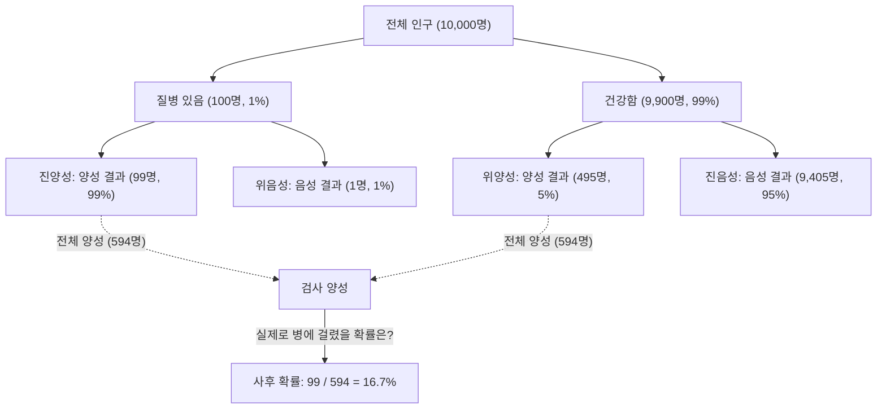
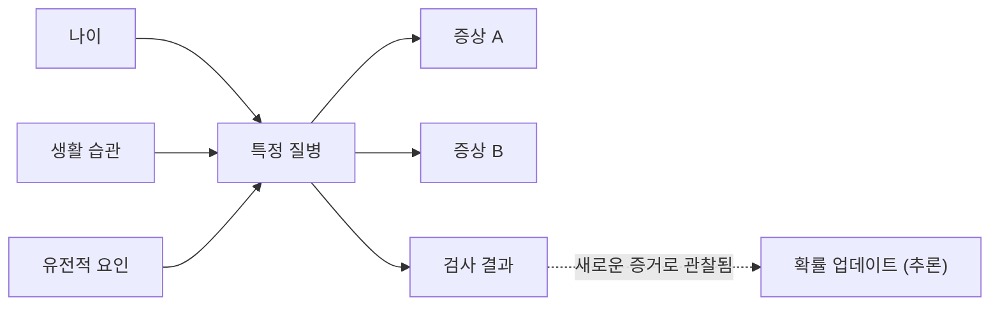

## 서론: 불확실한 세계에서의 "신념의 업데이트"

우리가 사는 세상은 불확실성으로 가득 차 있습니다. 내일 비가 올 확률, 새로운 약이 특정 질병에 효과가 있을 확률, 혹은 수신한 이메일이 스팸일 확률 등, 우리는 끊임없이 불완전한 정보 속에서 결정을 내리고 있습니다. 이러한 불확실성을 수학적으로 다루고 **새로운 정보(증거)를 얻을 때마다 우리의 예측을 업데이트해 나가는** 강력한 프레임워크가 바로 '[베이즈 정리](https://kenji.blog/p/bayes-theorem/)([Bayes' Theorem](https://kenji.blog/p/bayes-theorem/))'입니다.

18세기 영국의 목사이자 수학자였던 토머스 베이즈(Thomas Bayes)가 발견한 이 정리는 현대의 AI(인공지능) 및 머신러닝의 근간을 이루는 중요한 이론이 되었습니다. 이 글에서는 [베이즈 정리](https://kenji.blog/p/bayes-theorem/)의 기본적인 수학적 원리부터, 직관에 반하는 확률의 역설, 그리고 현대 기술에서 어떻게 응용되고 있는지 깊이 있게 파헤쳐 보겠습니다.

## [베이즈 정리](https://kenji.blog/p/bayes-theorem/)의 수학적 공식화

[베이즈 정리](https://kenji.blog/p/bayes-theorem/)는 어떤 사건 $B$가 일어났다는 조건 하에서 사건 $A$의 확률 $P(A|B)$를, 역의 조건부 확률 $P(B|A)$ 등을 바탕으로 계산하기 위한 정리입니다. 수식은 매우 간단하지만, 그 내포된 의미는 심오합니다.

$$
P(A|B) = \frac{P(B|A) \cdot P(A)}{P(B)}
$$

이 식의 각 항에는 통계학적인 "신념의 업데이트"라는 관점에서 특별한 이름이 붙어 있습니다.

- **사전 확률 (Prior Probability)** $P(A)$ : 새로운 증거 $B$를 고려하기 전, 사건 $A$가 발생할 확률. 우리의 초기 신념입니다.
- **우도 / 가능도 (Likelihood)** $P(B|A)$ : 사건 $A$가 참이라고 가정했을 때, 증거 $B$가 관찰될 확률.
- **주변 우도 / 증거 (Marginal Likelihood / Evidence)** $P(B)$ : 사건 $A$의 참거짓 여부에 관계없이, 증거 $B$가 관찰될 전체적인 확률. 정규화 상수 역할을 합니다.
- **사후 확률 (Posterior Probability)** $P(A|B)$ : 새로운 증거 $B$를 고려한 후의 사건 $A$의 확률. 업데이트된 우리의 신념입니다.

요약하자면, [베이즈 정리](https://kenji.blog/p/bayes-theorem/)는 **"사전 확률"에 "새로운 증거가 얼마나 들어맞는가(우도)"를 곱하여 "사후 확률"로 신념을 업데이트하는** 과정을 수식화한 것이라고 할 수 있습니다.

## 직관과의 괴리: "위양성(False Positive)"의 역설 (의료 검사 예시)

인간의 직관은 확률 계산에서 종종 실수를 범합니다. [베이즈 정리](https://kenji.blog/p/bayes-theorem/)의 강력함을 이해하기 위한 고전적인 예로 질병 검사(의료 스크리닝)를 생각해 봅시다.

어떤 희귀한 질병이 있고, 전체 인구의 $1\%$($0.01$)가 이 질병에 걸려 있다고 가정해 봅시다 (이것이 사전 확률 $P(\text{질병})$입니다).
이 질병을 발견하기 위한 검사는 매우 정확해서, 병에 걸린 사람이 검사를 받을 경우 $99\%$의 확률로 "양성" 판정을 받습니다 (진양성률: 우도 $P(\text{양성}|\text{질병})$).
하지만 이 검사에는 약간의 결함이 있어서, 병에 걸리지 않은 건강한 사람이 받더라도 $5\%$의 확률로 잘못되어 "양성" 판정을 받고 맙니다 (위양성률 $P(\text{양성}|\text{건강})$).

자, 당신이 무작위로 이 검사를 받았고 **"양성"** 이라는 결과가 나왔습니다. 당신이 실제로 이 질병에 걸려 있을 확률은 얼마나 될까요?

많은 사람들은 "검사 정확도가 $99\%$니까, 병에 걸렸을 확률도 $90\%$ 이상일 것이다"라고 생각하기 쉽습니다. 그러나 [베이즈 정리](https://kenji.blog/p/bayes-theorem/)를 사용하여 계산해 봅시다.

우리가 구하고자 하는 것은 $P(\text{질병}|\text{양성})$입니다.

1. **사전 확률** $P(\text{질병}) = 0.01$
2. **우도** $P(\text{양성}|\text{질병}) = 0.99$
3. **건강한 사람의 확률** $P(\text{건강}) = 1 - 0.01 = 0.99$
4. **위양성 확률** $P(\text{양성}|\text{건강}) = 0.05$

먼저, 검사 결과가 양성이 나올 전체 확률 $P(\text{양성})$(주변 우도)을 계산합니다. 이것은 "병에 걸려서 양성이 나오는 경우"와 "건강한데 양성이 나오는 경우"의 합입니다.

$$
\begin{aligned}
P(\text{양성}) &= P(\text{양성}|\text{질병}) \cdot P(\text{질병}) + P(\text{양성}|\text{건강}) \cdot P(\text{건강}) \\
&= (0.99 \times 0.01) + (0.05 \times 0.99) \\
&= 0.0099 + 0.0495 \\
&= 0.0594
\end{aligned}
$$

다음으로, [베이즈 정리](https://kenji.blog/p/bayes-theorem/)에 대입합니다.

$$
\begin{aligned}
P(\text{질병}|\text{양성}) &= \frac{P(\text{양성}|\text{질병}) \cdot P(\text{질병})}{P(\text{양성})} \\
&= \frac{0.0099}{0.0594} \\
&\approx 0.1667
\end{aligned}
$$

놀랍게도, 검사에서 양성이 나왔다고 하더라도 **실제로 병에 걸려 있을 확률은 겨우 약 $16.7\%$** 에 불과합니다. 나머지 $83.3\%$는 "건강한데 잘못해서 양성으로 판정된" 케이스(위양성)입니다. 이는 원래 질병의 유병률($1\%$)이 매우 낮기 때문에, 소수의 "진짜 병에 걸린 사람"보다 다수의 "건강한 사람 중에서 나오는 위양성인 사람"이 압도적으로 많아지기 때문입니다.

이처럼 [베이즈 정리](https://kenji.blog/p/bayes-theorem/)는 우리의 직관이 빠지기 쉬운 함정을 수학적으로 바로잡아, 냉정한 판단을 내리기 위한 강력한 도구가 됩니다.

## AI와 머신러닝에서의 [베이즈 정리](https://kenji.blog/p/bayes-theorem/) 응용

[베이즈 정리](https://kenji.blog/p/bayes-theorem/)는 단순한 확률 퍼즐에 그치지 않고, 현대 데이터 과학 및 인공지능(AI) 분야에서 극히 중요한 역할을 하고 있습니다. 방대한 데이터로부터 패턴을 학습하고, 미지의 데이터에 대해 예측을 수행하는 과정 자체가 '사후 확률의 최대화'로 공식화될 수 있기 때문입니다.

### 1. 나이브 베이즈 분류기 (Naive Bayes Classifier)

스팸 메일 필터링 등에 자주 사용되는 '나이브 베이즈 분류기'는 [베이즈 정리](https://kenji.blog/p/bayes-theorem/)의 가장 직접적인 응용 예 중 하나입니다. 이 알고리즘은 이메일에 포함된 단어(예: "무료", "당첨", "비밀번호" 등)를 증거(특성)로 취급하여, 그 이메일이 스팸일 사후 확률을 계산합니다.

"나이브(순진한)"라고 불리는 이유는, 각 특성(단어)이 서로 독립적으로 발생한다는 강한 가정을 두고 있기 때문입니다. 현실에서는 단어들 사이에 연관성이 있지만, 이 단순화된 가정에도 불구하고 나이브 베이즈는 텍스트 분류 등의 작업에서 매우 높은 정확도와 빠른 처리 속도를 보여줍니다.

### 2. 베이지안 네트워크 (Bayesian Networks)

여러 변수가 복잡하게 얽혀 있는 시스템에서, 변수들 간의 의존 관계를 그래프 구조(방향성 비순환 그래프)로 표현하고 불확실한 추론을 수행하는 것이 베이지안 네트워크입니다.

예를 들어, 의료 진단 AI에서는 "환자의 나이", "생활 습관", "유전적 요인"이 "특정 질환"에 미치는 확률적인 영향을 모델링하고, 다시 그 질환이 "나타나는 증상"에 미치는 영향을 연결합니다. 새로운 증상(증거)이 입력될 때마다 네트워크 전체의 확률이 [베이즈 정리](https://kenji.blog/p/bayes-theorem/)에 따라 업데이트되어 가장 가능성 높은 병명을 추론합니다. 이는 자율주행 자동차의 상황 판단이나 금융 시장 예측 등 다양한 분야에서 활용되고 있습니다.

### 3. 베이지안 최적화 (Bayesian Optimization)

머신러닝 모델을 구축할 때, 하이퍼파라미터(학습률이나 네트워크 층의 깊이 등 사람이 설정해야 하는 매개변수)의 최적 조합을 찾는 작업은 매우 시간이 오래 걸립니다. 모든 조합을 시도하는 것은 현실적이지 않습니다.

베이지안 최적화에서는 "파라미터 설정값"과 "모델의 성능"의 관계를 확률 모델(가우시안 프로세스 등)로 표현합니다. 과거에 시도했던 설정과 결과(증거)를 바탕으로, 다음에 살펴보아야 할 가장 유망한 파라미터 설정을 추론합니다. 이를 통해 최소한의 시도 횟수로 고성능 AI 모델을 구축하는 것이 가능해집니다.

### 4. 베이지안 딥러닝 (Bayesian Deep Learning)

최근 주목받고 있는 것은 딥러닝(심층 학습)과 베이즈 통계를 융합한 접근 방식입니다. 일반적인 신경망은 예측 결과를 하나의 결정론적인 값으로 출력하지만, 그것이 "어느 정도 확신을 가지고 있는지"는 알려주지 않습니다.

베이지안 딥러닝에서는 네트워크의 가중치를 고정된 수치가 아니라 "확률 분포"로 다룹니다. 이를 통해 AI는 예측 결과와 함께 **"불확실성(자신감 부족)"** 을 출력할 수 있게 됩니다. 예를 들어 의료 AI가 "90% 확률로 암입니다. 하지만 이 예측 자체의 불확실성이 매우 높기 때문에, 인간 의사의 확인이 필요합니다"라고 경고할 수 있게 되는 것입니다. 이는 AI의 안전성과 신뢰성을 높이는 데 있어서 극히 중요한 기술입니다.

## 철학적 관점: 빈도주의 vs 베이즈주의

통계학의 역사에서 "확률이란 무엇인가"를 두고 크게 두 학파가 대립해 왔습니다. 그것이 바로 **빈도주의(Frequentism)** 와 **베이즈주의(Bayesianism)** 입니다.

빈도주의에서는 확률을 "동일한 시행을 무한히 반복했을 때 그 사건이 일어나는 상대적인 빈도"로 정의합니다. 동전을 던졌을 때 앞면이 나올 확률이 $50\%$라는 것은, 무한히 던지면 정확히 절반이 앞면이 될 것이라는 의미입니다. 이 입장에서는 사건 자체에 진짜 고정된 확률이 존재하며, 관찰자가 "신념"을 가질 여지는 없습니다.

반면, 베이즈주의에서는 확률을 **"관찰자의 신념의 정도(주관적 확률)"** 로 취급합니다. 내일 비가 올 확률이 $70\%$라는 것은, 가지고 있는 기상 데이터(증거)를 바탕으로 한 기상청의 "확신 정도"를 나타냅니다. 새로운 데이터(예: 갑작스러운 기압 강하)가 관측되면, 그 확신도는 [베이즈 정리](https://kenji.blog/p/bayes-theorem/)에 따라 업데이트됩니다.

20세기의 대부분은 빈도주의가 주류였지만, 컴퓨터의 계산 능력이 비약적으로 향상된 현대에 이르러 유연하고 실용적인 베이즈주의 접근 방식이 재평가받으며 AI 붐을 견인하는 원동력 중 하나가 되었습니다.

## 결론: 끊임없이 배우고 업데이트하기

[베이즈 정리](https://kenji.blog/p/bayes-theorem/)는 단순한 수학 공식을 넘어, 일종의 사고의 프레임워크를 제공해 줍니다.

우리 모두는 과거의 경험이나 편견에 기반한 "사전 확률(초기의 신념)"을 가지고 있습니다. 그것은 결코 나쁜 것이 아니며, 세상을 효율적으로 인식하기 위한 출발점입니다. 하지만 중요한 것은 **새로운 사실이나 증거에 직면했을 때, 그것을 외면하는 것이 아니라 [베이즈 정리](https://kenji.blog/p/bayes-theorem/)처럼 유연하게 자신의 신념을 업데이트(사후 확률로 갱신)해 나가는 유연성**을 갖는 것입니다.

AI가 데이터를 먹고 똑똑해져 가는 것처럼, 우리 인간도 새로운 정보를 증거로 받아들이고 끊임없이 자신을 업데이트함으로써 세상에 대한 보다 정확한 이해에 도달할 수 있을 것입니다. 어쩌면 [베이즈 정리](https://kenji.blog/p/bayes-theorem/)는 그러한 "지성의 본질"을 수식으로 표현한 것이라고 할 수 있을지도 모릅니다.
