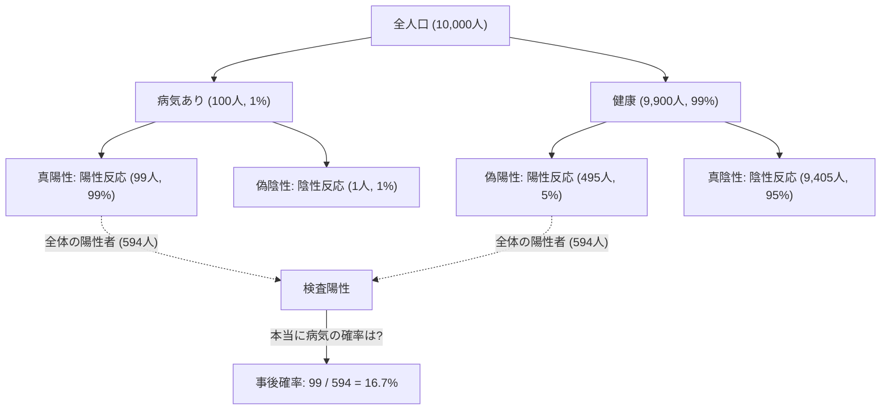
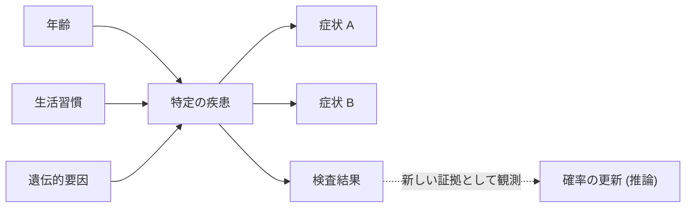

## はじめに：不確実な世界における「信念の更新」

私たちの住む世界は不確実性に満ちています。明日雨が降る確率、ある新しい薬が特定の病気に効く確率、あるいは受信したメールがスパムである確率など、日々私たちは不完全な情報の中で判断を下しています。このような不確実性を数学的に扱い、 **新しい情報（証拠）が得られるたびに予測を更新していく** ための強力な枠組みが「[ベイズの定理](https://kenji.blog/p/bayes-theorem/)（[Bayes' Theorem](https://kenji.blog/p/bayes-theorem/)）」です。

18世紀のイギリスの牧師であり数学者でもあったトーマス・ベイズ（Thomas Bayes）によって発見されたこの定理は、現代のAI（人工知能）や機械学習の根幹を成す重要な理論となっています。この記事では、[ベイズの定理](https://kenji.blog/p/bayes-theorem/)の基本的な数理から、直感に反するような確率のパラドックス、そして現代のテクノロジーにおいてどのように応用されているかまでを深く掘り下げていきます。

## [ベイズの定理](https://kenji.blog/p/bayes-theorem/)の数理的定式化

[ベイズの定理](https://kenji.blog/p/bayes-theorem/)は、ある事象 $B$ が起きたという条件下での事象 $A$ の確率 $P(A|B)$ を、逆の条件付き確率 $P(B|A)$ などを元に計算するための定理です。数式としては非常にシンプルですが、その意味するところは深遠です。

$$
P(A|B) = \frac{P(B|A) \cdot P(A)}{P(B)}
$$

この式の各項には、統計学的な「信念の更新」という観点から特別な名前が付けられています。

- **事前確率 (Prior Probability)** $P(A)$ : 新しい証拠 $B$ を考慮する前の、事象 $A$ が発生する確率。私たちの最初の信念。
- **尤度 (Likelihood)** $P(B|A)$ : 事象 $A$ が真であると仮定したときに、証拠 $B$ が観察される確率。
- **限界尤度 (Marginal Likelihood / Evidence)** $P(B)$ : 事象 $A$ の真偽にかかわらず、証拠 $B$ が観察される全体的な確率。正規化定数として機能します。
- **事後確率 (Posterior Probability)** $P(A|B)$ : 新しい証拠 $B$ を考慮した後の、事象 $A$ の確率。更新された私たちの信念。

つまり、[ベイズの定理](https://kenji.blog/p/bayes-theorem/)は **「事前確率」に「新しい証拠がどれくらい当てはまるか（尤度）」を掛け合わせることで、「事後確率」へと信念をアップデートする** プロセスを数式化したものと言えます。

## 直感とのズレ：「偽陽性」のパラドックス（医療検査の例）

人間の直感は確率の計算においてしばしば間違いを犯します。[ベイズの定理](https://kenji.blog/p/bayes-theorem/)の強力さを理解するための古典的な例として、病気の検査（医療スクリーニング）を考えてみましょう。

ある珍しい病気があり、全人口の $1\%$ （$0.01$）がこの病気にかかっているとします（これが事前確率 $P(\text{病気})$ です）。
この病気を発見するための検査は非常に精度が高く、病気にかかっている人が検査を受けた場合、$99\%$ の確率で「陽性」と判定されます（真陽性率：尤度 $P(\text{陽性}|\text{病気})$）。
しかし、この検査にはわずかな欠陥があり、病気にかかっていない健康な人が受けた場合でも、$5\%$ の確率で誤って「陽性」と判定されてしまいます（偽陽性率 $P(\text{陽性}|\text{健康})$）。

さて、あなたが無作為にこの検査を受け、 **「陽性」** という結果が出ました。あなたが本当にこの病気にかかっている確率はどれくらいでしょうか？

多くの人は「検査の精度が $99\%$ なのだから、$90\%$ 以上の確率で病気だろう」と考えがちです。しかし、[ベイズの定理](https://kenji.blog/p/bayes-theorem/)を使って計算してみましょう。

求めたいのは $P(\text{病気}|\text{陽性})$ です。

1. **事前確率** $P(\text{病気}) = 0.01$
2. **尤度** $P(\text{陽性}|\text{病気}) = 0.99$
3. **健康な人の確率** $P(\text{健康}) = 1 - 0.01 = 0.99$
4. **偽陽性の確率** $P(\text{陽性}|\text{健康}) = 0.05$

まず、検査結果が陽性になる全体の確率 $P(\text{陽性})$ （限界尤度）を計算します。これは「病気で陽性になる場合」と「健康なのに陽性になる場合」の和です。

$$
\begin{aligned}
P(\text{陽性}) &= P(\text{陽性}|\text{病気}) \cdot P(\text{病気}) + P(\text{陽性}|\text{健康}) \cdot P(\text{健康}) \\
&= (0.99 \times 0.01) + (0.05 \times 0.99) \\
&= 0.0099 + 0.0495 \\
&= 0.0594
\end{aligned}
$$

次に、[ベイズの定理](https://kenji.blog/p/bayes-theorem/)に当てはめます。

$$
\begin{aligned}
P(\text{病気}|\text{陽性}) &= \frac{P(\text{陽性}|\text{病気}) \cdot P(\text{病気})}{P(\text{陽性})} \\
&= \frac{0.0099}{0.0594} \\
&\approx 0.1667
\end{aligned}
$$

驚くべきことに、検査で陽性が出たとしても、 **本当に病気にかかっている確率はわずか約 $16.7\%$** に過ぎないのです。残りの $83.3\%$ は「健康なのに誤って陽性と判定された」ケース（偽陽性）です。これは、元の病気の罹患率（$1\%$）が非常に低いため、少数の「本当の病気の人」よりも、多数の「健康な人の中から出る偽陽性の人」の方が圧倒的に多くなってしまうためです。

このように、[ベイズの定理](https://kenji.blog/p/bayes-theorem/)は私たちの直感が陥りやすい罠を数学的に正し、冷静な判断を下すための強力なツールとなります。

## AIと機械学習におけるベイズ定理の応用

[ベイズの定理](https://kenji.blog/p/bayes-theorem/)は、単なる確率のパズルに留まらず、現代のデータサイエンスや人工知能（AI）の分野で極めて重要な役割を果たしています。大量のデータからパターンを学習し、未知のデータに対して予測を行うプロセス自体が、「事後確率の最大化」として定式化できるからです。

### 1. ナイーブベイズ分類器 (Naive Bayes Classifier)

スパムメールのフィルタリングなどによく用いられる「ナイーブベイズ分類器」は、[ベイズの定理](https://kenji.blog/p/bayes-theorem/)の最も直接的な応用例の一つです。このアルゴリズムは、メールに含まれる単語（「無料」「当選」「パスワード」など）を証拠（特徴量）として扱い、そのメールがスパムであるかどうかの事後確率を計算します。

「ナイーブ（単純な）」と呼ばれる理由は、各特徴量（単語）が互いに独立して発生するという強い仮定を置いているためです。現実には単語間には関連性がありますが、この単純な仮定にもかかわらず、ナイーブベイズはテキスト分類などのタスクで非常に高い精度と高速な処理速度を発揮します。

### 2. ベイジアンネットワーク (Bayesian Networks)

複数の変数が複雑に絡み合うシステムにおいて、変数間の依存関係を[グラフ](https://kenji.blog/p/tree-graph-data-structures-search-dfs-bfs-dijkstra/)構造（有向非巡回グラフ）で表現し、不確実な推論を行うのがベイジアンネットワークです。

例えば、医療診断AIでは、「患者の年齢」「生活習慣」「遺伝的要因」から「特定の疾患」への確率的な影響をモデル化し、さらにその疾患から「現れる症状」への影響をリンクさせます。新しい症状（証拠）が入力されるたびに、ネットワーク全体の確率が[ベイズの定理](https://kenji.blog/p/bayes-theorem/)に従って更新され、最も可能性の高い病名が推論されます。これは自動運転車の状況判断や、金融市場の予測など、多岐にわたる分野で活用されています。

### 3. ベイズ最適化 (Bayesian Optimization)

機械学習モデルの構築において、ハイパーパラメータ（学習率やネットワークの層の深さなど、人間が設定すべきパラメータ）の最適な組み合わせを見つける作業は非常に時間がかかります。すべての組み合わせを試すことは現実的ではありません。

ベイズ最適化では、「パラメータの設定値」と「モデルの性能」の関係を確率モデル（[ガウス](https://kenji.blog/p/gauss/)過程など）として表現します。過去に試した設定と結果（証拠）を元に、次に見るべき最も有望なパラメータ設定を推論します。これにより、最小限の試行回数で高性能なAIモデルを構築することが可能になります。

### 4. ベイズ深層学習 (Bayesian Deep Learning)

近年注目を集めているのが、ディープラーニング（深層学習）とベイズ統計を融合させたアプローチです。通常のニューラルネットワークは、予測結果を一つの決定的な値として出力しますが、それが「どの程度確信を持っているか」は教えてくれません。

ベイズ深層学習では、ネットワークの重みを固定の数値ではなく「確率分布」として扱います。これにより、AIは予測結果と共に **「不確実性（自信のなさ）」** を出力できるようになります。例えば、医療AIが「90%の確率でガンです。しかし、この予測自体の不確実性が非常に高いため、人間の医師の確認が必要です」と警告できるようになるのです。これは、AIの安全性と信頼性を高める上で極めて重要な技術です。

## 哲学的視点：ベイズ主義 vs 頻度主義

統計学の歴史において、「確率とは何か」をめぐって大きく二つの流派が対立してきました。それが **頻度主義（Frequentism）** と **ベイズ主義（Bayesianism）** です。

頻度主義では、確率は「同じ試行を無限回繰り返したときに、その事象が起こる相対的な頻度」と定義されます。コインを投げたときに表が出る確率が $50\%$ であるというのは、無限回投げればちょうど半分が表になる、という意味です。この立場では、事象自体には真の固定された確率が存在し、観測者が「信念」を持つ余地はありません。

一方、ベイズ主義では、確率は **「観測者の信念の度合い（主観的確率）」** として扱われます。明日の雨の確率が $70\%$ というのは、手元にある気象データ（証拠）に基づいた、気象庁の「確信度合い」を表しています。新しいデータ（例えば急な気圧の低下）が観測されれば、その確信度は[ベイズの定理](https://kenji.blog/p/bayes-theorem/)に従ってアップデートされます。

20世紀の多くは頻度主義が主流でしたが、コンピュータの計算能力が飛躍的に向上した現代において、柔軟で実用的なベイズ主義のアプローチが再評価され、AIブームを牽引する原動力の一つとなっています。

## 結論：常に学び、アップデートし続けること

[ベイズの定理](https://kenji.blog/p/bayes-theorem/)は、単なる数学の公式を超えた、一種の思考のフレームワークを提供してくれます。

私たちは皆、過去の経験や偏見に基づく「事前確率（初期の信念）」を持っています。それは決して悪いことではなく、世界を効率的に認識するための出発点です。しかし重要なのは、 **新しい事実や証拠に直面したとき、それに目を背けるのではなく、[ベイズの定理](https://kenji.blog/p/bayes-theorem/)のようにしなやかに自らの信念をアップデート（事後確率へ更新）していく柔軟性** を持つことです。

AIがデータを食べて賢くなっていくように、私たち人間も新しい情報を証拠として取り入れ、絶えず自己を更新し続けることで、より精度の高い世界への理解に到達できるはずです。[ベイズの定理](https://kenji.blog/p/bayes-theorem/)は、そんな「知性の本質」を数式で表したものと言えるのかもしれません。
