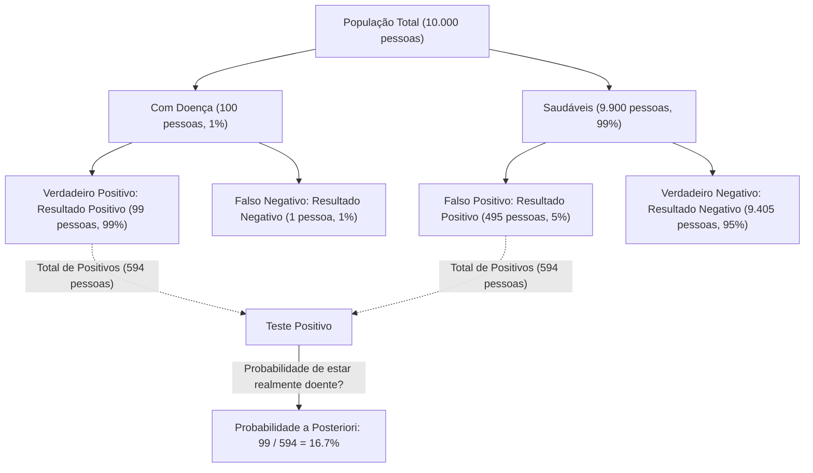
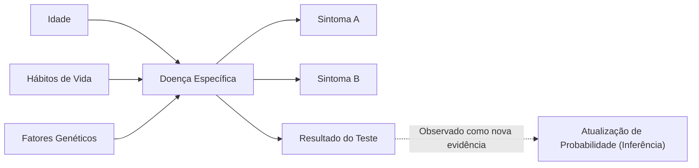

## Introdução: "Atualizando Crenças" em um Mundo Incerto

O mundo em que vivemos é cheio de incertezas. Desde a probabilidade de chover amanhã até a probabilidade de um novo medicamento ser eficaz contra uma doença específica, ou a chance de um e-mail recebido ser spam, tomamos decisões constantemente com base em informações incompletas. Um poderoso framework para lidar matematicamente com essa incerteza e **atualizar nossas previsões cada vez que novas informações (evidências) são obtidas** é o [Teorema de Bayes](https://kenji.blog/pt/p/bayes-theorem/) ([Bayes' Theorem](https://kenji.blog/pt/p/bayes-theorem/)).

Descoberto por Thomas Bayes, um ministro e matemático inglês do século XVIII, este teorema tornou-se uma teoria fundamental que sustenta a IA (Inteligência Artificial) moderna e o aprendizado de máquina. Neste artigo, vamos nos aprofundar em tudo, desde a matemática básica do [Teorema de Bayes](https://kenji.blog/pt/p/bayes-theorem/) até os paradoxos contra-intuitivos de probabilidade, e como ele é aplicado na tecnologia moderna.

## Formulação Matemática do [Teorema de Bayes](https://kenji.blog/pt/p/bayes-theorem/)

O [Teorema de Bayes](https://kenji.blog/pt/p/bayes-theorem/) é um teorema usado para calcular a probabilidade $P(A|B)$ de um evento $A$ sob a condição de que um evento $B$ ocorreu, com base na probabilidade condicional inversa $P(B|A)$ e outros fatores. Embora a fórmula seja extremamente simples, suas implicações são profundas.

$$
P(A|B) = \frac{P(B|A) \cdot P(A)}{P(B)}
$$

A cada termo nesta equação é dado um nome especial sob a perspectiva da "atualização de crenças" estatística.

- **Probabilidade a Priori (Prior Probability)** $P(A)$ : A probabilidade do evento $A$ ocorrer antes de considerar a nova evidência $B$. Nossa crença inicial.
- **Verossimilhança (Likelihood)** $P(B|A)$ : A probabilidade de observar a evidência $B$ assumindo que o evento $A$ é verdadeiro.
- **Verossimilhança Marginal / Evidência (Marginal Likelihood / Evidence)** $P(B)$ : A probabilidade geral de observar a evidência $B$ independentemente de o evento $A$ ser verdadeiro ou falso. Atua como uma constante de normalização.
- **Probabilidade a Posteriori (Posterior Probability)** $P(A|B)$ : A probabilidade do evento $A$ após considerar a nova evidência $B$. Nossa crença atualizada.

Em suma, o [Teorema de Bayes](https://kenji.blog/pt/p/bayes-theorem/) pode ser descrito como a formulação matemática do processo de **atualizar nossa crença para uma "probabilidade a posteriori", multiplicando a "probabilidade a priori" por "quão bem a nova evidência se ajusta (verossimilhança)"**.

## Desvio da Intuição: O Paradoxo dos "Falsos Positivos" (Exemplo de Exame Médico)

A intuição humana costuma cometer erros em cálculos de probabilidade. Como um exemplo clássico para entender o poder do [Teorema de Bayes](https://kenji.blog/pt/p/bayes-theorem/), vamos considerar exames de doenças (triagem médica).

Suponha que exista uma doença rara, e $1\%$ ($0.01$) da população total está infectada com esta doença (esta é a probabilidade a priori $P(\text{Doença})$).
O teste para detectar essa doença é altamente preciso: se uma pessoa com a doença fizer o teste, ela será julgada "Positivo" com uma probabilidade de $99\%$ (Taxa de Verdadeiros Positivos: Verossimilhança $P(\text{Positivo}|\text{Doença})$).
No entanto, este teste tem uma pequena falha: mesmo que uma pessoa saudável sem a doença o faça, ela será julgada incorretamente como "Positivo" com uma probabilidade de $5\%$ (Taxa de Falsos Positivos $P(\text{Positivo}|\text{Saudável})$).

Agora, suponha que você faça esse teste ao acaso e obtenha um resultado **"Positivo"** . Qual é a probabilidade de você realmente ter essa doença?

Muitas pessoas tendem a pensar: "Como o teste é $99\%$ preciso, há uma chance de $90\%$ ou mais de que eu tenha a doença." No entanto, vamos calcular isso usando o [Teorema de Bayes](https://kenji.blog/pt/p/bayes-theorem/).

Queremos encontrar $P(\text{Doença}|\text{Positivo})$.

1. **Probabilidade a priori** $P(\text{Doença}) = 0.01$
2. **Verossimilhança** $P(\text{Positivo}|\text{Doença}) = 0.99$
3. **Probabilidade de Pessoa Saudável** $P(\text{Saudável}) = 1 - 0.01 = 0.99$
4. **Probabilidade de Falso Positivo** $P(\text{Positivo}|\text{Saudável}) = 0.05$

Primeiro, calculamos a probabilidade geral de um resultado de teste positivo $P(\text{Positivo})$ (Verossimilhança Marginal). Esta é a soma de "testar positivo estando doente" e "testar positivo estando saudável".

$$
\begin{aligned}
P(\text{Positivo}) &= P(\text{Positivo}|\text{Doença}) \cdot P(\text{Doença}) + P(\text{Positivo}|\text{Saudável}) \cdot P(\text{Saudável}) \\
&= (0.99 \times 0.01) + (0.05 \times 0.99) \\
&= 0.0099 + 0.0495 \\
&= 0.0594
\end{aligned}
$$

A seguir, aplicamos o [Teorema de Bayes](https://kenji.blog/pt/p/bayes-theorem/).

$$
\begin{aligned}
P(\text{Doença}|\text{Positivo}) &= \frac{P(\text{Positivo}|\text{Doença}) \cdot P(\text{Doença})}{P(\text{Positivo})} \\
&= \frac{0.0099}{0.0594} \\
&\approx 0.1667
\end{aligned}
$$

Surpreendentemente, mesmo com um resultado de teste positivo, **a probabilidade de que você realmente tenha a doença é de apenas cerca de $16.7\%$**. Os $83.3\%$ restantes são casos de "pessoas saudáveis julgadas incorretamente como positivas" (falsos positivos). Isso ocorre porque a prevalência original da doença ($1\%$) é muito baixa, fazendo com que os "falsos positivos da grande população saudável" superem esmagadoramente o pequeno número de "pessoas verdadeiramente doentes".

Dessa forma, o [Teorema de Bayes](https://kenji.blog/pt/p/bayes-theorem/) corrige matematicamente as armadilhas nas quais nossa intuição cai facilmente e serve como uma ferramenta poderosa para fazer julgamentos sensatos.

## Aplicação do [Teorema de Bayes](https://kenji.blog/pt/p/bayes-theorem/) na IA e Aprendizado de Máquina

O [Teorema de Bayes](https://kenji.blog/pt/p/bayes-theorem/) vai além de ser apenas um quebra-cabeça de probabilidade; ele desempenha um papel crucial na moderna ciência de dados e Inteligência Artificial (IA). Isso ocorre porque o próprio processo de aprender padrões a partir de grandes quantidades de dados e fazer previsões sobre dados desconhecidos pode ser formulado como "maximizar a probabilidade a posteriori".

### 1. Classificador Naive Bayes

O "Classificador Naive Bayes", frequentemente usado para filtragem de e-mails de spam, é uma das aplicações mais diretas do [Teorema de Bayes](https://kenji.blog/pt/p/bayes-theorem/). Este algoritmo trata as palavras contidas num e-mail (como "grátis", "vencedor", "senha") como evidências (características) e calcula a probabilidade a posteriori de o e-mail ser spam.

É chamado de "ingênuo" (naive) porque impõe a forte suposição de que cada característica (palavra) ocorre independentemente das outras. Na realidade, as palavras estão relacionadas, mas, apesar dessa suposição simplista, o Naive Bayes exibe uma precisão muito alta e velocidades de processamento rápidas em tarefas como classificação de texto.

### 2. Redes Bayesianas

Em sistemas onde múltiplas variáveis estão intrincadamente interligadas, as Redes Bayesianas expressam as dependências entre variáveis como uma estrutura de grafo (Grafo Acíclico Dirigido) para realizar raciocínio sob incerteza.

Por exemplo, na IA de diagnóstico médico, a influência probabilística da "idade do paciente", "hábitos de vida" e "fatores genéticos" sobre uma "doença específica" é modelada, e a influência dessa doença sobre os "sintomas aparentes" é vinculada. Cada vez que um novo sintoma (evidência) é inserido, as probabilidades em toda a rede são atualizadas de acordo com o [Teorema de Bayes](https://kenji.blog/pt/p/bayes-theorem/), inferindo o nome da doença mais provável. Isso é utilizado em uma ampla variedade de campos, como julgamento de situações em carros autônomos e previsão do mercado financeiro.

### 3. Otimização Bayesiana

Na construção de modelos de aprendizado de máquina, a tarefa de encontrar a combinação ideal de hiperparâmetros (parâmetros que os humanos devem definir, como a taxa de aprendizado ou a profundidade da rede) consome muito tempo. É irreal testar todas as combinações.

Na Otimização Bayesiana, a relação entre "configurações de parâmetros" e "desempenho do modelo" é expressa como um modelo probabilístico (como um Processo Gaussiano). Com base em configurações e resultados de testes anteriores (evidências), ela infere a configuração de parâmetro mais promissora a ser analisada a seguir. Isso torna possível construir modelos de IA de alto desempenho com um número mínimo de tentativas.

### 4. Aprendizado Profundo Bayesiano (Bayesian Deep Learning)

Uma abordagem que tem ganhado atenção recentemente é a fusão do Aprendizado Profundo (Deep Learning) com as estatísticas Bayesianas. Uma rede neural padrão emite sua previsão como um valor determinístico único, mas não diz "quão confiante ela está".

No Aprendizado Profundo Bayesiano, os pesos da rede são tratados como "distribuições de probabilidade" em vez de números fixos. Isso permite que a IA emita **"incerteza (falta de confiança)"** junto com suas previsões. Por exemplo, uma IA médica poderia alertar: "Há 90% de chance de câncer. No entanto, a incerteza desta previsão em si é muito alta, então a confirmação por um médico humano é necessária." Esta é uma tecnologia extremamente importante para aumentar a segurança e a confiabilidade da IA.

## Perspectiva Filosófica: Frequentismo vs. Bayesianismo

Na história da estatística, duas grandes escolas de pensamento se chocaram sobre "o que é a probabilidade". Estas são o **Frequentismo (Frequentism)** e o **Bayesianismo (Bayesianism)** .

No Frequentismo, a probabilidade é definida como "a frequência relativa com que um evento ocorre quando a mesma tentativa é repetida infinitamente". Dizer que a probabilidade de uma moeda dar cara é de $50\%$ significa que se jogada infinitamente, exatamente a metade será cara. Nesta postura, existe uma probabilidade verdadeira e fixa para o evento em si, não deixando espaço para o observador ter uma "crença".

Por outro lado, no Bayesianismo, a probabilidade é tratada como **"o grau de crença do observador (probabilidade subjetiva)"**. Uma probabilidade de $70\%$ de chuva para amanhã representa o "grau de confiança" da agência meteorológica com base nos dados meteorológicos disponíveis (evidências). Se novos dados (por exemplo, uma queda repentina na pressão atmosférica) forem observados, essa confiança é atualizada de acordo com o [Teorema de Bayes](https://kenji.blog/pt/p/bayes-theorem/).

O frequentismo dominou grande parte do século XX, mas na era moderna, onde o poder de processamento dos computadores melhorou drasticamente, a abordagem flexível e prática do Bayesianismo foi reavaliada, tornando-se uma das forças motrizes por trás do boom da IA.

## Conclusão: Continue Aprendendo e Atualizando

O [Teorema de Bayes](https://kenji.blog/pt/p/bayes-theorem/) fornece uma espécie de estrutura de pensamento que vai além de uma mera fórmula matemática.

Todos nós temos "probabilidades a priori (crenças iniciais)" baseadas em experiências passadas e preconceitos. Isso não é necessariamente uma coisa ruim; é um ponto de partida para perceber o mundo de forma eficiente. No entanto, o que é importante é ter **a flexibilidade de atualizar graciosamente as próprias crenças (atualizar para a probabilidade a posteriori), assim como o [Teorema de Bayes](https://kenji.blog/pt/p/bayes-theorem/), em vez de fechar os olhos quando confrontado com novos fatos e evidências**.

Assim como a IA se torna mais inteligente consumindo dados, nós, humanos, também devemos incorporar novas informações como evidências e nos atualizarmos constantemente, alcançando uma compreensão mais precisa do mundo. Talvez, o [Teorema de Bayes](https://kenji.blog/pt/p/bayes-theorem/) possa ser considerado uma representação matemática da própria "essência da inteligência".
