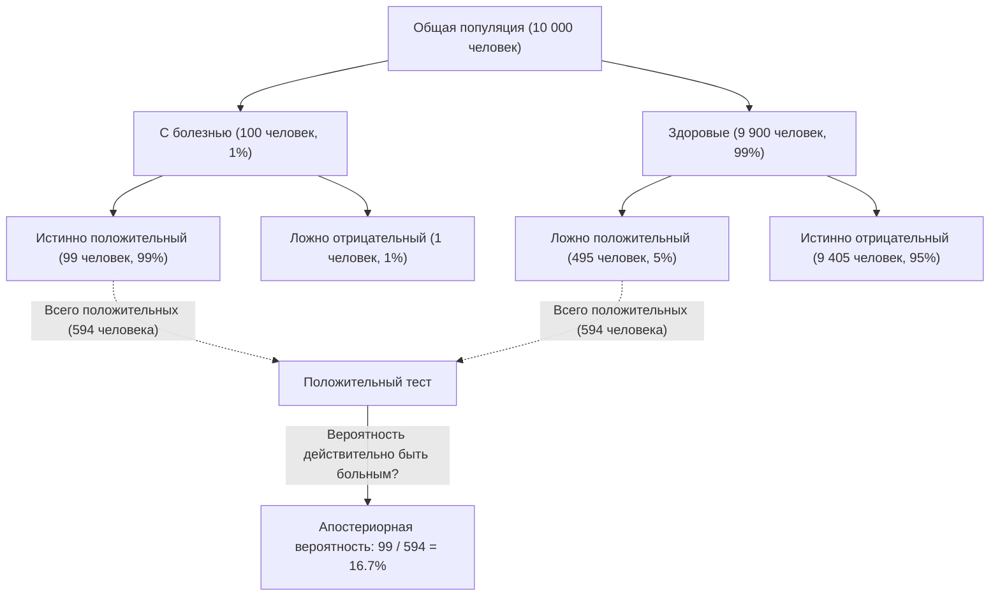
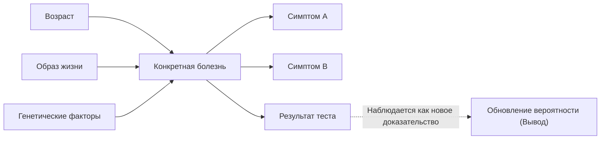

## Введение: «Обновление убеждений» в неопределенном мире

Мир, в котором мы живем, полон неопределенности. От вероятности того, что завтра пойдет дождь, до вероятности того, что новое лекарство будет эффективным против конкретного заболевания, или вероятности того, что полученное электронное письмо является спамом — мы постоянно принимаем решения на основе неполной информации. Мощной структурой для математической обработки этой неопределенности и **обновления наших прогнозов каждый раз при получении новой информации (доказательств)** является теорема Байеса ([Bayes' Theorem](https://kenji.blog/p/bayes-theorem/)).

Открытая Томасом Байесом, английским священником и математиком 18-го века, эта теорема стала фундаментальной теорией, лежащей в основе современного ИИ (искусственного интеллекта) и машинного обучения. В этой статье мы подробно рассмотрим все: от базовой математики теоремы Байеса до парадоксов вероятности, противоречащих интуиции, и того, как она применяется в современных технологиях.

## Математическая формулировка теоремы Байеса

[Теорема Байеса](https://kenji.blog/p/bayes-theorem/) — это теорема, используемая для расчета вероятности $P(A|B)$ события $A$ при условии, что произошло событие $B$, на основе обратной условной вероятности $P(B|A)$ и других факторов. Хотя формула чрезвычайно проста, ее последствия весьма глубоки.

$$
P(A|B) = \frac{P(B|A) \cdot P(A)}{P(B)}
$$

Каждому члену в этом уравнении дано специальное название с точки зрения статистического «обновления убеждений».

- **Априорная вероятность (Prior Probability)** $P(A)$ : Вероятность того, что событие $A$ произойдет, до рассмотрения нового доказательства $B$. Наше первоначальное убеждение.
- **Правдоподобие (Likelihood)** $P(B|A)$ : Вероятность наблюдения доказательства $B$ при условии, что событие $A$ истинно.
- **Маргинальное правдоподобие / Доказательство (Marginal Likelihood / Evidence)** $P(B)$ : Общая вероятность наблюдения доказательства $B$ независимо от того, истинно событие $A$ или ложно. Действует как константа нормализации.
- **Апостериорная вероятность (Posterior Probability)** $P(A|B)$ : Вероятность события $A$ после рассмотрения нового доказательства $B$. Наше обновленное убеждение.

Короче говоря, теорему Байеса можно описать как математическую формулировку процесса **обновления нашего убеждения до «апостериорной вероятности» путем умножения «априорной вероятности» на то, «насколько хорошо подходит новое доказательство (правдоподобие)»**.

## Отклонение от интуиции: парадокс «ложного срабатывания» (Пример медицинского теста)

Человеческая интуиция часто ошибается в расчетах вероятностей. В качестве классического примера для понимания силы теоремы Байеса давайте рассмотрим тестирование на заболевания (медицинский скрининг).

Предположим, существует редкое заболевание, и $1\%$ ($0.01$) от общей численности населения инфицировано этим заболеванием (это априорная вероятность $P(\text{Болезнь})$).
Тест для выявления этого заболевания очень точен: если человек с заболеванием проходит тест, он оценивается как «Положительно» с вероятностью $99\%$ (Доля истинно положительных результатов: Правдоподобие $P(\text{Положительно}|\text{Болезнь})$).
Однако у этого теста есть небольшой недостаток: даже если здоровый человек без заболевания проходит его, он ошибочно оценивается как «Положительно» с вероятностью $5\%$ (Доля ложноположительных результатов $P(\text{Положительно}|\text{Здоров})$).

Теперь предположим, что вы случайно проходите этот тест и получаете **«Положительный»** результат. Какова вероятность того, что вы действительно болеете этим заболеванием?

Многие люди склонны думать: «Поскольку тест точен на $99\%$, есть шанс $90\%$ или выше, что у меня есть это заболевание». Однако давайте рассчитаем это, используя теорему Байеса.

Мы хотим найти $P(\text{Болезнь}|\text{Положительно})$.

1. **Априорная вероятность** $P(\text{Болезнь}) = 0.01$
2. **Правдоподобие** $P(\text{Положительно}|\text{Болезнь}) = 0.99$
3. **Вероятность здорового человека** $P(\text{Здоров}) = 1 - 0.01 = 0.99$
4. **Вероятность ложного срабатывания** $P(\text{Положительно}|\text{Здоров}) = 0.05$

Сначала мы рассчитываем общую вероятность положительного результата теста $P(\text{Положительно})$ (Маргинальное правдоподобие). Это сумма вероятностей «положительного теста при болезни» и «положительного теста при здоровье».

$$
\begin{aligned}
P(\text{Положительно}) &= P(\text{Положительно}|\text{Болезнь}) \cdot P(\text{Болезнь}) + P(\text{Положительно}|\text{Здоров}) \cdot P(\text{Здоров}) \\
&= (0.99 \times 0.01) + (0.05 \times 0.99) \\
&= 0.0099 + 0.0495 \\
&= 0.0594
\end{aligned}
$$

Далее мы применяем теорему Байеса.

$$
\begin{aligned}
P(\text{Болезнь}|\text{Положительно}) &= \frac{P(\text{Положительно}|\text{Болезнь}) \cdot P(\text{Болезнь})}{P(\text{Положительно})} \\
&= \frac{0.0099}{0.0594} \\
&\approx 0.1667
\end{aligned}
$$

Удивительно, но даже при положительном результате теста **вероятность того, что у вас действительно есть заболевание, составляет всего около $16.7\%$**. Оставшиеся $83.3\%$ — это случаи «здоровых людей, ошибочно признанных положительными» (ложные срабатывания). Это связано с тем, что первоначальная распространенность заболевания ($1\%$) очень низка, из-за чего «ложноположительные результаты от большой здоровой популяции» в подавляющем большинстве превышают небольшое количество «действительно больных людей».

Таким образом, теорема Байеса математически исправляет ловушки, в которые легко попадает наша интуиция, и служит мощным инструментом для принятия спокойных суждений.

## Применение теоремы Байеса в ИИ и машинном обучении

[Теорема Байеса](https://kenji.blog/p/bayes-theorem/) выходит за рамки просто вероятностной головоломки; она играет решающую роль в современной науке о данных и искусственном интеллекте (ИИ). Это связано с тем, что сам процесс изучения паттернов на основе больших объемов данных и создания прогнозов на основе неизвестных данных можно сформулировать как «максимизацию апостериорной вероятности».

### 1. Наивный байесовский классификатор (Naive Bayes)

«Наивный байесовский классификатор», часто используемый для фильтрации спам-писем, является одним из самых прямых применений теоремы Байеса. Этот алгоритм рассматривает слова, содержащиеся в электронном письме (такие как «бесплатно», «победитель», «пароль»), в качестве доказательств (признаков) и рассчитывает апостериорную вероятность того, что электронное письмо является спамом.

Он называется «наивным», поскольку выдвигает сильное предположение, что каждый признак (слово) встречается независимо от других. На самом деле слова взаимосвязаны, но, несмотря на это упрощенное предположение, алгоритм Naive Bayes демонстрирует очень высокую точность и высокую скорость обработки в таких задачах, как классификация текста.

### 2. Байесовские сети

В системах, где несколько переменных сложным образом переплетены, байесовские сети выражают зависимости между переменными в виде графовой структуры (направленный ациклический граф) для выполнения рассуждений в условиях неопределенности.

Например, в ИИ медицинской диагностики моделируется вероятностное влияние «возраста пациента», «образа жизни» и «генетических факторов» на «конкретное заболевание», а затем связывается влияние этого заболевания на «появляющиеся симптомы». Каждый раз при вводе нового симптома (доказательства) вероятности во всей сети обновляются в соответствии с теоремой Байеса, выводя наиболее вероятное название заболевания. Это используется в самых разных областях, таких как оценка ситуации в беспилотных автомобилях и прогнозирование на финансовых рынках.

### 3. Байесовская оптимизация

При построении моделей машинного обучения задача поиска оптимальной комбинации гиперпараметров (параметров, которые должны быть заданы людьми, таких как скорость обучения или глубина сети) отнимает очень много времени. Перебирать все комбинации нереально.

В байесовской оптимизации связь между «настройками параметров» и «производительностью модели» выражается в виде вероятностной модели (например, гауссовского процесса). На основе прошлых настроек испытаний и результатов (доказательств) алгоритм выводит наиболее перспективную настройку параметров для последующего изучения. Это позволяет создавать высокопроизводительные модели ИИ с минимальным количеством испытаний.

### 4. Байесовское глубокое обучение (Bayesian Deep Learning)

Подходом, который в последнее время привлекает к себе внимание, является слияние глубокого обучения (Deep Learning) и байесовской статистики. Стандартная нейронная сеть выдает свой прогноз в виде одного детерминированного значения, но она не сообщает вам, «насколько она уверена».

В байесовском глубоком обучении веса сети рассматриваются не как фиксированные числа, а как «распределения вероятностей». Это позволяет ИИ выводить **«неопределенность (отсутствие уверенности)»** вместе со своими прогнозами. Например, медицинский ИИ может предупредить: «Существует 90% вероятность рака. Однако неопределенность самого этого прогноза очень высока, поэтому требуется подтверждение врача-человека». Это чрезвычайно важная технология для повышения безопасности и надежности ИИ.

## Философский взгляд: фреквентизм против байесианства

В истории статистики две основные школы мысли столкнулись по поводу вопроса «что такое вероятность». Это **Фреквентизм (Frequentism)** и **Байесианство (Bayesianism)** .

В фреквентизме вероятность определяется как «относительная частота, с которой происходит событие, когда одно и то же испытание повторяется бесконечно». Утверждение, что вероятность выпадения орла при подбрасывании монеты составляет $50\%$, означает, что при бесконечном подбрасывании ровно половина будет орлом. В этой позиции для самого события существует истинная фиксированная вероятность, не оставляющая наблюдателю возможности иметь «убеждение».

С другой стороны, в байесианстве вероятность рассматривается как **«степень убеждения наблюдателя (субъективная вероятность)»**. Вероятность дождя завтра в $70\%$ представляет собой «степень уверенности» метеорологического агентства, основанную на имеющихся метеорологических данных (доказательствах). Если наблюдаются новые данные (например, внезапное падение атмосферного давления), эта уверенность обновляется в соответствии с теоремой Байеса.

Фреквентизм доминировал на протяжении большей части 20-го века, но в современную эпоху, когда вычислительная мощность компьютеров резко возросла, гибкий и практичный подход байесианства был переоценен и стал одной из движущих сил бума ИИ.

## Заключение: продолжайте учиться и обновляться

[Теорема Байеса](https://kenji.blog/p/bayes-theorem/) обеспечивает своего рода основу для мышления, которая выходит за рамки простой математической формулы.

У всех нас есть «априорные вероятности (первоначальные убеждения)», основанные на прошлом опыте и предубеждениях. Это не обязательно плохо; это отправная точка для эффективного восприятия мира. Однако важно обладать **гибкостью для изящного обновления собственных убеждений (обновления до апостериорной вероятности), как в теореме Байеса, вместо того, чтобы закрывать глаза при столкновении с новыми фактами и доказательствами**.

Подобно тому, как ИИ становится умнее, потребляя данные, мы, люди, также должны использовать новую информацию в качестве доказательств и постоянно обновлять себя, достигая более точного понимания мира. Возможно, теорему Байеса можно назвать математическим представлением самой «сути интеллекта».
