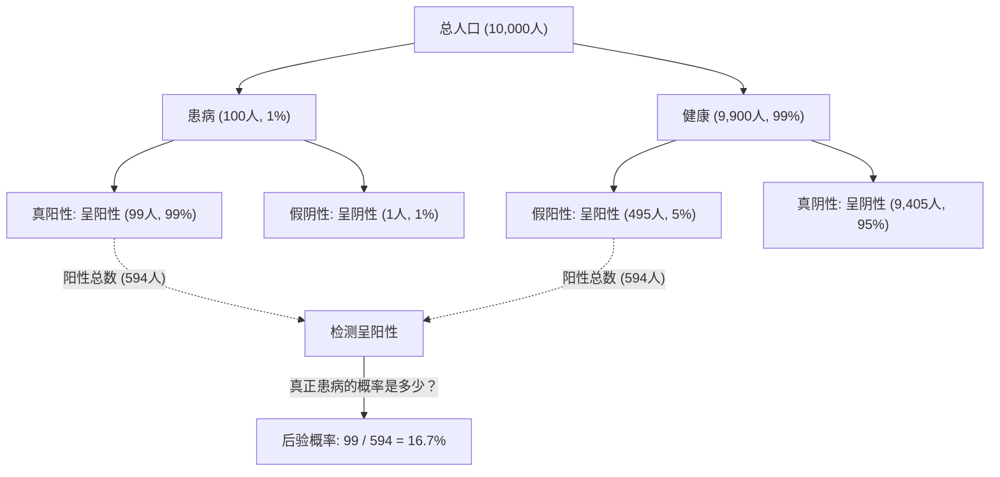
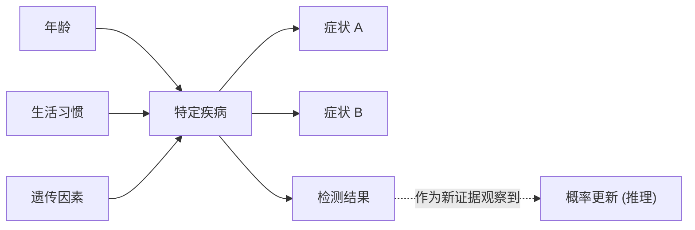

## 引言：在不确定的世界中“更新信念”

我们生活的世界充满了不确定性。明天是否会下雨、某种新药是否对特定疾病有效、或者收到的一封邮件是否是垃圾邮件，我们每天都在不完全的信息中做出判断。为了用数学方法处理这种不确定性，并 **在每次获得新信息（证据）时更新预测** ，一个强大的框架便是“[贝叶斯定理](https://kenji.blog/zh-cn/p/bayes-theorem/)（[Bayes' Theorem](https://kenji.blog/zh-cn/p/bayes-theorem/)）”。

由18世纪英国牧师兼数学家托马斯·贝叶斯（Thomas Bayes）发现的这一定理，已成为现代AI（人工智能）和机器学习的基石。在本文中，我们将深入探讨[贝叶斯定理](https://kenji.blog/zh-cn/p/bayes-theorem/)的基础数学原理，违背直觉的概率悖论，以及它在现代科技中的应用。

## [贝叶斯定理](https://kenji.blog/zh-cn/p/bayes-theorem/)的数学公式

[贝叶斯定理](https://kenji.blog/zh-cn/p/bayes-theorem/)是用于在事件 $B$ 已经发生的条件下，基于逆条件概率 $P(B|A)$ 等因素，计算事件 $A$ 的概率 $P(A|B)$ 的定理。虽然公式非常简单，但其蕴含的意义十分深远。

$$
P(A|B) = \frac{P(B|A) \cdot P(A)}{P(B)}
$$

从统计学“信念更新”的角度来看，该公式中的每一项都有一个特殊的名称。

- **先验概率 (Prior Probability)** $P(A)$ : 在考虑新证据 $B$ 之前，事件 $A$ 发生的概率。也就是我们最初的信念。
- **似然度 (Likelihood)** $P(B|A)$ : 在假设事件 $A$ 为真的情况下，观察到证据 $B$ 的概率。
- **边缘似然度 / 证据 (Marginal Likelihood / Evidence)** $P(B)$ : 无论事件 $A$ 是真是假，观察到证据 $B$ 的整体概率。它作为一个归一化常数。
- **后验概率 (Posterior Probability)** $P(A|B)$ : 在考虑了新证据 $B$ 之后，事件 $A$ 的概率。也就是我们更新后的信念。

简而言之，[贝叶斯定理](https://kenji.blog/zh-cn/p/bayes-theorem/)可以说是 **通过将“先验概率”乘以“新证据的适用程度（似然度）”，从而将信念更新为“后验概率”** 的过程的数学表达式。

## 直觉的偏差：“假阳性”的悖论（医疗检测的例子）

人类的直觉在概率计算中经常会犯错。作为理解[贝叶斯定理](https://kenji.blog/zh-cn/p/bayes-theorem/)强大之处的一个经典例子，让我们来考虑一下疾病检测（医疗筛查）。

假设有一种罕见疾病，总人口中有 $1\%$（$0.01$）的人患有此病（这就是先验概率 $P(\text{疾病})$）。
检测这种疾病的准确率非常高，如果患病的人接受检测，有 $99\%$ 的概率会被判定为“阳性”（真阳性率：似然度 $P(\text{阳性}|\text{疾病})$）。
然而，这种检测存在微小的缺陷，即使是没有患病的健康人接受检测，也有 $5\%$ 的概率会被误判为“阳性”（假阳性率 $P(\text{阳性}|\text{健康})$）。

现在，假设你随机接受了这项检测，并且结果呈 **“阳性”** 。你真正患有这种疾病的概率是多少呢？

许多人倾向于认为，“既然检测的准确率是 $99\%$，那么我患病的概率至少有 $90\%$ 以上。”但是，让我们用[贝叶斯定理](https://kenji.blog/zh-cn/p/bayes-theorem/)来计算一下。

我们需要求的是 $P(\text{疾病}|\text{阳性})$。

1. **先验概率** $P(\text{疾病}) = 0.01$
2. **似然度** $P(\text{阳性}|\text{疾病}) = 0.99$
3. **健康人的概率** $P(\text{健康}) = 1 - 0.01 = 0.99$
4. **假阳性概率** $P(\text{阳性}|\text{健康}) = 0.05$

首先，我们计算检测结果呈阳性的整体概率 $P(\text{阳性})$（边缘似然度）。这等于“患病且呈阳性的情况”加上“健康却呈阳性的情况”。

$$
\begin{aligned}
P(\text{阳性}) &= P(\text{阳性}|\text{疾病}) \cdot P(\text{疾病}) + P(\text{阳性}|\text{健康}) \cdot P(\text{健康}) \\
&= (0.99 \times 0.01) + (0.05 \times 0.99) \\
&= 0.0099 + 0.0495 \\
&= 0.0594
\end{aligned}
$$

接下来，应用[贝叶斯定理](https://kenji.blog/zh-cn/p/bayes-theorem/)。

$$
\begin{aligned}
P(\text{疾病}|\text{阳性}) &= \frac{P(\text{阳性}|\text{疾病}) \cdot P(\text{疾病})}{P(\text{阳性})} \\
&= \frac{0.0099}{0.0594} \\
&\approx 0.1667
\end{aligned}
$$

令人惊讶的是，即使检测结果呈阳性， **真正患病的概率也仅仅只有大约 $16.7\%$** 。剩下的 $83.3\%$ 是“虽然健康却被误判为阳性”的情况（假阳性）。这是因为这种疾病最初的患病率（$1\%$）非常低，导致“健康人群中产生的假阳性人数”以压倒性的优势多于少数“真正患病的人数”。

像这样，[贝叶斯定理](https://kenji.blog/zh-cn/p/bayes-theorem/)在数学上纠正了我们直觉容易陷入的陷阱，成为了我们做出冷静判断的强大工具。

## 在AI和机器学习中的应用

[贝叶斯定理](https://kenji.blog/zh-cn/p/bayes-theorem/)不仅仅是一个概率谜题，它在现代数据科学和人工智能（AI）领域中扮演着极其重要的角色。因为从大量数据中学习模式，并对未知数据进行预测的整个过程，本身就可以公式化为“最大化后验概率”。

### 1. 朴素贝叶斯分类器 (Naive Bayes Classifier)

常用于过滤垃圾邮件等的“朴素贝叶斯分类器”，是[贝叶斯定理](https://kenji.blog/zh-cn/p/bayes-theorem/)最直接的应用之一。该算法将邮件中包含的词语（如“免费”、“中奖”、“密码”等）作为证据（特征），计算该邮件是垃圾邮件的后验概率。

被称为“朴素（简单）”是因为它做了一个很强的假设：各个特征（词语）的出现是相互独立的。在现实中，词语之间是有关联的，但尽管有这个简单的假设，朴素贝叶斯在文本分类等任务中依然展现出极高的准确率和极快的处理速度。

### 2. 贝叶斯网络 (Bayesian Networks)

在多个变量复杂交织的系统中，利用图结构（有向无环图）来表示变量间的依赖关系，并进行不确定性推理的模型就是贝叶斯网络。

例如，在医疗诊断AI中，对从“患者年龄”、“生活习惯”、“遗传因素”到“特定疾病”的概率性影响进行建模，然后再将其与该疾病对“表现出的症状”的影响联系起来。每次输入新的症状（证据）时，整个网络的概率就会根据[贝叶斯定理](https://kenji.blog/zh-cn/p/bayes-theorem/)进行更新，从而推断出可能性最高的疾病名称。这项技术被广泛应用于自动驾驶汽车的状况判断、金融市场预测等众多领域。

### 3. 贝叶斯优化 (Bayesian Optimization)

在构建机器学习模型时，寻找超参数（需要人类设定的参数，如学习率、网络层数等）最佳组合的工作非常耗时。尝试所有组合是不现实的。

在贝叶斯优化中，将“参数设定值”和“模型性能”之间的关系用概率模型（如高斯过程）来表示。基于过去尝试的设定和结果（证据），推断出下一个最值得观察的参数设定。由此可以在最少的尝试次数内，构建出高性能的AI模型。

### 4. 贝叶斯深度学习 (Bayesian Deep Learning)

近年来备受瞩目的是将深度学习与贝叶斯统计融合的方法。普通的神经网络会将预测结果作为一个确定性的值输出，但它不会告诉你“它有多大把握”。

在贝叶斯深度学习中，网络的权重不再是固定的数值，而是作为“概率分布”来处理。因此，AI 能够连同预测结果一起输出 **“不确定性（缺乏自信）”** 。例如，医疗AI可以警告说：“有90%的概率是癌症。但是，这个预测本身的不确定性非常高，因此需要人类医生进行确认。”在提高AI的安全性和可靠性方面，这是一项至关重要的技术。

## 哲学视角：频率主义 vs 贝叶斯主义

在统计学的历史中，围绕“概率究竟是什么”的问题，存在着两大流派的激烈对抗。这就是 **频率主义（Frequentism）** 和 **贝叶斯主义（Bayesianism）** 。

在频率主义中，概率被定义为“当无限次重复同一试验时，该事件发生的相对频率”。投掷硬币正面朝上的概率是 $50\%$，意味着如果无限次投掷，正好有一半是正面。在这种立场下，事件本身存在一个真实固定的概率，观察者没有持有“信念”的余地。

另一方面，在贝叶斯主义中，概率被视为 **“观察者的信念程度（主观概率）”** 。明天下雨的概率是 $70\%$，代表了气象局基于现有的气象数据（证据）而得出的“确信程度”。如果观察到了新的数据（例如气压的突然下降），这种确信度就会根据[贝叶斯定理](https://kenji.blog/zh-cn/p/bayes-theorem/)进行更新。

在20世纪的大部分时间里，频率主义占据了主流地位。但在现代，随着计算机计算能力的飞跃式提升，灵活实用的贝叶斯主义方法得到了重新评估，成为了推动这波AI浪潮的动力之一。

## 结论：不断学习，持续更新

[贝叶斯定理](https://kenji.blog/zh-cn/p/bayes-theorem/)不仅仅是一个数学公式，它提供了一种超越公式本身的思维框架。

我们每个人都持有基于过往经验和偏见的“先验概率（最初的信念）”。这绝不是坏事，它是我们高效认知世界的起点。然而，重要的是 **当面对新的事实或证据时，不要回避，而是像[贝叶斯定理](https://kenji.blog/zh-cn/p/bayes-theorem/)一样灵活地更新自己的信念（更新为后验概率）的灵活性** 。

正如AI通过吞噬数据变得越来越聪明一样，我们人类也应该将新信息作为证据吸收，通过不断地自我更新，必将达到对这个世界更加精准的理解。也许，[贝叶斯定理](https://kenji.blog/zh-cn/p/bayes-theorem/)正是将这种“智慧的本质”用数学公式表达出来的杰作。
