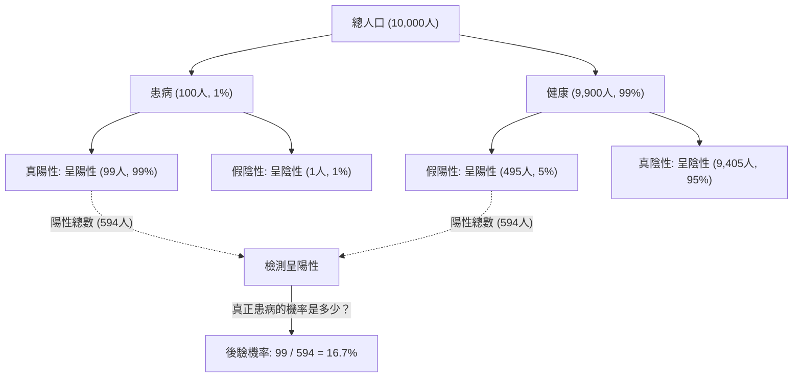
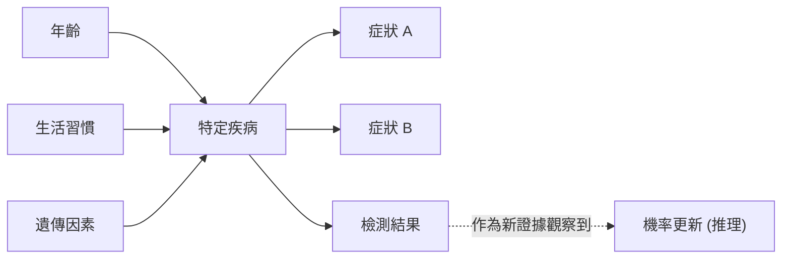

## 引言：在不確定的世界中「更新信念」

我們生活的世界充滿了不確定性。明天是否會下雨、某種新藥是否對特定疾病有效、或者收到的一封郵件是否是垃圾郵件，我們每天都在不完全的資訊中做出判斷。為了解決這類不確定性，並 **在每次獲得新資訊（證據）時更新預測** ，一個強大的數學框架便是「[貝氏定理](https://kenji.blog/zh-tw/p/bayes-theorem/)（[Bayes' Theorem](https://kenji.blog/zh-tw/p/bayes-theorem/)）」。

由18世紀英國牧師兼數學家湯瑪斯·貝葉斯（Thomas Bayes）所發現的這一定理，已成為現代AI（人工智慧）和機器學習的基石。在本文中，我們將深入探討[貝氏定理](https://kenji.blog/zh-tw/p/bayes-theorem/)的基礎數學原理，違背直覺的機率悖論，以及它在現代科技中的應用。

## [貝氏定理](https://kenji.blog/zh-tw/p/bayes-theorem/)的數學公式

[貝氏定理](https://kenji.blog/zh-tw/p/bayes-theorem/)是用於在事件 $B$ 已經發生的條件下，基於逆條件機率 $P(B|A)$ 等因素，計算事件 $A$ 的機率 $P(A|B)$ 的定理。雖然公式非常簡單，但其蘊含的意義十分深遠。

$$
P(A|B) = \frac{P(B|A) \cdot P(A)}{P(B)}
$$

從統計學「信念更新」的角度來看，該公式中的每一項都有一個特殊的名稱。

- **先驗機率 (Prior Probability)** $P(A)$ : 在考慮新證據 $B$ 之前，事件 $A$ 發生的機率。也就是我們最初的信念。
- **概似度 (Likelihood)** $P(B|A)$ : 在假設事件 $A$ 為真的情況下，觀察到證據 $B$ 的機率。
- **邊際概似度 / 證據 (Marginal Likelihood / Evidence)** $P(B)$ : 無論事件 $A$ 是真是假，觀察到證據 $B$ 的整體機率。它作為一個正規化常數。
- **後驗機率 (Posterior Probability)** $P(A|B)$ : 在考慮了新證據 $B$ 之後，事件 $A$ 的機率。也就是我們更新後的信念。

簡而言之，[貝氏定理](https://kenji.blog/zh-tw/p/bayes-theorem/)可以說是 **透過將「先驗機率」乘以「新證據的適用程度（概似度）」，從而將信念更新為「後驗機率」** 的過程的數學表達式。

## 直覺的偏差：「偽陽性」的悖論（醫療檢測的例子）

人類的直覺在機率計算中經常會犯錯。作為理解[貝氏定理](https://kenji.blog/zh-tw/p/bayes-theorem/)強大之處的一個經典例子，讓我們來考慮一下疾病檢測（醫療篩檢）。

假設有一種罕見疾病，總人口中有 $1\%$（$0.01$）的人患有此病（這就是先驗機率 $P(\text{疾病})$）。
檢測這種疾病的準確率非常高，如果患病的人接受檢測，有 $99\%$ 的機率會被判定為「陽性」（真陽性率：概似度 $P(\text{陽性}|\text{疾病})$）。
然而，這種檢測存在微小的缺陷，即使是沒有患病的健康人接受檢測，也有 $5\%$ 的機率會被誤判為「陽性」（偽陽性率 $P(\text{陽性}|\text{健康})$）。

現在，假設你隨機接受了這項檢測，並且結果呈 **「陽性」** 。你真正患有這種疾病的機率是多少呢？

許多人傾向於認為，「既然檢測的準確率是 $99\%$，那麼我患病的機率至少有 $90\%$ 以上。」但是，讓我們用[貝氏定理](https://kenji.blog/zh-tw/p/bayes-theorem/)來計算一下。

我們需要求的是 $P(\text{疾病}|\text{陽性})$。

1. **先驗機率** $P(\text{疾病}) = 0.01$
2. **概似度** $P(\text{陽性}|\text{疾病}) = 0.99$
3. **健康人的機率** $P(\text{健康}) = 1 - 0.01 = 0.99$
4. **偽陽性機率** $P(\text{陽性}|\text{健康}) = 0.05$

首先，我們計算檢測結果呈陽性的整體機率 $P(\text{陽性})$（邊際概似度）。這等於「患病且呈陽性的情況」加上「健康卻呈陽性的情況」。

$$
\begin{aligned}
P(\text{陽性}) &= P(\text{陽性}|\text{疾病}) \cdot P(\text{疾病}) + P(\text{陽性}|\text{健康}) \cdot P(\text{健康}) \\
&= (0.99 \times 0.01) + (0.05 \times 0.99) \\
&= 0.0099 + 0.0495 \\
&= 0.0594
\end{aligned}
$$

接下來，應用[貝氏定理](https://kenji.blog/zh-tw/p/bayes-theorem/)。

$$
\begin{aligned}
P(\text{疾病}|\text{陽性}) &= \frac{P(\text{陽性}|\text{疾病}) \cdot P(\text{疾病})}{P(\text{陽性})} \\
&= \frac{0.0099}{0.0594} \\
&\approx 0.1667
\end{aligned}
$$

令人驚訝的是，即使檢測結果呈陽性， **真正患病的機率也僅僅只有大約 $16.7\%$** 。剩下的 $83.3\%$ 是「雖然健康卻被誤判為陽性」的情況（偽陽性）。這是因為這種疾病最初的患病率（$1\%$）非常低，導致「健康人群中產生的偽陽性人數」以壓倒性的優勢多於少數「真正患病的人數」。

像這樣，[貝氏定理](https://kenji.blog/zh-tw/p/bayes-theorem/)在數學上糾正了我們直覺容易陷入的陷阱，成為了我們做出冷靜判斷的強大工具。

## 在AI和機器學習中的應用

[貝氏定理](https://kenji.blog/zh-tw/p/bayes-theorem/)不僅僅是一個機率謎題，它在現代資料科學和人工智慧（AI）領域中扮演著極其重要的角色。因為從大量資料中學習模式，並對未知資料進行預測的整個過程，本身就可以公式化為「最大化後驗機率」。

### 1. 樸素貝葉斯分類器 (Naive Bayes Classifier)

常用於過濾垃圾郵件等的「樸素貝葉斯分類器」，是[貝氏定理](https://kenji.blog/zh-tw/p/bayes-theorem/)最直接的應用之一。該演算法將郵件中包含的詞語（如「免費」、「中獎」、「密碼」等）作為證據（特徵），計算該郵件是垃圾郵件的後驗機率。

被稱為「樸素（簡單）」是因為它做了一個很強的假設：各個特徵（詞語）的出現是相互獨立的。在現實中，詞語之間是有關聯的，但儘管有這個簡單的假設，樸素貝葉斯在文本分類等任務中依然展現出極高的準確率和極快的處理速度。

### 2. 貝葉斯網路 (Bayesian Networks)

在多個變數複雜交織的系統中，利用圖結構（有向無環圖）來表示變數間的依賴關係，並進行不確定性推理的模型就是貝葉斯網路。

例如，在醫療診斷AI中，對從「患者年齡」、「生活習慣」、「遺傳因素」到「特定疾病」的機率性影響進行建模，然後再將其與該疾病對「表現出的症狀」的影響聯繫起來。每次輸入新的症狀（證據）時，整個網路的機率就會根據[貝氏定理](https://kenji.blog/zh-tw/p/bayes-theorem/)進行更新，從而推斷出可能性最高的疾病名稱。這項技術被廣泛應用於自動駕駛汽車的狀況判斷、金融市場預測等眾多領域。

### 3. 貝葉斯最佳化 (Bayesian Optimization)

在構建機器學習模型時，尋找超參數（需要人類設定的參數，如學習率、網路層數等）最佳組合的工作非常耗時。嘗試所有組合是不現實的。

在貝葉斯最佳化中，將「參數設定值」和「模型性能」之間的關係用機率模型（如高斯過程）來表示。基於過去嘗試的設定和結果（證據），推斷出下一個最值得觀察的參數設定。由此可以在最少的嘗試次數內，構建出高性能的AI模型。

### 4. 貝葉斯深度學習 (Bayesian Deep Learning)

近年來備受矚目的是將深度學習與貝氏統計融合的方法。普通的類神經網路會將預測結果作為一個確定性的值輸出，但它不會告訴你「它有多大把握」。

在貝葉斯深度學習中，網路的權重不再是固定的數值，而是作為「機率分佈」來處理。因此，AI 能夠連同預測結果一起輸出 **「不確定性（缺乏自信）」** 。例如，醫療AI可以警告說：「有90%的機率是癌症。但是，這個預測本身的不確定性非常高，因此需要人類醫生進行確認。」在提高AI的安全性和可靠性方面，這是一項至關重要的技術。

## 哲學視角：頻率主義 vs 貝氏主義

在統計學的歷史中，圍繞「機率究竟是什麼」的問題，存在著兩大流派的激烈對抗。這就是 **頻率主義（Frequentism）** 和 **貝氏主義（Bayesianism）** 。

在頻率主義中，機率被定義為「當無限次重複同一試驗時，該事件發生的相對頻率」。投擲硬幣正面朝上的機率是 $50\%$，意味著如果無限次投擲，正好有一半是正面。在這種立場下，事件本身存在一個真實固定的機率，觀察者沒有持有「信念」的餘地。

另一方面，在貝氏主義中，機率被視為 **「觀察者的信念程度（主觀機率）」** 。明天下雨的機率是 $70\%$，代表了氣象局基於現有的氣象資料（證據）而得出的「確信程度」。如果觀察到了新的資料（例如氣壓的突然下降），這種確信度就會根據[貝氏定理](https://kenji.blog/zh-tw/p/bayes-theorem/)進行更新。

在20世紀的大部分時間裡，頻率主義佔據了主流地位。但在現代，隨著電腦計算能力的飛躍式提升，靈活實用的貝氏主義方法得到了重新評估，成為了推動這波AI浪潮的動力之一。

## 結論：不斷學習，持續更新

[貝氏定理](https://kenji.blog/zh-tw/p/bayes-theorem/)不僅僅是一個數學公式，它提供了一種超越公式本身的思維框架。

我們每個人都持有基於過往經驗和偏見的「先驗機率（最初的信念）」。這絕不是壞事，它是我們高效認知世界的起點。然而，重要的是 **當面對新的事實或證據時，不要迴避，而是像[貝氏定理](https://kenji.blog/zh-tw/p/bayes-theorem/)一樣靈活地更新自己的信念（更新為後驗機率）的靈活性** 。

正如AI透過吞噬資料變得越來越聰明一樣，我們人類也應該將新資訊作為證據吸收，透過不斷地自我更新，必將達到對這個世界更加精準的理解。也許，[貝氏定理](https://kenji.blog/zh-tw/p/bayes-theorem/)正是將這種「智慧的本質」用數學公式表達出來的傑作。
