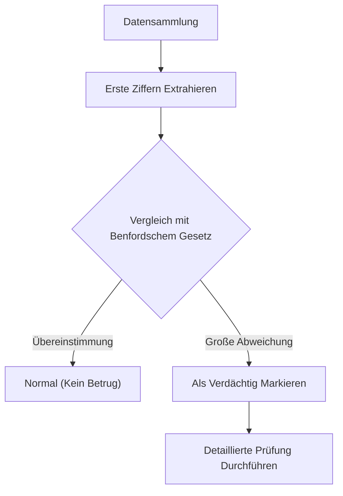

Haben Sie jemals auf die "erste Ziffer" (die signifikanteste Ziffer) verschiedener numerischer Daten in Ihrer Umgebung geachtet?

Wenn Sie beispielsweise die erste Ziffer verschiedener Daten in Natur und Gesellschaft extrahieren, wie etwa Einwohnerzahlen von Ländern oder Städten, Längen von Flüssen, Unternehmensumsätze oder physikalische Konstanten, werden Sie eine erstaunliche Tatsache feststellen: Sie treten nicht gleichmäßig von 1 bis 9 auf, sondern bestimmte Zahlen weisen eine starke Tendenz auf.

Die am häufigsten auftretende Zahl darunter ist die **"1"**. Überraschenderweise beginnen etwa 30 % aller Daten mit einer 1. Intuitiv könnten wir erwarten, dass die Zahlen 1 bis 9 jeweils in etwa 11,1 % der Fälle auftreten, aber so funktionieren reale Daten nicht.

Das mathematische Gesetz, das dieses mysteriöse Phänomen erklärt, ist das **Benfordsche Gesetz ([Benford's Law](https://kenji.blog/de/p/benfords-law/))**.

In diesem Artikel werden wir im Detail erklären, wie das Benfordsche Gesetz funktioniert, warum dieses Phänomen auftritt und wie dieses Gesetz zur Aufdeckung von Betrug angewendet wird.

## Was ist das Benfordsche Gesetz?

Das Benfordsche Gesetz (auch als Gesetz der ersten Ziffer bekannt) besagt, dass in vielen Sammlungen realer numerischer Daten die Wahrscheinlichkeit, dass die erste Ziffer (die signifikanteste Ziffer ungleich Null) auftritt, für kleinere Zahlen höher ist.

Genauer gesagt wird die Wahrscheinlichkeit $P(d)$, dass die erste Ziffer $d$ ($d \in \{1, 2, ..., 9\}$) ist, durch die folgende logarithmische Gleichung ausgedrückt:

$$ P(d) = \log_{10} \left( 1 + \frac{1}{d} \right) $$

Wenn diese Formel berechnet wird, ergibt sich die Wahrscheinlichkeit für das Auftreten jeder Zahl als erste Ziffer wie folgt:

- **1** : Ca. 30.1%
- **2** : Ca. 17.6%
- **3** : Ca. 12.5%
- **4** : Ca. 9.7%
- **5** : Ca. 7.9%
- **6** : Ca. 6.7%
- **7** : Ca. 5.8%
- **8** : Ca. 5.1%
- **9** : Ca. 4.6%

Zahlen, die mit 1 beginnen, sind überwältigend häufig, während Zahlen, die mit 9 beginnen, weniger als ein Sechstel so oft auftreten wie die 1.

### Geschichte der Entdeckung

Dieses Gesetz wurde 1881 erstmals von dem Astronomen Simon Newcomb bemerkt. Er entdeckte, dass die vorderen Seiten von Logarithmentafeln (Seiten, die mit 1 oder 2 beginnen) durch den Gebrauch viel abgenutzter und schmutziger waren als die hinteren Seiten.

Später, im Jahr 1938, analysierte der Physiker Frank Benford mehr als 20.000 verschiedene Datensätze (Flussoberflächen, physikalische Konstanten, Zeitschriftenadressen usw.) und bewies, dass dieses Phänomen universell ist.

## Warum ist "1" so häufig?

Warum tritt diese kontraintuitive Tendenz auf? Die intuitiven Erklärungen zum Verständnis dieses Grundes sind **Skaleninvarianz (Scale Invariance)** und **Gleichmäßigkeit auf einer logarithmischen Skala**.

### Skaleninvarianz

Wenn ein universelles Naturgesetz existiert, sollte sich das Gesetz selbst nicht ändern, selbst wenn die Maßeinheit geändert wird. Ob die Entfernung beispielsweise in Kilometern oder Meilen gemessen wird, die Wahrscheinlichkeitsverteilung der ersten Ziffer muss gleich sein. Mathematisch gesehen gelangt man, wenn man eine Wahrscheinlichkeitsverteilung sucht, die die Bedingung erfüllt, dass die Verteilung auch bei Multiplikation mit einer Konstanten (Skaleninvarianz) unverändert bleibt, unweigerlich zur logarithmischen Verteilung des Benfordschen Gesetzes.

### Logarithmische Skala und Wachstum

Viele Naturphänomene und Wirtschaftsdaten wachsen eher durch Multiplikation (Zinseszins) als durch Addition. Nehmen wir zum Beispiel an, der Umsatz eines Unternehmens wächst jedes Jahr um 10 %.

Es dauert etwa 7,3 Jahre, bis der Umsatz von 1 Million auf 2 Millionen wächst (der Zeitraum, in dem die erste Ziffer 1 ist). Es dauert jedoch nur 1,9 Jahre, bis der Umsatz von 5 Millionen auf 6 Millionen wächst (der Zeitraum, in dem die erste Ziffer 5 ist). Darüber hinaus dauert es nur 1,1 Jahre, um von 9 Millionen auf 10 Millionen zu wachsen (der Zeitraum, in dem die erste Ziffer 9 ist).

Sobald 10 Millionen erreicht sind, kehrt die erste Ziffer zu 1 zurück, und es wird lange dauern, bis sie 20 Millionen erreicht. Mit anderen Worten: Bei exponentiell wachsenden Daten ist der Zeitraum, in dem die erste Ziffer eine kleine Zahl ist, weitaus länger.

$$ \text{Verweilzeit} \propto \log_{10}(d+1) - \log_{10}(d) $$

## Auf welche Art von Daten ist es anwendbar?

Das Benfordsche Gesetz kann nicht auf alle Daten angewendet werden. Es gibt einen klaren Unterschied zwischen Daten, auf die es zutrifft, und solchen, auf die es nicht zutrifft.

### Beispiele für anwendbare Daten
- **Weit verteilte Daten**: Daten, die sich über mehrere Größenordnungen erstrecken (z. B. Daten, die von 10 bis 1.000.000 verteilt sind).
- **Natürlich generierte Daten**: Flusslängen, Seeflächen, physikalische Konstanten, Molekularmassen usw.
- **Vom Menschen beeinflusste Daten**: Aktienkurse, Unternehmensumsätze, Steuererklärungen, Bevölkerungszahlen usw.

### Beispiele für nicht anwendbare Daten
- **Künstlich zugewiesene Nummern**: Telefonnummern, Postleitzahlen, Sozialversicherungsnummern usw.
- **Daten mit begrenztem Bereich**: Menschliche Körpergröße (die meisten fallen zwischen 100 cm und 200 cm, sodass Zahlen, die mit 1 beginnen, die überwältigende Mehrheit ausmachen).
- **Normalverteilte Daten**: Daten, die sich um einen Durchschnitt konzentrieren, wie Testergebnisse oder IQ.

## Anwendung bei der Betrugserkennung

Derzeit ist eines der Felder, in denen das Benfordsche Gesetz am praktischsten eingesetzt wird, die **Betrugserkennung (Fraud Detection)**.

Wenn Menschen versuchen, Zahlen willkürlich zu fabrizieren oder zu manipulieren, um Daten zu erstellen, versuchen sie unbewusst, jede Zahl gleichmäßig zu verwenden oder bestimmte Zahlen zu vermeiden. Da natürliche Daten jedoch dem Benfordschen Gesetz folgen, weichen fingierte Daten erheblich von diesem Gesetz ab.

### Einsatz in Wirtschaftsprüfungen

Steuerbehörden und Wirtschaftsprüfungsgesellschaften scannen Unternehmensbücher und Spesenabrechnungen, um automatisch zu prüfen, ob die erste Ziffer (oder die zweite Ziffer) der Zahlen dem Benfordschen Gesetz folgt.

Wenn eine große Menge "fiktiver Ausgaben" aufgebläht wird, wird die Verteilung dieser Beträge unnatürlich und weicht von der Kurve des Benfordschen Gesetzes ab. Diese Methode ist unglaublich leistungsstark, und tatsächlich wurden viele Veruntreuungsfälle und Buchhaltungsbetrügereien durch dieses Gesetz aufgedeckt.

### Vorwürfe des Wahlbetrugs

Auch bei Daten zur Stimmenauszählung bei Wahlen wird die Frage, ob die aggregierten Ergebnisse der einzelnen Wahllokale dem Benfordschen Gesetz folgen, manchmal als Indikator zur Überprüfung von Wahlbetrug herangezogen (bei Wahldaten ist dies jedoch je nach Größe der Wahlbezirke manchmal schwer anwendbar, was Gegenstand von Debatten ist).

## Fazit

Das **Benfordsche Gesetz** ist eine der wunderschönen mathematischen Ordnungen, die in einer scheinbar chaotischen Welt verborgen sind.

Unsere Intuition neigt zu der Annahme, dass "Zahlen gleichmäßig vorkommen", aber in der Realität hat die "1" eine überwältigende Präsenz. Die Kenntnis dieses Gesetzes könnte Ihre Sichtweise auf die Daten, die Sie in den Nachrichten, in Unternehmensabschlüssen und sogar in den Weiten der Natur sehen, ein wenig verändern.

Wenn Sie das nächste Mal die Gelegenheit haben, große Datenmengen zu verarbeiten, versuchen Sie, die "ersten Ziffern" zu tabellieren. Sicherlich wird sich dort das schöne Gesetz abzeichnen, das von einer logarithmischen Kurve gezeichnet wird.
