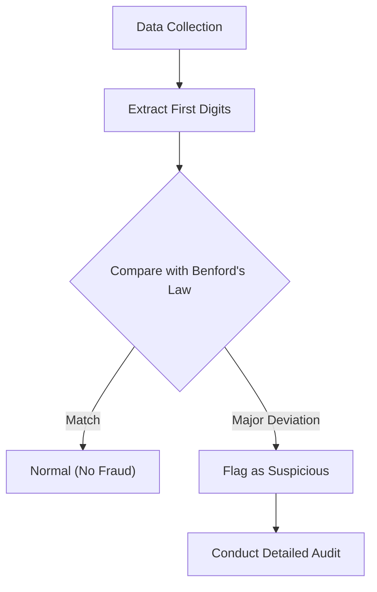

Have you ever paid attention to the "first digit" (the most significant digit) of various numerical data around you?

For example, if you take the first digit of diverse data in nature and society, such as populations of countries or cities, lengths of rivers, company revenues, or physical constants, you will find an astonishing fact: they do not appear evenly from 1 to 9, but rather specific numbers appear with a strong bias.

The most frequently appearing number among them is **"1"**. Surprisingly, about 30% of all data starts with 1. Intuitively, we might expect the numbers 1 through 9 to each appear about 11.1% of the time, but real-world data doesn't work that way.

The mathematical law that explains this mysterious phenomenon is **[Benford's Law](https://kenji.blog/en/p/benfords-law/)**.

In this article, we will thoroughly explain how [Benford's Law](https://kenji.blog/en/p/benfords-law/) works, why this phenomenon occurs, and how this law is applied to detect fraud.

## What is [Benford's Law](https://kenji.blog/en/p/benfords-law/)?

[Benford's Law](https://kenji.blog/en/p/benfords-law/) (also known as the First-Digit Law) states that in many collections of real-life numerical data, the probability of the first digit (the most significant non-zero digit) appearing is higher for smaller numbers.

Specifically, the probability $P(d)$ that the first digit is $d$ ($d \in \{1, 2, ..., 9\}$) is expressed by the following logarithmic equation:

$$ P(d) = \log_{10} \left( 1 + \frac{1}{d} \right) $$

When this formula is calculated, the probability of each number appearing as the first digit is as follows:

- **1** : Approx. 30.1%
- **2** : Approx. 17.6%
- **3** : Approx. 12.5%
- **4** : Approx. 9.7%
- **5** : Approx. 7.9%
- **6** : Approx. 6.7%
- **7** : Approx. 5.8%
- **8** : Approx. 5.1%
- **9** : Approx. 4.6%

Numbers starting with 1 are overwhelmingly common, while numbers starting with 9 appear less than one-sixth as often as 1.

### History of Discovery

This law was first noticed in 1881 by the astronomer Simon Newcomb. He discovered that the earlier pages of logarithm tables (pages starting with 1 or 2) were much more worn and dirty from use than the later pages.

Later, in 1938, physicist Frank Benford analyzed more than 20,000 diverse datasets (surface areas of rivers, physical constants, magazine addresses, etc.) and proved that this phenomenon is universal.

## Why is "1" So Common?

Why does this counter-intuitive bias occur? The intuitive explanations for understanding this reason are **Scale Invariance** and **Uniformity on a Logarithmic Scale**.

### Scale Invariance

If a universal natural law exists, the law itself should not change even if the unit of measurement is changed. For example, whether distance is measured in kilometers or miles, the probability distribution of the first digit must be the same. Mathematically, when seeking a probability distribution that satisfies the condition that the distribution remains unchanged even when multiplied by a constant (scale invariance), one inevitably arrives at the logarithmic distribution of [Benford's Law](https://kenji.blog/en/p/benfords-law/).

### Logarithmic Scale and Growth

Many natural phenomena and economic data grow by multiplication (compound interest) rather than addition. For example, suppose a company's revenue grows by 10% every year.

It takes about 7.3 years for revenue to grow from 1 million to 2 million (the period when the first digit is 1). However, it takes only 1.9 years for revenue to grow from 5 million to 6 million (the period when the first digit is 5). Furthermore, it takes only 1.1 years to grow from 9 million to 10 million (the period when the first digit is 9).

Once it reaches 10 million, the first digit returns to 1, and it will spend a long time until it reaches 20 million. In other words, in exponentially growing data, the period during which the first digit is a small number is overwhelmingly longer.

$$ \text{Duration} \propto \log_{10}(d+1) - \log_{10}(d) $$

## What Kind of Data Does it Apply To?

[Benford's Law](https://kenji.blog/en/p/benfords-law/) cannot be applied to all data. There is a clear difference between data it applies to and data it doesn't.

### Examples of Applicable Data
- **Widely distributed data**: Data spanning multiple orders of magnitude (e.g., data distributed from 10 to 1,000,000).
- **Naturally generated data**: River lengths, lake areas, physical constants, molecular masses, etc.
- **Human-related data**: Stock prices, company revenues, tax returns, populations, etc.

### Examples of Inapplicable Data
- **Artificially assigned numbers**: Phone numbers, zip codes, social security numbers, etc.
- **Data with a limited range**: Human height (most fall between 100cm and 200cm, making numbers starting with 1 the overwhelming majority).
- **Normally distributed data**: Data concentrated around an average, such as test scores or IQ.

## Application in Fraud Detection

Currently, one of the fields where [Benford's Law](https://kenji.blog/en/p/benfords-law/) is used most practically is **Fraud Detection**.

When humans try to randomly fabricate or manipulate numbers to create data, they unconsciously try to use each number equally or avoid certain numbers. However, because natural data follows [Benford's Law](https://kenji.blog/en/p/benfords-law/), fabricated data will deviate significantly from this law.

### Use in Accounting Audits

Tax authorities and accounting audit firms scan corporate ledgers and expense reports to automatically check whether the first digit (or the second digit) of the numbers follows [Benford's Law](https://kenji.blog/en/p/benfords-law/).

If a large amount of "fictitious expenses" are inflated, the distribution of those amounts will become unnatural and pop out from the [Benford's Law](https://kenji.blog/en/p/benfords-law/) curve. This method is incredibly powerful, and in fact, many embezzlement cases and accounting frauds have been uncovered triggered by this law.

### Election Fraud Allegations

Also, in election vote count data, whether the aggregated results of each polling station follow [Benford's Law](https://kenji.blog/en/p/benfords-law/) is sometimes used as an indicator to verify election fraud (however, in the case of election data, it is sometimes difficult to apply depending on the size of the districts, which is a subject of debate).

## Conclusion

**[Benford's Law](https://kenji.blog/en/p/benfords-law/)** is one of the beautiful mathematical orders hidden in a seemingly chaotic world.

Our intuition tends to think that "numbers appear equally," but in reality, "1" has an overwhelming presence. Knowing this law might slightly change how you look at the data you see in the news, corporate financial statements, and even the expansiveness of the natural world.

Next time you have the opportunity to handle a large amount of data, try tabulating the "first digits." Surely, the beautiful law drawn by a logarithmic curve will emerge there.
