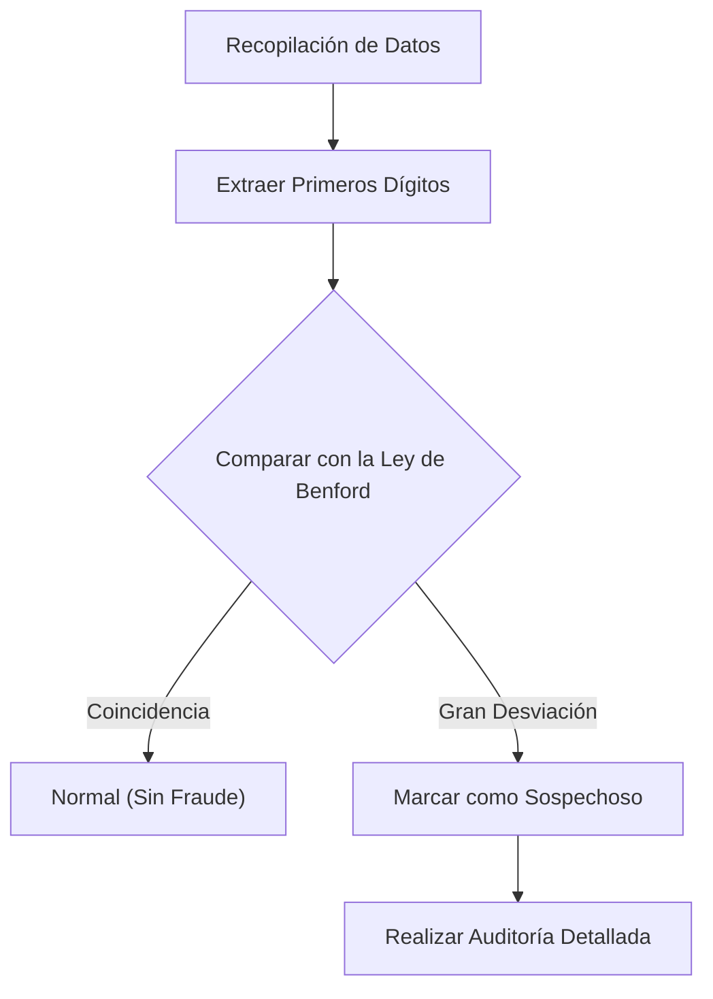

¿Alguna vez ha prestado atención al "primer dígito" (el dígito más significativo) de los diversos datos numéricos que le rodean?

Por ejemplo, si se extrae el primer dígito de diversos datos de la naturaleza y la sociedad, como la población de países o ciudades, la longitud de los ríos, los ingresos de las empresas o las constantes físicas, se descubre un hecho asombroso: no aparecen de manera uniforme del 1 al 9, sino que ciertos números aparecen con un fuerte sesgo.

El número que aparece con mayor frecuencia entre ellos es el **"1"**. Sorprendentemente, cerca del 30% de todos los datos comienzan con 1. Intuitivamente, podríamos esperar que los números del 1 al 9 aparezcan cada uno alrededor del 11,1% de las veces, pero los datos del mundo real no funcionan así.

La ley matemática que explica este misterioso fenómeno es la **[Ley de Benford](https://kenji.blog/p/benfords-law/) ([Benford's Law](https://kenji.blog/p/benfords-law/))**.

En este artículo, explicaremos en detalle cómo funciona la [Ley de Benford](https://kenji.blog/p/benfords-law/), por qué ocurre este fenómeno y cómo se aplica esta ley para detectar fraudes.

## ¿Qué es la [Ley de Benford](https://kenji.blog/p/benfords-law/)?

La [Ley de Benford](https://kenji.blog/p/benfords-law/) (también conocida como la ley del primer dígito) establece que en muchas colecciones de datos numéricos de la vida real, la probabilidad de que aparezca el primer dígito (el dígito distinto de cero más significativo) es mayor para los números más pequeños.

Específicamente, la probabilidad $P(d)$ de que el primer dígito sea $d$ ($d \in \{1, 2, ..., 9\}$) se expresa mediante la siguiente ecuación logarítmica:

$$ P(d) = \log_{10} \left( 1 + \frac{1}{d} \right) $$

Al calcular esta fórmula, la probabilidad de que cada número aparezca como el primer dígito es la siguiente:

- **1** : Aprox. 30.1%
- **2** : Aprox. 17.6%
- **3** : Aprox. 12.5%
- **4** : Aprox. 9.7%
- **5** : Aprox. 7.9%
- **6** : Aprox. 6.7%
- **7** : Aprox. 5.8%
- **8** : Aprox. 5.1%
- **9** : Aprox. 4.6%

Los números que comienzan con 1 son abrumadoramente comunes, mientras que los números que comienzan con 9 aparecen menos de una sexta parte que los del 1.

### Historia del Descubrimiento

Esta ley fue advertida por primera vez en 1881 por el astrónomo Simon Newcomb. Descubrió que las primeras páginas de las tablas de logaritmos (las páginas que comenzaban con 1 o 2) estaban mucho más desgastadas y sucias por el uso que las páginas posteriores.

Más tarde, en 1938, el físico Frank Benford analizó más de 20.000 conjuntos de datos diversos (áreas de ríos, constantes físicas, direcciones de revistas, etc.) y demostró que este fenómeno es universal.

## ¿Por qué el "1" es tan común?

¿Por qué se produce este sesgo contrario a la intuición? Las explicaciones intuitivas para comprender esta razón son la **Invarianza de Escala (Scale Invariance)** y la **Uniformidad en una Escala Logarítmica**.

### Invarianza de Escala

Si existe una ley natural universal, la ley misma no debería cambiar incluso si se cambia la unidad de medida. Por ejemplo, ya sea que la distancia se mida en kilómetros o millas, la probabilidad de distribución del primer dígito debe ser la misma. Matemáticamente, cuando se busca una distribución de probabilidad que satisfaga la condición de que la distribución permanezca sin cambios incluso cuando se multiplica por una constante (invarianza de escala), se llega inevitablemente a la distribución logarítmica de la [Ley de Benford](https://kenji.blog/p/benfords-law/).

### Escala Logarítmica y Crecimiento

Muchos fenómenos naturales y datos económicos crecen mediante la multiplicación (interés compuesto) en lugar de la suma. Por ejemplo, supongamos que los ingresos de una empresa crecen un 10% cada año.

Se necesitan unos 7,3 años para que los ingresos crezcan de 1 millón a 2 millones (el período en que el primer dígito es 1). Sin embargo, solo se necesitan 1,9 años para que los ingresos crezcan de 5 millones a 6 millones (el período en que el primer dígito es 5). Además, solo se necesita 1,1 años para crecer de 9 millones a 10 millones (el período en que el primer dígito es 9).

Una vez que alcanza los 10 millones, el primer dígito vuelve al 1 y pasará mucho tiempo hasta que alcance los 20 millones. En otras palabras, en los datos que crecen exponencialmente, el período durante el cual el primer dígito es un número pequeño es abrumadoramente más largo.

$$ \text{Tiempo de permanencia} \propto \log_{10}(d+1) - \log_{10}(d) $$

## ¿A qué tipo de datos se aplica?

La [Ley de Benford](https://kenji.blog/p/benfords-law/) no se puede aplicar a todos los datos. Existe una clara diferencia entre los datos a los que se aplica y los que no.

### Ejemplos de datos aplicables
- **Datos de amplia distribución**: Datos que abarcan múltiples órdenes de magnitud (ej: datos distribuidos de 10 a 1.000.000).
- **Datos generados naturalmente**: Longitud de los ríos, área de los lagos, constantes físicas, masa molecular, etc.
- **Datos relacionados con humanos**: Precios de acciones, ingresos de empresas, declaraciones de impuestos, poblaciones, etc.

### Ejemplos de datos inaplicables
- **Números asignados artificialmente**: Números de teléfono, códigos postales, números de seguro social, etc.
- **Datos con un rango limitado**: Altura humana (la mayoría cae entre 100 cm y 200 cm, lo que hace que los números que comienzan con 1 sean la abrumadora mayoría).
- **Datos con distribución normal**: Datos concentrados alrededor de un promedio, como las calificaciones de los exámenes o el coeficiente intelectual.

## Aplicación en la Detección de Fraude

Actualmente, uno de los campos en los que la [Ley de Benford](https://kenji.blog/p/benfords-law/) se utiliza de forma más práctica es la **Detección de Fraude (Fraud Detection)**.

Cuando los humanos intentan inventar o manipular números al azar para crear datos, inconscientemente intentan usar cada número por igual o evitar ciertos números. Sin embargo, dado que los datos naturales siguen la [Ley de Benford](https://kenji.blog/p/benfords-law/), los datos inventados se desviarán significativamente de esta ley.

### Uso en Auditorías Contables

Las autoridades fiscales y las empresas de auditoría contable escanean los libros de contabilidad y los informes de gastos de las empresas para verificar automáticamente si el primer dígito (o el segundo dígito) de los números sigue la [Ley de Benford](https://kenji.blog/p/benfords-law/).

Si se infla una gran cantidad de "gastos ficticios", la distribución de esas cantidades se volverá antinatural y sobresaldrá de la curva de la [Ley de Benford](https://kenji.blog/p/benfords-law/). Este método es increíblemente poderoso y, de hecho, muchos casos de malversación de fondos y fraudes contables han sido descubiertos a partir de esta ley.

### Alegaciones de Fraude Electoral

Además, en los datos del recuento de votos electorales, si los resultados agregados de cada colegio electoral siguen la [Ley de Benford](https://kenji.blog/p/benfords-law/) a veces se utiliza como indicador para verificar el fraude electoral (sin embargo, en el caso de los datos electorales, a veces es difícil de aplicar dependiendo del tamaño de los distritos, lo que es tema de debate).

## Conclusión

La **[Ley de Benford](https://kenji.blog/p/benfords-law/)** es uno de los hermosos órdenes matemáticos ocultos en un mundo aparentemente caótico.

Nuestra intuición tiende a pensar que "los números aparecen por igual", pero en realidad, el "1" tiene una presencia abrumadora. Conocer esta ley podría cambiar un poco la forma de ver los datos que ve en las noticias, los estados financieros de las empresas e incluso la expansión del mundo natural.

La próxima vez que tenga la oportunidad de manejar una gran cantidad de datos, intente tabular los "primeros dígitos". Seguramente, emergerá allí la hermosa ley dibujada por una curva logarítmica.
