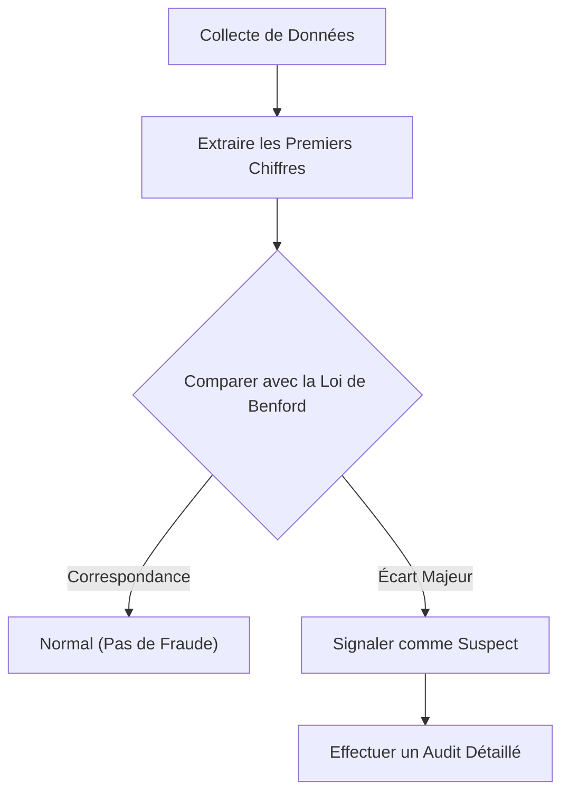

Avez-vous déjà prêté attention au « premier chiffre » (le chiffre le plus significatif) de diverses données numériques autour de vous ?

Par exemple, si vous extrayez le premier chiffre de diverses données dans la nature et la société, telles que la population des pays ou des villes, la longueur des fleuves, les revenus des entreprises ou les constantes physiques, vous découvrirez un fait étonnant : ils n'apparaissent pas de manière uniforme de 1 à 9, mais plutôt, certains nombres apparaissent avec un fort biais.

Le chiffre qui apparaît le plus fréquemment parmi eux est le **« 1 »**. Étonnamment, près de 30 % de toutes les données commencent par 1. Intuitivement, nous pourrions nous attendre à ce que les chiffres de 1 à 9 apparaissent chacun environ 11,1 % du temps, mais les données du monde réel ne fonctionnent pas ainsi.

La loi mathématique qui explique ce phénomène mystérieux est la **[Loi de Benford](https://kenji.blog/fr/p/benfords-law/) ([Benford's Law](https://kenji.blog/fr/p/benfords-law/))**.

Dans cet article, nous expliquerons en détail le fonctionnement de la loi de Benford, pourquoi ce phénomène se produit, et comment cette loi est appliquée pour détecter la fraude.

## Qu'est-ce que la loi de Benford ?

La loi de Benford (également connue sous le nom de loi du premier chiffre) stipule que dans de nombreuses collections de données numériques de la vie réelle, la probabilité d'apparition du premier chiffre (le chiffre non nul le plus significatif) est plus élevée pour les petits nombres.

Plus précisément, la probabilité $P(d)$ que le premier chiffre soit $d$ ($d \in \{1, 2, ..., 9\}$) est exprimée par l'équation logarithmique suivante :

$$ P(d) = \log_{10} \left( 1 + \frac{1}{d} \right) $$

Lorsque cette formule est calculée, la probabilité que chaque nombre apparaisse comme le premier chiffre est la suivante :

- **1** : Env. 30.1%
- **2** : Env. 17.6%
- **3** : Env. 12.5%
- **4** : Env. 9.7%
- **5** : Env. 7.9%
- **6** : Env. 6.7%
- **7** : Env. 5.8%
- **8** : Env. 5.1%
- **9** : Env. 4.6%

Les nombres commençant par 1 sont extrêmement fréquents, tandis que les nombres commençant par 9 apparaissent moins d'un sixième de fois que le 1.

### Histoire de la découverte

Cette loi a été remarquée pour la première fois en 1881 par l'astronome Simon Newcomb. Il a découvert que les premières pages des tables de logarithmes (les pages commençant par 1 ou 2) étaient beaucoup plus usées et sales par l'utilisation que les pages ultérieures.

Plus tard, en 1938, le physicien Frank Benford a analysé plus de 20 000 ensembles de données divers (superficies de rivières, constantes physiques, adresses de magazines, etc.) et a prouvé que ce phénomène est universel.

## Pourquoi le « 1 » est-il si courant ?

Pourquoi ce biais contre-intuitif se produit-il ? Les explications intuitives pour comprendre cette raison sont **l'Invariance d'Échelle (Scale Invariance)** et **l'Uniformité sur une Échelle Logarithmique**.

### Invariance d'Échelle

S'il existe une loi naturelle universelle, la loi elle-même ne devrait pas changer même si l'unité de mesure est modifiée. Par exemple, que la distance soit mesurée en kilomètres ou en miles, la probabilité de distribution du premier chiffre doit être la même. Mathématiquement, lorsqu'on recherche une distribution de probabilité qui satisfait la condition que la distribution reste inchangée même lorsqu'elle est multipliée par une constante (invariance d'échelle), on arrive inévitablement à la distribution logarithmique de la loi de Benford.

### Échelle Logarithmique et Croissance

De nombreux phénomènes naturels et données économiques croissent par multiplication (intérêts composés) plutôt que par addition. Par exemple, supposons que les revenus d'une entreprise augmentent de 10 % chaque année.

Il faut environ 7,3 ans pour que les revenus passent de 1 million à 2 millions (la période où le premier chiffre est 1). Cependant, il ne faut que 1,9 an pour que les revenus passent de 5 millions à 6 millions (la période où le premier chiffre est 5). De plus, il ne faut que 1,1 an pour passer de 9 millions à 10 millions (la période où le premier chiffre est 9).

Une fois qu'il atteint 10 millions, le premier chiffre revient à 1, et il s'écoulera beaucoup de temps avant qu'il n'atteigne 20 millions. En d'autres termes, dans les données qui croissent de manière exponentielle, la période pendant laquelle le premier chiffre est un petit nombre est extrêmement plus longue.

$$ \text{Temps de séjour} \propto \log_{10}(d+1) - \log_{10}(d) $$

## À quel type de données s'applique-t-elle ?

La loi de Benford ne peut pas être appliquée à toutes les données. Il existe une différence claire entre les données auxquelles elle s'applique et celles auxquelles elle ne s'applique pas.

### Exemples de données applicables
- **Données largement distribuées**: Données couvrant plusieurs ordres de grandeur (ex : données distribuées de 10 à 1 000 000).
- **Données générées naturellement**: Longueur des rivières, superficie des lacs, constantes physiques, masse moléculaire, etc.
- **Données liées à l'homme**: Cours des actions, revenus des entreprises, déclarations de revenus, populations, etc.

### Exemples de données inapplicables
- **Numéros attribués artificiellement**: Numéros de téléphone, codes postaux, numéros de sécurité sociale, etc.
- **Données avec une plage limitée**: Taille humaine (la plupart se situent entre 100 cm et 200 cm, ce qui fait des nombres commençant par 1 la très grande majorité).
- **Données distribuées normalement**: Données concentrées autour d'une moyenne, comme les résultats de tests ou le QI.

## Application dans la Détection de Fraude

Actuellement, l'un des domaines où la loi de Benford est utilisée le plus concrètement est la **Détection de Fraude (Fraud Detection)**.

Lorsque les humains essaient de fabriquer ou de manipuler des chiffres au hasard pour créer des données, ils essaient inconsciemment d'utiliser chaque chiffre de manière égale ou d'éviter certains chiffres. Cependant, parce que les données naturelles suivent la loi de Benford, les données fabriquées s'écarteront considérablement de cette loi.

### Utilisation dans les Audits Comptables

Les autorités fiscales et les cabinets d'audit comptable scannent les registres et les rapports de dépenses des entreprises pour vérifier automatiquement si le premier chiffre (ou le deuxième chiffre) des nombres suit la loi de Benford.

Si une grande quantité de « dépenses fictives » est gonflée, la distribution de ces montants deviendra artificielle et ressortira de la courbe de la loi de Benford. Cette méthode est incroyablement puissante, et en fait, de nombreuses affaires de détournement de fonds et de fraude comptable ont été découvertes grâce à cette loi.

### Allégations de Fraude Électorale

De plus, dans les données de comptage des voix électorales, le fait que les résultats agrégés de chaque bureau de vote suivent la loi de Benford est parfois utilisé comme indicateur pour vérifier la fraude électorale (cependant, dans le cas des données électorales, il est parfois difficile de l'appliquer en fonction de la taille des districts, ce qui fait l'objet de débats).

## Conclusion

La **[Loi de Benford](https://kenji.blog/fr/p/benfords-law/)** est l'un des magnifiques ordres mathématiques cachés dans un monde apparemment chaotique.

Notre intuition a tendance à penser que « les nombres apparaissent de manière égale », mais en réalité, le « 1 » a une présence écrasante. Connaître cette loi pourrait changer légèrement votre façon de voir les données que vous voyez aux informations, les états financiers des entreprises, et même l'étendue du monde naturel.

La prochaine fois que vous aurez l'occasion de manipuler une grande quantité de données, essayez de totaliser les « premiers chiffres ». À coup sûr, la belle loi dessinée par une courbe logarithmique y apparaîtra.
