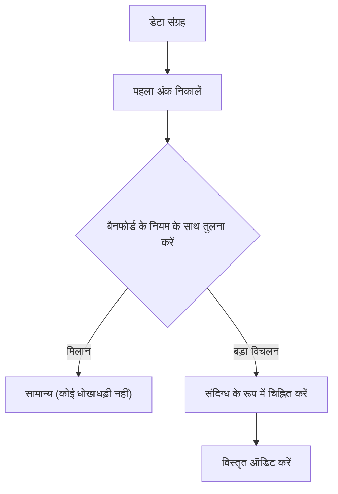

क्या आपने कभी अपने आस-पास के विभिन्न संख्यात्मक डेटा के "पहले अंक" (सबसे महत्वपूर्ण अंक) पर ध्यान दिया है?

उदाहरण के लिए, यदि आप प्रकृति और समाज में विविध डेटा के पहले अंक को निकालते हैं, जैसे देशों या शहरों की जनसंख्या, नदियों की लंबाई, कंपनी का राजस्व, या भौतिक स्थिरांक, तो आप एक आश्चर्यजनक तथ्य पाएंगे: वे 1 से 9 तक समान रूप से प्रकट नहीं होते हैं, बल्कि कुछ विशिष्ट संख्याएँ एक मजबूत पूर्वाग्रह के साथ प्रकट होती हैं।

उनमें से सबसे अधिक बार आने वाली संख्या **"1"** है। आश्चर्यजनक रूप से, सभी डेटा का लगभग 30% हिस्सा 1 से शुरू होता है। सहज रूप से, हम उम्मीद कर सकते हैं कि 1 से 9 तक की संख्याएँ प्रत्येक लगभग 11.1% बार प्रकट होंगी, लेकिन वास्तविक दुनिया का डेटा इस तरह काम नहीं करता है।

इस रहस्यमय घटना की व्याख्या करने वाला गणितीय नियम **[बैनफोर्ड का नियम](https://kenji.blog/p/benfords-law/) ([Benford's Law](https://kenji.blog/p/benfords-law/))** है।

इस लेख में, हम विस्तार से बताएंगे कि [बैनफोर्ड का नियम](https://kenji.blog/p/benfords-law/) कैसे काम करता है, यह घटना क्यों होती है, और धोखाधड़ी का पता लगाने के लिए इस नियम को कैसे लागू किया जाता है।

## [बैनफोर्ड का नियम](https://kenji.blog/p/benfords-law/) क्या है?

[बैनफोर्ड का नियम](https://kenji.blog/p/benfords-law/) (जिसे पहले अंक का नियम भी कहा जाता है) बताता है कि वास्तविक जीवन के संख्यात्मक डेटा के कई संग्रहों में, पहले अंक (सबसे महत्वपूर्ण गैर-शून्य अंक) के प्रकट होने की संभावना छोटी संख्याओं के लिए अधिक होती है।

विशेष रूप से, यह संभावना $P(d)$ कि पहला अंक $d$ ($d \in \{1, 2, ..., 9\}$) है, निम्नलिखित लॉगरिदमिक समीकरण द्वारा व्यक्त की जाती है:

$$ P(d) = \log_{10} \left( 1 + \frac{1}{d} \right) $$

जब इस सूत्र की गणना की जाती है, तो पहले अंक के रूप में दिखाई देने वाली प्रत्येक संख्या की संभावना इस प्रकार है:

- **1** : लगभग 30.1%
- **2** : लगभग 17.6%
- **3** : लगभग 12.5%
- **4** : लगभग 9.7%
- **5** : लगभग 7.9%
- **6** : लगभग 6.7%
- **7** : लगभग 5.8%
- **8** : लगभग 5.1%
- **9** : लगभग 4.6%

1 से शुरू होने वाली संख्याएँ अत्यधिक आम हैं, जबकि 9 से शुरू होने वाली संख्याएँ 1 की तुलना में छठे हिस्से से भी कम बार दिखाई देती हैं।

### खोज का इतिहास

इस नियम पर सबसे पहले 1881 में खगोलशास्त्री साइमन न्यूकॉम्ब ने ध्यान दिया था। उन्होंने पाया कि लघुगणक तालिकाओं के पहले के पृष्ठ (1 या 2 से शुरू होने वाले पृष्ठ) बाद के पृष्ठों की तुलना में उपयोग से बहुत अधिक घिसे और गंदे थे।

बाद में, 1938 में, भौतिक विज्ञानी फ्रैंक बैनफोर्ड ने 20,000 से अधिक विविध डेटासेट (नदियों के सतही क्षेत्रफल, भौतिक स्थिरांक, पत्रिकाओं के पते आदि) का विश्लेषण किया और साबित किया कि यह घटना सार्वभौमिक है।

## "1" इतना आम क्यों है?

यह सहज ज्ञान के विपरीत पूर्वाग्रह क्यों होता है? इस कारण को समझने के लिए सहज ज्ञान युक्त स्पष्टीकरण **स्केल अपरिवर्तनीयता (Scale Invariance)** और **लॉगरिदमिक स्केल पर एकरूपता** हैं।

### स्केल अपरिवर्तनीयता

यदि कोई सार्वभौमिक प्राकृतिक नियम मौजूद है, तो माप की इकाई बदलने पर भी नियम स्वयं नहीं बदलना चाहिए। उदाहरण के लिए, चाहे दूरी किलोमीटर में मापी जाए या मील में, पहले अंक का संभाव्यता वितरण समान होना चाहिए। गणितीय रूप से, जब किसी ऐसे संभाव्यता वितरण की तलाश की जाती है जो इस शर्त को पूरा करता हो कि स्थिरांक से गुणा करने पर भी वितरण अपरिवर्तित रहता है (स्केल अपरिवर्तनीयता), तो कोई अनिवार्य रूप से बैनफोर्ड के नियम के लॉगरिदमिक वितरण तक पहुँच जाता है।

### लॉगरिदमिक स्केल और वृद्धि

कई प्राकृतिक घटनाएँ और आर्थिक डेटा जोड़ के बजाय गुणा (चक्रवृद्धि ब्याज) द्वारा बढ़ते हैं। उदाहरण के लिए, मान लीजिए कि किसी कंपनी का राजस्व हर साल 10% बढ़ता है।

राजस्व को 1 मिलियन से 2 मिलियन (वह अवधि जब पहला अंक 1 होता है) तक बढ़ने में लगभग 7.3 वर्ष लगते हैं। हालाँकि, राजस्व को 5 मिलियन से 6 मिलियन (वह अवधि जब पहला अंक 5 होता है) तक बढ़ने में केवल 1.9 वर्ष लगते हैं। इसके अलावा, 9 मिलियन से 10 मिलियन (वह अवधि जब पहला अंक 9 होता है) तक बढ़ने में केवल 1.1 वर्ष लगता है।

एक बार जब यह 10 मिलियन तक पहुंच जाता है, तो पहला अंक 1 पर वापस आ जाता है, और इसे 20 मिलियन तक पहुंचने में लंबा समय लगेगा। दूसरे शब्दों में, घातीय रूप से बढ़ने वाले डेटा में, वह अवधि जिसके दौरान पहला अंक एक छोटी संख्या है, अत्यधिक लंबी होती है।

$$ \text{ठहरने का समय} \propto \log_{10}(d+1) - \log_{10}(d) $$

## यह किस प्रकार के डेटा पर लागू होता है?

[बैनफोर्ड का नियम](https://kenji.blog/p/benfords-law/) सभी डेटा पर लागू नहीं किया जा सकता है। जिन डेटा पर यह लागू होता है और जिन पर यह लागू नहीं होता है, उनके बीच स्पष्ट अंतर है।

### लागू डेटा के उदाहरण
- **व्यापक रूप से वितरित डेटा**: डेटा जो परिमाण के कई क्रमों तक फैला हुआ है (उदाहरण के लिए: 10 से 1,000,000 तक वितरित डेटा)।
- **प्राकृतिक रूप से उत्पन्न डेटा**: नदियों की लंबाई, झीलों का क्षेत्रफल, भौतिक स्थिरांक, आणविक द्रव्यमान आदि।
- **मनुष्य से संबंधित डेटा**: स्टॉक की कीमतें, कंपनी का राजस्व, टैक्स रिटर्न, जनसंख्या आदि।

### गैर-लागू डेटा के उदाहरण
- **कृत्रिम रूप से निर्दिष्ट संख्याएँ**: फ़ोन नंबर, ज़िप कोड, सामाजिक सुरक्षा नंबर आदि।
- **सीमित सीमा वाले डेटा**: मानव ऊंचाई (अधिकांश 100 सेमी और 200 सेमी के बीच आते हैं, जिससे 1 से शुरू होने वाली संख्याएँ भारी बहुमत में होती हैं)।
- **सामान्य रूप से वितरित डेटा**: औसत के आसपास केंद्रित डेटा, जैसे परीक्षण स्कोर या आईक्यू।

## धोखाधड़ी का पता लगाने में अनुप्रयोग

वर्तमान में, उन क्षेत्रों में से एक जहां बैनफोर्ड के नियम का सबसे व्यावहारिक रूप से उपयोग किया जाता है, वह है **धोखाधड़ी का पता लगाना (Fraud Detection)**।

जब मनुष्य डेटा बनाने के लिए संख्याओं को यादृच्छिक रूप से गढ़ने या हेरफेर करने का प्रयास करते हैं, तो वे अनजाने में प्रत्येक संख्या का समान रूप से उपयोग करने या कुछ संख्याओं से बचने का प्रयास करते हैं। हालाँकि, चूँकि प्राकृतिक डेटा बैनफोर्ड के नियम का पालन करता है, गढ़ा हुआ डेटा इस नियम से काफी विचलित होगा।

### लेखा परीक्षा में उपयोग

कर अधिकारी और लेखा परीक्षा फर्में यह स्वचालित रूप से जांचने के लिए कॉर्पोरेट बहीखाते और व्यय रिपोर्ट स्कैन करती हैं कि क्या संख्याओं का पहला अंक (या दूसरा अंक) बैनफोर्ड के नियम का पालन करता है।

यदि बड़ी मात्रा में "फर्जी खर्च" बढ़ा-चढ़ाकर पेश किए जाते हैं, तो उन राशियों का वितरण अप्राकृतिक हो जाएगा और बैनफोर्ड के नियम वक्र से बाहर आ जाएगा। यह तरीका अविश्वसनीय रूप से शक्तिशाली है, और वास्तव में, इस नियम से प्रेरित होकर कई गबन के मामले और लेखांकन धोखाधड़ी का खुलासा हुआ है।

### चुनाव में धांधली के आरोप

इसके अलावा, चुनाव वोट गिनती डेटा में, प्रत्येक मतदान केंद्र के समग्र परिणाम बैनफोर्ड के नियम का पालन करते हैं या नहीं, इसका उपयोग कभी-कभी चुनाव धोखाधड़ी को सत्यापित करने के लिए एक संकेतक के रूप में किया जाता है (हालांकि, चुनाव डेटा के मामले में, जिलों के आकार के आधार पर इसे लागू करना कभी-कभी मुश्किल होता है, जो बहस का विषय है)।

## निष्कर्ष

**[बैनफोर्ड का नियम](https://kenji.blog/p/benfords-law/)** एक प्रतीत होने वाली अराजक दुनिया में छिपे सुंदर गणितीय आदेशों में से एक है।

हमारी अंतर्ज्ञान यह सोचने लगती है कि "संख्याएँ समान रूप से प्रकट होती हैं," लेकिन वास्तविकता में, "1" की भारी उपस्थिति है। इस नियम को जानने से आप समाचारों में दिखने वाले डेटा, कॉर्पोरेट वित्तीय विवरणों और यहां तक कि प्राकृतिक दुनिया के विस्तार को देखने के तरीके को थोड़ा बदल सकते हैं।

अगली बार जब आपके पास बड़ी मात्रा में डेटा को संभालने का अवसर हो, तो "पहले अंकों" को सारणीबद्ध करने का प्रयास करें। निश्चित रूप से, एक लॉगरिदमिक वक्र द्वारा खींचा गया सुंदर नियम वहां उभरेगा।
