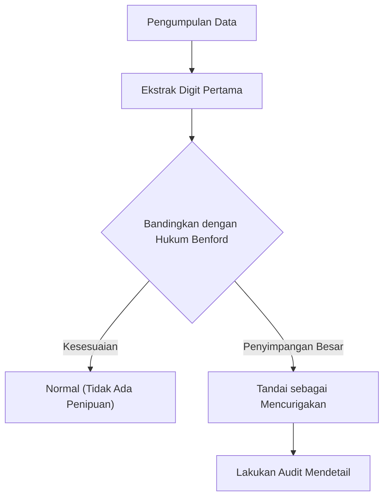

Pernahkah Anda memperhatikan "digit pertama" (digit yang paling signifikan) dari berbagai data numerik di sekitar Anda?

Misalnya, jika Anda mengekstrak digit pertama dari beragam data di alam dan masyarakat, seperti populasi negara atau kota, panjang sungai, pendapatan perusahaan, atau konstanta fisika, Anda akan menemukan fakta yang menakjubkan: angka-angka tersebut tidak muncul secara merata dari 1 hingga 9, melainkan angka-angka tertentu muncul dengan bias yang kuat.

Angka yang paling sering muncul di antara angka-angka tersebut adalah **"1"**. Mengejutkannya, sekitar 30% dari semua data dimulai dengan 1. Secara intuitif, kita mungkin berharap angka 1 hingga 9 masing-masing muncul sekitar 11,1% dari waktu, tetapi data dunia nyata tidak berfungsi seperti itu.

Hukum matematika yang menjelaskan fenomena misterius ini adalah **[Hukum Benford](https://kenji.blog/id/p/benfords-law/) ([Benford's Law](https://kenji.blog/id/p/benfords-law/))**.

Dalam artikel ini, kami akan menjelaskan secara menyeluruh bagaimana [Hukum Benford](https://kenji.blog/id/p/benfords-law/) bekerja, mengapa fenomena ini terjadi, dan bagaimana hukum ini diterapkan untuk mendeteksi penipuan.

## Apa itu [Hukum Benford](https://kenji.blog/id/p/benfords-law/)?

[Hukum Benford](https://kenji.blog/id/p/benfords-law/) (juga dikenal sebagai Hukum Digit Pertama) menyatakan bahwa dalam banyak kumpulan data numerik di kehidupan nyata, probabilitas munculnya digit pertama (digit bukan nol yang paling signifikan) lebih tinggi untuk angka yang lebih kecil.

Secara spesifik, probabilitas $P(d)$ bahwa digit pertama adalah $d$ ($d \in \{1, 2, ..., 9\}$) dinyatakan dengan persamaan logaritmik berikut:

$$ P(d) = \log_{10} \left( 1 + \frac{1}{d} \right) $$

Ketika rumus ini dihitung, probabilitas setiap angka muncul sebagai digit pertama adalah sebagai berikut:

- **1** : Sekitar 30.1%
- **2** : Sekitar 17.6%
- **3** : Sekitar 12.5%
- **4** : Sekitar 9.7%
- **5** : Sekitar 7.9%
- **6** : Sekitar 6.7%
- **7** : Sekitar 5.8%
- **8** : Sekitar 5.1%
- **9** : Sekitar 4.6%

Angka yang dimulai dengan 1 sangat umum, sedangkan angka yang dimulai dengan 9 muncul kurang dari seperenam kali lipat angka 1.

### Sejarah Penemuan

Hukum ini pertama kali diperhatikan pada tahun 1881 oleh astronom Simon Newcomb. Ia menemukan bahwa halaman-halaman awal dari tabel logaritma (halaman yang dimulai dengan 1 atau 2) jauh lebih aus dan kotor karena sering digunakan daripada halaman-halaman berikutnya.

Kemudian, pada tahun 1938, fisikawan Frank Benford menganalisis lebih dari 20.000 kumpulan data yang beragam (luas sungai, konstanta fisika, alamat majalah, dll.) dan membuktikan bahwa fenomena ini bersifat universal.

## Mengapa "1" Sangat Umum?

Mengapa bias yang berlawanan dengan intuisi ini terjadi? Penjelasan intuitif untuk memahami alasan ini adalah **Invariansi Skala (Scale Invariance)** dan **Keseragaman pada Skala Logaritmik**.

### Invariansi Skala

Jika ada hukum alam universal yang ada, hukum itu sendiri tidak boleh berubah meskipun satuan pengukurannya diubah. Misalnya, baik jarak diukur dalam kilometer atau mil, probabilitas distribusi digit pertama harus sama. Secara matematis, ketika mencari distribusi probabilitas yang memenuhi kondisi bahwa distribusi tetap tidak berubah bahkan ketika dikalikan dengan konstanta (invariansi skala), seseorang pasti akan sampai pada distribusi logaritmik [Hukum Benford](https://kenji.blog/id/p/benfords-law/).

### Skala Logaritmik dan Pertumbuhan

Banyak fenomena alam dan data ekonomi tumbuh dengan perkalian (bunga majemuk) daripada penjumlahan. Misalnya, misalkan pendapatan perusahaan tumbuh sebesar 10% setiap tahun.

Dibutuhkan sekitar 7,3 tahun agar pendapatan tumbuh dari 1 juta menjadi 2 juta (periode ketika digit pertama adalah 1). Namun, hanya dibutuhkan 1,9 tahun agar pendapatan tumbuh dari 5 juta menjadi 6 juta (periode ketika digit pertama adalah 5). Selain itu, hanya dibutuhkan 1,1 tahun untuk tumbuh dari 9 juta menjadi 10 juta (periode ketika digit pertama adalah 9).

Setelah mencapai 10 juta, digit pertama kembali ke 1, dan akan menghabiskan waktu lama hingga mencapai 20 juta. Dengan kata lain, dalam data yang tumbuh secara eksponensial, periode di mana digit pertama merupakan angka kecil jauh lebih lama.

$$ \text{Waktu singgah} \propto \log_{10}(d+1) - \log_{10}(d) $$

## Untuk Jenis Data Apa Ini Berlaku?

[Hukum Benford](https://kenji.blog/id/p/benfords-law/) tidak dapat diterapkan pada semua data. Ada perbedaan yang jelas antara data yang berlaku dan data yang tidak berlaku.

### Contoh Data yang Berlaku
- **Data yang tersebar luas**: Data yang mencakup berbagai urutan besaran (misalnya, data yang tersebar dari 10 hingga 1.000.000).
- **Data yang dihasilkan secara alami**: Panjang sungai, luas danau, konstanta fisika, massa molekul, dll.
- **Data terkait manusia**: Harga saham, pendapatan perusahaan, pengembalian pajak, populasi, dll.

### Contoh Data yang Tidak Berlaku
- **Nomor yang ditetapkan secara artifisial**: Nomor telepon, kode pos, nomor jaminan sosial, dll.
- **Data dengan rentang terbatas**: Tinggi badan manusia (sebagian besar berada di antara 100cm dan 200cm, membuat angka yang dimulai dengan 1 menjadi mayoritas yang luar biasa).
- **Data berdistribusi normal**: Data yang terkonsentrasi di sekitar rata-rata, seperti nilai ujian atau IQ.

## Penerapan dalam Deteksi Penipuan

Saat ini, salah satu bidang di mana [Hukum Benford](https://kenji.blog/id/p/benfords-law/) digunakan paling praktis adalah **Deteksi Penipuan (Fraud Detection)**.

Ketika manusia mencoba membuat atau memanipulasi angka secara acak untuk membuat data, mereka secara tidak sadar mencoba menggunakan setiap angka secara setara atau menghindari angka-angka tertentu. Namun, karena data alam mengikuti [Hukum Benford](https://kenji.blog/id/p/benfords-law/), data yang dibuat-buat akan menyimpang secara signifikan dari hukum ini.

### Penggunaan dalam Audit Akuntansi

Otoritas pajak dan firma audit akuntansi memindai buku besar perusahaan dan laporan pengeluaran untuk secara otomatis memeriksa apakah digit pertama (atau digit kedua) dari angka-angka tersebut mengikuti [Hukum Benford](https://kenji.blog/id/p/benfords-law/).

Jika sejumlah besar "pengeluaran fiktif" digelembungkan, distribusi jumlah tersebut akan menjadi tidak wajar dan menonjol dari kurva [Hukum Benford](https://kenji.blog/id/p/benfords-law/). Metode ini sangat kuat, dan faktanya, banyak kasus penggelapan dan penipuan akuntansi telah terungkap yang dipicu oleh hukum ini.

### Tuduhan Kecurangan Pemilu

Selain itu, dalam data penghitungan suara pemilu, apakah hasil agregat dari setiap tempat pemungutan suara mengikuti [Hukum Benford](https://kenji.blog/id/p/benfords-law/) terkadang digunakan sebagai indikator untuk memverifikasi kecurangan pemilu (namun, dalam kasus data pemilu, terkadang sulit untuk diterapkan tergantung pada ukuran distrik, yang merupakan bahan perdebatan).

## Kesimpulan

**[Hukum Benford](https://kenji.blog/id/p/benfords-law/)** adalah salah satu tatanan matematika indah yang tersembunyi di dunia yang tampak kacau.

Intuisi kita cenderung berpikir bahwa "angka muncul secara setara," tetapi kenyataannya, "1" memiliki kehadiran yang luar biasa. Mengetahui hukum ini mungkin sedikit mengubah cara Anda memandang data yang Anda lihat di berita, laporan keuangan perusahaan, dan bahkan luasnya alam.

Lain kali Anda memiliki kesempatan untuk menangani data dalam jumlah besar, cobalah untuk mentabulasi "digit pertama". Tentunya, hukum indah yang digambar oleh kurva logaritmik akan muncul di sana.
