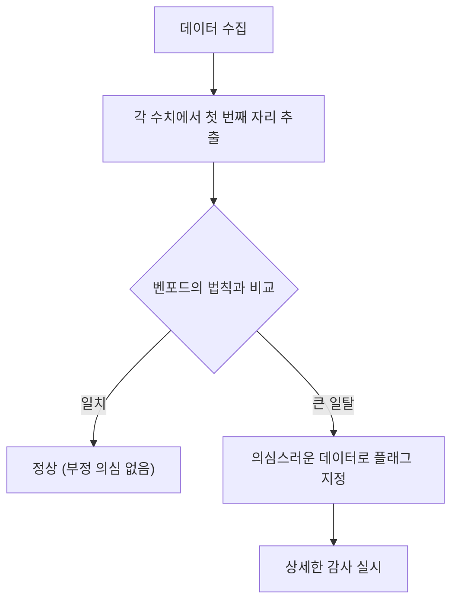

우리 주변에 있는 다양한 수치 데이터. 그 "첫 번째 자리(최상위 자리)"에 주목해 본 적이 있습니까?

예를 들어, 국가나 도시의 인구, 강의 길이, 회사의 매출액, 물리 상수 등 자연계나 사회에 존재하는 다양한 데이터의 첫 번째 숫자를 추출해 보면, 1부터 9까지 균등하게 나타나는 것이 아니라 특정 숫자가 편중되어 나타난다는 놀라운 사실이 있습니다.

그중에서도 가장 많이 나타나는 숫자는 **"1"** 입니다. 무려 전체 데이터의 약 30%가 1로 시작합니다. 직관적으로는 1부터 9까지의 숫자가 각각 약 11.1%씩 나타날 것 같지만, 현실의 데이터는 그렇지 않습니다.

이 신비한 현상을 설명하는 수학적 법칙이 **벤포드의 법칙 (Benford's Law)** 입니다.

이 글에서는 벤포드의 법칙의 원리, 왜 이런 현상이 일어나는지, 그리고 이 법칙이 어떻게 부정 발견에 응용되고 있는지 자세히 해설합니다.

## 벤포드의 법칙이란?

벤포드의 법칙(제1숫자의 법칙이라고도 불림)은 실재하는 많은 수치 데이터 집단에서, 첫 번째 자리(가장 큰 자리의 0이 아닌 숫자)가 나타날 확률이 작은 숫자일수록 높아진다는 법칙입니다.

구체적으로, 첫 번째 자리의 숫자 $d$ ($d \in \{1, 2, ..., 9\}$) 가 나타날 확률 $P(d)$ 는 다음 로그 방정식으로 표현됩니다.

$$ P(d) = \log_{10} \left( 1 + \frac{1}{d} \right) $$

이 식을 계산하면 각 숫자가 첫 번째 자리에 나타날 확률은 다음과 같습니다.

- **1** : 약 30.1%
- **2** : 약 17.6%
- **3** : 약 12.5%
- **4** : 약 9.7%
- **5** : 약 7.9%
- **6** : 약 6.7%
- **7** : 약 5.8%
- **8** : 약 5.1%
- **9** : 약 4.6%

1로 시작하는 숫자가 압도적으로 많으며, 9로 시작하는 숫자는 1의 6분의 1 이하로만 출현합니다.

### 발견의 역사

이 법칙은 1881년 천문학자 사이먼 뉴컴에 의해 처음 발견되었습니다. 그는 로그표의 앞부분(1이나 2로 시작하는 페이지)이 뒷부분보다 손때가 묻어 낡아 있다는 사실을 발견했습니다.

그 후, 1938년 물리학자 프랭크 벤포드가 2만 개 이상의 다양한 데이터 세트(강의 면적, 물리 상수, 잡지의 주소 등)를 분석하여 이 현상이 보편적인 것임을 증명했습니다.

## 왜 "1"이 많아지는 것일까?

직관에 반하는 이 법칙이지만, 왜 이런 편중이 발생하는 것일까요? 그 이유를 이해하기 위한 직관적인 설명이 **척도 불변성 (Scale Invariance)** 과 **로그 척도에서의 균일성** 입니다.

### 척도 불변성

만약 보편적인 자연계의 법칙이 존재한다면, 측정 단위를 바꾸더라도 법칙 자체는 변하지 않아야 합니다. 예를 들어, 거리를 킬로미터로 측정하든 마일로 측정하든 첫 번째 숫자의 출현 확률은 같아야 합니다. 수학적으로 단위를 곱해도 분포가 변하지 않는다는 조건(척도 불변성)을 만족하는 확률 분포를 구하면, 필연적으로 벤포드의 법칙의 로그 분포에 도달하게 됩니다.

### 로그 척도와 성장

많은 자연현상이나 경제 데이터는 덧셈이 아니라 곱셈(복리)으로 성장합니다. 예를 들어 기업의 매출이 매년 10%씩 성장한다고 가정해 봅시다.

매출이 100만 엔에서 200만 엔(첫 번째 자리가 1인 기간)이 되기 위해서는 약 7.3년이 걸립니다. 그러나 매출이 500만 엔에서 600만 엔(첫 번째 자리가 5인 기간)이 되기 위해서는 불과 1.9년밖에 걸리지 않습니다. 나아가 900만 엔에서 1000만 엔(첫 번째 자리가 9인 기간)이 되기 위해서는 단 1.1년밖에 걸리지 않습니다.

1000만 엔에 도달하면 다시 첫 번째 자리는 1로 돌아가고, 이번에는 2000만 엔이 될 때까지 긴 시간을 보냅니다. 즉, 지수함수적으로 성장하는 데이터에서는 첫 번째 자리가 작은 숫자인 기간이 압도적으로 길어지는 것입니다.

$$ \text{체류 시간} \propto \log_{10}(d+1) - \log_{10}(d) $$

## 어떤 데이터에 적용할 수 있을까?

벤포드의 법칙은 모든 데이터에 적용할 수 있는 것은 아닙니다. 적용할 수 있는 데이터와 없는 데이터에는 명확한 차이가 있습니다.

### 적용할 수 있는 데이터의 예
- **폭넓게 분포하는 데이터**: 자릿수가 여러 개에 걸쳐 있는 데이터 (예: 10부터 100만까지 분포하는 데이터).
- **자연적으로 생성된 데이터**: 강의 길이, 호수의 면적, 물리학 상수, 분자의 질량 등.
- **인간이 관여하는 데이터**: 주가, 기업의 매출액, 세무 신고서, 인구 등.

### 적용할 수 없는 데이터의 예
- **인위적으로 할당된 숫자**: 전화번호, 우편번호, 주민등록번호 등.
- **범위가 한정된 데이터**: 인간의 키 (대부분 100cm~200cm에 수렴하여 1로 시작하는 숫자가 압도적 다수가 됨).
- **정규 분포를 따르는 데이터**: 시험 점수나 IQ 등 평균값 주위에 집중되는 데이터.

## 부정 발견에의 응용

현재 벤포드의 법칙이 가장 실용적으로 사용되고 있는 분야 중 하나가 **부정 탐지 (Fraud Detection)** 입니다.

인간이 무작위로 숫자를 날조하거나 속여서 데이터를 만들려고 하면, 무의식중에 각 숫자를 균등하게 사용하려고 하거나 특정 숫자를 피하려는 심리가 작용합니다. 그러나 자연계의 데이터는 벤포드의 법칙을 따르기 때문에, 날조된 데이터는 이 법칙에서 크게 벗어나게 됩니다.

### 회계 감사에서의 이용

세무서나 회계 감사 법인은 기업의 장부나 경비 보고서를 스캔하여 수치의 첫 번째 자리(또는 두 번째 자리)가 벤포드의 법칙을 따르고 있는지를 자동으로 체크하고 있습니다.

만약 "가공의 경비"를 대량으로 부풀려 청구하고 있다면, 그 금액의 분포는 부자연스러워지고 벤포드의 법칙 곡선에서 벗어나게 됩니다. 이 기법은 매우 강력하며, 실제로 많은 횡령 사건이나 분식 회계가 이 법칙을 계기로 발각되었습니다.

### 선거 부정 의혹

또한 선거 득표수 데이터에서도, 각 투표소의 결과를 집계한 데이터가 벤포드의 법칙을 따르는지가 부정 선거를 검증하는 하나의 지표로 사용되기도 합니다(단, 선거 데이터의 경우 지역의 규모 등에 따라 적용이 어려운 경우도 있어 논란이 있습니다).

## 결론

**벤포드의 법칙** 은 언뜻 무질서해 보이는 세계에 숨어 있는 아름다운 수학적 질서 중 하나입니다.

우리의 직관은 "숫자는 평등하게 출현한다"고 생각하기 쉽지만, 실제로는 "1"이 압도적인 존재감을 가지고 있습니다. 이 법칙을 알게 되면 뉴스에서 보는 데이터나 기업의 결산서, 더 나아가 자연계의 확장에 대한 시각이 조금 달라질지도 모릅니다.

다음 번에 대량의 데이터를 다룰 기회가 있다면, 꼭 "첫 번째 자리"를 집계해 보십시오. 분명 그곳에는 로그 곡선이 그리는 아름다운 법칙이 나타날 것입니다.
