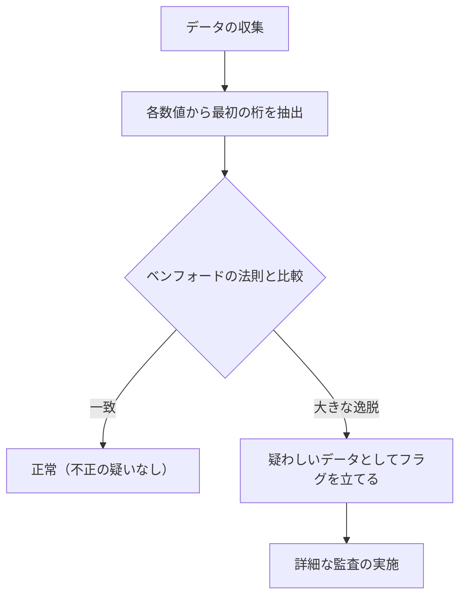

身の回りにある様々な数値データ。その「最初の桁（最上位の桁）」に注目したことはありますか？

例えば、国や市の人口、川の長さ、会社の売上高、物理定数など、自然界や社会に存在する多様なデータの最初の数字を取り出してみると、均等に 1 から 9 まで出現するのではなく、特定の数字が偏って出現するという驚くべき事実があります。

その中でも最も多く現れる数字は **「1」** です。なんと全体の約 30% ものデータが 1 から始まります。直感的には、1 から 9 までの数字はそれぞれ約 11.1% ずつ現れそうですが、現実のデータはそうはなっていません。

この不思議な現象を説明する数学的な法則が **[ベンフォードの法則](https://kenji.blog/p/benfords-law/) ([Benford's Law](https://kenji.blog/p/benfords-law/))** です。

この記事では、[ベンフォードの法則](https://kenji.blog/p/benfords-law/)の仕組み、なぜこのような現象が起きるのか、そしてこの法則がどのように不正発見に応用されているのかを詳しく解説します。

## [ベンフォードの法則](https://kenji.blog/p/benfords-law/)とは？

[ベンフォードの法則](https://kenji.blog/p/benfords-law/)（第一数字の法則とも呼ばれます）は、多くの実在する数値データ群において、最初の桁（最も大きい位の数字）の出現確率が、小さな数字ほど高くなるという法則です。

具体的には、最初の桁の数字 $d$ ($d \in \{1, 2, ..., 9\}$) が出現する確率 $P(d)$ は、次の対数方程式で表されます。

$$ P(d) = \log_{10} \left( 1 + \frac{1}{d} \right) $$

この式を計算すると、各数字が最初の桁に現れる確率は以下のようになります。

- **1** : 約 30.1%
- **2** : 約 17.6%
- **3** : 約 12.5%
- **4** : 約 9.7%
- **5** : 約 7.9%
- **6** : 約 6.7%
- **7** : 約 5.8%
- **8** : 約 5.1%
- **9** : 約 4.6%

1 から始まる数字が圧倒的に多く、9 から始まる数字は 1 の 6 分の 1 以下しか出現しません。

### 発見の歴史

この法則は 1881 年に天文学者のサイモン・ニューコムによって最初に気づかれました。彼は対数表の最初のほう（1 や 2 から始まるページ）が、後のページよりも手垢で汚れてボロボロになっていることを発見したのです。

その後、1938 年に物理学者のフランク・ベンフォードが 2 万以上の多様なデータセット（川の面積、物理定数、雑誌の住所など）を分析し、この現象が普遍的なものであることを証明しました。

## なぜ「1」が多くなるのか？

直感に反するこの法則ですが、なぜこのような偏りが生じるのでしょうか？ その理由を理解するための直感的な説明が **スケール[不変性](https://kenji.blog/p/functional-programming-concepts-pure-functions-monads/) (Scale Invariance)** と **対数スケールでの一様性** です。

### スケール不変性

もし、普遍的な自然界の法則が存在するならば、測定単位を変えても法則自体は変わらないはずです。例えば、距離をキロメートルで測っても、マイルで測っても、第一数字の出現確率は同じでなければなりません。数学的に、単位を掛け算しても分布が変わらないという条件（スケール不変性）を満たす確率分布を求めると、必然的に[ベンフォードの法則](https://kenji.blog/p/benfords-law/)の対数分布に行き着きます。

### 対数スケールと成長

多くの自然現象や経済データは、足し算ではなく掛け算（複利）で成長します。例えば、企業の売上高が毎年 10% ずつ成長するとします。

売上が 100 万円から 200 万円（最初の桁が 1 の期間）になるためには、約 7.3 年かかります。しかし、売上が 500 万円から 600 万円（最初の桁が 5 の期間）になるためには、わずか 1.9 年しかかかりません。さらに、900 万円から 1000 万円（最初の桁が 9 の期間）になるためには、たった 1.1 年しかかかりません。

1000 万円に達すると、再び最初の桁は 1 に戻り、今度は 2000 万円になるまで長い時間を過ごします。つまり、指数関数的に成長するデータにおいては、最初の桁が小さな数字である期間が圧倒的に長くなるのです。

$$ \text{滞在時間} \propto \log_{10}(d+1) - \log_{10}(d) $$

## どのようなデータに適用できるのか？

[ベンフォードの法則](https://kenji.blog/p/benfords-law/)はすべてのデータに適用できるわけではありません。適用できるデータとできないデータには明確な違いがあります。

### 適用できるデータの例
- **幅広く分布するデータ**: 桁数が複数にまたがるデータ（例: 10 から 100 万まで分布するデータ）。
- **自然に生成されたデータ**: 川の長さ、湖の面積、物理学の定数、分子の質量など。
- **人間が関わるデータ**: 株価、企業の売上高、税務申告書、人口など。

### 適用できないデータの例
- **人為的に割り当てられた数字**: 電話番号、郵便番号、マイナンバーなど。
- **範囲が限定されたデータ**: 人間の身長（ほとんどが 100cm 〜 200cm に収まり、1 から始まる数字が圧倒的多数になる）。
- **正規分布に従うデータ**: テストの点数や IQ など、平均値の周りに集中するデータ。

## 不正発見への応用

現在、[ベンフォードの法則](https://kenji.blog/p/benfords-law/)が最も実用的に使われている分野の一つが **不正検知 (Fraud Detection)** です。

人間がでたらめに数字を捏造したり、ごまかしたりしてデータを作ろうとすると、無意識のうちに各数字を均等に使おうとしたり、特定の数字を避けたりする心理が働きます。しかし、自然界のデータは[ベンフォードの法則](https://kenji.blog/p/benfords-law/)に従うため、捏造されたデータはこの法則から大きく逸脱することになります。

### 会計監査での利用

税務署や会計監査法人は、企業の帳簿や経費報告書をスキャンし、数値の最初の桁（または 2 桁目）が[ベンフォードの法則](https://kenji.blog/p/benfords-law/)に従っているかを自動的にチェックしています。

もし「架空の経費」を大量に水増し請求している場合、その金額の分布は不自然になり、[ベンフォードの法則](https://kenji.blog/p/benfords-law/)のカーブから飛び出します。この手法は非常に強力であり、実際に多くの横領事件や粉飾決算がこの法則をきっかけに発覚しています。

### 選挙の不正疑惑

また、選挙の得票数データにおいても、各投票所の結果を集計したデータが[ベンフォードの法則](https://kenji.blog/p/benfords-law/)に従うかどうかが、不正選挙を検証するひとつの指標として使われることがあります（ただし、選挙データの場合は地区の規模などにより適用が難しいケースもあり、議論があります）。

## まとめ

**[ベンフォードの法則](https://kenji.blog/p/benfords-law/)** は、一見無秩序に見える世界に潜む、美しい数学的な秩序のひとつです。

私たちの直感では「数字は平等に出現する」と思いがちですが、実際には「1」が圧倒的な存在感を持っています。この法則を知ることで、ニュースで見るデータや企業の決算書、さらには自然界の広がりに対する見方が少し変わるかもしれません。

次回、大量のデータを扱う機会があれば、ぜひ「最初の桁」を集計してみてください。きっとそこには、対数曲線が描く美しい法則が現れるはずです。
