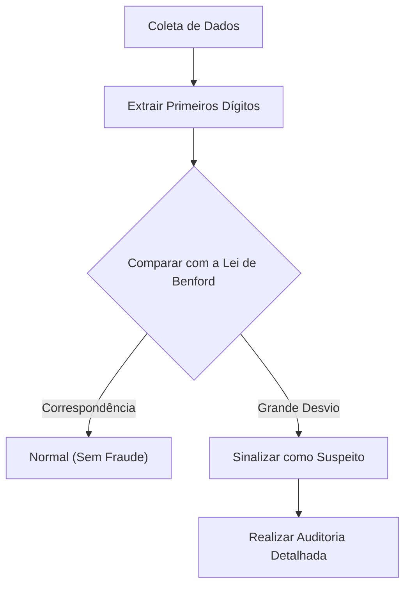

Você já prestou atenção ao "primeiro dígito" (o dígito mais significativo) de vários dados numéricos ao seu redor?

Por exemplo, se você extrair o primeiro dígito de diversos dados na natureza e na sociedade, como populações de países ou cidades, comprimentos de rios, receitas de empresas ou constantes físicas, descobrirá um fato surpreendente: eles não aparecem uniformemente de 1 a 9, mas sim que certos números aparecem com um forte viés.

O número que aparece com mais frequência entre eles é o **"1"**. Surpreendentemente, cerca de 30% de todos os dados começam com 1. Intuitivamente, poderíamos esperar que os números de 1 a 9 aparecessem cerca de 11,1% das vezes cada, mas os dados do mundo real não funcionam assim.

A lei matemática que explica esse fenômeno misterioso é a **Lei de Benford (Benford's Law)**.

Neste artigo, explicaremos em detalhes como a Lei de Benford funciona, por que esse fenômeno ocorre e como essa lei é aplicada para detectar fraudes.

## O que é a Lei de Benford?

A Lei de Benford (também conhecida como a Lei do Primeiro Dígito) afirma que, em muitas coleções de dados numéricos da vida real, a probabilidade de o primeiro dígito (o dígito não zero mais significativo) aparecer é maior para números menores.

Especificamente, a probabilidade $P(d)$ de o primeiro dígito ser $d$ ($d \in \{1, 2, ..., 9\}$) é expressa pela seguinte equação logarítmica:

$$ P(d) = \log_{10} \left( 1 + \frac{1}{d} \right) $$

Quando esta fórmula é calculada, a probabilidade de cada número aparecer como o primeiro dígito é a seguinte:

- **1** : Aprox. 30.1%
- **2** : Aprox. 17.6%
- **3** : Aprox. 12.5%
- **4** : Aprox. 9.7%
- **5** : Aprox. 7.9%
- **6** : Aprox. 6.7%
- **7** : Aprox. 5.8%
- **8** : Aprox. 5.1%
- **9** : Aprox. 4.6%

Números começando com 1 são esmagadoramente comuns, enquanto números começando com 9 aparecem menos de um sexto das vezes que o 1.

### História da Descoberta

Esta lei foi notada pela primeira vez em 1881 pelo astrônomo Simon Newcomb. Ele descobriu que as primeiras páginas das tabelas de logaritmos (páginas começando com 1 ou 2) estavam muito mais desgastadas e sujas pelo uso do que as páginas posteriores.

Mais tarde, em 1938, o físico Frank Benford analisou mais de 20.000 conjuntos de dados diversos (áreas de rios, constantes físicas, endereços de revistas, etc.) e provou que esse fenômeno é universal.

## Por que o "1" é tão comum?

Por que ocorre esse viés contraintuitivo? As explicações intuitivas para entender essa razão são **Invariância de Escala (Scale Invariance)** e **Uniformidade em uma Escala Logarítmica**.

### Invariância de Escala

Se existe uma lei natural universal, a própria lei não deve mudar mesmo se a unidade de medida for alterada. Por exemplo, se a distância for medida em quilômetros ou milhas, a probabilidade de distribuição do primeiro dígito deve ser a mesma. Matematicamente, quando se busca uma distribuição de probabilidade que satisfaça a condição de que a distribuição permaneça inalterada mesmo quando multiplicada por uma constante (invariância de escala), chega-se inevitavelmente à distribuição logarítmica da Lei de Benford.

### Escala Logarítmica e Crescimento

Muitos fenômenos naturais e dados econômicos crescem por multiplicação (juros compostos) em vez de adição. Por exemplo, suponha que a receita de uma empresa cresça 10% a cada ano.

Demora cerca de 7,3 anos para que a receita cresça de 1 milhão para 2 milhões (o período em que o primeiro dígito é 1). No entanto, leva apenas 1,9 anos para que a receita cresça de 5 milhões para 6 milhões (o período em que o primeiro dígito é 5). Além disso, leva apenas 1,1 anos para crescer de 9 milhões para 10 milhões (o período em que o primeiro dígito é 9).

Quando atinge 10 milhões, o primeiro dígito retorna a 1, e levará muito tempo até atingir 20 milhões. Em outras palavras, em dados que crescem exponencialmente, o período durante o qual o primeiro dígito é um número pequeno é esmagadoramente mais longo.

$$ \text{Tempo de permanência} \propto \log_{10}(d+1) - \log_{10}(d) $$

## A que tipo de dados se aplica?

A Lei de Benford não pode ser aplicada a todos os dados. Existe uma diferença clara entre os dados a que se aplica e os dados a que não se aplica.

### Exemplos de dados aplicáveis
- **Dados amplamente distribuídos**: Dados que abrangem várias ordens de grandeza (ex: dados distribuídos de 10 a 1.000.000).
- **Dados gerados naturalmente**: Comprimento de rios, área de lagos, constantes físicas, massa molecular, etc.
- **Dados relacionados a humanos**: Preços de ações, receitas de empresas, declarações de impostos, populações, etc.

### Exemplos de dados não aplicáveis
- **Números atribuídos artificialmente**: Números de telefone, códigos postais, números de segurança social, etc.
- **Dados com alcance limitado**: Altura humana (a maioria fica entre 100cm e 200cm, tornando os números que começam com 1 a esmagadora maioria).
- **Dados com distribuição normal**: Dados concentrados em torno de uma média, como notas de testes ou QI.

## Aplicação na Detecção de Fraudes

Atualmente, um dos campos em que a Lei de Benford é usada de forma mais prática é a **Detecção de Fraude (Fraud Detection)**.

Quando os humanos tentam fabricar ou manipular números aleatoriamente para criar dados, inconscientemente tentam usar cada número igualmente ou evitar certos números. No entanto, como os dados naturais seguem a Lei de Benford, os dados fabricados se desviarão significativamente desta lei.

### Uso em Auditorias Contábeis

Autoridades fiscais e empresas de auditoria contábil examinam livros e relatórios de despesas corporativas para verificar automaticamente se o primeiro dígito (ou o segundo dígito) dos números segue a Lei de Benford.

Se uma grande quantidade de "despesas fictícias" for inflada, a distribuição desses valores se tornará antinatural e sairá da curva da Lei de Benford. Esse método é incrivelmente poderoso e, de fato, muitos casos de peculato e fraudes contábeis foram descobertos a partir desta lei.

### Alegações de Fraude Eleitoral

Além disso, em dados de contagem de votos eleitorais, se os resultados agregados de cada seção eleitoral seguem a Lei de Benford é às vezes usado como indicador para verificar fraudes eleitorais (no entanto, no caso de dados eleitorais, às vezes é difícil de aplicar dependendo do tamanho dos distritos, o que é um assunto de debate).

## Conclusão

A **Lei de Benford** é uma das belas ordens matemáticas ocultas em um mundo aparentemente caótico.

Nossa intuição tende a pensar que "os números aparecem igualmente", mas, na realidade, o "1" tem uma presença esmagadora. Conhecer essa lei pode mudar um pouco a maneira como você vê os dados que vê nos noticiários, nas demonstrações financeiras das empresas e até mesmo na vastidão do mundo natural.

Da próxima vez que tiver a oportunidade de lidar com uma grande quantidade de dados, tente tabular os "primeiros dígitos". Certamente, a bela lei desenhada por uma curva logarítmica surgirá lá.
