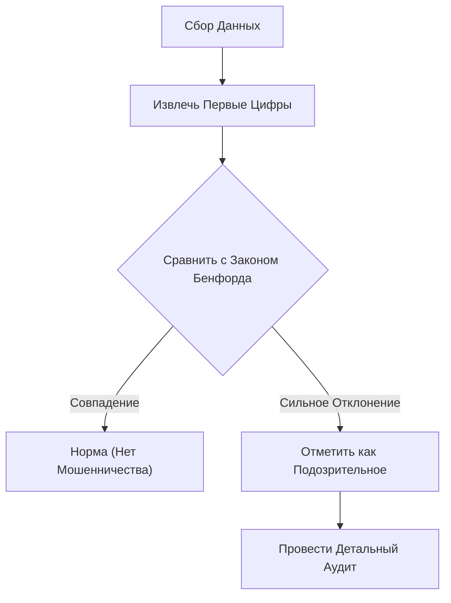

Вы когда-нибудь обращали внимание на «первую цифру» (наиболее значимую цифру) различных числовых данных вокруг вас?

Например, если вы возьмете первую цифру различных данных в природе и обществе, таких как население стран или городов, длина рек, доходы компаний или физические константы, вы обнаружите удивительный факт: они не появляются равномерно от 1 до 9, а скорее определенные цифры появляются с сильным перекосом.

Число, которое появляется среди них чаще всего, — это **«1»**. Удивительно, но около 30% всех данных начинаются с 1. Интуитивно мы могли бы ожидать, что цифры от 1 до 9 будут появляться каждая примерно в 11,1% случаев, но данные реального мира работают иначе.

Математический закон, объясняющий этот загадочный феномен, — это **[Закон Бенфорда](https://kenji.blog/p/benfords-law/) ([Benford's Law](https://kenji.blog/p/benfords-law/))**.

В этой статье мы подробно объясним, как работает закон Бенфорда, почему возникает этот феномен и как этот закон применяется для обнаружения мошенничества.

## Что такое закон Бенфорда?

[Закон Бенфорда](https://kenji.blog/p/benfords-law/) (также известный как закон первой цифры) гласит, что во многих наборах реальных числовых данных вероятность появления первой цифры (наиболее значимой ненулевой цифры) выше для меньших чисел.

В частности, вероятность $P(d)$ того, что первой цифрой будет $d$ ($d \in \{1, 2, ..., 9\}$), выражается следующим логарифмическим уравнением:

$$ P(d) = \log_{10} \left( 1 + \frac{1}{d} \right) $$

При вычислении по этой формуле вероятность того, что каждое число появится в качестве первой цифры, следующая:

- **1** : Около 30.1%
- **2** : Около 17.6%
- **3** : Около 12.5%
- **4** : Около 9.7%
- **5** : Около 7.9%
- **6** : Около 6.7%
- **7** : Около 5.8%
- **8** : Около 5.1%
- **9** : Около 4.6%

Числа, начинающиеся с 1, встречаются в подавляющем большинстве случаев, в то время как числа, начинающиеся с 9, появляются менее чем в шесть раз реже, чем 1.

### История открытия

Этот закон был впервые замечен в 1881 году астрономом Саймоном Ньюкомом. Он обнаружил, что более ранние страницы таблиц логарифмов (страницы, начинающиеся с 1 или 2) были намного более изношенными и грязными от использования, чем более поздние страницы.

Позже, в 1938 году, физик Фрэнк Бенфорд проанализировал более 20 000 различных наборов данных (площади рек, физические константы, адреса журналов и т. д.) и доказал, что этот феномен универсален.

## Почему «1» встречается так часто?

Почему возникает этот неинтуитивный перекос? Интуитивные объяснения понимания этой причины — это **Масштабная Инвариантность (Scale Invariance)** и **Равномерность на Логарифмической Шкале**.

### Масштабная Инвариантность

Если существует универсальный закон природы, сам закон не должен изменяться даже при изменении единицы измерения. Например, измеряется ли расстояние в километрах или милях, распределение вероятностей первой цифры должно быть одинаковым. Математически, при поиске распределения вероятностей, которое удовлетворяет условию, что распределение остается неизменным даже при умножении на константу (масштабная инвариантность), неизбежно приходят к логарифмическому распределению закона Бенфорда.

### Логарифмическая шкала и рост

Многие природные явления и экономические данные растут за счет умножения (сложных процентов), а не сложения. Например, предположим, что доходы компании растут на 10% каждый год.

Чтобы выручка выросла с 1 миллиона до 2 миллионов (период, когда первая цифра равна 1), требуется около 7,3 лет. Однако, чтобы выручка выросла с 5 миллионов до 6 миллионов (период, когда первая цифра равна 5), требуется всего 1,9 года. Более того, чтобы вырасти с 9 миллионов до 10 миллионов (период, когда первая цифра равна 9), требуется всего 1,1 года.

Как только он достигает 10 миллионов, первая цифра возвращается к 1, и пройдет много времени, прежде чем она достигнет 20 миллионов. Другими словами, в данных, которые растут экспоненциально, период времени, в течение которого первая цифра является небольшим числом, в подавляющем большинстве случаев дольше.

$$ \text{Время пребывания} \propto \log_{10}(d+1) - \log_{10}(d) $$

## К каким данным это применимо?

[Закон Бенфорда](https://kenji.blog/p/benfords-law/) не может быть применен ко всем данным. Существует четкое различие между данными, к которым он применяется, и данными, к которым он не применяется.

### Примеры применимых данных
- **Широко распределенные данные**: Данные, охватывающие несколько порядков величины (например, данные, распределенные от 10 до 1 000 000).
- **Естественно сгенерированные данные**: Длина рек, площадь озер, физические константы, молекулярная масса и т. д.
- **Данные, связанные с человеком**: Цены на акции, доходы компаний, налоговые декларации, население и т. д.

### Примеры неприменимых данных
- **Искусственно присвоенные номера**: Номера телефонов, почтовые индексы, номера социального страхования и т. д.
- **Данные с ограниченным диапазоном**: Рост человека (большинство попадает в диапазон от 100 см до 200 см, в результате чего числа, начинающиеся с 1, составляют подавляющее большинство).
- **Нормально распределенные данные**: Данные, сконцентрированные вокруг среднего значения, такие как результаты тестов или IQ.

## Применение для Обнаружения Мошенничества

В настоящее время одной из областей, где закон Бенфорда используется наиболее практично, является **Обнаружение Мошенничества (Fraud Detection)**.

Когда люди пытаются случайным образом сфабриковать или манипулировать цифрами для создания данных, они бессознательно пытаются использовать каждую цифру в равной степени или избегать определенных цифр. Однако, поскольку естественные данные подчиняются закону Бенфорда, сфабрикованные данные будут значительно отклоняться от этого закона.

### Использование в Бухгалтерском Аудите

Налоговые органы и аудиторские фирмы сканируют корпоративные бухгалтерские книги и отчеты о расходах, чтобы автоматически проверить, соответствует ли первая цифра (или вторая цифра) чисел закону Бенфорда.

Если раздуто большое количество «фиктивных расходов», распределение этих сумм станет неестественным и будет выделяться на фоне кривой закона Бенфорда. Этот метод невероятно эффективен, и на самом деле многие случаи растрат и бухгалтерского мошенничества были раскрыты благодаря этому закону.

### Обвинения в Фальсификации Выборов

Кроме того, в данных подсчета голосов на выборах тот факт, подчиняются ли совокупные результаты каждого избирательного участка закону Бенфорда, иногда используется в качестве индикатора для проверки фальсификации выборов (однако в случае данных о выборах иногда трудно применить это в зависимости от размера округов, что является предметом споров).

## Заключение

**[Закон Бенфорда](https://kenji.blog/p/benfords-law/)** — один из прекрасных математических порядков, скрытых в, казалось бы, хаотичном мире.

Наша интуиция склонна думать, что «числа появляются одинаково», но в реальности «1» имеет подавляющее присутствие. Знание этого закона может немного изменить ваш взгляд на данные, которые вы видите в новостях, корпоративной финансовой отчетности и даже в необъятности природного мира.

В следующий раз, когда у вас будет возможность обрабатывать большой объем данных, попробуйте свести в таблицу «первые цифры». Безусловно, там проявится прекрасный закон, нарисованный логарифмической кривой.
