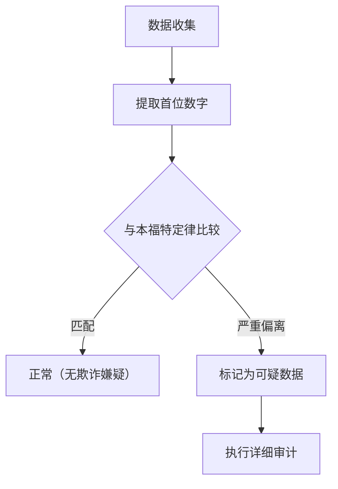

你有没有注意过周围各种数值数据的“首位数字（最高位数字）”？

例如，如果你提取自然界和社会中各种数据的首位数字，比如国家或城市的人口、河流的长度、公司的营业额或物理常数等，你会发现一个惊人的事实：它们并不是平均地从 1 到 9 出现，而是特定数字出现了极大的偏倚。

其中出现频率最高的数字是 **“1”** 。令人惊讶的是，几乎有 30% 的数据是以 1 开头的。从直觉上看，我们可能会认为 1 到 9 各个数字出现的概率大概都是 11.1%，但现实中的数据并非如此。

解释这种神秘现象的数学定律就是 **本福特定律 (Benford's Law)** 。

在本文中，我们将详细解释本福特定律的机制、为什么会发生这种现象，以及这一定律是如何被应用于欺诈检测的。

## 什么是本福特定律？

本福特定律（又称第一数字定律）指出，在许多现实生活中的数值数据集合中，首位数字（最高位的非零数字）出现的概率对于较小的数字来说更高。

具体而言，首位数字 $d$ ($d \in \{1, 2, ..., 9\}$) 出现的概率 $P(d)$ 可以用以下对数方程式表示：

$$ P(d) = \log_{10} \left( 1 + \frac{1}{d} \right) $$

根据这个公式计算，各个数字作为首位数字出现的概率如下：

- **1** : 约 30.1%
- **2** : 约 17.6%
- **3** : 约 12.5%
- **4** : 约 9.7%
- **5** : 约 7.9%
- **6** : 约 6.7%
- **7** : 约 5.8%
- **8** : 约 5.1%
- **9** : 约 4.6%

以 1 开头的数字占据压倒性优势，而以 9 开头的数字出现的频率不到 1 的六分之一。

### 发现的历史

这一定律最初由天文学家西蒙·纽康（Simon Newcomb）于 1881 年发现。他发现对数表前面的页面（以 1 或 2 开头的页面）比后面的页面磨损得更严重、更脏。

随后，在 1938 年，物理学家弗兰克·本福特（Frank Benford）分析了 2 万多个不同的数据集（河流的面积、物理常数、杂志地址等），并证明了这种现象是普遍存在的。

## 为什么“1”这么常见？

为什么会出现这种违反直觉的偏倚呢？理解其原因的直观解释在于 **尺度不变性 (Scale Invariance)** 和 **对数尺度上的均匀性** 。

### 尺度不变性

如果存在一个普遍的自然法则，那么即使改变测量单位，该法则本身也不应该改变。例如，无论是用公里还是英里来测量距离，首位数字的出现概率都必须相同。在数学上，当寻找一种即使乘以一个常数（尺度不变性）分布也不会改变的概率分布时，必然会得出本福特定律的对数分布。

### 对数尺度与增长

许多自然现象和经济数据是通过乘法（复利）而不是加法来增长的。例如，假设一家公司的营业额每年增长 10%。

营业额从 100 万增长到 200 万（首位数字为 1 的期间）需要大约 7.3 年。然而，营业额从 500 万增长到 600 万（首位数字为 5 的期间）只需要短短 1.9 年。此外，从 900 万增长到 1000 万（首位数字为 9 的期间）仅需 1.1 年。

一旦达到 1000 万，首位数字又会回到 1，并且将经历很长时间才会达到 2000 万。也就是说，在呈指数增长的数据中，首位数字为较小数字的持续时间要长得多。

$$ \text{停留时间} \propto \log_{10}(d+1) - \log_{10}(d) $$

## 它适用于什么样的数据？

本福特定律不能应用于所有数据。适用的数据和不适用的数据之间存在明显的区别。

### 适用数据的例子
- **广泛分布的数据**: 跨越多个数量级的数据（例如：从 10 分布到 1,000,000 的数据）。
- **自然生成的数据**: 河流长度、湖泊面积、物理常数、分子质量等。
- **与人类相关的数据**: 股票价格、企业营业额、税务申报单、人口等。

### 不适用数据的例子
- **人为分配的数字**: 电话号码、邮政编码、身份证号等。
- **范围受限的数据**: 人类身高（大多集中在 100cm 到 200cm 之间，以 1 开头的数字占据压倒性多数）。
- **服从正态分布的数据**: 集中在平均值附近的数据，如考试成绩或智商等。

## 在欺诈检测中的应用

目前，本福特定律最实用的领域之一就是 **欺诈检测 (Fraud Detection)** 。

当人们试图随意编造或篡改数字以创建数据时，他们会无意识地试图平均使用每个数字或避免某些数字。然而，由于自然界的数据遵循本福特定律，捏造的数据将显著偏离这一定律。

### 在审计中的使用

税务机关和会计审计公司会扫描公司的账簿和费用报告，以自动检查数字的首位（或第二位）数字是否遵循本福特定律。

如果大量夸大“虚构费用”，这些金额的分布将变得不自然并从本福特定律曲线中凸显出来。这种方法非常强大，事实上，许多贪污案和财务欺诈都是由这一定律引发而被揭露的。

### 选举违规指控

此外，在选举计票数据中，每个投票站的总结果是否遵循本福特定律有时会被用作验证选举欺诈的指标（不过，就选举数据而言，根据选区规模的不同，有时很难应用，这一直是争论的话题）。

## 结论

**本福特定律** 是隐藏在看似混乱世界中的优美数学秩序之一。

我们的直觉往往认为“数字是平均出现的”，但实际上“1”具有压倒性的存在感。了解这一定律可能会稍微改变你对新闻中的数据、企业财务报表甚至广袤自然界的看法。

下次当你有机会处理大量数据时，一定要尝试统计一下“首位数字”。肯定那里会出现一条由对数曲线绘制出的优美法则。
