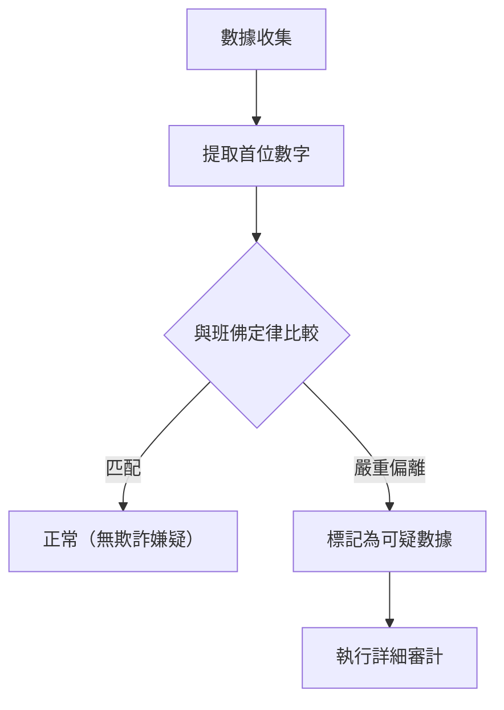

你有沒有注意過周圍各種數值數據的「首位數字（最高位數字）」？

例如，如果你提取自然界和社會中各種數據的首位數字，比如國家或城市的人口、河流的長度、公司的營業額或物理常數等，你會發現一個驚人的事實：它們並不是平均地從 1 到 9 出現，而是特定數字出現了極大的偏倚。

其中出現頻率最高的數字是 **「1」** 。令人驚訝的是，幾乎有 30% 的數據是以 1 開頭的。從直覺上看，我們可能會認為 1 到 9 各個數字出現的概率大概都是 11.1%，但現實中的數據並非如此。

解釋這種神秘現象的數學定律就是 **[班佛定律](https://kenji.blog/p/benfords-law/) ([Benford's Law](https://kenji.blog/p/benfords-law/))** 。

在本文中，我們將詳細解釋[班佛定律](https://kenji.blog/p/benfords-law/)的機制、為什麼會發生這種現象，以及這一定律是如何被應用於欺詐檢測的。

## 什麼是[班佛定律](https://kenji.blog/p/benfords-law/)？

[班佛定律](https://kenji.blog/p/benfords-law/)（又稱第一數字定律）指出，在許多現實生活中的數值數據集合中，首位數字（最高位的非零數字）出現的概率對於較小的數字來說更高。

具體而言，首位數字 $d$ ($d \in \{1, 2, ..., 9\}$) 出現的概率 $P(d)$ 可以用以下對數方程式表示：

$$ P(d) = \log_{10} \left( 1 + \frac{1}{d} \right) $$

根據這個公式計算，各個數字作為首位數字出現的概率如下：

- **1** : 約 30.1%
- **2** : 約 17.6%
- **3** : 約 12.5%
- **4** : 約 9.7%
- **5** : 約 7.9%
- **6** : 約 6.7%
- **7** : 約 5.8%
- **8** : 約 5.1%
- **9** : 約 4.6%

以 1 開頭的數字佔據壓倒性優勢，而以 9 開頭的數字出現的頻率不到 1 的六分之一。

### 發現的歷史

這一定律最初由天文學家西蒙·紐康（Simon Newcomb）於 1881 年發現。他發現對數表前面的頁面（以 1 或 2 開頭的頁面）比後面的頁面磨損得更嚴重、更髒。

隨後，在 1938 年，物理學家弗蘭克·班佛（Frank Benford）分析了 2 萬多個不同的數據集（河流的面積、物理常數、雜誌地址等），並證明了這種現象是普遍存在的。

## 為什麼「1」這麼常見？

為什麼會出現這種違反直覺的偏倚呢？理解其原因的直觀解釋在於 **尺度不變性 (Scale Invariance)** 和 **對數尺度上的均勻性** 。

### 尺度不變性

如果存在一個普遍的自然法則，那麼即使改變測量單位，該法則本身也不應該改變。例如，無論是用公里還是英里來測量距離，首位數字的出現概率都必須相同。在數學上，當尋找一種即使乘以一個常數（尺度不變性）分佈也不會改變的概率分佈時，必然會得出[班佛定律](https://kenji.blog/p/benfords-law/)的對數分佈。

### 對數尺度與增長

許多自然現象和經濟數據是透過乘法（複利）而不是加法來增長的。例如，假設一家公司的營業額每年增長 10%。

營業額從 100 萬增長到 200 萬（首位數字為 1 的期間）需要大約 7.3 年。然而，營業額從 500 萬增長到 600 萬（首位數字為 5 的期間）只需要短短 1.9 年。此外，從 900 萬增長到 1000 萬（首位數字為 9 的期間）僅需 1.1 年。

一旦達到 1000 萬，首位數字又會回到 1，並且將經歷很長時間才會達到 2000 萬。也就是說，在呈指數增長的數據中，首位數字為較小數字的持續時間要長得多。

$$ \text{停留時間} \propto \log_{10}(d+1) - \log_{10}(d) $$

## 它適用於什麼樣的數據？

[班佛定律](https://kenji.blog/p/benfords-law/)不能應用於所有數據。適用的數據和不適用的數據之間存在明顯的區別。

### 適用數據的例子
- **廣泛分佈的數據**: 跨越多個數量級的數據（例如：從 10 分佈到 1,000,000 的數據）。
- **自然生成的數據**: 河流長度、湖泊面積、物理常數、分子質量等。
- **與人類相關的數據**: 股票價格、企業營業額、稅務申報單、人口等。

### 不適用數據的例子
- **人為分配的數字**: 電話號碼、郵政編碼、身份證號等。
- **範圍受限的數據**: 人類身高（大多集中在 100cm 到 200cm 之間，以 1 開頭的數字佔據壓倒性多數）。
- **服從正態分佈的數據**: 集中在平均值附近的數據，如考試成績或智商等。

## 在欺詐檢測中的應用

目前，[班佛定律](https://kenji.blog/p/benfords-law/)最實用的領域之一就是 **欺詐檢測 (Fraud Detection)** 。

當人們試圖隨意編造或篡改數字以創建數據時，他們會無意識地試圖平均使用每個數字或避免某些數字。然而，由於自然界的數據遵循[班佛定律](https://kenji.blog/p/benfords-law/)，捏造的數據將顯著偏離這一定律。

### 在審計中的使用

稅務機關和會計審計公司會掃描公司的賬簿和費用報告，以自動檢查數字的首位（或第二位）數字是否遵循[班佛定律](https://kenji.blog/p/benfords-law/)。

如果大量誇大「虛構費用」，這些金額的分佈將變得不自然並從[班佛定律](https://kenji.blog/p/benfords-law/)曲線中凸顯出來。這種方法非常強大，事實上，許多貪污案和財務欺詐都是由這一定律引發而被揭露的。

### 選舉違規指控

此外，在選舉計票數據中，每個投票站的總結果是否遵循[班佛定律](https://kenji.blog/p/benfords-law/)有時會被用作驗證選舉欺詐的指標（不過，就選舉數據而言，根據選區規模的不同，有時很難應用，這一直是爭論的話題）。

## 結論

**[班佛定律](https://kenji.blog/p/benfords-law/)** 是隱藏在看似混亂世界中的優美數學秩序之一。

我們的直覺往往認為「數字是平均出現的」，但實際上「1」具有壓倒性的存在感。了解這一定律可能會稍微改變你對新聞中的數據、企業財務報表甚至廣袤自然界的看法。

下次當你有機會處理大量數據時，一定要嘗試統計一下「首位數字」。肯定那裡會出現一條由對數曲線繪製出的優美法則。
