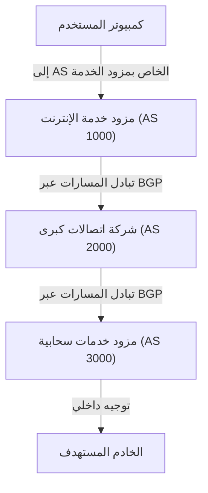

غالباً ما يُعتقد أن الإنترنت عبارة عن شبكة واحدة عملاقة، ولكنه في الواقع مجموعة من شبكات لا حصر لها ومستقلة تُعرف باسم "الأنظمة الذاتية" (Autonomous Systems أو اختصاراً AS). تتشكل "شبكة الإنترنت" التي نستخدمها يومياً من خلال الترابط المتبادل بين عشرات الآلاف من هذه الأنظمة، والتي تشمل كبرى شركات التكنولوجيا مثل Google وAmazon، ومزودي خدمات الإنترنت (ISPs) في مختلف البلدان، والجامعات، والمؤسسات الكبرى.

ولكن، كيف تعثر البيانات (الحزم أو Packets) على أفضل مسار للوصول إلى وجهتها عبر هذه الشبكة الشاسعة والمعقدة؟ الإجابة تكمن في "**بروتوكول البوابة الحدودية (Border Gateway Protocol - BGP)**".

في هذا المقال، سنشرح بالتفصيل آلية عمل بروتوكول BGP، بوصفه تقنية التوجيه الضخمة التي ترتكز عليها بنية الإنترنت، بالإضافة إلى أهميته والتحديات التي يواجهها.

## 1. ما هو بروتوكول BGP؟

يُعد بروتوكول BGP (Border Gateway Protocol) بروتوكول توجيه يُستخدم لتبادل معلومات المسارات بين مختلف الأنظمة الذاتية (AS) عبر الإنترنت. وإلى جانب بروتوكولات مثل TCP/IP وDNS، يمثل BGP إحدى الركائز الأساسية التي لا غنى عنها في البنية التحتية للإنترنت المعاصر.

إذا كانت بروتوكولات التوجيه الداخلي (IGP) مثل OSPF أو IS-IS — والمستخدمة داخل نظام ذاتي واحد كالشبكات الداخلية للشركات — تشبه "خريطة إرشادية داخل مبنى"، فإن بروتوكول BGP يمكن تشبيهه بـ "خريطة شبكة الطرق السريعة التي تربط بين المدن". يتولى BGP مهمة توجيه أجهزة التوجيه (الراوترات) حول العالم وإرشادها إلى المسالك المناسبة: "عبر أي شبكة يمكن الوصول إلى الوجهة المطلوبة؟".

### أبرز ميزات بروتوكول BGP

*   **بروتوكول موجه المسار (Path-Vector Protocol)**: لا يقتصر BGP على حساب "المسافة" نحو الوجهة فحسب، بل يحتفظ بمعلومات تفصيلية حول "الأنظمة الذاتية التي مر بها المسار (مسار AS أو AS-Path)". يساهم ذلك في منع تشكل حلقات التوجيه (Routing Loops) ويتيح اتخاذ قرارات توجيه متقدمة بناءً على سياسات محددة.
*   **اتصال قائم على بروتوكول TCP**: يتواصل BGP مع أجهزة التوجيه المجاورة (BGP Peers) عبر منفذ TCP رقم 179، مما يضمن نقلاً موثوقاً ومؤكداً لمعلومات المسارات.
*   **تحديثات تدريجية (Incremental Updates)**: بعد تبادل جداول التوجيه بالكامل في البداية، يقتصر الإرسال لاحقاً على التحديثات المتعلقة بالتغييرات فقط، مما يحافظ على النطاق الترددي ويقلل من استهلاكه.

## 2. الأنظمة الذاتية (AS) المكونة للإنترنت

لفهم بروتوكول BGP بشكل سليم، لا بد من استيعاب مفهوم "النظام الذاتي (Autonomous System - AS)".

النظام الذاتي هو عبارة عن مجموعة من شبكات IP التي تتبع سياسة توجيه واضحة وموحدة، ويُمنح كل نظام "رقم نظام ذاتي" فريداً (Autonomous System Number - ASN). على سبيل المثال، يمتلك كبار مزودي خدمات الإنترنت أرقام AS خاصة بهم، ويقومون من خلالها بربط شبكات عملائهم بشبكة الإنترنت العالمية.

تنقسم أشكال الاتصال بين الأنظمة الذاتية (AS) بصورة رئيسية إلى نوعين:

1.  **العبور (Transit)**: علاقة يقدم فيها نظام ذاتي لآخر إمكانية الوصول الشامل إلى شبكة الإنترنت بأكملها (وتكون عادةً خدمة مدفوعة).
2.  **التناظر (Peering)**: علاقة يتبادل فيها نظامان ذاتيان حركة البيانات مباشرة بين شبكتيهما (وشبكات عملائهما)، وغالباً ما تتم بدون مقابل مالي.

يمتلك BGP إمكانات قوية تتيح ترجمة هذه العلاقات التجارية والسياسات المؤسسية وتطبيقها عملياً في توجيه حركة المرور.

## 3. آلية اختيار المسار في بروتوكول BGP

قد تتلقى أجهزة توجيه BGP مسارات متعددة نحو نفس الوجهة من عدة أجهزة توجيه مجاورة (Peers). ولاختيار مسار واحد مثالي هو "أفضل مسار (Best Path)"، يعتمد BGP على خوارزمية مفاضلة دقيقة.

لا يرتكز اختيار المسار في BGP على مفهوم "أقصر مسار جغرافي" فحسب؛ بل تقوم أجهزة التوجيه بمقارنة سلسلة من السمات (Attributes) وفق ترتيب أولويات صارم لتحديد المسار الفائز:

1.  **الوزن (Weight)**: سمة خاصة بأجهزة Cisco يتم ضبطها محلياً داخل جهاز التوجيه، وتُمنح الأولوية للقيمة الأعلى.
2.  **التفضيل المحلي (Local Preference)**: سمة يتم تبادلها داخل النظام الذاتي (AS) الواحد، وتُستخدم لتفضيل نقطة خروج معينة، حيث تكون الأولوية للقيمة الأعلى.
3.  **المسار المُنشأ محلياً (Originate)**: تُمنح الأولوية للمسارات التي تم إنشاؤها على نفس جهاز التوجيه (باستخدام أمر network أو إعادة التوزيع وما شابه).
4.  **طول مسار AS (طول AS_PATH)**: يُفضل المسار الذي يمر عبر أقل عدد من الأنظمة الذاتية (وهو المفهوم الأقرب لمعنى "أقصر مسار").
5.  **المصدر (Origin)**: مقارنة منشأ المسار (IGP أو EGP أو Incomplete)، مع إعطاء الأولوية القصوى لـ IGP.
6.  **مميّز الخروج المتعدد (Multi-Exit Discriminator - MED)**: سمة تُستخدم لإعلام النظام الذاتي المجاور بنقطة الدخول المفضلة لديه لاستقبال حركة البيانات، وتُعطى الأولوية للقيمة الأقل.

وهكذا، لا يقتصر BGP على تحقيق الكفاءة التقنية فقط، بل يمكّن مديري الشبكات من تطبيق **رؤيتهم وسياساتهم التجارية** بدقة، مثل الإجابة عن: "أي مسار هو الأقل تكلفة؟" أو "أي مزود خدمة نفضل تمرير البيانات من خلاله؟".

## 4. التحديات والثغرات الأمنية في BGP

مع النمو الهائل والمتواصل لحجم الإنترنت، أظهر BGP قدرة فائقة على التكيف بفضل مرونته وقابليته للتوسع. ومع ذلك، نظراً لتصميمه في مرحلة مبكرة من تاريخ الشبكة، فإنه يواجه تحديات وثغرات أمنية جوهرية.

### 4-1. اختطاف المسار (BGP Hijacking)

صُمم بروتوكول BGP في الأصل استناداً إلى مبدأ "حسن النية المتبادل"، مما يعني أن أجهزة التوجيه تثق افتراضياً في صحة معلومات المسارات المرسلة إليها من أجهزة التوجيه الأخرى دون تحقق مسبق.

فإذا قام نظام ذاتي (سواء بدافع خطأ في الإعدادات أو عن قصد خبيث) بالإعلان كذباً عن ملكيته لنطاق معين من عناوين IP، فقد تنجذب حركة المرور العالمية الموجهة لتلك العناوين نحوه ويتم ابتلاعها. هذا ما يُعرف بـ "اختطاف المسار".

وقد شهد التاريخ حوادث بارزة، مثل تحويل حركة مرور موقع YouTube بالكامل خطأً نحو مزود خدمة في باكستان مما تسبب في انقطاعه عالمياً، إلى جانب حوادث أخرى استهدفت اعتراض حركة مرور منصات العملات المشفرة.

### 4-2. تسريب المسارات (Route Leak)

يحدث تسريب المسارات عندما تتسبب أخطاء الإعدادات في قيام نظام ذاتي بنشر معلومات مسارات لم يكن ينبغي إعادة الإعلان عنها لأطراف أخرى. ويؤدي ذلك إلى تدفق كميات هائلة من البيانات غير المتوقعة نحو مزودي خدمة صغار، مما ينجم عنه اختناقات وانقطاعات شبكية واسعة.

### 4-3. تضخم جداول التوجيه (Routing Table Bloat)

مع التوسع المتواصل للشبكات العالمية، يتزايد العبء التشغيلي على أجهزة التوجيه التي تحتفظ بجدول التوجيه العالمي الكامل (Full Routing Table). وحالياً يتجاوز عدد مسارات IPv4 الكاملة حاجز 900,000 مسار، مما يتطلب أجهزة توجيه فائقة الأداء وعالية التكلفة لمعالجتها بكفاءة.

## 5. مبادرات تعزيز أمان بروتوكول BGP

للتعامل مع هذه التحديات والحد من المخاطر، يعمل مجتمع هندسة الإنترنت على تطبيق حلول وقائية متقدمة:

*   **البنية التحتية للمفتاح العام للموارد (RPKI - Resource Public Key Infrastructure)**: إطار عمل لإثبات ملكية عناوين IP تشفيرياً؛ حيث يتم إصدار شهادات رقمية تُعرف بتفويض مصدر المسار (ROA - Route Origin Authorization)، والتي تسمح لأجهزة التوجيه بالتحقق من شرعية وصحة مصدر المسارات المعلنة (Origin Validation)، مما يقلل احتمالات اختطاف المسارات بشكل ملحوظ.
*   **سجل توجيه الإنترنت (IRR - Internet Routing Registry)**: قواعد بيانات موثقة لتسجيل سياسات التوجيه، يعتمد عليها مزودو الخدمات لفلترة وتدقيق صحة المسارات المعلنة من قِبل عملائهم.
*   **المعايير المتفق عليها لأمن التوجيه (MANRS - Mutually Agreed Norms for Routing Security)**: مبادرة عالمية ترسي أفضل الممارسات الأمنية للحد من تهديدات التوجيه، وتحظى بمشاركة واسعة من كبرى الشركات ومزودي الخدمات السحابية ومزودي الإنترنت حول العالم.

## 6. خاتمة

يُعد بروتوكول BGP بمثابة "الرابط الأساسي" الذي يجمع شبكات العالم المنفصلة في نسيج إنترنت واحد متصل. وتعود قدرتنا اليومية على تصفح المواقع ومشاهدة المحتوى بسلاسة إلى الدور الحيوي الذي تؤديه آلاف أجهزة التوجيه خلف الكواليس في حساب أفضل المسارات باستمرار وتمرير الحزم البرمجية دون توقف.

ورغم التحديات المتبقية مثل تعقيد التكوين والثغرات التاريخية، فإن تبني التقنيات الحديثة وفي مقدمتها RPKI يواصل الارتقاء بأمان البنية التحتية للإنترنت وموثوقيتها.

إن استيعاب المبادئ الأساسية لبروتوكول BGP ليس مفيداً لمهندسي الشبكات فحسب، بل يمنح كل متخصص في تكنولوجيا المعلومات فهماً أعمق وأشمل لكيفية عمل هذا الصرح الرقمي العالمي.
