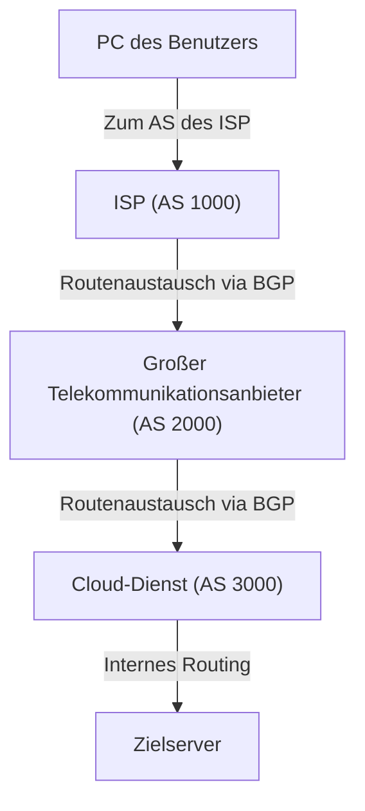

Das Internet wird oft als ein einziges, riesiges Netzwerk wahrgenommen, doch in Wirklichkeit handelt es sich um einen Zusammenschluss unzähliger unabhängiger Netzwerke, die als **AS (Autonomes System / Autonomous System)** bezeichnet werden. Zehntausende von AS – darunter globale Tech-Giganten wie Google und Amazon, nationale ISPs (Internet-Service-Provider), Universitäten und Großkonzerne – sind miteinander vernetzt und bilden gemeinsam das „Internet“, das wir täglich nutzen.

Doch wie finden Datenpakete in diesem riesigen und hochkomplexen Netzwerkverbund eigentlich den optimalen Weg zu ihrem Ziel? Die Antwort darauf lautet **BGP (Border Gateway Protocol)**.

In diesem Artikel erläutern wir ausführlich die Funktionsweise von BGP, die Bedeutung dieser Routing-Schlüsseltechnologie für das weltweite Internet sowie die Herausforderungen und Sicherheitsrisiken, mit denen das Protokoll heute konfrontiert ist.

## 1. Was ist BGP?

BGP (Border Gateway Protocol) ist ein Routing-Protokoll, das für den Austausch von Routing-Informationen zwischen verschiedenen Autonomen Systemen (AS) im Internet verwendet wird. Neben TCP/IP und DNS zählt es zu den grundlegendsten Technologien der modernen Internet-Infrastruktur.

Während ein IGP (Interior Gateway Protocol wie OSPF oder IS-IS), das innerhalb eines einzelnen AS wie einem Unternehmensnetzwerk zum Einsatz kommt, mit dem „Orientierungsplan im Inneren eines Gebäudes“ verglichen werden kann, entspricht BGP eher der „Karte des überregionalen Autobahnnetzes zwischen verschiedenen Städten“. BGP übernimmt die Aufgabe, Routern weltweit mitzuteilen, über welche Netzwerke ein bestimmtes Ziel erreicht werden kann.

### Hauptmerkmale von BGP

*   **Pfadvektor-Protokoll (Path Vector Protocol)**: BGP erfasst nicht nur die „Distanz“ zu einem Ziel, sondern auch die exakte Information darüber, welche Autonomen Systeme passiert wurden (den sogenannten AS-Pfad). Dies verhindert Routing-Schleifen (Loops) und ermöglicht eine Routenauswahl auf der Grundlage komplexer Routing-Richtlinien (Policies).
*   **TCP-basierte Kommunikation**: BGP nutzt TCP-Port 179 für die Kommunikation mit Peers (benachbarten Routern). Dies gewährleistet eine zuverlässige Übertragung der Routing-Informationen.
*   **Inkrementelle Aktualisierungen (Differential Updates)**: Nach dem initialen vollständigen Austausch der Routing-Tabellen werden anschließend nur noch Änderungen (Differenz-Updates) übertragen. Dies minimiert den Bandbreitenverbrauch erheblich.

## 2. Die Bausteine des Internets: „AS (Autonome Systeme)“

Um BGP zu verstehen, ist das Konzept des **AS (Autonomous System / Autonomes System)** essenziell.

Ein AS ist eine Gruppe von IP-Netzwerken, die unter einer gemeinsamen, klar definierten Routing-Richtlinie verwaltet wird. Jedem AS wird eine weltweit eindeutige **AS-Nummer (ASN - Autonomous System Number)** zugewiesen. Große ISPs besitzen beispielsweise eigene AS-Nummern, über die sie Kundennetzwerke an das weltweite Internet anbinden.

Zwischen verschiedenen AS gibt es im Wesentlichen zwei Arten von Verbindungsbeziehungen:

1.  **Transit**: Eine Beziehung, bei der ein AS einem anderen AS gegen Bezahlung (üblicherweise kostenpflichtig) Konnektivität zum gesamten restlichen Internet bereitstellt.
2.  **Peering**: Eine Vereinbarung, bei der zwei AS Datenverkehr direkt zwischen ihren jeweiligen Netzwerken (und Kunden) austauschen – häufig auf gegenseitiger, unentgeltlicher Basis (Settlement-Free Peering).

BGP bietet leistungsfähige Mechanismen, um genau diese wirtschaftlichen Vereinbarungen und geschäftlichen Beziehungen (Routing-Policies) im technischen Routing abzubilden.

## 3. Der Mechanismus der BGP-Pfadauswahl

Ein BGP-Router empfängt häufig von mehreren benachbarten Routern (Peers) Routeninformationen für ein und dasselbe Ziel. Um aus diesen Optionen den optimalen Pfad – den sogenannten „Best Path“ – auszuwählen, wendet BGP einen präzise geregelten Entscheidungsprozess an.

Die Pfadauswahl in BGP basiert keineswegs auf einer simplen „kürzesten Distanz“. Stattdessen vergleicht der Router eine Reihe von BGP-Attributen nacheinander in einer festgelegten Prioritätenreihenfolge, um den besten Pfad zu ermitteln:

1.  **Weight**: Ein Cisco-spezifisches Attribut, das nur lokal auf dem Router konfiguriert wird. Der höchste Wert wird bevorzugt.
2.  **Local Preference**: Ein Attribut, das innerhalb des gesamten eigenen AS ausgetauscht wird. Es wird verwendet, um festzulegen, welcher Exit-Router für ausgehenden Datenverkehr bevorzugt werden soll. Auch hier gewinnt der höchste Wert.
3.  **Originate (Ursprung / Lokale Generierung)**: Routen, die vom lokalen Router selbst initiiert wurden (z. B. per Network-Befehl oder Umverteilung/Redistribution), werden gegenüber von anderen Routern gelernten Routen bevorzugt.
4.  **AS_PATH-Länge**: Der Pfad mit der geringsten Anzahl an durchlaufenen Autonomen Systemen wird bevorzugt (dies entspricht am ehesten dem klassischen Konzept des „kürzesten Pfades“).
5.  **Origin (Typ des Ursprungs)**: Gibt an, wie die Route in BGP eingespeist wurde (IGP, EGP oder Incomplete). IGP wird am höchsten priorisiert.
6.  **MED (Multi-Exit Discriminator)**: Dient dazu, einem benachbarten AS zu signalisieren, über welchen Eingangspunkt eingehender Datenverkehr bevorzugt empfangen werden soll. Ein niedrigerer Wert wird bevorzugt.

Auf diese Weise berücksichtigt BGP nicht nur rein technische Kennzahlen, sondern erlaubt es Netzwerkadministratoren, **strategische und geschäftliche Richtlinien (Policies)** präzise durchzusetzen – beispielsweise welche Verbindung kostengünstiger ist oder welcher Provider aus vertraglichen Gründen bevorzugt werden soll.

## 4. Herausforderungen und Schwachstellen von BGP

Im Zuge des rasanten Wachstums des Internets hat BGP dank seiner enormen Flexibilität und Skalierbarkeit bemerkenswerte Dienste geleistet. Da das Protokoll jedoch in einer Ära entwickelt wurde, in der das Internet noch ein überschaubares Netzwerk von vertrauenswürdigen Institutionen war, weist es einige gravierende Schwachstellen und strukturelle Herausforderungen auf.

### 4-1. BGP-Hijacking (Routenentführung)

BGP basiert historisch auf einem impliziten Vertrauensprinzip: Router gehen grundsätzlich davon aus, dass die von Peer-Routern angekündigten Routen legitim und wahrheitsgemäß sind.

Kündigt nun ein AS versehentlich (oder in böswilliger Absicht) gefälschte Routeninformationen an – etwa indem es behauptet, der rechtmäßige Inhaber eines fremden IP-Adressbereichs (Präfixes) zu sein –, kann dies dazu führen, dass weltweiter Datenverkehr zu diesem AS fehlgeleitet („eingesaugt“) wird. Dieses Phänomen nennt man **BGP-Hijacking**.

In der Vergangenheit kam es wiederholt zu spektakulären Vorfällen: So wurde beispielsweise durch eine Fehlkonfiguration eines pakistanischen ISPs der weltweite YouTube-Verkehr dorthin umgeleitet und lahmgelegt. In anderen Fällen wurde BGP-Hijacking gezielt für Angriffe auf Krypto-Wallets und zur Abfangung sensibler Daten eingesetzt.

### 4-2. Route Leaks (Routen-Leaks)

Ein Route Leak tritt auf, wenn ein AS Routing-Informationen versehentlich an andere Peers weiterleitet, obwohl dies gemäß den vereinbarten Richtlinien nicht geschehen dürfte. Dadurch kann es passieren, dass riesige Verkehrsmengen unerwartet über kleinere Netzbetreiber oder ISPs fließen, deren Bandbreite überlasten und massive, weltweite Netzausfälle verursachen.

### 4-3. Anschwellen der Routing-Tabellen (Routing Table Growth)

Mit der kontinuierlich steigenden Zahl von Netzwerken im Internet wächst auch die Belastung für BGP-Router, die die weltweiten Gesamtrouten (die sogenannte „Full Routing Table“) vorhalten müssen. Die IPv4-Routing-Tabelle umfasst mittlerweile weit über 900.000 Einträge (Präfixe). Um diese Datenmengen in Echtzeit im Speicher zu halten und blitzschnell zu verarbeiten, sind extrem leistungsfähige und kostspielige Enterprise-Router erforderlich.

## 5. Initiativen zur Erhöhung der BGP-Sicherheit

Um diesen Risiken wirksam zu begegnen, treibt die Internet-Community verschiedene Sicherheitsinitiativen und -technologien voran:

*   **RPKI (Resource Public Key Infrastructure)**: Ein kryptografisches Framework zur eindeutigen Verifizierung von IP-Adressinhabern. Mittels digitaler Zertifikate namens **ROA (Route Origin Authorization)** wird geprüft, ob das AS, welches eine Route ankündigt, auch tatsächlich autorisiert ist, dieses IP-Präfix zu betreiben (Route Origin Validation). RPKI stellt damit das wirksamste Mittel gegen BGP-Hijacking dar.
*   **IRR (Internet Routing Registry)**: Öffentliche Datenbanken zur Registrierung von Routing-Richtlinien und IP-Präfix-Zuweisungen. ISPs nutzen IRR-Datenbanken, um Routenankündigungen ihrer Kunden automatisiert zu filtern und auf Plausibilität zu prüfen.
*   **MANRS (Mutually Agreed Norms for Routing Security)**: Eine globale Brancheninitiative, die verbindliche Best Practices für die Sicherheit im Routing definiert. Zahlreiche führende ISPs, Tier-1-Netzbetreiber und Cloud-Anbieter haben sich MANRS angeschlossen, um das globale Routing gemeinsam abzusichern.

## 6. Fazit

BGP fungiert als das unverzichtbare „Bindeglied des weltweiten Internets“, das unzählige unabhängige Netzwerke zu einem funktionierenden Ganzen zusammenfügt. Wenn wir tagtäglich wie selbstverständlich Webseiten aufrufen oder Videos streamen, verdanken wir dies im Hintergrund zahllosen BGP-Routern, die kontinuierlich optimale Pfade berechnen und Datenpakete zuverlässig weiterleiten.

Auch wenn die Komplexität der Konfiguration und historische Sicherheitslücken BGP vor anhaltende Herausforderungen stellen, sorgt die zunehmende Verbreitung moderner Sicherheitsstandards wie RPKI für eine stetige Verbesserung von Ausfallsicherheit und Vertrauenswürdigkeit.

Nicht nur für Netzwerktechniker, sondern für jeden IT-Interessierten ist das Verständnis der grundlegenden Mechanismen von BGP von unschätzbarem Wert, um die Architektur des Internets in ihrer ganzen Dimension zu begreifen.
