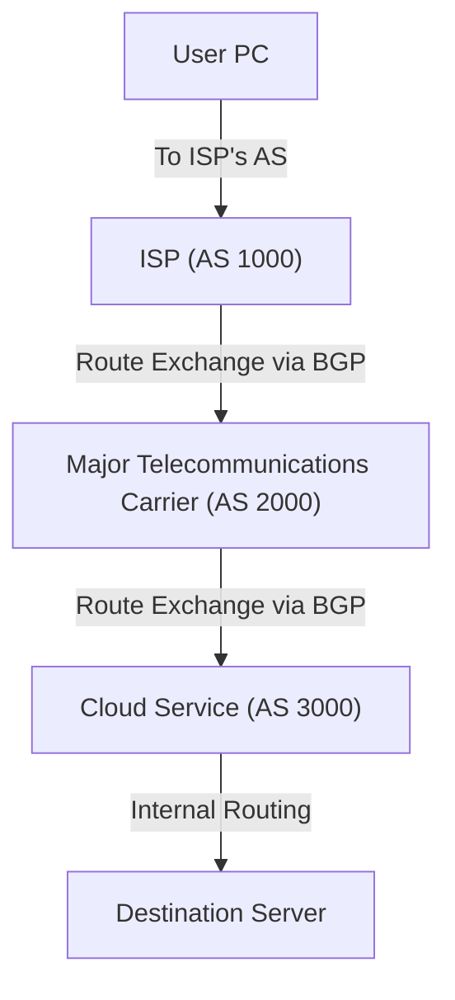

People often think of the internet as a single massive network, but in reality, it is a collection of countless independent networks known as **Autonomous Systems (AS)**. By interconnecting tens of thousands of ASes—operated by tech giants like Google and Amazon, regional and global Internet Service Providers (ISPs), universities, and large enterprises—the "Internet" that we rely on every day is formed.

So, within this vast and intricate network, how do data packets find the optimal path to their destination? The answer is **BGP (Border Gateway Protocol)**.

In this article, we will take a deep dive into how BGP—the vital routing technology underpinning the internet—works, why it is so important, and the challenges and vulnerabilities it faces today.

## 1. What is BGP?

BGP (Border Gateway Protocol) is a routing protocol used to exchange routing and reachability information between different Autonomous Systems across the internet. Alongside TCP/IP and DNS, it is widely regarded as one of the most critical technologies powering modern internet infrastructure.

If Interior Gateway Protocols (IGPs such as OSPF or IS-IS) used within a single AS—like a corporate local network—are like a "floor plan inside a building," BGP can be likened to a "map of the interstate highway system connecting cities." BGP is responsible for routers worldwide communicating with one another about which networks packets must traverse to reach their destinations.

### Key Characteristics of BGP

*   **Path-Vector Protocol**: Rather than just tracking the "distance" to a destination, BGP maintains full path information—specifically, which Autonomous Systems a route has traversed (the AS_PATH). This prevents routing loops and enables path selection based on complex routing policies.
*   **TCP-Based Communication**: BGP communicates with peers (neighboring routers) over TCP port 179. This ensures reliable and ordered transmission of routing information.
*   **Incremental Updates**: After an initial full exchange of routing tables, BGP only transmits updates when changes occur (incremental updates), minimizing unnecessary bandwidth consumption.

## 2. Autonomous Systems (AS): The Building Blocks of the Internet

To understand BGP, grasping the concept of an **Autonomous System (AS)** is essential.

An AS is a collection of IP networks and routers under the control of a single administrative entity that presents a common, clearly defined routing policy to the internet. Each AS is assigned a globally unique **Autonomous System Number (ASN)**. For instance, major ISPs possess their own ASNs and use them to connect customer networks to the wider internet.

There are two primary interconnection models between Autonomous Systems:

1.  **Transit**: A relationship where one AS provides another AS with connectivity to the entire rest of the internet (typically for a fee).
2.  **Peering**: A relationship where two ASes agree to directly exchange traffic between their respective networks (and often their direct customers), usually on a settlement-free basis.

BGP includes powerful features designed to translate these commercial agreements and business policies directly into routing decisions.

## 3. The BGP Path Selection Mechanism

A BGP router often receives multiple routes to the exact same destination prefix from different BGP peers. To determine the single optimal "Best Path" to install into the routing table and advertise onwards, BGP uses a deterministic step-by-step decision algorithm.

BGP path selection does not simply look for the "shortest distance." Instead, each router evaluates a hierarchy of path attributes in a strict, sequential order:

1.  **Weight**: A Cisco-proprietary attribute local to the router. The path with the highest weight is preferred.
2.  **Local Preference**: An attribute shared throughout the local AS. Used to prefer a specific exit point (egress router) from the AS. The highest value is preferred.
3.  **Locally Originated Routes**: Prefers routes originated locally by the router itself (via network commands, redistribution, etc.).
4.  **AS_PATH Length**: Prefers the route with the fewest Autonomous Systems in the AS_PATH (the closest equivalent to the traditional concept of "shortest path").
5.  **Origin Type**: Evaluates the origin of the route (IGP, EGP, Incomplete), preferring IGP over EGP, and EGP over Incomplete.
6.  **MED (Multi-Exit Discriminator)**: An attribute communicated to neighboring ASes to indicate which entry point (ingress router) is preferred for incoming traffic. The lowest value is preferred.

As shown above, BGP is designed not merely for technical optimization, but also to accommodate the network administrator's **business policies and strategic intentions**—such as routing traffic through lower-cost transit links or choosing preferred upstream transit providers.

## 4. Challenges and Vulnerabilities in BGP

As the scale of the internet expanded exponentially, BGP adapted remarkably well thanks to its inherent flexibility and scalability. However, because it was designed in the internet's early days, it inherits several major structural challenges and vulnerabilities.

### 4-1. BGP Hijacking

BGP was fundamentally built on an assumption of mutual trust. By default, routers accept and trust route announcements received from their BGP peers without cryptographic verification.

If an AS mistakenly—or maliciously—announces that it owns an IP address block belonging to someone else, traffic across the internet destined for those IP addresses can be diverted into that rogue AS. This phenomenon is known as **BGP Hijacking**.

Notable real-world incidents include a 2008 misconfiguration where a Pakistani ISP inadvertently hijacked YouTube's IP prefixes, causing a global outage of YouTube, as well as multiple incidents where cryptocurrency service traffic was intercepted for theft.

### 4-2. Route Leaks

A route leak occurs when routing announcements are propagated beyond their intended scope due to configuration errors. For example, a customer AS might inadvertently readvertise routes learned from one transit provider to another transit provider. This can funnel overwhelming amounts of global internet traffic through a small ISP network that lacks the capacity to handle it, triggering widespread service outages.

### 4-3. Routing Table Growth (Full Route Bloat)

As more networks connect to the internet, the memory and computational burden on border routers maintaining the complete global routing table (the "Full BGP Table") continues to grow. Today, the IPv4 full routing table contains over 900,000 routes. Processing and storing these routes while performing line-rate lookups requires specialized, high-performance, and expensive hardware.

## 5. Initiatives to Strengthen BGP Security

To mitigate these systemic vulnerabilities, the global networking community has developed and deployed several key security initiatives:

*   **RPKI (Resource Public Key Infrastructure)**: A public key infrastructure framework that cryptographically verifies the legitimate holder of an IP address block and the ASN authorized to originate routes for it. By validating Route Origin Authorizations (ROAs), routers can perform BGP Route Origin Validation (ROV), effectively preventing most forms of BGP route hijacking.
*   **IRR (Internet Routing Registry)**: A globally distributed set of databases where network operators register their routing policies and IP address allocations. Upstream ISPs use IRR data to construct route filters and verify that peer and customer route announcements are legitimate.
*   **MANRS (Mutually Agreed Norms for Routing Security)**: A global initiative providing baseline security recommendations and best practices for routing security. A wide range of tier-1 ISPs, cloud providers, and internet exchanges actively participate to reduce common routing threats.

## 6. Conclusion

BGP acts as the essential "glue" holding the global internet together. The seamless ability to browse websites, stream videos, and connect with services worldwide is made possible by countless BGP routers constantly calculating optimal paths and guiding packets across disparate networks.

While BGP still faces challenges—ranging from operational complexity to historic security flaws—the progressive adoption of modern frameworks like RPKI and MANRS is transforming the internet into a much safer and more resilient infrastructure.

Whether you are a network engineer, software developer, or IT professional, understanding the fundamentals of BGP offers invaluable insight into how the global internet truly operates behind the scenes.
