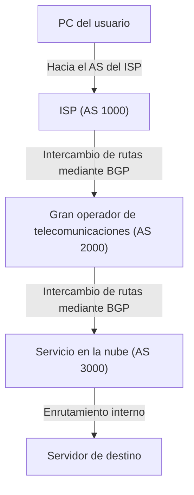

A menudo se piensa que Internet es una única red gigantesca, pero en realidad es un conjunto de innumerables redes independientes denominadas «AS (Autonomous System: Sistema Autónomo)». Decenas de miles de AS —que incluyen a gigantes tecnológicos como Google y Amazon, proveedores de servicios de Internet (ISP) de distintos países, universidades y grandes corporaciones— se interconectan entre sí para dar forma al «Internet» que utilizamos a diario.

Ahora bien, en esta red tan vasta y compleja, ¿cómo encuentran los datos (paquetes) la ruta óptima hacia su destino? La respuesta es el **BGP (Border Gateway Protocol)**.

En este artículo, explicaremos en detalle el funcionamiento del BGP, la tecnología clave de enrutamiento que sustenta los cimientos de Internet, así como su importancia y los desafíos a los que se enfrenta.

## 1. ¿Qué es BGP?

BGP (Border Gateway Protocol o Protocolo de Pasarela Fronteriza) es un protocolo de enrutamiento diseñado para intercambiar información de rutas entre diferentes AS en Internet. Junto con TCP/IP y el DNS, puede considerarse una de las tecnologías más críticas de la infraestructura de Internet moderna.

Si comparamos los IGP (Interior Gateway Protocol, como OSPF o IS-IS) —utilizados dentro de un único AS, como una red corporativa— con el «plano interior de un edificio», BGP vendría a ser el «mapa de la red de autopistas entre ciudades». BGP cumple la función de comunicar a los routers de todo el mundo el camino adecuado: «qué redes atravesar para llegar al destino».

### Características principales de BGP

*   **Protocolo de vector de rutas (Path-Vector Protocol)**: BGP no solo tiene en cuenta la «distancia» hasta el destino, sino también la información sobre «qué AS se han atravesado (ruta AS o AS-Path)». Esto permite evitar bucles de enrutamiento (routing loops) y seleccionar rutas basándose en políticas más complejas.
*   **Comunicación basada en TCP**: BGP utiliza el puerto TCP 179 para comunicarse con los pares (routers adyacentes o *peers*). Esto garantiza una transmisión fiable de la información de enrutamiento.
*   **Actualizaciones incrementales (Differential Updates)**: Tras el intercambio inicial de toda la tabla de rutas, solo se transmiten actualizaciones de las partes modificadas, lo que permite minimizar el consumo de ancho de banda.

## 2. Los «AS (Sistemas Autónomos)» que componen Internet

Para comprender BGP, es indispensable entender el concepto de «AS (Autonomous System)».

Un AS es un conjunto de redes IP administradas bajo una política de enrutamiento única y claramente definida, y a cada uno se le asigna un número único denominado «Número de AS (ASN, Autonomous System Number)». Por ejemplo, un gran ISP cuenta con su propio ASN y conecta las redes de sus clientes corporativos a Internet.

Existen principalmente dos modalidades de interconexión entre distintos AS:

1.  **Tránsito (Transit)**: Una relación en la que un AS proporciona a otro AS conectividad hacia todo Internet (por lo general, mediante un servicio de pago).
2.  **Peering (Intercambio de tráfico)**: Una relación en la que dos AS intercambian tráfico directamente entre sus respectivas redes (y las de sus clientes), a menudo sin coste monetario.

BGP dispone de potentes funciones para plasmar estas relaciones comerciales y acuerdos (políticas) en las decisiones de enrutamiento.

## 3. Mecanismo de selección de rutas en BGP

Un router BGP puede recibir múltiples anuncios de ruta hacia un mismo destino desde diferentes routers adyacentes (*peers*). Para seleccionar una única «mejor ruta» (*best path*), BGP utiliza un algoritmo complejo.

La selección de rutas de BGP no se basa simplemente en la «distancia más corta». Cada router evalúa en orden secuencial una serie de atributos (*attributes*) para determinar la mejor ruta:

1.  **Weight (Peso)**: Atributo propietario de Cisco. Se configura localmente en el router y se prioriza el valor más alto.
2.  **Local Preference (Preferencia local)**: Atributo compartido dentro del mismo AS. Se utiliza para indicar la salida preferida hacia el exterior; se prioriza el valor más alto.
3.  **Originate (Origen local)**: Se priorizan las rutas originadas por el propio router (mediante comandos de red o redistribución).
4.  **Longitud de AS_PATH**: Se prioriza la ruta que atraviesa el menor número de AS (el concepto más cercano al camino más corto tradicional).
5.  **Origin (Tipo de origen)**: Compara la procedencia de la ruta (IGP, EGP, Incomplete), donde IGP tiene la máxima prioridad.
6.  **MED (Multi-Exit Discriminator)**: Atributo que sugiere a un AS adyacente qué punto de entrada específico prefiere para recibir el tráfico entrante. Se prioriza el valor más bajo.

De este modo, BGP no solo busca la eficiencia técnica, sino que también permite configurar minuciosamente las **intenciones y conveniencias comerciales (políticas)** del administrador de la red, tales como «qué enlace resulta más económico» o «a través de qué ISP se prefiere canalizar el tráfico».

## 4. Desafíos y vulnerabilidades de BGP

A medida que Internet ha crecido de forma exponencial, BGP se ha adaptado con notable éxito gracias a su flexibilidad y escalabilidad. No obstante, al tratarse de un diseño con varias décadas de antigüedad, arrastra importantes desafíos y vulnerabilidades.

### 4-1. Secuestro de rutas (BGP Hijacking)

BGP fue diseñado originalmente bajo un principio de «buena fe» o confianza mutua; es decir, asume que la información de enrutamiento enviada por otros routers es legítima y verídica sin cuestionarla.

Si un AS anuncia por error (o con fines malintencionados) información de enrutamiento falsa alegando ser el propietario de un rango de direcciones IP específico, el tráfico de Internet puede ser absorbido hacia dicho AS. A este fenómeno se le conoce como «secuestro de rutas» (*BGP Hijacking*).

En el pasado se han producido incidentes notables: errores de configuración provocaron que el tráfico de YouTube fuera absorbido por un ISP de Pakistán, impidiendo el acceso al servicio a nivel mundial, o casos en los que se interceptaron comunicaciones dirigidas a plataformas de criptomonedas.

### 4-2. Fugas de rutas (Route Leak)

Se trata de un fenómeno en el que, debido a un error de configuración, se anuncian accidentalmente rutas a redes a las que no deberían haberse propagado. Como consecuencia, volúmenes imprevistos de tráfico se canalizan a través de ISP de menor capacidad, provocando congestiones y graves interrupciones en el servicio de la red.

### 4-3. Crecimiento desmedido de la tabla de enrutamiento

Con el continuo incremento de redes conectadas a Internet, la carga sobre los routers BGP encargados de mantener la tabla completa de rutas globales (*full routing table*) no deja de aumentar. En la actualidad, la tabla completa de rutas IPv4 supera los 900.000 prefijos, y procesar semejante volumen a alta velocidad requiere routers de altísimo rendimiento y elevado coste.

## 5. Iniciativas para reforzar la seguridad de BGP

Para hacer frente a estos desafíos, la comunidad de Internet promueve diversas contramedidas:

*   **RPKI (Resource Public Key Infrastructure)**: Un mecanismo para certificar criptográficamente la titularidad de los bloques de direcciones IP. Mediante la emisión de un certificado digital denominado ROA (Route Origin Authorization), se valida si el emisor de la información de ruta recibida por BGP es su propietario legítimo (*Origin Validation*), previniendo de forma contundente los secuestros de rutas.
*   **IRR (Internet Routing Registry)**: Bases de datos donde se registran las políticas de enrutamiento. Los ISP las utilizan para crear filtros y verificar que los anuncios de rutas recibidos de sus clientes sean legítimos.
*   **MANRS (Mutually Agreed Norms for Routing Security)**: Una iniciativa global que promueve la adopción de buenas prácticas para garantizar la seguridad del enrutamiento. En ella participan numerosos ISP y proveedores de servicios en la nube de primer nivel.

## 6. Conclusión

BGP puede considerarse el «pegamento de Internet» que mantiene unidas las redes de todo el mundo. El hecho de que podamos navegar por sitios web o reproducir vídeos a diario de forma transparente se debe a que, en segundo plano, incontables routers BGP calculan constantemente el camino óptimo y transportan los paquetes sin descanso.

A pesar de retos como la complejidad de su configuración y las vulnerabilidades de seguridad, la incorporación de nuevas tecnologías como RPKI continúa impulsando la evolución de Internet hacia una infraestructura más segura y confiable.

Comprender los principios básicos de BGP resulta muy enriquecedor no solo para los ingenieros de redes, sino para cualquier profesional del sector tecnológico que desee obtener una visión global del funcionamiento de este inmenso sistema que llamamos Internet.
