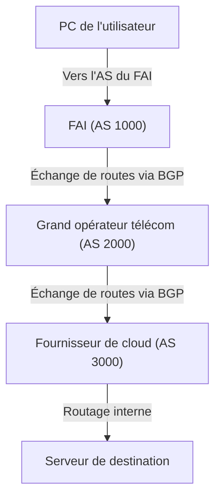

On a souvent tendance à penser qu'Internet est un unique réseau gigantesque, mais il s'agit en réalité d'un ensemble d'innombrables réseaux indépendants appelés « AS » (Autonomous System, ou système autonome). Des géants du numérique comme Google ou Amazon aux fournisseurs d'accès à Internet (FAI) de chaque pays, en passant par les universités et les grandes entreprises, ce sont plusieurs dizaines de milliers d'AS interconnectés qui forment l'« Internet » que nous utilisons au quotidien.

Dès lors, au sein de ce réseau vaste et complexe, comment les données (les paquets) trouvent-elles le chemin optimal jusqu'à leur destination ? La réponse réside dans le protocole **BGP (Border Gateway Protocol)**.

Dans cet article, nous explorerons en détail le fonctionnement de BGP, technologie de routage majeure qui soutient les fondations d'Internet, son importance capitale ainsi que les défis auxquels il fait face.

## 1. Qu'est-ce que BGP ?

BGP (Border Gateway Protocol) est un protocole de routage permettant à différents AS d'échanger des informations de routage sur Internet. Aux côtés de TCP/IP et du DNS, il constitue l'une des technologies les plus cruciales de l'infrastructure Internet moderne.

Si l'on compare les protocoles de routage interne (IGP, tels qu'OSPF ou IS-IS) utilisés au sein d'un seul AS — comme un réseau d'entreprise — au « plan intérieur d'un bâtiment », BGP peut alors être assimilé à « une carte du réseau autoroutier reliant différentes villes ». BGP a pour rôle d'indiquer aux routeurs du monde entier l'itinéraire à suivre pour atteindre une destination en traversant les différents réseaux.

### Principales caractéristiques de BGP

*   **Protocole à vecteur de chemin (Path Vector)** : BGP ne prend pas seulement en compte la « distance » jusqu'à la destination, mais conserve également la liste des réseaux traversés (« chemin d'AS » ou AS_PATH). Cela permet d'éviter les boucles de routage et d'effectuer une sélection de route basée sur des politiques plus complexes.
*   **Communication basée sur TCP** : BGP utilise le port TCP 179 pour communiquer avec ses pairs (routeurs voisins ou « peers »). Cela garantit une transmission fiable des informations de routage.
*   **Mises à jour incrémentielles** : Après un premier échange complet des tables de routage, seules les modifications sont envoyées sous forme de mises à jour, ce qui permet de préserver la bande passante.

## 2. Les « AS (systèmes autonomes) », piliers d'Internet

Pour comprendre BGP, la notion d'« AS (Autonomous System ou système autonome) » est indispensable.

Un AS est un ensemble de réseaux IP partageant une politique de routage clairement définie et administrée de manière unifiée, auquel est attribué un « numéro d'AS (ASN - Autonomous System Number) » unique. Par exemple, un grand FAI dispose de son propre ASN et connecte les réseaux de ses clients professionnels à Internet.

Les interconnexions entre AS se divisent principalement en deux grandes catégories :

1.  **Le transit (Transit)** : relation dans laquelle un AS fournit à un autre AS une connectivité vers l'ensemble de l'Internet (généralement payant).
2.  **Le peering (Échange de trafic / Appairage)** : relation dans laquelle deux AS s'échangent directement du trafic destiné à leurs réseaux respectifs (et à ceux de leurs clients), le plus souvent sans compensation financière (accord dit « settlement-free »).

BGP intègre des mécanismes puissants permettant de refléter ces accords commerciaux et ces choix stratégiques (politiques de routage) dans l'acheminement effectif des paquets.

## 3. Le mécanisme de sélection de route de BGP

Un routeur BGP peut recevoir de la part de plusieurs voisins (pairs) différentes annonces pour une même destination. Afin d'élire un seul et unique « meilleur chemin » (Best Path), BGP applique un algorithme de décision rigoureux et hiérarchisé.

Le choix d'une route BGP ne se résume pas à la simple « distance la plus courte ». Chaque routeur compare successivement plusieurs attributs (Attributes) selon un ordre strict pour déterminer le meilleur chemin :

1.  **Weight (Poids)** : Attribut propriétaire de Cisco, local au routeur. La valeur la plus élevée est prioritaire.
2.  **Local Preference (Préférence locale)** : Attribut partagé au sein d'un même AS. Utilisé pour privilégier un routeur de sortie spécifique pour le trafic sortant. La valeur la plus élevée est prioritaire.
3.  **Originate (Origine locale)** : Les routes générées localement par le routeur lui-même (via la commande network, agrégation ou redistribution) sont préférées.
4.  **Longueur de l'AS_PATH** : La route traversant le moins d'AS est prioritaire (ce qui correspond le plus à la notion intuitive de « chemin le plus court »).
5.  **Origin (Type d'origine)** : Compare la source de la route (IGP, EGP ou Incomplete). Les routes issues d'un IGP sont préférées.
6.  **MED (Multi-Exit Discriminator)** : Attribut transmis à un AS voisin pour lui suggérer quel point d'entrée privilégier pour atteindre notre AS. La valeur la plus faible est prioritaire.

Ainsi, BGP ne se contente pas d'optimiser l'efficacité technique pure : il permet aux administrateurs de réseau d'appliquer avec finesse leurs **intentions et exigences commerciales (politiques)**, telles que « quel lien est le plus économique » ou « par quel opérateur faire transiter le trafic ».

## 4. Défis et vulnérabilités de BGP

Bien que BGP se soit adapté avec un succès remarquable à l'explosion de la taille d'Internet grâce à sa flexibilité et son évolutivité, sa conception historique l'amène aujourd'hui à faire face à plusieurs vulnérabilités et défis majeurs.

### 4-1. Le détournement de route (BGP Hijacking)

À l'origine, BGP a été conçu selon un modèle reposant sur la confiance implicite. En d'autres termes, les routeurs acceptent et font confiance par défaut aux annonces de routage émises par leurs pairs, sans mécanisme natif d'authentification.

Si un AS annonce, par erreur ou avec une intention malveillante, qu'il détient une plage d'adresses IP qui ne lui appartient pas, le trafic mondial destiné à cette plage peut être redirigé et aspiré vers cet AS. C'est ce que l'on appelle le « BGP Hijacking » (détournement de route).

Par le passé, des incidents célèbres ont illustré cette faille : une mauvaise configuration a par exemple conduit le trafic mondial vers YouTube à être aspiré par un FAI pakistanais, rendant la plateforme inaccessible dans le monde entier, tandis que d'autres attaques ont servi à intercepter des flux de transactions de cryptomonnaies.

### 4-2. Les fuites de route (Route Leaks)

Une fuite de route se produit lorsqu'une erreur de configuration entraîne la réémission non désirée d'annonces de routage vers des tiers. Par conséquent, un volume massif de trafic imprévu peut se retrouver soudainement dirigé vers un FAI de taille modeste, provoquant de sévères congestions et des pannes d'ampleur mondiale.

### 4-3. L'explosion de la table de routage globale

Avec la croissance continue du nombre de réseaux connectés à Internet, la charge imposée aux routeurs BGP qui hébergent la table de routage complète (« full route » ou table Internet mondiale) ne cesse d'augmenter. Aujourd'hui, la table IPv4 dépasse les 900 000 préfixes, ce qui nécessite des équipements réseau haut de gamme, dotés d'une mémoire TCAM importante et très coûteuse, pour traiter ces volumes à haute vitesse.

## 5. Les initiatives pour renforcer la sécurité de BGP

Pour pallier ces vulnérabilités, la communauté Internet déploie et standardise plusieurs solutions techniques :

*   **RPKI (Resource Public Key Infrastructure)** : Un cadre cryptographique permettant de prouver la légitimité de l'attribution d'une plage d'adresses IP. Grâce à l'émission d'un certificat numérique appelé ROA (Route Origin Authorization), les routeurs peuvent valider que l'AS à l'origine d'une annonce est bien habilité à le faire (Origin Validation / RPKI-ROV). Cette démarche permet d'éliminer la majorité des détournements de route accidentels ou malveillants.
*   **IRR (Internet Routing Registry)** : Des bases de données publiques dans lesquelles les opérateurs enregistrent leurs politiques de routage et les préfixes qu'ils prévoient d'annoncer. Les FAI s'y appuient pour construire des filtres automatiques et valider les annonces reçues de leurs clients et pairs.
*   **MANRS (Mutually Agreed Norms for Routing Security)** : Une initiative mondiale définissant un ensemble de bonnes pratiques concrètes pour assainir et sécuriser le routage mondial. De nombreux opérateurs télécoms, FAI et fournisseurs de cloud de premier plan y adhèrent activement.

## 6. Conclusion

BGP fait office de véritable « ciment d'Internet », reliant l'ensemble des réseaux mondiaux en un maillage cohérent. Si nous pouvons naviguer sur le Web ou regarder des vidéos en streaming de manière transparente chaque jour, c'est parce qu'en coulisses, une multitude de routeurs BGP calculent sans interruption les itinéraires les plus adaptés pour acheminer nos paquets.

Entre la complexité de sa configuration et ses faiblesses historiques de sécurité, BGP soulève encore des défis d'ingénierie majeurs. Toutefois, grâce au déploiement progressif de standards comme RPKI, l'infrastructure Internet continue d'évoluer vers un modèle toujours plus robuste et sécurisé.

Que l'on soit ingénieur réseau ou simplement acteur du monde informatique, comprendre les principes fondamentaux de BGP constitue un atout précieux pour appréhender l'architecture globale du gigantesque système qu'est Internet.
