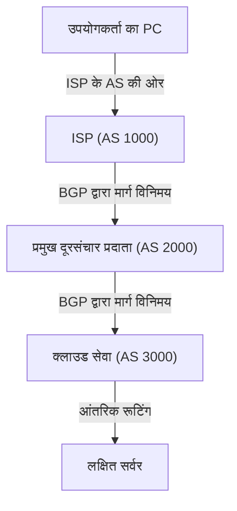

अक्सर इंटरनेट को एक एकल विशाल नेटवर्क मान लिया जाता है, लेकिन वास्तव में यह "AS (Autonomous System: स्वायत्त प्रणाली)" कहे जाने वाले अनगिनत स्वतंत्र नेटवर्कों का एक समूह है। Google और Amazon जैसी दिग्गज IT कंपनियाँ, विभिन्न देशों के ISP (इंटरनेट सेवा प्रदाता), विश्वविद्यालय और बड़े उद्यम आदि—हज़ारों की संख्या में मौजूद ये AS आपस में परस्पर जुड़े हुए हैं, जिससे मिलकर वह "इंटरनेट" बनता है जिसका उपयोग हम प्रतिदिन करते हैं।

तो फिर, इस विशाल और जटिल नेटवर्क में डेटा (पैकेट) अपने गंतव्य तक पहुँचने का सबसे उपयुक्त मार्ग कैसे ढूँढता है? इसका उत्तर है "**BGP (Border Gateway Protocol)**"।

इस लेख में, हम इंटरनेट की नींव को संभालने वाली विशाल रूटिंग तकनीक यानी BGP की कार्यप्रणाली, इसके महत्व और इसकी चुनौतियों के बारे में विस्तार से चर्चा करेंगे।

## 1. BGP क्या है?

BGP (Border Gateway Protocol) इंटरनेट पर विभिन्न AS के बीच रूटिंग जानकारी का आदान-प्रदान करने के लिए उपयोग किया जाने वाला एक रूटिंग प्रोटोकॉल है। TCP/IP और DNS के साथ-साथ, इसे आधुनिक इंटरनेट इंफ्रास्ट्रक्चर की सबसे महत्वपूर्ण तकनीकों में से एक कहा जा सकता है।

यदि कॉर्पोरेट नेटवर्क जैसे एकल AS के भीतर उपयोग किए जाने वाले IGP (जैसे OSPF या IS-IS) की तुलना "किसी इमारत के अंदरूनी नक्शे" से की जाए, तो BGP की तुलना "शहरों के बीच फैले राजमार्ग नेटवर्क के नक्शे" से की जा सकती है। BGP दुनिया भर के राउटर्स को आपस में यह बताने की भूमिका निभाता है कि "किस नेटवर्क से होकर गंतव्य तक पहुँचा जा सकता है।"

### BGP की मुख्य विशेषताएँ

*   **पाथ-वेक्टर प्रोटोकॉल (Path-Vector Protocol)**: BGP गंतव्य तक की केवल "दूरी" ही नहीं, बल्कि यह जानकारी भी रखता है कि "डेटा किन-किन AS से होकर गुज़रा है (AS पाथ)"। इससे रूटिंग लूप को रोकने में मदद मिलती है और अधिक जटिल नीतियों (policies) पर आधारित मार्ग चयन संभव होता है।
*   **TCP-आधारित संचार**: BGP अपने पीयर (निकटवर्ती राउटर) के साथ संचार करने के लिए TCP पोर्ट 179 का उपयोग करता है। इससे रूटिंग जानकारी का विश्वसनीय संचरण सुनिश्चित होता है।
*   **इंक्रीमेंटल (अंतर) अपडेट**: शुरुआत में रूटिंग की पूरी जानकारी का आदान-प्रदान करने के बाद, यह केवल बदले हुए भागों को ही अपडेट के रूप में भेजता है, जिससे बैंडविड्थ की खपत कम होती है।

## 2. इंटरनेट का निर्माण करने वाले "AS (स्वायत्त प्रणाली)"

BGP को समझने के लिए "AS (Autonomous System)" की अवधारणा को समझना अत्यंत आवश्यक है।

AS एक स्पष्ट और एकल रूटिंग नीति वाला IP नेटवर्कों का समूह होता है, और प्रत्येक AS को एक विशिष्ट "AS नंबर (ASN)" आवंटित किया जाता है। उदाहरण के लिए, बड़े ISP के पास अपना AS नंबर होता है और वे ग्राहक कंपनियों के नेटवर्क को इंटरनेट से जोड़ते हैं।

AS के बीच कनेक्शन के मुख्य रूप से दो प्रकार होते हैं:

1.  **ट्रांजिट (Transit)**: ऐसा संबंध जिसमें एक AS दूसरे AS को संपूर्ण इंटरनेट से कनेक्टिविटी प्रदान करता है (यह आमतौर पर सशुल्क होता है)।
2.  **पीयरिंग (Peering)**: ऐसा संबंध जिसमें दो AS एक-दूसरे के नेटवर्क (और उनके ग्राहकों) के बीच सीधे ट्रैफ़िक का आदान-प्रदान करते हैं (यह अक्सर निःशुल्क होता है)।

BGP में इन व्यावसायिक संबंधों (नीतियों) को रूटिंग में लागू करने के लिए शक्तिशाली क्षमताएँ मौजूद हैं।

## 3. BGP द्वारा मार्ग चयन की कार्यप्रणाली (मैकेनिज्म)

एक BGP राउटर एक ही गंतव्य के लिए कई निकटवर्ती राउटर्स (पीयर्स) से कई रूटिंग जानकारी प्राप्त कर सकता है। उनमें से केवल एक सबसे उपयुक्त "सर्वश्रेष्ठ मार्ग (Best Path)" चुनने के लिए, BGP एक जटिल एल्गोरिदम का उपयोग करता है।

BGP का मार्ग चयन केवल "सबसे कम दूरी" पर निर्भर नहीं करता। प्रत्येक राउटर निम्नलिखित कई विशेषताओं (Attributes) की क्रमिक रूप से तुलना करके सर्वश्रेष्ठ मार्ग तय करता है:

1.  **Weight (वेट)**: यह Cisco की अपनी विशिष्ट विशेषता है। इसे राउटर के भीतर आंतरिक रूप से कॉन्फ़िगर किया जाता है, और उच्चतम मान को प्राथमिकता दी जाती है।
2.  **Local Preference (लोकल प्रेफरेंस)**: यह AS के भीतर साझा की जाने वाली विशेषता है। इसका उपयोग तब किया जाता है जब किसी विशिष्ट निकास (एग्जिट) राउटर को प्राथमिकता देनी हो; इसमें उच्चतम मान को प्राथमिकता मिलती है।
3.  **Originate (उत्पत्ति स्रोत)**: राउटर द्वारा स्वयं उत्पन्न किए गए रूट (जैसे नेटवर्क कमांड या पुनर्वितरण/रीडिस्ट्रिब्यूशन) को प्राथमिकता दी जाती है।
4.  **AS_PATH लंबाई**: यह उन मार्गों को प्राथमिकता देता है जिनमें गुज़रने वाले AS की संख्या सबसे कम हो (यह पारंपरिक "सबसे छोटे मार्ग" की अवधारणा के सबसे करीब है)।
5.  **Origin (मूल स्रोत)**: यह मार्ग के स्रोत (IGP, EGP, Incomplete) की तुलना करता है, जिसमें IGP को सर्वोच्च प्राथमिकता दी जाती है।
6.  **MED (Multi-Exit Discriminator)**: यह निकटवर्ती AS को यह बताने वाली विशेषता है कि ट्रैफ़िक किस प्रवेश द्वार से अंदर आना चाहिए। इसमें निम्नतम मान को प्राथमिकता दी जाती है।

इस प्रकार, BGP न केवल तकनीकी दक्षता, बल्कि नेटवर्क प्रशासक के **इरादों और व्यावसायिक आवश्यकताओं (नीतियों)** को भी बारीकी से कॉन्फ़िगर करने की अनुमति देता है—जैसे कि "किस लाइन से ट्रैफ़िक भेजने पर लागत कम आएगी" या "किस ISP के माध्यम से डेटा गुज़ारना बेहतर होगा।"

## 4. BGP की चुनौतियाँ और कमज़ोरियाँ

इंटरनेट के आकार में अभूतपूर्व वृद्धि के बावजूद, BGP ने अपने लचीलेपन और स्केलेबिलिटी के कारण शानदार ढंग से तालमेल बिठाया है। फिर भी, अपनी पुरानी डिज़ाइन के कारण, इसमें कुछ गंभीर चुनौतियाँ और सुरक्षा कमज़ोरियाँ मौजूद हैं।

### 4-1. रूट हाईजैकिंग (BGP Hijacking)

BGP को मूल रूप से "पारस्परिक विश्वास" के आधार पर डिज़ाइन किया गया था। इसका अर्थ यह है कि यह अन्य राउटर्स से प्राप्त रूटिंग जानकारी पर बिना किसी संदेह के भरोसा कर लेता है।

यदि कोई AS गलती से (या दुर्भावनापूर्ण इरादे से) यह झूठी रूटिंग घोषणा कर देता है कि "वह किसी विशिष्ट IP एड्रेस रेंज का स्वामी है", तो इंटरनेट का ट्रैफ़िक उस AS की ओर खिंचा चला जा सकता है। इसे ही "रूट हाईजैकिंग" कहा जाता है।

अतीत में, कॉन्फ़िगरेशन त्रुटि के कारण YouTube का ट्रैफ़िक पाकिस्तान के एक ISP की ओर मुड़ गया था जिससे दुनिया भर में इसकी सेवा बाधित हो गई थी; इसके अलावा क्रिप्टोकरेंसी से संबंधित संचार को इंटरसेप्ट किए जाने जैसी घटनाएँ भी सामने आई हैं।

### 4-2. रूट लीक (Route Leak)

यह वह स्थिति है जब कॉन्फ़िगरेशन में गड़बड़ी के कारण ऐसी रूटिंग जानकारी की अनजाने में घोषणा कर दी जाती है जिसे दूसरों को नहीं भेजा जाना चाहिए था। इसके परिणामस्वरूप अप्रत्याशित ट्रैफ़िक किसी छोटे ISP पर केंद्रित हो जाता है, जिससे बड़े पैमाने पर नेटवर्क आउटेज हो सकता है।

### 4-3. रूटिंग टेबल का अत्यधिक विस्तार

इंटरनेट से जुड़ने वाले नेटवर्कों की संख्या लगातार बढ़ने के साथ ही, दुनिया के सभी मार्गों की पूरी जानकारी (फुलルート) बनाए रखने वाले BGP राउटर्स पर भार बढ़ता जा रहा है। वर्तमान में, IPv4 के फुल रूट 9,00,000 (900k) रूट्स को पार कर चुके हैं, और इन्हें उच्च गति से प्रोसेस करने के लिए अत्यंत शक्तिशाली और महंगे राउटर्स की आवश्यकता होती है।

## 5. BGP की सुरक्षा सुदृढ़ करने के प्रयास

इन चुनौतियों से निपटने के लिए, इंटरनेट समुदाय विभिन्न सुरक्षा उपायों पर काम कर रहा है।

*   **RPKI (Resource Public Key Infrastructure)**: यह IP एड्रेस के स्वामित्व को क्रिप्टोग्राफ़िक रूप से प्रमाणित करने की एक प्रणाली है। इसमें ROA (Route Origin Authorization) नामक डिजिटल प्रमाणपत्र जारी किया जाता है, जो यह सत्यापित (Origin Validation) करता है कि BGP में प्राप्त मार्ग जानकारी का प्रेषक वैध स्वामी है या नहीं। इससे रूट हाईजैकिंग को काफी हद तक रोका जा सकता है।
*   **IRR (Internet Routing Registry)**: रूटिंग नीतियों को पंजीकृत करने वाला एक डेटाबेस। ISP इसका उपयोग ग्राहकों की ओर से आने वाले रूट विज्ञापनों (अनाउंसमेंट्स) को फ़िल्टर करने और यह जाँचने के लिए करते हैं कि वे सही हैं या नहीं।
*   **MANRS (Mutually Agreed Norms for Routing Security)**: रूटिंग सुरक्षा बढ़ाने के लिए सर्वोत्तम कार्यप्रणालियों (best practices) का पालन करने वाली एक वैश्विक पहल। कई प्रमुख ISP और क्लाउड प्रदाता इसमें भाग ले रहे हैं।

## 6. निष्कर्ष

BGP दुनिया भर के नेटवर्कों को एक सूत्र में पिरोने वाला "इंटरनेट का गोंद" है। हम जो रोज़ाना स्वाभाविक रूप से वेबसाइटें ब्राउज़ करते हैं और वीडियो देखते हैं, वह इसलिए संभव है क्योंकि बैकएंड में अनगिनत BGP राउटर्स लगातार सबसे उपयुक्त मार्गों की गणना कर रहे हैं और डेटा पैकेटों को उनकी मंज़िल तक पहुँचा रहे हैं।

कॉन्फ़िगरेशन की जटिलता और सुरक्षा कमज़ोरियों जैसी कई चुनौतियाँ आज भी BGP के सामने बनी हुई हैं। फिर भी, RPKI जैसी नई तकनीकों के आगमन से इंटरनेट एक अधिक सुरक्षित और विश्वसनीय इंफ्रास्ट्रक्चर के रूप में लगातार विकसित हो रहा है।

न केवल नेटवर्क इंजीनियरों के लिए, बल्कि IT क्षेत्र से जुड़े प्रत्येक व्यक्ति के लिए BGP की बुनियादी कार्यप्रणाली को समझना इंटरनेट जैसे विशाल तंत्र के समग्र परिदृश्य को समझने में अत्यंत लाभकारी सिद्ध होगा।
