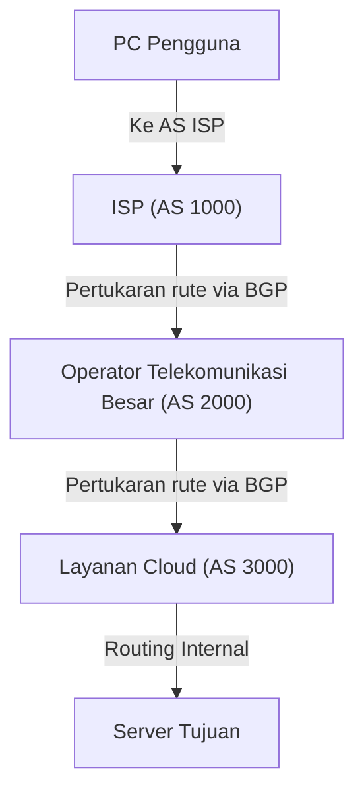

Internet kerap dianggap sebagai sebuah jaringan raksasa tunggal, padahal kenyataannya internet adalah kumpulan dari banyak jaringan independen yang disebut "AS (Autonomous System: Sistem Otonom)". Perusahaan teknologi raksasa seperti Google dan Amazon, ISP (Internet Service Provider) di berbagai negara, universitas, hingga korporasi besar—puluhan ribu AS saling terhubung satu sama lain untuk membentuk "internet" yang kita gunakan sehari-hari.

Lantas, bagaimana data (paket) menemukan rute terbaik menuju tujuannya di tengah jaringan yang begitu luas dan kompleks ini? Jawabannya adalah "**BGP (Border Gateway Protocol)**".

Dalam artikel ini, kita akan membahas secara mendalam mengenai cara kerja BGP sebagai teknologi routing skala masif yang menopang fondasi internet, arti pentingnya, serta berbagai tantangan yang dihadapinya.

## 1. Apa itu BGP?

BGP (Border Gateway Protocol) adalah protokol routing yang digunakan untuk bertukar informasi rute antar-AS yang berbeda di internet. Bersama dengan TCP/IP dan DNS, BGP merupakan salah satu teknologi paling vital dalam infrastruktur internet modern.

Jika IGP (seperti OSPF atau IS-IS) yang digunakan di dalam satu AS—misalnya jaringan internal perusahaan—dianalogikan sebagai "denah bagian dalam gedung", maka BGP dapat diibaratkan sebagai "peta jaringan jalan tol antarkota". BGP memegang peran penting dalam saling membagikan petunjuk jalan ke seluruh router di dunia mengenai "jaringan mana yang harus dilalui agar bisa sampai ke tujuan".

### Karakteristik Utama BGP

*   **Protokol Path Vector**: BGP tidak hanya menyimpan informasi tentang "jarak" ke tujuan, tetapi juga informasi tentang "AS mana saja yang telah dilewati (AS Path)". Hal ini mencegah terjadinya *routing loop* serta memungkinkan pemilihan rute berdasarkan kebijakan (*policy*) yang lebih kompleks.
*   **Komunikasi Berbasis TCP**: BGP menggunakan port TCP 179 untuk berkomunikasi dengan *peer* (router tetangga). Hal ini menjamin keandalan transmisi informasi rute.
*   **Pembaruan Diferensial (*Incremental Updates*)**: Setelah seluruh informasi rute dipertukarkan untuk pertama kalinya, BGP hanya mengirimkan pembaruan (*update*) pada bagian yang mengalami perubahan saja, sehingga menghemat konsumsi *bandwidth*.

## 2. "AS (Autonomous System)" yang Membentuk Internet

Memahami konsep "AS (Autonomous System)" sangatlah krusial untuk memahami cara kerja BGP.

AS adalah kumpulan jaringan IP yang berada di bawah satu kebijakan routing yang jelas dan terpadu, di mana masing-masing AS memiliki "Nomor AS (ASN - Autonomous System Number)" yang unik. Sebagai contoh, ISP besar memiliki nomor AS tersendiri dan menghubungkan jaringan perusahaan pelanggan ke internet.

Secara garis besar, terdapat dua jenis bentuk interkoneksi antar-AS:

1.  **Transit**: Hubungan di mana salah satu AS menyediakan konektivitas ke seluruh internet bagi AS lainnya (biasanya berbayar).
2.  **Peering**: Hubungan di mana dua AS saling bertukar lalu lintas data secara langsung antara jaringan masing-masing (beserta para pelanggannya), yang umumnya bersifat bebas biaya (tanpa biaya transit).

BGP menyediakan kapabilitas canggih untuk merefleksikan hubungan bisnis dan kebijakan (*policy*) ini secara langsung ke dalam routing.

## 3. Mekanisme Pemilihan Rute pada BGP

Router BGP dapat menerima beberapa informasi rute menuju tujuan yang sama dari beberapa router tetangga (*peer*). Untuk memilih hanya satu "rute terbaik (*best path*)", BGP menggunakan algoritma yang komprehensif.

Pemilihan rute BGP tidak semata-mata didasarkan pada "jarak terpendek". Setiap router membandingkan sejumlah atribut (*Attribute*) secara berurutan untuk menentukan rute terbaik:

1.  **Weight**: Atribut spesifik milik Cisco yang dikonfigurasikan secara internal pada router; nilai tertinggi diprioritaskan.
2.  **Local Preference**: Atribut yang dibagikan ke seluruh router di dalam satu AS. Digunakan saat ingin memprioritaskan router jalur keluar tertentu; nilai tertinggi diprioritaskan.
3.  **Originate**: Memprioritaskan rute yang di-*generate* sendiri oleh router (misalnya melalui perintah *network* atau redistribusi).
4.  **Panjang AS_PATH**: Memprioritaskan rute yang melewati jumlah AS paling sedikit (konsep yang paling dekat dengan "jalur terpendek" pada umumnya).
5.  **Origin**: Membandingkan asal muasal rute (IGP, EGP, atau Incomplete), di mana IGP memiliki prioritas paling tinggi.
6.  **MED (Multi-Exit Discriminator)**: Atribut yang digunakan untuk memberi tahu AS tetangga mengenai pintu masuk mana yang lebih disukai untuk menerima lalu lintas masuk; nilai terendah diprioritaskan.

Dengan cara ini, BGP tidak hanya mempertimbangkan efisiensi teknis semata, melainkan juga memungkinkan administrator jaringan mengonfigurasi **niat dan pertimbangan bisnis (kebijakan/*policy*)** secara mendetail, seperti "jalur mana yang biaya operasionalnya lebih murah" atau "ISP mana yang ingin diprioritaskan".

## 4. Tantangan dan Kerentanan BGP

Seiring dengan ekspansi skala internet yang eksplosif, BGP telah beradaptasi dengan luar biasa berkat fleksibilitas dan skalabilitasnya. Kendati demikian, karena dirancang pada masa awal internet, BGP memiliki beberapa tantangan kritis dan celah kerentanan.

### 4-1. Pembajakan Rute (BGP Hijacking)

BGP pada dasarnya dirancang dengan asas praduga tidak bersalah (*implicit trust* / asumsi niat baik). Artinya, router BGP memercayai informasi rute yang dikirimkan oleh router lain tanpa prasangka atau validasi bawaan.

Jika sebuah AS secara tidak sengaja (akibat salah konfigurasi) atau dengan sengaja mengumumkan (*announce*) informasi rute palsu yang mengklaim bahwa "dirinya adalah pemilik rentang alamat IP tertentu", lalu lintas internet dapat tersedot ke AS tersebut. Inilah yang disebut dengan "pembajakan rute" (*BGP Hijacking*).

Di masa lalu, insiden salah konfigurasi pernah menyebabkan lalu lintas YouTube tersedot ke sebuah ISP di Pakistan hingga tidak dapat diakses dari seluruh dunia, atau insiden di mana komunikasi transaksi mata uang kripto disadap.

### 4-2. Kebocoran Rute (Route Leak)

Ini adalah fenomena di mana informasi rute yang semestinya tidak diteruskan ke pihak lain diumumkan secara keliru akibat kesalahan konfigurasi. Akibatnya, lalu lintas yang tidak diinginkan membanjiri ISP berskala kecil dan memicu gangguan jaringan (*outage*) berskala masif.

### 4-3. Pembengkakan Tabel Routing

Seiring bertambahnya jaringan yang terhubung ke internet, beban kerja router BGP yang harus menyimpan seluruh informasi rute global (*full route*) terus melonjak. Saat ini, tabel *full route* untuk IPv4 telah melampaui 900.000 rute, dan router dengan performa sangat tinggi serta bernilai mahal sangat dibutuhkan untuk memprosesnya dengan cepat.

## 5. Inisiatif untuk Memperkuat Keamanan BGP

Untuk mengatasi tantangan-tantangan ini, berbagai langkah mitigasi terus dikembangkan oleh komunitas internet global.

*   **RPKI (Resource Public Key Infrastructure)**: Mekanisme untuk membuktikan kepemilikan alamat IP secara kriptografis. Dengan menerbitkan sertifikat digital yang disebut ROA (*Route Origin Authorization*), keabsahan pihak pengirim rute BGP dapat diverifikasi (*Origin Validation*) guna memastikan apakah pengirim tersebut merupakan pemilik sah dari prefiks tersebut. Hal ini mampu mencegah pembajakan rute secara signifikan.
*   **IRR (Internet Routing Registry)**: Basis data untuk mendaftarkan kebijakan routing. ISP memanfaatkannya untuk menyaring (*filtering*) dan memastikan bahwa pengumuman rute dari pelanggan adalah sah dan benar.
*   **MANRS (Mutually Agreed Norms for Routing Security)**: Inisiatif global untuk mematuhi serangkaian praktik terbaik (*best practices*) demi meningkatkan keamanan routing. Sejumlah besar ISP terkemuka dan penyedia cloud telah berpartisipasi dalam inisiatif ini.

## 6. Kesimpulan

BGP adalah "lem perekat internet" yang menyatukan seluruh jaringan di dunia menjadi satu kesatuan. Alasan kita dapat membuka situs web dan menonton video dengan lancar setiap hari adalah karena di balik layar, router BGP yang tak terhitung jumlahnya terus-menerus menghitung rute optimal dan mengantarkan paket data tanpa henti.

Meskipun BGP masih menyisakan sejumlah tantangan, seperti kerumitan konfigurasi dan kerentanan keamanan, internet terus berevolusi menjadi infrastruktur yang semakin aman dan andal melalui penerapan berbagai teknologi baru seperti RPKI.

Memahami cara kerja mendasar BGP tidak hanya bermanfaat bagi para insinyur jaringan, tetapi juga sangat berguna bagi siapa pun yang berkecimpung di dunia IT untuk memahami gambaran utuh dari sistem internet yang luar biasa besar ini.
