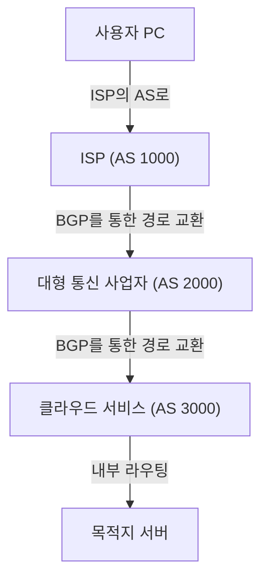

인터넷은 흔히 하나의 거대한 단일 네트워크로 생각하기 쉽지만, 실제로는 'AS(Autonomous System: 자율 시스템)'라 불리는 수많은 독립된 네트워크의 집합체입니다. Google이나 Amazon과 같은 거대 IT 기업, 각국의 ISP(인터넷 서비스 공급자), 대학, 그리고 대기업 등 수만 개에 달하는 AS가 상호 연결됨으로써 우리가 매일 이용하는 '인터넷'이 형성됩니다.

그렇다면 이처럼 방대하고 복잡한 네트워크 속에서 데이터(패킷)는 어떻게 목적지까지 최적의 경로를 찾아가는 것일까요? 그 해답이 바로 '**BGP(Border Gateway Protocol)**'입니다.

본 글에서는 인터넷의 근간을 지탱하는 거대 라우팅 기술인 BGP의 동작 원리와 그 중요성, 그리고 현재 직면한 과제에 대해 자세히 살펴보겠습니다.

## 1. BGP란 무엇인가?

BGP(Border Gateway Protocol)는 인터넷상에서 서로 다른 AS 간에 경로 정보를 교환하기 위한 라우팅 프로토콜입니다. TCP/IP, DNS와 더불어 현대 인터넷 인프라에서 가장 중요한 기술 중 하나로 꼽힙니다.

사내 네트워크와 같은 단일 AS 내부에서 사용되는 IGP(OSPF, IS-IS 등)가 '건물 내부 안내도'라면, BGP는 '도시 간 고속도로망 지도'에 비유할 수 있습니다. BGP는 전 세계 라우터들이 '어느 네트워크를 거쳐야 목적지에 도달할 수 있는지'에 대한 경로를 서로 공유할 수 있도록 해 주는 역할을 합니다.

### BGP의 주요 특징

*   **경로 벡터(Path Vector)형 프로토콜**: BGP는 목적지까지의 '거리'뿐만 아니라 '어느 AS를 거쳐왔는가(AS 경로)'에 대한 정보를 가지고 있습니다. 이를 통해 라우팅 루프(Loop)를 방지하고, 보다 복잡한 정책에 기반한 경로 선택이 가능해집니다.
*   **TCP 기반 통신**: BGP는 TCP 포트 179번을 사용하여 피어(인접 라우터)와 통신합니다. 이를 통해 경로 정보의 확실하고 안정적인 전달이 보장됩니다.
*   **증분 업데이트(Incremental Update)**: 초기에 전체 경로 정보를 한 번 교환한 뒤에는 변경 사항이 발생한 부분만 업데이트로 전송하므로 대역폭 낭비를 줄일 수 있습니다.

## 2. 인터넷을 구성하는 'AS(자율 시스템)'

BGP를 이해하는 데 있어 필수적인 것이 바로 'AS(Autonomous System)'의 개념입니다.

AS는 단일하고 명확한 라우팅 정책을 가진 IP 네트워크의 집합체이며, 각각 고유한 'AS 번호(ASN)'가 할당되어 있습니다. 예를 들어 대형 ISP는 자체 AS 번호를 보유하며, 고객 기업의 네트워크를 인터넷에 연결해 줍니다.

AS 간의 연결 형태에는 주로 다음 두 가지 유형이 있습니다.

1.  **트랜짓(Transit)**: 한 AS가 다른 AS에 대해 인터넷 전체로의 연결성을 제공하는(일반적으로 유료) 관계.
2.  **피어링(Peering)**: 두 AS가 상호 네트워크(및 해당 고객) 간에 트래픽을 직접 교환하는(대부분 무상) 관계.

BGP는 이러한 비즈니스적 관계(정책)를 라우팅에 반영할 수 있는 강력한 기능을 제공합니다.

## 3. BGP의 경로 선택 메커니즘

BGP 라우터는 복수의 인접 라우터(피어)로부터 동일한 목적지에 대한 여러 경로 정보를 수신할 수 있습니다. 그중에서 최적의 '베스트 패스(Best Path)'를 단 하나만 선택하기 위해 BGP는 정교한 알고리즘을 사용합니다.

BGP의 경로 선택은 단순한 '최단 거리' 기준이 아닙니다. 각 라우터는 다음과 같은 여러 속성(Attribute)을 순서대로 비교하여 베스트 패스를 결정합니다.

1.  **Weight(가중치)**: Cisco 고유의 속성입니다. 라우터 로컬 내부에서 설정되며, 가장 높은 값이 우선됩니다.
2.  **Local Preference(로컬 프리퍼런스)**: AS 내부에서 공유되는 속성입니다. 특정 송출 라우터를 우선시하고자 할 때 사용되며, 높은 값이 우선됩니다.
3.  **Originate(생성 출처)**: 라우터 자신이 직접 생성한 경로(network 명령어, 재분배 등)를 우선합니다.
4.  **AS_PATH 길이**: 경유하는 AS 수가 가장 적은 경로를 우선합니다(일반적인 '최단 경로' 개념과 가장 가깝습니다).
5.  **Origin(기원)**: 경로의 출처(IGP, EGP, Incomplete)를 비교하며, IGP가 가장 높은 우선순위를 갖습니다.
6.  **MED(Multi-Exit Discriminator)**: 인접한 AS에 대해 어떤 인입 경로로 트래픽을 보내주기를 원하는지 알리는 속성입니다. 낮은 값이 우선됩니다.

이처럼 BGP는 기술적인 효율성뿐만 아니라, "어떤 회선을 이용해야 비용이 저렴한가", "어떤 ISP를 경유하도록 할 것인가"와 같은 네트워크 관리자의 <strong>의도나 비즈니스적 요구사항(정책)</strong>을 정밀하게 설정할 수 있도록 설계되어 있습니다.

## 4. BGP가 안고 있는 과제와 취약점

인터넷 규모가 폭발적으로 팽창하는 과정에서 BGP는 뛰어난 유연성과 확장성으로 성공적으로 적응해 왔습니다. 하지만 설계 시기가 오래되었기 때문에 몇 가지 중대한 과제와 취약점을 안고 있습니다.

### 4-1. BGP 하이재킹(BGP Hijacking, 경로 가로채기)

BGP는 기본적으로 '성선설'에 기반하여 설계되었습니다. 즉, 다른 라우터로부터 전달받은 경로 정보를 의심 없이 신뢰해 버립니다.

만약 어떤 AS가 실수로(혹은 악의를 품고) "자신이 특정 IP 주소 대역의 소유자"라는 거짓 경로 정보를 알리는(광고하는) 경우, 인터넷상의 트래픽이 해당 AS로 빨려 들어가 버릴 수 있습니다. 이것이 바로 '경로 하이재킹'입니다.

과거에는 설정 오류로 인해 YouTube 트래픽이 파키스탄의 한 ISP로 흡수되어 전 세계에서 접속 불능 사태가 발생하거나, 암호화폐 관련 통신이 도청·탈취되는 사건이 실제로 발생하기도 했습니다.

### 4-2. 경로 누출(Route Leak)

설정 오류 등으로 인해 본래 다른 곳으로 전달하지 말아야 할 경로 정보를 잘못 광고해 버리는 현상입니다. 이로 인해 원치 않는 대규모 트래픽이 소규모 ISP로 집중되어 광범위한 네트워크 장애가 발생할 수 있습니다.

### 4-3. 라우팅 테이블 비대화

인터넷에 연결되는 네트워크가 끊임없이 증가함에 따라, 전 세계의 전체 경로 정보(풀 라우트, Full Route)를 유지해야 하는 BGP 라우터의 부담도 계속 가중되고 있습니다. 현재 IPv4 풀 라우트는 90만 개를 훌쩍 넘어섰으며, 이를 고속으로 처리하기 위해서는 매우 고성능이고 값비싼 라우터 장비가 필요합니다.

## 5. BGP 보안을 강화하기 위한 노력

이러한 문제들을 해결하기 위해 인터넷 커뮤니티에서는 다양한 대응책을 추진하고 있습니다.

*   **RPKI (Resource Public Key Infrastructure)**: IP 주소의 소유권을 암호학적으로 증명하는 체계입니다. ROA(Route Origin Authorization)라는 디지털 인증서를 발행하여, BGP로 수신한 경로 정보의 송신처가 정당한 소유자인지를 검증(Origin Validation)합니다. 이를 통해 경로 하이재킹을 획기적으로 차단할 수 있습니다.
*   **IRR (Internet Routing Registry)**: 라우팅 정책을 등록하는 데이터베이스입니다. ISP는 이를 활용하여 고객으로부터 전달받는 경로 광고가 올바른지 필터링합니다.
*   **MANRS (Mutually Agreed Norms for Routing Security)**: 라우팅 보안성을 높이기 위한 모범 사례(Best Practice)를 준수하는 글로벌 이니셔티브입니다. 수많은 주요 ISP와 클라우드 사업자가 참여하고 있습니다.

## 6. 마치며

BGP는 전 세계의 네트워크를 하나로 이어주는 '인터넷의 접착제'와 같은 존재입니다. 우리가 매일 당연한 듯이 웹사이트를 탐색하고 영상을 시청할 수 있는 것은, 보이지 않는 곳에서 수많은 BGP 라우터가 쉼 없이 최적의 경로를 계산하고 패킷을 전달해 주고 있기 때문입니다.

설정의 복잡성이나 보안상의 취약점 등 BGP에는 여전히 해결해야 할 과제가 많습니다. 하지만 RPKI와 같은 새로운 기술의 도입을 통해 인터넷은 한층 더 안전하고 신뢰할 수 있는 인프라로 끊임없이 진화하고 있습니다.

네트워크 엔지니어뿐만 아니라 IT에 종사하는 모든 이들에게 BGP의 기본적인 동작 원리를 이해하는 것은, 인터넷이라는 거대한 시스템의 전체적인 모습을 파악하는 데 매우 유익할 것입니다.
