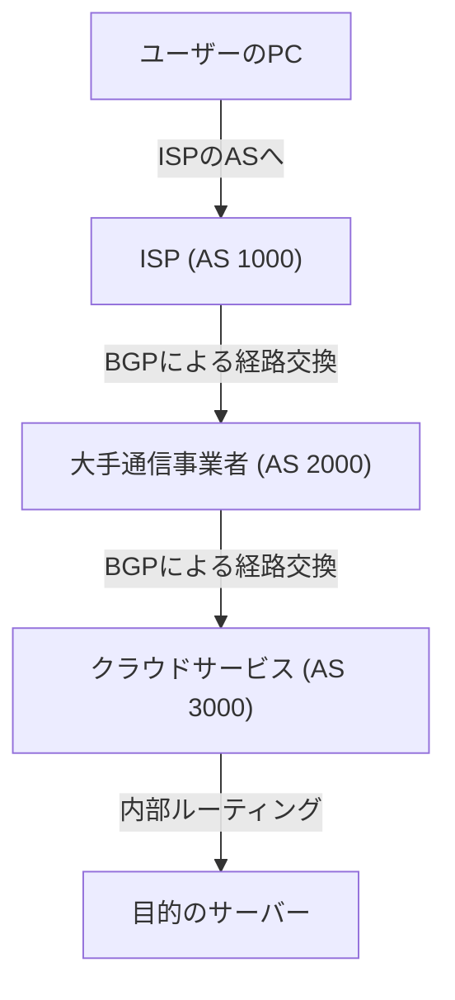

インターネットは単一の巨大なネットワークだと思われがちですが、実際には「AS（Autonomous System：自律システム）」と呼ばれる無数の独立したネットワークの集合体です。GoogleやAmazonのような巨大IT企業、各国のISP（インターネットサービスプロバイダ）、大学、そして大企業など、数万にも及ぶASが相互に接続し合うことで、私たちが日々利用する「インターネット」が形成されています。

では、この広大で複雑なネットワークの中で、データ（パケット）はどのようにして目的地までの最適な経路を見つけ出しているのでしょうか。その答えが「**BGP（Border Gateway Protocol）**」です。

本記事では、インターネットの根幹を支える巨大ルーティング技術であるBGPの仕組み、その重要性、そして抱える課題について詳しく解説します。

## 1. BGPとは何か？

BGP（Border Gateway Protocol）は、インターネット上で異なるAS同士が経路情報を交換するためのルーティングプロトコルです。TCP/IPやDNSと並び、現代のインターネットインフラにおいて最も重要な技術の一つと言えます。

社内ネットワークなどの単一AS内で使用されるIGP（OSPFやIS-ISなど）が「建物の内部の案内図」だとすれば、BGPは「都市間の高速道路網の地図」に例えられます。BGPは、世界中にあるルーターに「どのネットワークを通れば目的地に到達できるか」という道順を教え合う役割を担っています。

### BGPの主な特徴

*   **パスベクタ型プロトコル**: BGPは、目的地までの「距離」だけでなく、「どのASを経由してきたか（ASパス）」という情報を持っています。これにより、ルーティングのループを防止し、より複雑なポリシーに基づいた経路選択が可能になります。
*   **TCPベースの通信**: BGPはTCPポート179番を使用してピア（隣接ルーター）と通信を行います。これにより、経路情報の確実な伝達が保証されます。
*   **差分アップデート**: 最初に全経路情報を交換した後は、変更があった部分のみをアップデートとして送信するため、帯域幅の消費を抑えることができます。

## 2. インターネットを構成する「AS（自律システム）」

BGPを理解する上で欠かせないのが「AS（Autonomous System）」の概念です。

ASは、単一の明確なルーティングポリシーを持つIPネットワークの集合体であり、それぞれに固有の「AS番号（ASN）」が割り当てられています。例えば、大手ISPは自身のAS番号を持ち、顧客企業のネットワークをインターネットに接続します。

AS同士の接続形態には、主に以下の2種類があります。

1.  **トランジット（Transit）**: 一方のASが他方のASに対して、インターネット全体への接続性を提供する（通常は有料）関係。
2.  **ピアリング（Peering）**: 2つのASが相互のネットワーク（およびその顧客）にトラフィックを直接交換する（多くの場合、無償）関係。

BGPは、これらのビジネス的な関係性（ポリシー）をルーティングに反映させるための強力な機能を持っています。

## 3. BGPによる経路選択のメカニズム

BGPルーターは、複数の隣接ルーター（ピア）から同じ目的地に対する複数の経路情報を受け取ることがあります。その中から最適な「ベストパス」を一つだけ選ぶために、BGPは複雑なアルゴリズムを使用します。

BGPの経路選択は、単なる「最短距離」ではありません。各ルーターは、以下のような複数の属性（Attribute）を順番に比較してベストパスを決定します。

1.  **Weight（ウェイト）**: Cisco独自の属性。ルーター内部で設定され、最も高い値が優先されます。
2.  **Local Preference（ローカルプリファレンス）**: AS内で共有される属性。特定の出口ルーターを優先させたい場合に使用され、高い値が優先されます。
3.  **Originate（生成元）**: 自身が生成した経路（ネットワークコマンドや再配送など）を優先します。
4.  **AS_PATH長**: 経由するASの数が最も少ない経路を優先します（一般的な「最短経路」の概念に最も近いもの）。
5.  **Origin（起源）**: 経路の出所（IGP、EGP、Incomplete）を比較し、IGPが最も優先されます。
6.  **MED（Multi-Exit Discriminator）**: 隣接するASに対して、どの入り口からトラフィックを入れてほしいかを伝える属性。低い値が優先されます。

このように、BGPは技術的な効率性だけでなく、「どの回線を通せばコストが安いか」「どのISPを経由させたいか」といった、ネットワーク管理者の**意図やビジネス上の都合（ポリシー）**を細かく設定できるようになっています。

## 4. BGPが抱える課題と脆弱性

インターネットの規模が爆発的に拡大する中で、BGPはその柔軟性と拡張性により見事に適応してきました。しかし、設計が古いため、いくつかの重大な課題や脆弱性を抱えています。

### 4-1. 経路ハイジャック（BGP Hijacking）

BGPは基本的に「性善説」に基づいて設計されています。つまり、他のルーターから送られてきた経路情報を疑わずに信用してしまいます。

もし、あるASが誤って（あるいは悪意を持って）「自分が特定のIPアドレス帯の所有者である」という偽の経路情報をアナウンスした場合、インターネット上のトラフィックがそのASに吸い込まれてしまうことがあります。これが「経路ハイジャック」です。

過去には、設定ミスによってYouTubeのトラフィックがパキスタンのISPに吸い込まれて世界中からアクセスできなくなったり、暗号資産の通信が傍受されたりする事件が発生しています。

### 4-2. 経路リーク（Route Leak）

設定ミスにより、本来他へ流すべきではない経路情報を誤ってアナウンスしてしまう現象です。これにより、意図しないトラフィックが小規模なISPに集中し、大規模なネットワーク障害を引き起こすことがあります。

### 4-3. ルーティングテーブルの肥大化

インターネットに接続されるネットワークが増え続けるにつれ、世界の全経路情報（フルルート）を保持するBGPルーターの負担は増大し続けています。現在、IPv4のフルルートは90万経路を超えており、これらを高速に処理するためには非常に高性能で高価なルーターが必要となります。

## 5. BGPのセキュリティを強化する取り組み

これらの課題に対処するため、インターネットコミュニティでは様々な対策が進められています。

*   **RPKI (Resource Public Key Infrastructure)**: IPアドレスの所有権を暗号学的に証明する仕組みです。ROA (Route Origin Authorization) というデジタル証明書を発行し、BGPで受信した経路情報の送信元が正当な所有者であるかを検証（Origin Validation）します。これにより、経路ハイジャックを大幅に防ぐことができます。
*   **IRR (Internet Routing Registry)**: ルーティングポリシーを登録するデータベース。ISPはこれを利用して、顧客からの経路アナウンスが正しいものかをフィルタリングします。
*   **MANRS (Mutually Agreed Norms for Routing Security)**: ルーティングの安全性を高めるためのベストプラクティスを遵守するグローバルな取り組み。多くの主要なISPやクラウド事業者が参加しています。

## 6. まとめ

BGPは、世界中のネットワークを一つに繋ぎ合わせる「インターネットの接着剤」のような存在です。私たちが毎日当たり前のようにウェブサイトを閲覧し、動画を視聴できるのは、裏側で無数のBGPルーターが絶え間なく最適な道順を計算し、パケットを運んでくれているからです。

設定の複雑さやセキュリティ上の脆弱性など、BGPにはまだ多くの課題が残されています。しかし、RPKIなどの新しい技術の導入によって、インターネットはより安全で信頼性の高いインフラへと進化し続けています。

ネットワークエンジニアだけでなく、ITに関わるすべての人がBGPの基本的な仕組みを理解することは、インターネットという巨大なシステムの全体像を掴む上で非常に有益と言えるでしょう。
