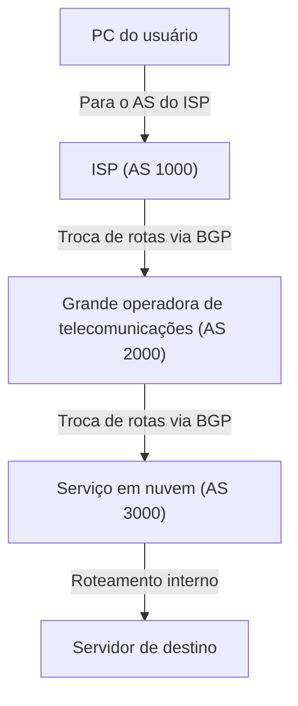

É comum pensar na internet como uma rede única e colossal, mas, na realidade, ela é uma coleção de incontáveis redes independentes conhecidas como "AS (Autonomous System: Sistema Autônomo)". Dezenas de milhares de ASes — abrangendo gigantes da tecnologia como Google e Amazon, provedores de serviços de internet (ISPs) de vários países, universidades e grandes corporações — conectam-se mutuamente para formar a "internet" que utilizamos todos os dias.

Mas como os dados (pacotes) encontram a rota ideal até o seu destino dentro dessa rede vasta e complexa? A resposta é o "**BGP (Border Gateway Protocol)**".

Neste artigo, explicamos em detalhes o funcionamento do BGP — a gigantesca tecnologia de roteamento que sustenta a espinha dorsal da internet —, a sua importância e os desafios que enfrenta.

## 1. O que é o BGP?

O BGP (Border Gateway Protocol) é um protocolo de roteamento utilizado para trocar informações de rotas entre diferentes ASes na internet. Ao lado do TCP/IP e do DNS, pode-se dizer que é uma das tecnologias mais fundamentais da infraestrutura moderna da internet.

Se compararmos os IGPs (como OSPF e IS-IS), usados dentro de um único AS (como uma rede corporativa interna), a uma "planta interna de um edifício", o BGP pode ser comparado a um "mapa da malha rodoviária entre cidades". O BGP desempenha o papel de instruir mutuamente os roteadores em todo o mundo sobre "qual rede atravessar para chegar ao destino".

### Principais características do BGP

*   **Protocolo de vetor de caminhos (Path Vector)**: O BGP mantém não apenas a "distância" até o destino, mas também informações sobre "por quais ASes o pacote passou (AS-Path)". Isso evita loops de roteamento e possibilita a seleção de rotas com base em políticas mais complexas.
*   **Comunicação baseada em TCP**: O BGP se comunica com seus pares (roteadores vizinhos) usando a porta TCP 179. Isso garante a entrega confiável das informações de roteamento.
*   **Atualizações incrementais (diferenciais)**: Após a troca inicial de todas as informações de rota, apenas as alterações ocorridas são enviadas como atualizações, economizando o consumo de largura de banda.

## 2. Os "AS (Sistemas Autônomos)" que compõem a internet

Para entender o BGP, o conceito de "AS (Autonomous System)" é indispensável.

Um AS é um agrupamento de redes IP gerenciadas sob uma política de roteamento única e claramente definida, com um "Número de Sistema Autônomo (ASN)" exclusivo atribuído a cada um. Por exemplo, os grandes ISPs possuem seus próprios ASNs e conectam as redes de seus clientes empresariais à internet.

Existem principalmente dois tipos de relacionamento de conexão entre ASes:

1.  **Trânsito (Transit)**: Relação na qual um AS fornece a outro AS conectividade com toda a internet (geralmente mediante pagamento).
2.  **Peering**: Relação em que dois ASes trocam tráfego diretamente entre suas respectivas redes (e de seus clientes), na maioria dos casos sem cobrança mútua.

O BGP possui recursos poderosos para refletir esses relacionamentos comerciais (políticas) nas decisões de roteamento.

## 3. O mecanismo de seleção de rotas do BGP

Um roteador BGP pode receber múltiplos anúncios de rota para o mesmo destino a partir de vários roteadores vizinhos (peers). Para escolher apenas uma "melhor rota" (Best Path) entre elas, o BGP utiliza um algoritmo refinado.

A seleção de rotas do BGP não se baseia simplesmente na "distância mais curta". Cada roteador compara sucessivamente múltiplos atributos (Attributes) na ordem a seguir para determinar o melhor caminho:

1.  **Weight (Peso)**: Atributo proprietário da Cisco. Configurado localmente no roteador; o maior valor tem preferência.
2.  **Local Preference (Preferência Local)**: Atributo compartilhado dentro do AS. Utilizado para priorizar um roteador de saída específico; o maior valor tem preferência.
3.  **Originate (Origem Local)**: Rotas originadas pelo próprio roteador (via comando network, redistribuição, etc.) têm preferência.
4.  **Comprimento do AS_PATH**: Prioriza a rota com o menor número de ASes intermediários (o que mais se aproxima do conceito geral de "menor caminho").
5.  **Origin (Código de Origem)**: Compara a origem da rota (IGP, EGP, Incomplete); o IGP tem a maior prioridade.
6.  **MED (Multi-Exit Discriminator)**: Atributo que informa a um AS vizinho por qual ponto de entrada ele deve enviar o tráfego; o menor valor tem prioridade.

Dessa forma, o BGP permite definir com precisão não apenas a eficiência técnica, mas também a **intenção e os interesses comerciais (políticas)** dos administradores de rede, como "qual link tem menor custo" ou "por qual ISP devemos enviar o tráfego".

## 4. Desafios e vulnerabilidades do BGP

Com a expansão exponencial da internet, o BGP adaptou-se com sucesso graças à sua flexibilidade e escalabilidade. No entanto, por ter sido concebido há décadas, ele apresenta vulnerabilidades e desafios significativos.

### 4-1. Sequestro de rotas (BGP Hijacking)

O BGP foi projetado originalmente com base em uma premissa de confiança mútua. Em outras palavras, ele confia nas informações de rota recebidas de outros roteadores sem validação intrínseca.

Se um AS anunciar, por engano ou maliciosamente, uma rota falsa afirmando "eu sou o detentor deste bloco de endereços IP específico", o tráfego da internet pode ser desviado e absorvido por esse AS. Esse fenômeno é conhecido como "sequestro de rotas" (BGP Hijacking).

No passado, incidentes notórios já ocorreram: devido a um erro de configuração, o tráfego do YouTube foi desviado para um ISP no Paquistão, tornando a plataforma inacessível globalmente; em outros casos, comunicações envolvendo criptoativos foram interceptadas.

### 4-2. Vazamento de rotas (Route Leak)

Ocorre quando informações de rota que não deveriam ser propagadas externamente são anunciadas por engano devido a falhas de configuração. Isso pode fazer com que um volume imenso de tráfego não planejado convirja para um ISP de menor porte, provocando interrupções e lentidões em grande escala na rede.

### 4-3. Crescimento excessivo da tabela de roteamento

À medida que o número de redes conectadas à internet continua aumentando, o fardo sobre os roteadores BGP que mantêm a tabela de rotas globais completa (Full Route) cresce sem parar. Atualmente, a Full Route do IPv4 já ultrapassa 900.000 prefixos, exigindo roteadores de altíssimo desempenho e custo elevado para processar essas tabelas em alta velocidade.

## 5. Iniciativas para fortalecer a segurança do BGP

Para mitigar esses desafios, a comunidade da internet tem implementado diversas contramedidas:

*   **RPKI (Resource Public Key Infrastructure)**: Um mecanismo que comprova criptograficamente a titularidade de blocos de endereços IP. Por meio da emissão de certificados digitais chamados ROA (Route Origin Authorization), valida-se se a origem da informação de rota recebida via BGP é o legítimo detentor do prefixo (Origin Validation). Isso previne amplamente os sequestros de rotas.
*   **IRR (Internet Routing Registry)**: Um banco de dados distribuído onde políticas de roteamento são registradas. Os provedores utilizam essa base para filtrar e validar os anúncios de rotas enviados por seus clientes.
*   **MANRS (Mutually Agreed Norms for Routing Security)**: Uma iniciativa global que promove a adesão às melhores práticas de segurança de roteamento. Inúmeros ISPs e provedores de nuvem líderes participam dessa aliança.

## 6. Conclusão

O BGP atua como a verdadeira "cola da internet", conectando redes do mundo inteiro em um ecossistema unificado. O fato de podermos navegar em sites e assistir a vídeos diariamente com naturalidade se deve a incontáveis roteadores BGP que trabalham nos bastidores, calculando continuamente os melhores caminhos e encaminhando pacotes.

Apesar da complexidade de configuração e das vulnerabilidades de segurança inerentes ao seu projeto original, o BGP continua evoluindo com a adoção de tecnologias modernas como o RPKI, tornando a internet uma infraestrutura cada vez mais segura e resiliente.

Compreender o funcionamento básico do BGP é extremamente valioso não apenas para engenheiros de redes, mas para todos os profissionais de TI que desejam ter uma visão abrangente e sólida de como funciona esse gigantesco sistema global que chamamos de internet.
