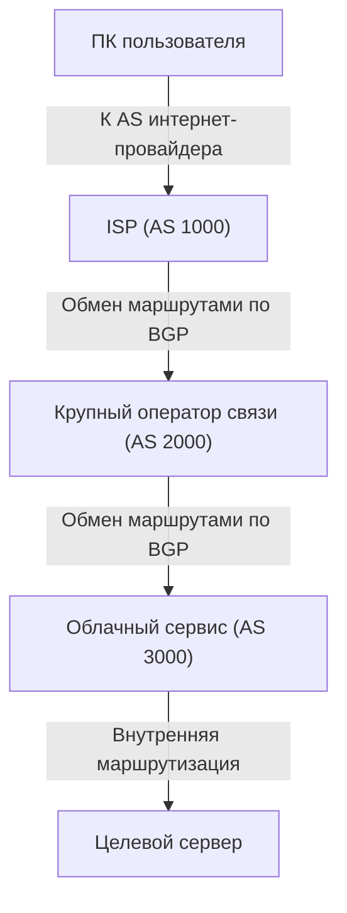

Принято считать, что интернет — это единая гигантская сеть, однако на самом деле он представляет собой совокупность бесчисленного множества независимых сетей, называемых «автономными системами» (AS, Autonomous System). Интернет, которым мы пользуемся каждый день, формируется благодаря взаимному соединению десятков тысяч AS: технологических гигантов вроде Google и Amazon, интернет-провайдеров (ISP) по всему миру, университетов и крупных корпораций.

Но как же в этой огромной и сложной сети данные (пакеты) находят оптимальный маршрут до места назначения? Ответ кроется в протоколе **BGP (Border Gateway Protocol)**.

В этой статье мы подробно разберем принцип работы BGP — фундаментальной технологии маршрутизации, обеспечивающей функционирование интернета, — ее важность, а также присущие ей проблемы и уязвимости.

## 1. Что такое BGP?

BGP (Border Gateway Protocol, протокол граничного шлюза) — это протокол маршрутизации, используемый для обмена маршрутной информацией между различными автономными системами (AS) в интернете. Наряду с TCP/IP и DNS он по праву считается одной из важнейших технологий современной интернет-инфраструктуры.

Если протоколы внутреннего шлюза IGP (такие как OSPF или IS-IS), применяемые внутри одной AS (например, корпоративной сети), можно сравнить со «схемой помещений внутри здания», то BGP — это «карта сети междугородных автомагистралей». BGP позволяет маршрутизаторам по всему миру сообщать друг другу направления: «через какую сеть нужно пройти, чтобы добраться до нужного пункта назначения».

### Основные особенности BGP

*   **Дистанционно-векторный протокол с учетом пути (Path-Vector Protocol)**: BGP оперирует не только «расстоянием» до цели, но и хранит информацию о том, через какие именно AS пролегал маршрут (AS-Path). Это предотвращает образование маршрутных петель (routing loops) и позволяет выбирать маршруты на основе гибких и сложных политик.
*   **Связь на базе TCP**: BGP взаимодействует с пирами (соседними маршрутизаторами) по порту TCP 179. Это гарантирует надежную и упорядоченную доставку маршрутной информации.
*   **Инкрементальные (разностные) обновления**: После первоначального обмена полной таблицей маршрутизации в дальнейшем передаются только произошедшие изменения, что позволяет минимизировать потребление пропускной способности сети.

## 2. Автономные системы (AS), формирующие интернет

Для понимания BGP ключевым является понятие «автономной системы» (Autonomous System, AS).

AS — это совокупность IP-сетей с единой четко определенной политикой маршрутизации, каждой из которых присваивается уникальный номер — ASN (Autonomous System Number). Например, крупные интернет-провайдеры имеют собственные номера AS и подключают сети клиентов к глобальному интернету.

Существуют два основных типа межсетевого взаимодействия между AS:

1.  **Транзит (Transit)**: соглашение, при котором одна AS предоставляет другой AS доступ ко всему интернету (как правило, на платной основе).
2.  **Пиринг (Peering)**: прямое взаимное соединение двух AS для прямого обмена трафиком между их сетями (и их клиентами), чаще всего на безвозмездной основе.

BGP обладает мощными инструментами, позволяющими отражать эти деловые договоренности (политики) непосредственно в правилах маршрутизации.

## 3. Механизм выбора маршрута в BGP

Маршрутизатор BGP может получать от нескольких соседних маршрутизаторов (пиров) разные маршруты до одного и того же пункта назначения. Чтобы выбрать из них единственный наилучший маршрут (Best Path), протокол использует четко регламентированный алгоритм.

Выбор маршрута в BGP не сводится к банальному «кратчайшему расстоянию». Каждый маршрутизатор последовательно сравнивает ряд атрибутов (Path Attributes) маршрута в строгом порядке:

1.  **Weight (Вес)**: проприетарный атрибут Cisco. Настраивается локально на маршрутизаторе; предпочтение отдается наибольшему значению.
2.  **Local Preference (Локальное предпочтение)**: атрибут, передаваемый внутри одной AS. Используется для выбора предпочитаемого маршрутизатора выхода из AS; предпочтение отдается наибольшему значению.
3.  **Originate (Источник маршрута)**: предпочтение отдается маршрутам, сгенерированным локально на данном маршрутизаторе (через команду network или редистрибуцию).
4.  **Длина AS_PATH (AS-Path Length)**: предпочтение отдается маршруту с наименьшим количеством промежуточных AS (наиболее близко к классическому понятию «кратчайшего пути»).
5.  **Origin (Тип происхождения)**: сравнивается способ попадания маршрута в BGP (IGP, EGP, Incomplete); наивысший приоритет имеет IGP.
6.  **MED (Multi-Exit Discriminator)**: атрибут, сообщающий соседней AS, через какую точку входа предпочтительнее направлять входящий трафик; предпочтение отдается наименьшему значению.

Таким образом, BGP позволяет учитывать не только техническую эффективность, но и детально настраивать **намерения и бизнес-требования (политики)** сетевых администраторов — например, «какой канал обходится дешевле» или «через какого провайдера предпочтительнее пускать трафик».

## 4. Проблемы и уязвимости BGP

В условиях взрывного роста масштабов интернета BGP блестяще справлялся с нагрузкой благодаря своей гибкости и масштабируемости. Однако, будучи разработанным много лет назад, протокол несет в себе ряд серьезных проблем и уязвимостей.

### 4-1. Перехват маршрутов (BGP Hijacking)

BGP изначально строился на модели полного доверия: по умолчанию маршрутизатор безоговорочно доверяет маршрутной информации, полученной от других пиров.

Если какая-либо AS по ошибке (или злонамеренно) анонсирует ложную информацию о том, что именно она владеет определенным диапазоном IP-адресов, интернет-трафик может перенаправиться к этой AS. Это явление называется «перехватом маршрута» (BGP Hijacking).

В истории уже случались резонансные инциденты: из-за ошибок в конфигурации весь мировой трафик YouTube был ошибочно перенаправлен к пакистанскому провайдеру, сделав сервис недоступным по всему миру, а в других случаях злоумышленникам удавалось перехватывать конфиденциальный трафик сервисов криптовалют.

### 4-2. Утечка маршрутов (Route Leak)

Это явление возникает, когда из-за ошибок конфигурации маршрутная информация распространяется за пределы согласованных границ. В результате непредусмотренный колоссальный объем трафика может обрушиться на небольшого провайдера, вызывая масштабные сбои в работе сети.

### 4-3. Разрастание таблицы маршрутизации

По мере непрерывного подключения новых сетей к интернету нагрузка на BGP-маршрутизаторы, хранящие полную глобальную таблицу маршрутизации («full view» / фулл-вью), неуклонно возрастает. На сегодняшний день число маршрутов IPv4 в full view превышает 900 000, и для их оперативной обработки требуются крайне производительные и дорогостоящие маршрутизаторы.

## 5. Меры по повышению безопасности BGP

Для решения этих проблем интернет-сообщество внедряет комплекс защитных мер:

*   **RPKI (Resource Public Key Infrastructure)**: инфраструктура открытых ключей для криптографического подтверждения прав владения IP-адресами. С помощью цифровых сертификатов ROA (Route Origin Authorization) маршрутизаторы могут проверять подлинность источника анонсируемого маршрута (Origin Validation). Это позволяет эффективно предотвращать перехват маршрутов (BGP Hijacking).
*   **IRR (Internet Routing Registry)**: базы данных для регистрации политик маршрутизации. Интернет-провайдеры используют IRR для фильтрации анонсов клиентов и проверки их легитимности.
*   **MANRS (Mutually Agreed Norms for Routing Security)**: глобальная инициатива, продвигающая применение лучших практик для обеспечения безопасности маршрутизации. В ней участвуют многие ведущие интернет-провайдеры и облачные платформы.

## 6. Заключение

BGP — это своего рода «клей интернета», связывающий воедино сети по всему миру. Мы привыкли ежедневно беспрепятственно открывать сайты и смотреть потоковое видео именно потому, что за кулисами бесчисленные маршрутизаторы BGP непрерывно вычисляют оптимальные маршруты и передают сетевые пакеты.

Несмотря на сложности конфигурации и уязвимости безопасности, протокол продолжает развиваться. Благодаря внедрению таких технологий, как RPKI, глобальный интернет становится всё более надежной и защищенной инфраструктурой.

Понимание базовых принципов BGP полезно не только сетевым инженерам, но и любым IT-специалистам, стремящимся увидеть целостную картину устройства современного интернета.
