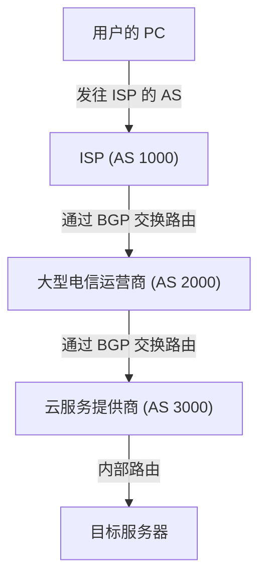

人们往往认为互联网是一个单一且庞大的网络，但实际上，它是由无数被称为“AS（Autonomous System，自治系统）”的独立网络组合而成的集合体。包括 Google、Amazon 等大型科技巨头，各国的 ISP（互联网服务提供商），大学以及各大企业在内，数以万计的 AS 相互连接，才构成了我们日常所使用的“互联网”。

那么，在如此庞大而复杂的网络之中，数据（数据包）究竟是如何找到通往目的地的最优路径的呢？答案正是“**BGP（Border Gateway Protocol，边界网关协议）**”。

本文将深入剖析作为互联网基石的宏大路由技术——BGP 的工作原理、核心重要性及其面临的现实挑战。

## 1. 什么是 BGP？

BGP（Border Gateway Protocol，边界网关协议）是互联网上不同 AS 之间用于交换路由信息的路由协议。它与 TCP/IP、DNS 并列，被公认为现代互联网基础设施中最重要的核心技术之一。

如果将企业内网等单一 AS 内部所使用的 IGP（内部网关协议，如 OSPF、IS-IS 等）比作“建筑物内部的平面导览图”，那么 BGP 就相当于“连接各大城市的城际高速公路网地图”。BGP 承担着向分布在全球的路由器相互告知“途经哪些网络能够到达目的地”这一路线指引的关键职责。

### BGP 的主要特性

*   **路径矢量协议（Path-Vector Protocol）**：BGP 不仅记录到达目的地的“距离”，更完整记录了“途经了哪些 AS（AS_PATH，自治系统路径）”。这不仅能够有效防止路由环路，还能支持基于复杂策略的路径选择。
*   **基于 TCP 的通信**：BGP 使用 TCP 179 端口与对等体（Peer，相邻路由器）建立连接并进行通信，从而确保了路由信息传输的可靠性。
*   **增量更新（Incremental Updates）**：在初次交换全量路由信息后，后续仅在网络发生变化时发送差异更新，从而大幅降低了网络带宽的开销。

## 2. 构成互联网的“AS（自治系统）”

要理解 BGP，首先必须掌握“AS（Autonomous System，自治系统）”的概念。

AS 是指拥有单一且明确的路由策略的 IP 网络集合体，每个 AS 都会被分配一个全球唯一的“AS 号码（ASN）”。例如，大型 ISP 都拥有自己的 AS 编号，并将客户企业的网络接入互联网。

AS 之间的互联模式主要有以下两种：

1.  **转接（Transit）**：一个 AS 向另一个 AS 提供访问整个互联网的连通性（通常为付费服务）的商业关系。
2.  **对等互联（Peering）**：两个 AS 之间相互直接交换彼此网络（及其客户网络）流量（通常为免费模式）的关系。

BGP 具备强大的路由策略调控能力，能够将这些商业合作关系与策略灵活地反映在实际的路由选择中。

## 3. BGP 的选路决策机制

BGP 路由器常常会从多个对等体（Peer）处接收到指向同一目的地的多条路由信息。为了从中遴选出一条最优的“最佳路径（Best Path）”，BGP 采用了一套严谨且细致的决策算法。

BGP 的选路并非简单考量物理上的“最短距离”。每台路由器会按固定优先级依次比较以下多个路径属性（Attributes），从而裁定最优路径：

1.  **Weight（权重）**：Cisco 私有属性。仅在本地路由器有效，数值越大越优先。
2.  **Local Preference（本地优先级）**：在整个 AS 内部传递并共享的属性。用于指定离开本 AS 的首选出口路由器，数值越大越优先。
3.  **Originate（本地起源）**：优先选择由本地路由器自身生成的路由（例如通过 network 命令注入或重分发进入的路由）。
4.  **AS_PATH 长度**：优先选择所经过 AS 数量最少的路由（最接近传统意义上的“最短路径”概念）。
5.  **Origin（起源代码）**：比较路由的起源类型（IGP、EGP、Incomplete），优先级顺序为 IGP > EGP > Incomplete。
6.  **MED（Multi-Exit Discriminator，多出口鉴别器）**：告知相邻 AS 进入本 AS 时推荐使用的入口。数值越小越优先。

由此可见，BGP 不仅兼顾技术上的传输效率，更能让网络工程师细粒度地贯彻“走哪条链路成本更低”、“期望经由哪个 ISP 转发”等**管理意图与商业策略（Policy）**。

## 4. BGP 面临的挑战与安全隐患

随着互联网规模爆发式增长，BGP 凭借其极高的灵活性与可扩展性成功经受住了考验。然而，受限于其诞生初期的历史背景与架构设计，BGP 也存在若干严重的隐患与脆弱性。

### 4-1. 路由劫持（BGP Hijacking）

BGP 最初是建立在“完全信任（性善论）”的前提下设计的。这意味着路由器默认会信任相邻对等体发送过来的所有路由通告。

如果某个 AS 意外配置错误（或蓄意恶意）向外发布了虚假路由通告，声称“自己拥有某段特定 IP 地址前缀”，互联网上发往该网段的流量就会被引流劫持至该 AS。这就是所谓的“BGP 路由劫持”。

历史上曾发生过多起著名事件：例如由于配置失误导致全球发往 YouTube 的访问流量全部涌向巴基斯坦某 ISP，造成全球性服务中断；亦或是黑客利用 BGP 劫持窃听并盗取加密货币资产流量等。

### 4-2. 路由泄露（Route Leak）

这是指由于网络配置错误，将本不应向外传播的路由通告错误地宣告给了其他 AS 的现象。这会导致不受预期的海量流量异常集中到小规模的 ISP 网络中，进而诱发大规模的网络拥塞与瘫痪。

### 4-3. 全球路由表持续膨胀

随着接入互联网的网络数量持续激增，承载全球完整路由表（Full Route，全路由）的核心 BGP 路由器面临着与日俱增的内存与算力负荷。目前，IPv4 全球路由条目已突破 90 万条大关，要对其进行线速处理与高频震荡收敛，必须依赖造价高昂的高性能硬件路由器。

## 5. 加固 BGP 安全的行业实践与倡议

针对上述结构性风险，全球互联网社群一直在积极推动多层次的防御与治理方案：

*   **RPKI（Resource Public Key Infrastructure，资源公钥基础设施）**：一种利用密码学手段证明 IP 地址段所有权的机制。通过签发 ROA（Route Origin Authorization，路由起始授权）数字证书，路由器能够对收到的 BGP 路由通告其源头 AS 是否合法进行严格验证（Origin Validation），从而在根本上遏制大部分路由劫持攻击。
*   **IRR（Internet Routing Registry，互联网路由注册库）**：用于登记并共享网络路由策略的分布式数据库。ISP 能够利用 IRR 规则生成精确的路由过滤器，对客户上报的路由通告实施严密的有效性校验。
*   **MANRS（Mutually Agreed Norms for Routing Security，路由安全相互协议规范）**：旨在提升全球路由安全的行业基准与国际行动倡议。全球主流的大型 ISP、云厂商和网络运营商均已加入该倡议并践行其安全基线准则。

## 6. 总结

BGP 就如同一剂“将全球网络紧密粘合在一起的粘合剂”。我们日常能够顺畅无阻地浏览网页、观看高清视频，背后都离不开遍布世界各地的海量 BGP 路由器在每分每秒进行着最优路径计算与数据包中继转送。

尽管 BGP 在配置复杂度与固有安全隐患方面仍面临不少挑战，但随着 RPKI 等新型安全防御体系的推广与普及，互联网正在向着更加稳固可靠的基础设施持续演进。

无论是网络工程师，还是广大的 IT 从业人员，深入理解 BGP 的基本工作原理，都将为把握当今宏大互联网架构的全貌带来极具价值的宏观视角。
