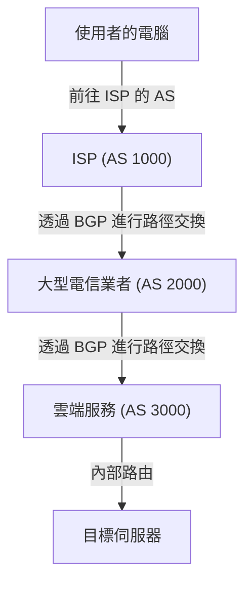

很多人常以為網際網路是一個單一且龐大的網路，但實際上，它是由無數個被稱為「AS（Autonomous System，自治系統）」的獨立網路所組成的集合體。包括 Google 和 Amazon 等大型科技巨頭、各國的 ISP（網際網路服務供應商）、大學以及各大型企業等，數以萬計的 AS 彼此相互連接，才構成了我們日常所使用的「網際網路」。

那麼，在這個廣大而複雜的網路中，資料（封包）究竟是如何找到通往目的地的最佳路徑呢？答案就是「**BGP（Border Gateway Protocol，邊界閘道協定）**」。

本文將深入解析這項支撐網際網路根基的龐大路由技術——BGP 的運作機制、其重要性以及目前所面臨的各項課題。

## 1. 什麼是 BGP？

BGP（Border Gateway Protocol，邊界閘道協定）是用於在網際網路上交換不同 AS 之間路徑資訊的路由協定。它與 TCP/IP 和 DNS 並列，堪稱現代網際網路基礎設施中最核心的技術之一。

如果說企業內部網路等單一 AS 內所使用的 IGP（如 OSPF 或 IS-IS 等）是「建築物內部的導覽圖」，那麼 BGP 就好比「城市間的高速公路路網地圖」。BGP 扮演著向全世界的路由器互相傳遞「途經哪個網路才能抵達目的地」這項路線指南的角色。

### BGP 的主要特徵

*   **路徑向量協定（Path Vector Protocol）**: BGP 不僅具備通往目的地的「距離」，還記錄了「途經了哪些 AS（AS_PATH，自治系統路徑）」的資訊。藉由此機制，能夠有效防止路由迴圈（Routing Loop），並實現基於更複雜原則（Policy）的路徑選擇。
*   **基於 TCP 的通訊**: BGP 使用 TCP 連接埠 179 與對等節點（Peer，相鄰路由器）進行通訊，從而保證了路徑資訊的可靠傳遞。
*   **增量更新（Incremental Update）**: 在最初交換完整的路由資訊之後，後續僅針對產生變動的部分傳送更新，進而大幅節省頻寬消耗。

## 2. 構成網際網路的「AS（自治系統）」

要深入理解 BGP，就必須先掌握「AS（Autonomous System）」的概念。

AS 是擁有單一且明確路由原則（Routing Policy）的 IP 網路集合體，每一個 AS 都被分配了一個專屬的「AS 號碼（ASN）」。例如，大型 ISP 擁有自己的 AS 號碼，並將其企業客戶的網路連接至網際網路上。

AS 之間的連線型態主要分為以下兩種：

1.  **轉訊（Transit）**: 一方 AS 向另一方 AS 提供連接至全球網際網路的連線能力（通常為付費）之關係。
2.  **對等互連（Peering）**: 兩個 AS 彼此直接交換雙方網路（及其客戶）之間流量（多數情況下為免費）之關係。

BGP 擁有強大的功能，能將這些商業夥伴關係（原則／Policy）直接反映在路由決策之中。

## 3. BGP 的路徑選擇機制

BGP 路由器經常會從多個相鄰路由器（Peer）收到通往同一目的地的多條路徑資訊。為了從中選出一條唯一的「最佳路徑（Best Path）」，BGP 採用了複雜的演算法。

BGP 的路徑選擇絕非單純取決於「最短距離」。每台路由器都會依序比對以下多個屬性（Attribute），從而決定最佳路徑：

1.  **Weight（權重）**: Cisco 專屬屬性。僅在路由器本機內部設定，數值最高者優先。
2.  **Local Preference（本地優先級）**: 在 AS 內部共享的屬性。用於偏好特定出口路由器的情境，數值最高者優先。
3.  **Originate（產生來源）**: 優先選擇由本路由器自行產生的路由（例如透過 network 指令或重分配等方式）。
4.  **AS_PATH 長度**: 優先選擇途經 AS 數量最少的路徑（最接近傳統「最短路徑」的概念）。
5.  **Origin（起源代碼）**: 比對路徑的來源（IGP、EGP、Incomplete），以 IGP 優先級最高。
6.  **MED（Multi-Exit Discriminator，多出口鑑別器）**: 告知相鄰 AS 希望對方從哪個入口將流量導入的屬性。數值最低者優先。

由此可見，BGP 不僅追求技術上的效率，還能讓網路管理者細部設定「走哪條線路成本更低」、「偏好經過哪家 ISP」等**管理者的意圖與商業考量（原則／Policy）**。

## 4. BGP 面臨的課題與安全性弱點

在網際網路規模呈爆炸性成長的過程中，BGP 憑藉其高度的彈性與擴充性完美適應了各項變遷。然而，由於其初始設計年代久遠，現今也面臨著數個嚴峻的課題與安全漏洞。

### 4-1. 路由劫持（BGP Hijacking）

BGP 基本上是基於「性善說」的理念設計的。也就是說，路由器會預設毫不懷疑地信任由其他路由器傳送過來的路徑資訊。

一旦某個 AS 不慎（或出於惡意）發布（宣告）了虛假的路由資訊，聲稱「自己擁有特定的 IP 位址區段」，網際網路上的流量就有可能被全數導向並吸入該 AS。這就是所謂的「路由劫持」。

過去就曾發生過因人為設定錯誤，導致 YouTube 的流量被全數吸入巴基斯坦的 ISP，造成全球無法正常存取；或是加密貨幣的連線通訊遭到惡意竊聽攔截的嚴重事件。

### 4-2. 路由外洩（Route Leak）

這是指由於設定疏失，將原本不應傳播至其他網路的路徑資訊錯誤地宣告出去的現象。這會導致非預期的龐大流量集中灌入小規模的 ISP，進而引發大規模的網路癱瘓障礙。

### 4-3. 路由表膨脹（Routing Table Growth）

隨著連接至網際網路的網路數量持續增加，必須維護全世界所有路徑資訊（全域路由／Full Route）的 BGP 路由器負擔日益沉重。目前，IPv4 的全域路由數量已突破 90 萬筆，為了能高速處理這些路由表項，必須仰賴效能極高且造價昂貴的硬體路由器。

## 5. 強化 BGP 安全性的因應作為

為了應對這些挑戰，網際網路社群正積極推動各項防禦措施：

*   **RPKI (Resource Public Key Infrastructure)**: 以密碼學方式驗證 IP 位址擁有權的機制。透過核發稱為 ROA (Route Origin Authorization，路由來源授權) 的數位憑證，驗證 BGP 所收到的路徑資訊來源是否為合法擁有者（來源驗證／Origin Validation）。這能大幅防範路由劫持事件。
*   **IRR (Internet Routing Registry)**: 用於登錄路由原則的資料庫。ISP 可藉由查詢此資料庫，過濾並驗證來自客戶的路由宣告是否正確合規。
*   **MANRS (Mutually Agreed Norms for Routing Security)**: 旨在遵守提升路由安全最佳實踐的全球性倡議行動。目前眾多主流 ISP 與雲端服務供應商皆已積極參與。

## 6. 總結

BGP 就如同將全球網路緊密串聯在一起的「網際網路黏著劑」。我們每天習以為常地瀏覽網站、觀賞線上影片，背後都是因為有無數台 BGP 路由器在幕後不間斷地計算出最佳路線並傳輸封包。

儘管在設定的複雜度與安全性弱點上，BGP 仍存在許多待解的難題；但藉由導入 RPKI 等全新技術，網際網路正朝著更安全、更可靠的基礎設施持續進化。

不僅是網路工程師，對於所有從事 IT 領域的人來說，理解 BGP 的基本運作機制，對於掌握整個網際網路這套龐大系統的全貌而言，都具有極高的助益與價值。
