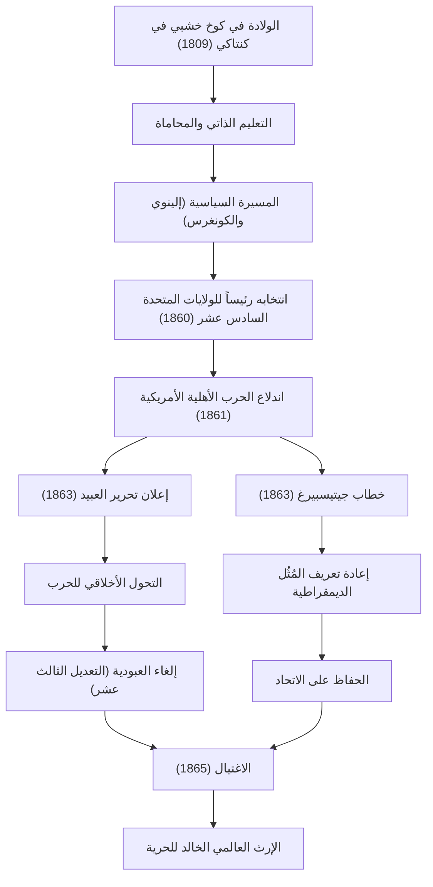

أبراهام لينكولن (Abraham Lincoln)، الرئيس السادس عشر للولايات المتحدة الأمريكية. يُعرف على نطاق واسع باسم "أبو تحرير العبيد"، وهو الشخصية التي تجاوزت أكبر أزمة منذ تأسيس البلاد، وهي الحرب الأهلية، ومنعت انقسام الأمة. لا تزال مقولته "حكومة الشعب، بالشعب، وللشعب" تُتداول حتى اليوم كمبدأ أساسي من مبادئ الديمقراطية.

في هذا المقال، سنتعمق مع الاستعانة بالرسوم التوضيحية في حياته العجيبة التي بدأها من كوخ خشبي حتى وصل إلى سدة الرئاسة، وإنسانيته العميقة وفلسفته الفريدة، وتأثيره الذي لا يُحصى والذي تركه للأجيال القادمة.

## الانطلاق من الشدائد: من كوخ خشبي إلى محامٍ علم نفسه بنفسه

في 12 فبراير 1809، وُلد لينكولن في كوخ خشبي متواضع في ولاية كنتاكي. أجبر في طفولته على عيش حياة الرواد الفقراء للغاية، ويُقال إن التعليم المدرسي الرسمي الذي تلقاه لم يتجاوز عاماً واحداً طوال حياته. ومع ذلك، فإن فضوله الفكري لم يفتر قط. التهم كل ما وقعت عليه يداه من كتب، بدءًا من الكتاب المقدس وأعمال شكسبير، وصولاً إلى كتب القانون، واستوعب المعرفة بتعليم نفسه بنفسه.

في شبابه، واصل دراسة القانون بينما كان يعمل في مهن مختلفة مثل بحار على القوارب المسطحة، ومساح، وموظف في متجر. عندما حصل على رخصة المحاماة في عام 1836، وبفضل شخصيته الصادقة وبلاغته المتميزة، اكتسب ثقة كبيرة في ولاية إلينوي. من هنا أصبح لقب "آيب الصادق" (Honest Abe) مرادفاً لاسمِه.

## دخول المسرح السياسي: معارضة توسع العبودية

بدأ لينكولن مسيرته السياسية كعضو في الهيئة التشريعية لولاية إلينوي. بعد ذلك، خدم لفترة واحدة في مجلس النواب الاتحادي، لكنه لفت انتباه الأمة بأكملها حقًا في أواخر خمسينيات القرن التاسع عشر، خلال الجدل حول توسع العبودية.

في ذلك الوقت، كانت أمريكا تعيش صراعاً عميقاً قسم البلاد بين الجنوب الذي طالب ببقاء العبودية، والشمال الذي طالب بإلغائها أو على الأقل منع توسعها. رغم أن لينكولن لم يطالب بالإلغاء الفوري للعبودية، إلا أنه عارض "توسعها" بشدة. في المناظرات العامة لانتخابات مجلس الشيوخ عام 1858 مع ستيفن دوغلاس (مناظرات لينكولن ودوغلاس)، ألقى خطابه الشهير "البيت المنقسم على نفسه لا يمكن أن يقف"، حيث ناشد الأمة بأكملها بضرورة إيجاد حل جذري لمشكلة العبودية.

## تنصيبه كرئيس السادس عشر واندلاع الحرب الأهلية

في الانتخابات الرئاسية لعام 1860، ترشح لينكولن عن الحزب الجمهوري، وحقق فوزاً بفضل الدعم الساحق من الولايات الشمالية، ليُنتخب كرئيس الولايات المتحدة السادس عشر. ومع ذلك، جعل انتخابه معارضة الولايات الجنوبية حتمية، فانفصلت الولايات الجنوبية الواحدة تلو الأخرى لتأسيس "الولايات المتلافية الأمريكية".

في أبريل 1861، بعد شهر واحد فقط من تنصيب لينكولن، اندلعت الحرب الأهلية الأمريكية (American Civil War). أصبحت هذه الحرب أكثر الحروب دموية ومأساوية في التاريخ الأمريكي. كان هدف لينكولن الأكبر هو "الحفاظ على الاتحاد"، وتوحيد الأمة المنقسمة. على الرغم من أن الوضع الأولي للحرب كان غير مواتٍ للشمال، إلا أنه قاد الجيش بروح لا تقهر ولم يستسلم أبداً حتى في ظل الظروف اليائسة.

## نقطة تحول تاريخية: إعلان تحرير العبيد وخطاب جيتيسبيرغ

مع إطالة أمد الحرب، اتخذ لينكولن قراراً بالغ الأهمية. ففي 1 يناير 1863، أصدر "إعلان تحرير العبيد" (Emancipation Proclamation). بموجب هذا الإعلان، تم التصريح قانونياً بتحرير العبيد في الولايات الجنوبية المتمردة. على الرغم من أن هذا الإعلان لم يحرر جميع العبيد فوراً، إلا أنه حمل أهمية تاريخية حيث حوّل هدف الحرب من مجرد "الحفاظ على الاتحاد" إلى "معركة من أجل حرية وكرامة الإنسان".

وفي نوفمبر من نفس العام، ألقى خطابه القصير الخالد في حفل تكريس المقبرة الوطنية في جيتيسبيرغ بولاية بنسلفانيا، التي كانت ساحة معركة طاحنة. عُرف هذا الخطاب بـ "خطاب جيتيسبيرغ". فيه، أعاد تأكيد مُثُل ولادة الأمة والحرية، وناشد بأن مهمة الأحياء هي ضمان ألا تتلاشى "حكومة الشعب، بالشعب، وللشعب" (Government of the people, by the people, for the people) من على وجه الأرض. عبّر هذا الخطاب الذي استغرق حوالي دقيقتين عن جوهر الديمقراطية الأمريكية ببراعة، وسيظل يُروى للأجيال القادمة إلى الأبد.

### مسار إنجازات لينكولن وتأثيرها

يوضح الرسم البياني التالي المعالم البارزة في حياة لينكولن ومسار التأثيرات التي أحدثتها سياساته.

## الاغتيال والتأثير على الأجيال القادمة: المُثُل الخالدة

في 9 أبريل 1865، استسلم الجنرال لي من الجيش الجنوبي، وانتهت أخيراً الحرب الأهلية المأساوية التي استمرت أربع سنوات. حقق لينكولن هدفيه العظيمين المتمثلين في الحفاظ على الاتحاد وإلغاء العبودية. استعداداً لإعادة الإعمار بعد الحرب (Reconstruction)، كان قد عقد العزم على اتخاذ موقف متسامح، مقدماً "عدم حمل ضغينة لأحد، والمحبة للجميع".

ولكن فرحة السلام لم تدم طويلاً. بعد خمسة أيام فقط من الاستسلام، في 14 أبريل 1865، وأثناء مشاهدته مسرحية في مسرح فورد في واشنطن العاصمة، تعرض لينكولن لإطلاق نار على يد الممثل والمتعاطف مع الجنوب جون ويلكس بوث، وتوفي في صباح اليوم التالي عن عمر يناهز 56 عاماً. لقد غادر هذا العالم دون أن يرى الأمة موحدة بالكامل.

أحدثت وفاة أبراهام لينكولن حزناً عميقاً في جميع أنحاء أمريكا، لكن الإرث الذي تركه لم يتلاشى. تم تحقيق الإلغاء الرسمي للعبودية بموجب التعديل الثالث عشر للدستور بعد وفاته، ولا تزال مُثُل الحرية والمساواة التي نادى بها تترك تأثيراً لا يُحصى على حركات حقوق الإنسان في جميع أنحاء العالم، بما في ذلك حركة الحقوق المدنية اللاحقة.

تعتبر حياة لينكولن تجسيداً للحلم الأمريكي، الذي يثبت أنه مهما كانت البداية فقيرة، فإن الإنجازات العظيمة ممكنة بالإرادة والجهد. في ظل أزمة غير مسبوقة متمثلة في انقسام الأمة، لا تزال قيادته، التي وجهت البلاد بفهم عميق للإنسانية وإيمان لا يتزعزع، تقدم لنا دروساً هامة في المجتمع الحديث.
