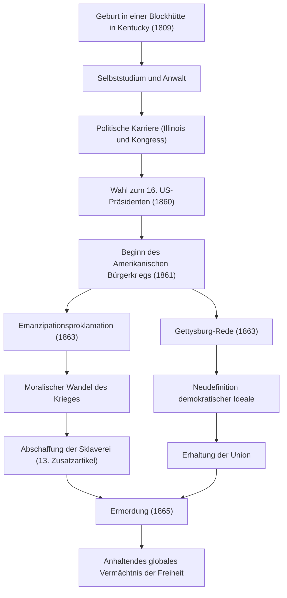

Abraham Lincoln, der 16. Präsident der Vereinigten Staaten von Amerika. Er ist weithin als der „Vater der Sklavenbefreiung“ bekannt und der Mann, der den Bürgerkrieg – die größte Krise seit der Gründung der Nation – überwand und die Spaltung des Landes verhinderte. Seine Worte „Die Regierung des Volkes, durch das Volk und für das Volk“ werden bis heute als ein grundlegendes Ideal der Demokratie weitergegeben.

In diesem Artikel werden wir sein außergewöhnliches Leben vom Aufstieg aus einer Blockhütte bis zum Präsidenten, seine tiefe Menschlichkeit und seine einzigartige Philosophie sowie seinen unermesslichen Einfluss auf die Nachwelt anhand von Diagrammen genauer betrachten.

## Der Start aus der Widrigkeit: Von der Blockhütte zum autodidaktischen Anwalt

Am 12. Februar 1809 wurde Lincoln in einer bescheidenen Blockhütte in Kentucky geboren. In seiner Kindheit war er gezwungen, das Leben eines extrem armen Pioniers zu führen, und es heißt, dass er in seinem ganzen Leben nur knapp ein Jahr formale Schulbildung erhielt. Seine intellektuelle Neugier ließ jedoch nie nach. Er las alles, was er in die Hände bekommen konnte – von der Bibel und Shakespeare bis hin zu juristischen Büchern – und eignete sich das Wissen im Selbststudium an.

In seiner Jugend sammelte er Erfahrungen in verschiedenen Berufen wie Flachbootfahrer, Landvermesser und Ladenangestellter, während er weiterhin Jura studierte. Als er 1836 seine Zulassung als Anwalt erhielt, gewann er durch seine aufrichtige Persönlichkeit und seine herausragende Beredsamkeit großes Vertrauen in Illinois. Der Spitzname „Honest Abe“ (Ehrlicher Abe) wurde ab dieser Zeit zu seinem Markenzeichen.

## Auf die politische Bühne: Widerstand gegen die Ausweitung der Sklaverei

Lincolns politische Karriere begann als Abgeordneter im Repräsentantenhaus von Illinois. Danach diente er eine Amtszeit im Repräsentantenhaus der Vereinigten Staaten, erlangte jedoch erst Ende der 1850er Jahre in der Debatte um die Ausweitung der Sklaverei wirklich landesweite Aufmerksamkeit.

Das damalige Amerika befand sich in einem tiefen Konflikt, der das Land in den Süden, der für den Fortbestand der Sklaverei eintrat, und den Norden, der deren Abschaffung oder die Verhinderung ihrer Ausweitung forderte, spaltete. Obwohl Lincoln nicht die sofortige Abschaffung der Sklaverei forderte, widersetzte er sich entschieden ihrer „Ausweitung“. In einer öffentlichen Debatte während der Senatswahlen 1858 gegen Stephen Douglas (die Lincoln-Douglas-Debatten) hielt er seine berühmte Rede „Ein in sich gespaltenes Haus kann keinen Bestand haben“ und appellierte an die ganze Nation für die Notwendigkeit einer grundlegenden Lösung des Sklavereiproblems.

## Amtsantritt als 16. Präsident und der Ausbruch des Bürgerkriegs

Bei den Präsidentschaftswahlen 1860 trat Lincoln als Kandidat der Republikanischen Partei an, gewann mit überwältigender Unterstützung der Nordstaaten und wurde zum 16. Präsidenten der Vereinigten Staaten von Amerika gewählt. Sein Wahlsieg machte den Widerstand der Südstaaten jedoch endgültig, und diese traten nacheinander aus der Union aus, um die „Konföderierten Staaten von Amerika“ zu gründen.

Im April 1861, nur einen Monat nach Lincolns Amtsantritt, brach der Amerikanische Bürgerkrieg (American Civil War) aus. Dies wurde der blutigste und tragischste Bürgerkrieg in der amerikanischen Geschichte. Lincolns größtes Ziel war die „Erhaltung der Union“ und die Wiedervereinigung einer gespaltenen Nation. Obwohl die anfängliche Kriegslage für den Norden unvorteilhaft war, kommandierte er die Armee mit unbeugsamen Geist und gab selbst in verzweifelten Situationen niemals auf.

## Historischer Wendepunkt: Die Emanzipationsproklamation und die Gettysburg-Rede

Während der Krieg sich hinzog, traf Lincoln eine schwerwiegende Entscheidung. Am 1. Januar 1863 erließ er die „Emanzipationsproklamation“ (Emancipation Proclamation). Damit wurde die Befreiung der Sklaven in den rebellierenden Südstaaten rechtlich erklärt. Obwohl diese Proklamation nicht sofort alle Sklaven befreite, hatte sie die historische Bedeutung, dass sie das Ziel des Krieges von der bloßen „Erhaltung der Union“ zu einem „Kampf für menschliche Freiheit und Würde“ erhob.

Im November desselben Jahres hielt er bei der Einweihung des Nationalfriedhofs in Gettysburg, Pennsylvania, das Schauplatz heftiger Kämpfe gewesen war, eine kurze Rede, die in die Geschichte eingehen sollte. Dies ist die sogenannte „Gettysburg-Rede“. Darin bekräftigte er die Geburt der Nation und die Ideale der Freiheit und appellierte, dass es die Mission der Hinterbliebenen sei, dafür zu sorgen, dass „die Regierung des Volkes, durch das Volk und für das Volk“ nicht von der Erde verschwindet. Diese etwa zweiminütige Rede brachte die Essenz der amerikanischen Demokratie brillant zum Ausdruck und wird der Nachwelt für immer in Erinnerung bleiben.

### Ablauf von Lincolns Werdegang und Erfolgen

Das folgende Diagramm zeigt den Ablauf der wichtigen Meilensteine in Lincolns Leben und die Auswirkungen seiner Politik.

## Ermordung und Einfluss auf die Nachwelt: Unsterbliche Ideale

Am 9. April 1865 kapitulierte General Lee von der Konföderierten Armee, und der vierjährige, tragische Bürgerkrieg endete schließlich. Lincoln hatte seine beiden großen Ziele erreicht: die Erhaltung der Union und die Abschaffung der Sklaverei. Für den Wiederaufbau (Reconstruction) nach dem Krieg war er entschlossen, mit einer toleranten Haltung vorzugehen: „Mit Groll gegen niemanden, mit Nächstenliebe für alle“.

Doch die Freude über diesen Frieden war nur von kurzer Dauer. Nur fünf Tage nach der Kapitulation, am 14. April 1865, wurde Lincoln beim Besuch einer Vorstellung im Ford’s Theatre in Washington, D.C. von dem Südstaaten-Sympathisanten und Schauspieler John Wilkes Booth niedergeschossen und starb am nächsten Morgen. Er wurde 56 Jahre alt. Ohne eine geeinte Nation erlebt zu haben, verstarb er.

Der Tod von Abraham Lincoln brachte tiefe Trauer über das ganze Land, aber sein Vermächtnis verblasste nicht. Die formelle Abschaffung der Sklaverei durch den 13. Zusatzartikel zur Verfassung wurde nach seinem Tod verwirklicht, und die von ihm vertretenen Ideale von Freiheit und Gleichheit haben weiterhin einen unermesslichen Einfluss auf den weltweiten Kampf für Menschenrechte, einschließlich der späteren Bürgerrechtsbewegung.

Das Leben von Lincoln ist die Verkörperung des amerikanischen Traums, dass trotz der ärmlichsten Umstände große Errungenschaften durch eigenen Willen und eigene Anstrengung möglich sind. Seine Führung, mit der er das Land während der beispiellosen Krise der nationalen Spaltung mit tiefem menschlichen Verständnis und unerschütterlichen Überzeugungen lenkte, bietet uns auch in der modernen Gesellschaft wichtige Lehren.
