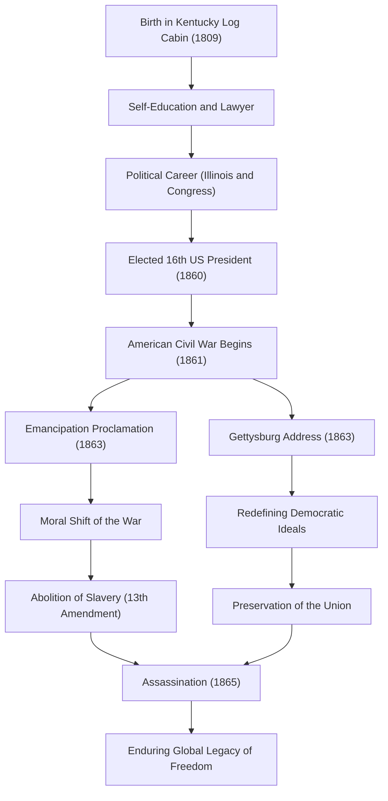

Abraham Lincoln, the 16th President of the United States. Widely known as the "Father of Emancipation," he is the figure who overcame the American Civil War—the greatest crisis since the founding of the nation—and prevented the division of the country. The phrase "government of the people, by the people, for the people" has been handed down to this day as a fundamental principle of democracy.

In this article, we will delve deeply into his extraordinary life, rising from a log cabin to the presidency, his profound humanity and unique philosophy, and the immeasurable impact he left on future generations, using diagrams to illustrate his journey.

## Starting from Adversity: From a Log Cabin to a Self-Taught Lawyer

On February 12, 1809, Lincoln was born in a humble log cabin in Kentucky. During his childhood, he was forced to live in extreme poverty as a pioneer, and it is said that he received less than a year of formal schooling in his entire life. However, his intellectual curiosity never waned. He avidly read every book he could get his hands on, from the Bible and Shakespeare to law books, absorbing knowledge through self-study.

During his youth, he continued his legal studies while experiencing various jobs such as a flatboatman, surveyor, and store clerk. Upon acquiring his license to practice law in 1836, his sincere character and outstanding eloquence earned him deep trust in Illinois. The nickname "Honest Abe" became synonymous with him around this time.

## Entering the Political Stage: Opposing the Expansion of Slavery

Lincoln's career as a politician began as a member of the Illinois state legislature. He then served one term in the U.S. House of Representatives, but it was in the late 1850s, during the debates over the expansion of slavery, that he truly began to attract national attention.

At that time, the United States was in a state of severe conflict that divided the country in two, between the South, which advocated for the continuation of slavery, and the North, which advocated for its abolition or the prevention of its expansion. Although Lincoln did not advocate for the immediate abolition of slavery, he firmly opposed its "expansion." In a public debate during the 1858 Senate election against Stephen Douglas (the Lincoln-Douglas debates), he delivered his famous "House Divided" speech, appealing to the entire nation about the necessity of a fundamental resolution to the issue of slavery.

## Inauguration as the 16th President and the Outbreak of the Civil War

In the presidential election of 1860, running as the Republican candidate, Lincoln won with overwhelming support from the Northern states and was elected the 16th President of the United States. However, his election made the backlash from the Southern states decisive; one after another, Southern states seceded from the Union and established the "Confederate States of America."

In April 1861, just one month after Lincoln's inauguration, the American Civil War broke out. It became the most tragic civil war in American history, with the most blood spilled. Lincoln's primary goal was the "preservation of the Union," bringing the divided nation back together. Although the early course of the war was unfavorable to the North, he commanded the army with an indomitable spirit and never gave up, even under desperate circumstances.

## A Historical Turning Point: The Emancipation Proclamation and the Gettysburg Address

As the war prolonged, Lincoln made a momentous decision. On January 1, 1863, he issued the "Emancipation Proclamation." This legally declared the freedom of slaves in the Southern states that were in rebellion. While this proclamation did not immediately free all slaves, it held historical significance by elevating the purpose of the war from merely "preserving the Union" to a "fight for human freedom and dignity."

In November of the same year, at the dedication ceremony for the National Cemetery in Gettysburg, Pennsylvania—a site of fierce fighting—he delivered a short speech that would go down in history: the "Gettysburg Address." Here, he reaffirmed the birth of the nation and the ideals of freedom, appealing that ensuring "government of the people, by the people, for the people" shall not perish from the earth was the very mission of those left behind. This approximately two-minute speech perfectly captured the essence of American democracy and will be eternally remembered by future generations.

### The Flow of Lincoln's Path and Achievements

The diagram below illustrates the significant milestones of Lincoln's life and the flow of the impact brought about by his policies.

## Assassination and Impact on Future Generations: Immortal Ideals

On April 9, 1865, Confederate General Robert E. Lee surrendered, finally bringing an end to the tragic four-year-long American Civil War. Lincoln had achieved his two colossal goals: preserving the Union and abolishing slavery. As he faced post-war Reconstruction, he was determined to approach it with a forgiving attitude of "with malice toward none, with charity for all."

However, this joy of peace was short-lived. On April 14, 1865, just five days after the surrender, while attending a play at Ford's Theatre in Washington, D.C., Lincoln was struck by an assassin's bullet from John Wilkes Booth, an actor and Southern sympathizer. He passed away the following morning at the age of 56. He departed this world without being able to see the nation reunified.

The death of Abraham Lincoln brought profound sorrow to the entire nation, but the legacy he left behind never faded. The formal abolition of slavery through the 13th Amendment to the Constitution was realized after his death, and the ideals of freedom and equality he championed continue to have an immeasurable impact on the march toward human rights worldwide, including the subsequent Civil Rights Movement.

Lincoln's life is also an embodiment of the American Dream—that no matter how impoverished one's circumstances, great achievements are possible through one's own will and effort. In an unprecedented crisis of national division, his leadership, guiding the country with deep human understanding and unwavering conviction, continues to offer vital insights for us even in modern society.
