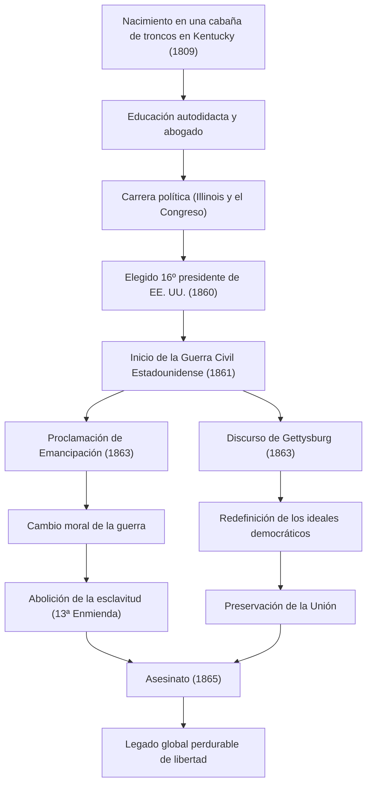

El 16º presidente de los Estados Unidos, Abraham Lincoln. Ampliamente conocido como el "Padre de la Emancipación", es la figura que superó la Guerra Civil, la mayor crisis desde la fundación del país, y evitó la división de la nación. Sus palabras "el gobierno del pueblo, por el pueblo y para el pueblo" han sido transmitidas hasta hoy como un ideal que constituye la base de la democracia.

En este artículo, profundizaremos en su extraordinaria vida, desde una cabaña de troncos hasta la presidencia, su profundo amor por la humanidad y su filosofía única, así como el incalculable impacto que dejó para la posteridad, todo ello acompañado de diagramas ilustrativos.

## Partida desde la adversidad: De una cabaña de troncos a abogado autodidacta

El 12 de febrero de 1809, Lincoln nació en una humilde cabaña de troncos en el estado de Kentucky. Durante su infancia se vio obligado a vivir como un pionero en la pobreza extrema, y se dice que la educación formal que recibió en toda su vida apenas alcanzó a un año. Sin embargo, su curiosidad intelectual nunca decayó. Leyó todos los libros a su alcance, desde la Biblia y Shakespeare hasta libros de leyes, absorbiendo conocimientos de forma autodidacta.

Durante su juventud, continuó sus estudios de derecho mientras trabajaba en diversas ocupaciones, como marinero de barco fluvial, agrimensor y empleado de tienda. Al obtener su licencia de abogado en 1836, su personalidad honesta y su elocuencia excepcional le valieron una gran confianza en el estado de Illinois. El apodo de "Honest Abe" (Abe el Honesto) se convirtió en su sinónimo a partir de esta época.

## Hacia el escenario político principal: Oposición a la expansión de la esclavitud

La carrera política de Lincoln comenzó como miembro de la legislatura del estado de Illinois. Posteriormente, sirvió un mandato en la Cámara de Representantes federal, pero realmente captó la atención nacional a finales de la década de 1850, durante el debate sobre la expansión de la esclavitud.

En aquella época, Estados Unidos se encontraba en un profundo conflicto que dividía al país en dos: el Sur, que defendía el mantenimiento de la esclavitud, y el Norte, que abogaba por su abolición o la prevención de su expansión. Aunque Lincoln no exigió la abolición inmediata de la esclavitud, se opuso resueltamente a su "expansión". En los debates públicos de 1858 para el Senado contra Stephen Douglas (los debates Lincoln-Douglas), pronunció su famoso discurso de "una casa dividida contra sí misma no puede sostenerse", apelando a toda la nación sobre la necesidad de una solución fundamental al problema de la esclavitud.

## Toma de posesión como 16º presidente y estallido de la Guerra Civil

En las elecciones presidenciales de 1860, Lincoln, postulándose como candidato del Partido Republicano, ganó con el abrumador apoyo de los estados del Norte y fue elegido como el 16º presidente de los Estados Unidos. Sin embargo, su elección hizo definitiva la oposición de los estados del Sur, los cuales se separaron de la Unión uno tras otro y establecieron los "Estados Confederados de América".

En abril de 1861, apenas un mes después de la toma de posesión de Lincoln, estalló la Guerra Civil Estadounidense (American Civil War). Esta se convirtió en la trágica guerra civil en la que se derramó más sangre en la historia de Estados Unidos. El principal objetivo de Lincoln era "preservar la Unión", uniendo nuevamente a una nación dividida. Aunque la situación inicial de la guerra fue desfavorable para el Norte, dirigió al ejército con un espíritu indomable y nunca se rindió, incluso bajo circunstancias desesperadas.

## Punto de inflexión histórico: La Proclamación de Emancipación y el Discurso de Gettysburg

A medida que la guerra se prolongaba, Lincoln tomó una decisión trascendental. El 1 de enero de 1863, emitió la "Proclamación de Emancipación" (Emancipation Proclamation). Con esto, se declaró legalmente la liberación de los esclavos en los estados del Sur que se encontraban en rebelión. Aunque esta proclamación no liberó inmediatamente a todos los esclavos, tuvo el significado histórico de elevar el objetivo de la guerra de una mera "preservación de la Unión" a una "lucha por la libertad y la dignidad humana".

En noviembre de ese mismo año, durante la ceremonia de dedicación del Cementerio Nacional de los Caídos en Gettysburg, Pensilvania, lugar de una feroz batalla, pronunció un breve discurso que pasaría a la historia: el llamado "Discurso de Gettysburg". Allí reafirmó el nacimiento de la nación y los ideales de libertad, y apeló a que la misión de los que quedaron es asegurar que "el gobierno del pueblo, por el pueblo, para el pueblo" (Government of the people, by the people, for the people) no desaparezca de la faz de la tierra. Este discurso de aproximadamente dos minutos capturó magistralmente la esencia de la democracia estadounidense y será recordado eternamente por las generaciones venideras.

### Flujo de la trayectoria y los logros de Lincoln

El siguiente diagrama muestra el flujo de los hitos importantes en la vida de Lincoln y el impacto que tuvieron sus políticas.

## Asesinato e impacto en la posteridad: Ideales inmortales

El 9 de abril de 1865, el general Lee del ejército confederado se rindió, y la trágica Guerra Civil, que duró cuatro años, finalmente llegó a su fin. Lincoln había logrado sus dos gigantescos objetivos: la preservación de la Unión y la abolición de la esclavitud. Estaba decidido a afrontar la reconstrucción de la posguerra (Reconstruction) con una actitud tolerante, declarando: "con malicia hacia nadie, con caridad para todos".

Sin embargo, esa alegría de paz duró poco. Apenas cinco días después de la rendición, el 14 de abril de 1865, mientras veía una obra en el Teatro Ford en Washington D.C., Lincoln fue asesinado por una bala disparada por John Wilkes Booth, un actor simpatizante del Sur, y falleció a la mañana siguiente. Tenía 56 años. Dejó este mundo sin poder ver a la nación unificada.

La muerte de Abraham Lincoln trajo una profunda tristeza a todo el país, pero el legado que dejó nunca se desvaneció. La abolición oficial de la esclavitud mediante la 13ª Enmienda a la Constitución se hizo realidad tras su muerte, y sus ideales de libertad e igualdad han seguido ejerciendo una influencia incalculable en el avance de los derechos humanos en todo el mundo, comenzando por el movimiento por los derechos civiles.

La vida de Lincoln también es la encarnación del sueño americano, demostrando que, sin importar cuán pobres sean las circunstancias, grandes logros son posibles a través de la voluntad y el esfuerzo propios. En medio de la crisis sin precedentes de la división de la nación, su liderazgo, guiando al país con una profunda comprensión humana y convicciones inquebrantables, continúa ofreciéndonos lecciones vitales incluso en la sociedad contemporánea.
