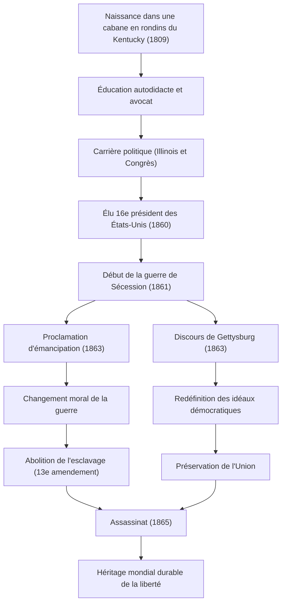

Abraham Lincoln, 16e président des États-Unis. Largement connu comme le « Père de l'émancipation des esclaves », il est l'homme qui a surmonté la guerre de Sécession, la plus grande crise depuis la fondation du pays, et a empêché la division de la nation. L'expression « Le gouvernement du peuple, par le peuple, pour le peuple » a été transmise jusqu'à nos jours comme un idéal constituant le fondement de la démocratie.

Dans cet article, nous examinerons en profondeur, avec des illustrations, sa vie singulière depuis une cabane en rondins jusqu'à la présidence, son profond amour pour l'humanité et sa philosophie unique, ainsi que son influence incommensurable laissée aux générations futures.

## Départ dans l'adversité : De la cabane en rondins à l'avocat autodidacte

Le 12 février 1809, Lincoln est né dans une modeste cabane en rondins dans le Kentucky. Dans son enfance, il a été contraint de vivre comme un pionnier dans une extrême pauvreté et on dit qu'il a reçu moins d'un an d'éducation scolaire formelle dans toute sa vie. Cependant, sa curiosité intellectuelle ne s'est jamais démentie. Il lisait tout ce qui lui tombait sous la main, de la Bible à Shakespeare en passant par les livres de droit, et a acquis ses connaissances en autodidacte.

Dans sa jeunesse, il a exercé divers métiers tels que marin sur un bateau à fond plat, arpenteur et commis de magasin, tout en continuant à étudier le droit. Après avoir obtenu son diplôme d'avocat en 1836, sa personnalité honnête et son éloquence exceptionnelle lui ont valu une grande confiance dans l'Illinois. Le surnom d'« Honest Abe » (Abe l'Honnête) est devenu synonyme de son nom à partir de cette époque.

## L'entrée sur la scène politique : L'opposition à l'expansion de l'esclavage

La carrière politique de Lincoln a commencé comme membre de l'assemblée de l'État de l'Illinois. Ensuite, il a siégé un mandat à la Chambre des représentants des États-Unis, mais c'est à la fin des années 1850, lors des débats sur l'expansion de l'esclavage, qu'il a véritablement attiré l'attention nationale.

À l'époque, les États-Unis étaient profondément divisés entre le Sud, qui soutenait le maintien de l'esclavage, et le Nord, qui plaidait pour son abolition ou son endiguement. Bien que Lincoln n'ait pas réclamé l'abolition immédiate de l'esclavage, il s'est fermement opposé à son « expansion ». Lors des débats publics (les débats Lincoln-Douglas) pour l'élection sénatoriale de 1858 contre Stephen Douglas, il a prononcé son célèbre discours « Une maison divisée contre elle-même ne peut subsister », soulignant à la nation la nécessité d'une résolution fondamentale de la question de l'esclavage.

## L'investiture du 16e président et le début de la guerre de Sécession

Lors de l'élection présidentielle de 1860, Lincoln, candidat du Parti républicain, a remporté une victoire écrasante avec le soutien des États du Nord et a été élu 16e président des États-Unis. Cependant, son élection a rendu définitive l'opposition des États du Sud, qui ont fait sécession l'un après l'autre pour former les « États confédérés d'Amérique ».

En avril 1861, un mois seulement après l'investiture de Lincoln, la guerre de Sécession (American Civil War) éclate. Ce fut la guerre civile la plus sanglante et la plus tragique de l'histoire des États-Unis. Le principal objectif de Lincoln était de « préserver l'Union » et de réunifier la nation divisée. Bien que la situation initiale ait été défavorable au Nord, il a dirigé l'armée avec un esprit indomptable et n'a jamais abandonné, même dans les situations les plus désespérées.

## Un tournant historique : La proclamation d'émancipation et le discours de Gettysburg

Alors que la guerre se prolongeait, Lincoln a pris une décision majeure. Le 1er janvier 1863, il a publié la « Proclamation d'émancipation » (Emancipation Proclamation). Celle-ci déclarait légalement libres les esclaves dans les États du Sud en rébellion. Bien que cette proclamation n'ait pas libéré tous les esclaves immédiatement, elle avait une importance historique en élevant le but de la guerre de la simple « préservation de l'Union » à une « lutte pour la liberté et la dignité humaine ».

En novembre de la même année, lors de la cérémonie de consécration du cimetière militaire national de Gettysburg, en Pennsylvanie, un site de bataille féroce, il a prononcé un court discours resté dans l'histoire. Il s'agit du fameux « Discours de Gettysburg ». Il y a réaffirmé la naissance de la nation et les idéaux de liberté, et a plaidé pour que la mission des survivants soit de s'assurer que le « gouvernement du peuple, par le peuple, pour le peuple (Government of the people, by the people, for the people) » ne disparaisse pas de la terre. Ce discours d'environ deux minutes exprime brillamment l'essence de la démocratie américaine et sera transmis pour l'éternité.

### Le parcours de Lincoln et le déroulement de ses réalisations

Le diagramme suivant illustre les étapes importantes de la vie de Lincoln et le flux d'impacts de ses politiques.

## L'assassinat et l'impact sur la postérité : Un idéal immortel

Le 9 avril 1865, le général Lee des forces confédérées se rend, mettant enfin un terme à la tragique guerre de Sécession qui avait duré quatre ans. Lincoln a atteint ses deux objectifs colossaux : préserver l'Union et abolir l'esclavage. En vue de la reconstruction d'après-guerre (Reconstruction), il était résolu à faire preuve de tolérance, « sans malveillance envers quiconque, avec charité pour tous ».

Cependant, cette joie de la paix fut de courte durée. Le 14 avril 1865, seulement cinq jours après la reddition, alors qu'il assistait à une pièce de théâtre au théâtre Ford de Washington D.C., Lincoln a été abattu par l'acteur John Wilkes Booth, un sympathisant du Sud, et a rendu son dernier soupir le lendemain matin. Il avait 56 ans. Il a quitté ce monde sans voir la nation unifiée.

La mort d'Abraham Lincoln a plongé les États-Unis dans un profond chagrin, mais l'héritage qu'il a laissé ne s'est pas estompé. L'abolition formelle de l'esclavage par le 13e amendement de la Constitution s'est réalisée après sa mort, et les idéaux de liberté et d'égalité qu'il a promus continuent d'avoir un impact incommensurable sur la lutte pour les droits de l'homme dans le monde entier, y compris le mouvement des droits civiques.

La vie de Lincoln est aussi l'incarnation du rêve américain, prouvant qu'il est possible de réaliser de grandes choses par sa propre volonté et ses efforts, même à partir d'un milieu très pauvre. Face à la crise sans précédent qu'a été la division de la nation, son leadership qui a guidé le pays avec une profonde compréhension humaine et une conviction inébranlable continue de nous offrir des enseignements importants dans la société d'aujourd'hui.
