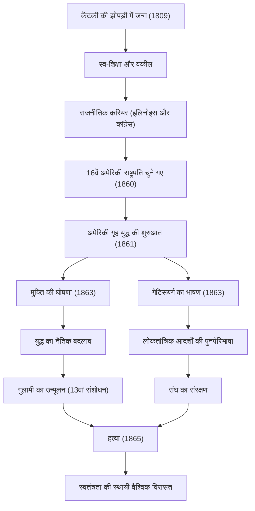

अमरीका के 16वें राष्ट्रपति, अब्राहम लिंकन (Abraham Lincoln)। 'गुलामों के मुक्तिदाता' के रूप में व्यापक रूप से जाने जाने वाले, उन्होंने गृह युद्ध के दौरान देश को पार लगाया, जो इसकी स्थापना के बाद से सबसे बड़ा संकट था, और राष्ट्र के विभाजन को रोका। "जनता का, जनता द्वारा, और जनता के लिए शासन" के उनके शब्द आज भी लोकतंत्र के मूल सिद्धांत के रूप में याद किए जाते हैं।

इस लेख में, हम उनके एक लकड़हारे की झोपड़ी से राष्ट्रपति बनने तक के असाधारण जीवन, उनके गहरे मानवीय प्रेम और अद्वितीय दर्शन, और आने वाली पीढ़ियों पर उनके द्वारा छोड़े गए अपार प्रभाव की, चित्रों के साथ गहराई से पड़ताल करेंगे।

## विपरीत परिस्थितियों से शुरुआत: लकड़हारे की झोपड़ी से स्व-शिक्षित वकील तक

12 फरवरी 1809 को, लिंकन का जन्म केंटकी में एक साधारण लकड़हारे की झोपड़ी में हुआ था। अपने बचपन में, उन्हें एक अत्यंत गरीब अग्रणी के रूप में जीवन जीने के लिए मजबूर होना पड़ा, और कहा जाता है कि उन्होंने अपने पूरे जीवन में केवल एक वर्ष से भी कम समय तक औपचारिक स्कूली शिक्षा प्राप्त की थी। हालाँकि, उनकी बौद्धिक जिज्ञासा कभी कम नहीं हुई। बाइबिल, शेक्सपियर, और यहाँ तक कि कानून की किताबों तक, जो भी किताबें उन्हें मिल सकती थीं, उन्हें पढ़कर, उन्होंने खुद को शिक्षित किया और ज्ञान प्राप्त किया।

अपनी युवावस्था में, उन्होंने एक चपटे तल वाली नाव के नाविक, सर्वेक्षक और एक दुकान के क्लर्क के रूप में काम करते हुए कानून का अध्ययन जारी रखा। 1836 में जब उन्होंने वकालत का लाइसेंस प्राप्त किया, तो उनके ईमानदार चरित्र और उत्कृष्ट वक्तृत्व ने उन्हें इलिनोइस में बहुत सम्मान दिलाया। 'ईमानदार एब' (Honest Abe) उपनाम इसी समय से उनका पर्याय बन गया।

## राजनीति के मुख्य मंच पर: गुलामी के विस्तार का विरोध

लिंकन का राजनीतिक करियर इलिनोइस राज्य विधायिका के सदस्य के रूप में शुरू हुआ। बाद में उन्होंने अमेरिकी प्रतिनिधि सभा में एक कार्यकाल तक सेवा की, लेकिन 1850 के दशक के उत्तरार्ध में गुलामी के विस्तार को लेकर हुए विवाद के दौरान ही उन्होंने वास्तव में राष्ट्रीय ध्यान आकर्षित किया।

उस समय, अमेरिका में गुलामी को बनाए रखने की वकालत करने वाले दक्षिण और इसके उन्मूलन या इसके विस्तार को रोकने की वकालत करने वाले उत्तर के बीच गहरा विवाद था, जिसने देश को दो हिस्सों में बाँट दिया था। हालाँकि लिंकन ने गुलामी को तत्काल समाप्त करने का आह्वान नहीं किया, लेकिन उन्होंने इसके 'विस्तार' का कड़ा विरोध किया। 1858 में सीनेटर के चुनाव में स्टीफन डगलस (Stephen Douglas) के साथ सार्वजनिक बहस (लिंकन-डगलस बहस) में, उन्होंने अपना प्रसिद्ध "विभाजित घर खड़ा नहीं रह सकता" भाषण दिया, जिसमें उन्होंने पूरे देश से गुलामी के मुद्दे के मौलिक समाधान की आवश्यकता की अपील की।

## 16वें राष्ट्रपति के रूप में उद्घाटन और गृह युद्ध का प्रकोप

1860 के राष्ट्रपति चुनाव में, रिपब्लिकन उम्मीदवार के रूप में दौड़ते हुए, लिंकन ने उत्तरी राज्यों का भारी समर्थन हासिल किया और उन्हें संयुक्त राज्य अमेरिका के 16वें राष्ट्रपति के रूप में चुना गया। हालाँकि, उनके चुनाव ने दक्षिणी राज्यों के विरोध को निर्णायक बना दिया, और दक्षिणी राज्यों ने एक-एक करके संघ से अलग होकर 'कन्फेडरेट स्टेट्स ऑफ अमेरिका' (Confederate States of America) की स्थापना की।

अप्रैल 1861 में, लिंकन के उद्घाटन के ठीक एक महीने बाद, अमेरिकी गृह युद्ध (American Civil War) छिड़ गया। यह अमेरिकी इतिहास का सबसे खूनी और सबसे दुखद गृह युद्ध बन गया। लिंकन का सबसे बड़ा लक्ष्य "संघ को बनाए रखना" और एक विभाजित राष्ट्र को एकजुट करना था। यद्यपि युद्ध के शुरुआती चरण उत्तर के लिए प्रतिकूल थे, उन्होंने अदम्य भावना के साथ सेना की कमान संभाली और निराशाजनक परिस्थितियों में भी कभी हार नहीं मानी।

## ऐतिहासिक मोड़: मुक्ति की घोषणा और गेटिसबर्ग का भाषण

जैसे-जैसे युद्ध खिंचता गया, लिंकन ने एक बड़ा फैसला किया। 1 जनवरी 1863 को, उन्होंने "मुक्ति की घोषणा" (Emancipation Proclamation) जारी की। इसने विद्रोह की स्थिति में दक्षिणी राज्यों में दासों को कानूनी रूप से मुक्त घोषित कर दिया। हालाँकि इस घोषणा ने तुरंत सभी दासों को मुक्त नहीं किया, लेकिन इसका ऐतिहासिक महत्व था क्योंकि इसने युद्ध के उद्देश्य को केवल "संघ को बनाए रखने" से "मानव स्वतंत्रता और गरिमा की खोज" तक बढ़ा दिया।

उसी वर्ष के नवंबर में, उन्होंने पेंसिल्वेनिया के गेटिसबर्ग में सोल्जर्स नेशनल सेमेट्री के समर्पण समारोह में एक छोटा, ऐतिहासिक भाषण दिया, जो एक भयंकर युद्ध का मैदान रहा था। इसे "गेटिसबर्ग एड्रेस" (Gettysburg Address) के रूप में जाना जाता है। यहाँ उन्होंने राष्ट्र के जन्म और स्वतंत्रता के आदर्शों की पुष्टि की, और अपील की कि यह सुनिश्चित करना जीवित लोगों का कर्तव्य है कि "जनता का, जनता द्वारा, और जनता के लिए शासन" पृथ्वी से नष्ट न हो। लगभग दो मिनट का यह भाषण अमेरिकी लोकतंत्र के सार को पूरी तरह से व्यक्त करता है और आने वाली पीढ़ियों द्वारा हमेशा याद किया जाएगा।

### लिंकन का प्रक्षेपवक्र और उपलब्धियों का प्रवाह

नीचे दिया गया चित्र लिंकन के जीवन में महत्वपूर्ण मील के पत्थर और उनकी नीतियों के प्रभाव के प्रवाह को दर्शाता है।

## हत्या और आने वाली पीढ़ियों पर प्रभाव: अमर आदर्श

9 अप्रैल 1865 को, कन्फेडरेट जनरल ली (General Lee) ने आत्मसमर्पण कर दिया, जिससे 4 साल के विनाशकारी गृह युद्ध का अंत हो गया। लिंकन ने संघ को बनाए रखने और गुलामी को खत्म करने के अपने दोहरे लक्ष्यों को प्राप्त कर लिया था। वह "किसी के प्रति द्वेष के बिना, सभी के लिए दान के साथ" एक सहिष्णु दृष्टिकोण के साथ युद्ध के बाद के पुनर्निर्माण (Reconstruction) का सामना करने के लिए दृढ़ संकल्पित थे।

हालाँकि, शांति की खुशी अल्पकालिक थी। आत्मसमर्पण के ठीक पांच दिन बाद, 14 अप्रैल 1865 को, वाशिंगटन डी.सी. के फोर्ड थिएटर में एक नाटक देखते समय, लिंकन को एक दक्षिणी सहानुभूति रखने वाले अभिनेता जॉन विल्क्स बूथ (John Wilkes Booth) ने गोली मार दी थी, और अगली सुबह उनकी मृत्यु हो गई। वह 56 वर्ष के थे। एक एकीकृत राष्ट्र देखे बिना ही उनका निधन हो गया।

अब्राहम लिंकन की मृत्यु ने पूरे संयुक्त राज्य अमेरिका में गहरा दुख ला दिया, लेकिन उनकी विरासत कभी फीकी সাংস্কৃতিক नहीं पड़ी। संविधान में 13वें संशोधन के माध्यम से गुलामी का औपचारिक उन्मूलन उनकी मृत्यु के बाद हुआ, और स्वतंत्रता और समानता के उनके आदर्शों का नागरिक अधिकार आंदोलन सहित दुनिया भर में मानवाधिकारों की खोज पर अथाह प्रभाव पड़ा।

लिंकन का जीवन अमेरिकी सपने का अवतार है कि बहुत गरीब परिस्थितियों में भी अपनी इच्छा और प्रयास से महान उपलब्धियां हासिल करना संभव है। अभूतपूर्व राष्ट्रीय विभाजन के संकट में, गहरे मानवीय समझ और अटूट विश्वास के साथ देश का नेतृत्व करने वाले उनका नेतृत्व आज भी हमारे लिए महत्वपूर्ण सुझाव प्रदान करता है।
